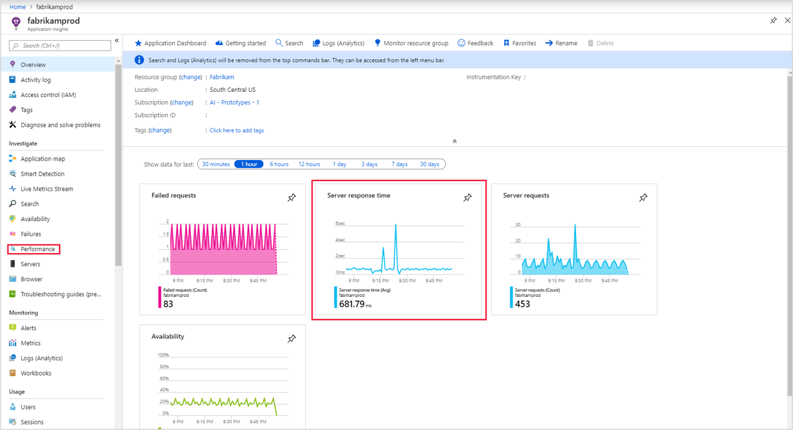
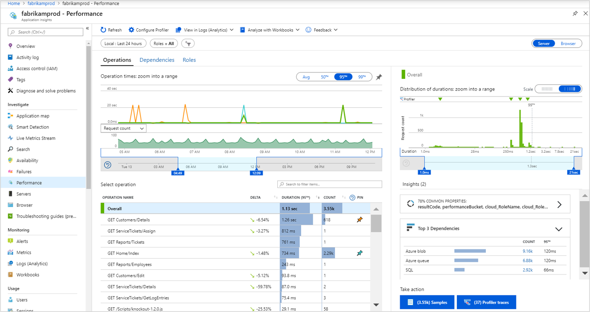
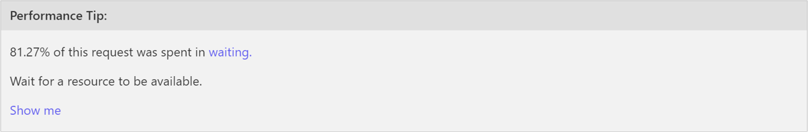

# Find and diagnose performance issues with Application Insights

Application Insights collects telemetry from your application to help analyze its operation and performance. You can use this information to identify problems that might be occurring or to identify improvements to the application that would most affect users. This tutorial takes you through the process of analyzing the performance of both the server components of your application and the perspective of the client.

You learn how to:

> [!div class="checklist"]
> * Identify the performance of server-side operations.
> * Analyze server operations to determine the root cause of slow performance.
> * Identify the slowest client-side operations.
> * Analyze details of page views by using query language.

## Prerequisites

To complete this tutorial:

- Install [Visual Studio 2019](https://www.visualstudio.com/downloads/) with the following workloads:
	- ASP.NET and web development
	- Azure development
- Deploy a .NET application to Azure and [enable the Application Insights SDK](../app/asp-net.md).
- [Enable the Application Insights profiler](../app/profiler.md) for your application.

## Sign in to Azure

Sign in to the [Azure portal](https://portal.azure.com).

## Identify slow server operations

Application Insights collects performance details for the different operations in your application. By identifying the operations with the longest duration, you can diagnose potential problems or target your ongoing development to improve the overall performance of the application.

1. Select **Application Insights** and then select your subscription.
1. To open the **Performance** panel, either select **Performance** under the **Investigate** menu or select the **Server response time** graph.

	

1. The **Performance** screen shows the count and average duration of each operation for the application. You can use this information to identify those operations that affect users the most. In this example, the **GET Customers/Details** and **GET Home/Index** are likely candidates to investigate because of their relatively high duration and number of calls. Other operations might have a higher duration but were rarely called, so the effect of their improvement would be minimal.

	

1. The graph currently shows the average duration of the selected operations over time. You can switch to the 95th percentile to find the performance issues. Add the operations you're interested in by pinning them to the graph. The graph shows that there are some peaks worth investigating. To isolate them further, reduce the time window of the graph.

	

1. The performance panel on the right shows distribution of durations for different requests for the selected operation. Reduce the window to start around the 95th percentile. The **Top 3 Dependencies** insights card can tell you at a glance that the external dependencies are likely contributing to the slow transactions. Select the button with the number of samples to see a list of the samples. Then select any sample to see transaction details.

1. You can see at a glance that the call to the Fabrikamaccount Azure Table contributes most to the total duration of the transaction. You can also see that an exception caused it to fail. Select any item in the list to see its details on the right side. [Learn more about the transaction diagnostics experience](../app/transaction-diagnostics.md)

	

1. The [Profiler](../app/profiler-overview.md) helps get further with code-level diagnostics by showing the actual code that ran for the operation and the time required for each step. Some operations might not have a trace because the Profiler runs periodically. Over time, more operations should have traces. To start the Profiler for the operation, select **Profiler traces**.
1. The trace shows the individual events for each operation so that you can diagnose the root cause for the duration of the overall operation. Select one of the top examples that has the longest duration.
1. Select **Hot path** to highlight the specific path of events that contribute the most to the total duration of the operation. In this example, you can see that the slowest call is from the `FabrikamFiberAzureStorage.GetStorageTableData` method. The part that takes the most time is the `CloudTable.CreateIfNotExist` method. If this line of code is executed every time the function gets called, unnecessary network call and CPU resources will be consumed. The best way to fix your code is to put this line in some startup method that executes only once.

	

1. The **Performance Tip** at the top of the screen supports the assessment that the excessive duration is because of waiting. Select the **waiting** link for documentation on interpreting the different types of events.

	

1. For further analysis, select **Download Trace** to download the trace. You can view this data by using [PerfView](https://github.com/Microsoft/perfview#perfview-overview).

## Use logs data for server

 Logs provides a rich query language that you can use to analyze all data collected by Application Insights. You can use this feature to perform deep analysis on request and performance data.

1. Return to the operation detail panel and select **View in Logs (Analytics)**.

1. The **Logs** screen opens with a query for each of the views in the panel. You can run these queries as they are or modify them for your requirements. The first query shows the duration for this operation over time.

	

## Identify slow client operations

In addition to identifying server processes to optimize, Application Insights can analyze the perspective of client browsers. This information can help you identify potential improvements to client components and even identify issues with different browsers or different locations.

1. Select **Browser** under **Investigate** and then select **Browser Performance**. Alternatively, select **Performance** under **Investigate** and switch to the **Browser** tab by selecting the **Server/Browser** toggle button in the upper-right corner to open the browser performance summary. This view provides a visual summary of various telemetries of your application from the perspective of the browser.

	

1. Select one of the operation names, select the **Samples** button at the bottom right, and then select an operation. End-to-end transaction details open on the right side where you can view the **Page View Properties**. You can view details of the client requesting the page including the type of browser and its location. This information can assist you in determining whether there are performance issues related to particular types of clients.

	

## Use logs data for client

Like the data collected for server performance, Application Insights makes all client data available for deep analysis by using logs.

1. Return to the browser summary and select  **View in Logs (Analytics)**.

1. The **Logs** screen opens with a query for each of the views in the panel. The first query shows the duration for different page views over time.

	

## Next steps

Now that you've learned how to identify runtime exceptions, proceed to the next tutorial to learn how to create alerts in response to failures.

> [!div class="nextstepaction"]
> [Standard test](availability-standard-tests.md)
