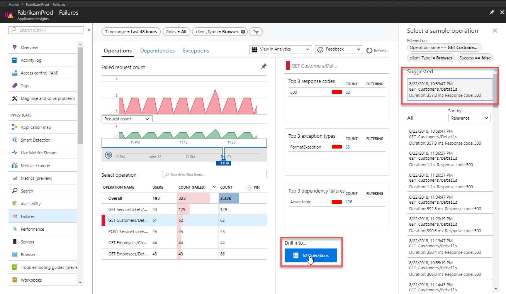
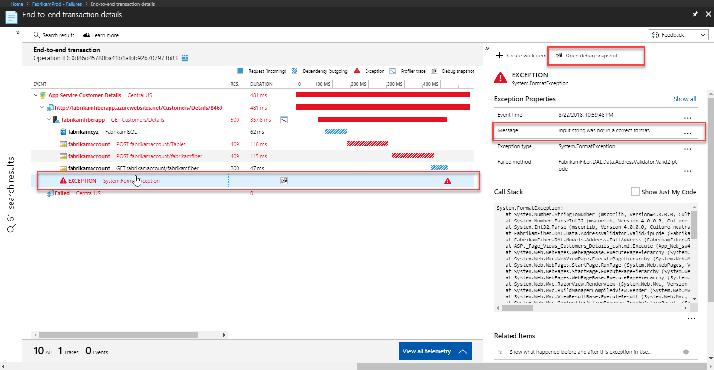
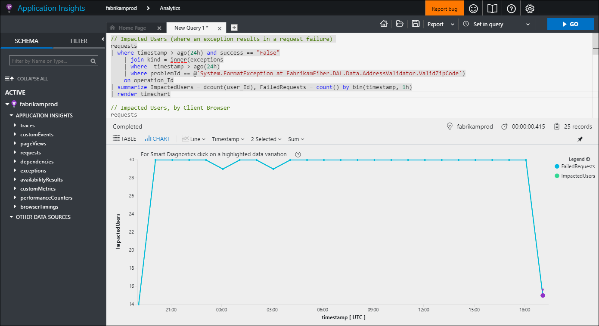

# Find and diagnose runtime exceptions with Application Insights

Application Insights collects telemetry from your application to help identify and diagnose runtime exceptions. This tutorial takes you through this process with your application. You learn how to:

> [!div class="checklist"]
> * Modify your project to enable exception tracking.
> * Identify exceptions for different components of your application.
> * View details of an exception.
> * Download a snapshot of the exception to Visual Studio for debugging.
> * Analyze details of failed requests by using query language.
> * Create a new work item to correct the faulty code.

## Prerequisites

To complete this tutorial:

- Install [Visual Studio 2019](https://www.visualstudio.com/downloads/) with the following workloads:
	- ASP.NET and web development
	- Azure development
- Download and install the [Visual Studio Snapshot Debugger](https://aka.ms/snapshotdebugger).
- Enable the [Visual Studio Snapshot Debugger](../app/snapshot-debugger.md).
- Deploy a .NET application to Azure and [enable the Application Insights SDK](../app/asp-net.md).
- Modify your code in your development or test environment to generate an exception because the tutorial tracks the identification of an exception in your application.

## Sign in to Azure
Sign in to the [Azure portal](https://portal.azure.com).

## Analyze failures
Application Insights collects any failures in your application. It lets you view their frequency across different operations to help you focus your efforts on those issues with the highest impact. You can then drill down on details of these failures to identify the root cause.

1. Select **Application Insights** and then select your subscription.
1. To open the **Failures** pane, either select **Failures** under the **Investigate** menu or select the **Failed requests** graph.

	

1. The **Failed requests** pane shows the count of failed requests and the number of users affected for each operation for the application. By sorting this information by user, you can identify those failures that most affect users. In this example, **GET Employees/Create** and **GET Customers/Details** are likely candidates to investigate because of their large number of failures and affected users. Selecting an operation shows more information about this operation in the right pane.

	

1. Reduce the time window to zoom in on the period where the failure rate shows a spike.

	

1. See the related samples by selecting the button with the number of filtered results. The **Suggested** samples have related telemetry from all components, even if sampling might have been in effect in any of them. Select a search result to see the details of the failure.

	

1. The details of the failed request show the Gantt chart that shows that there were two dependency failures in this transaction, which also contributed to more than 50% of the total duration of the transaction. This experience presents all telemetry across components of a distributed application that are related to this operation ID. To learn more about the new experience, see [Unified cross-component transaction diagnostics](../app/transaction-diagnostics.md). You can select any of the items to see their details on the right side.

	

1. The operations detail also shows a format exception, which appears to have caused the failure. You can see that it's because of an invalid Zip Code. You can open the debug snapshot to see code-level debug information in Visual Studio.

	

## Identify failing code
The Snapshot Debugger collects snapshots of the most frequent exceptions in your application to assist you in diagnosing its root cause in production. You can view debug snapshots in the portal to see the call stack and inspect variables at each call stack frame. Afterward, you can debug the source code by downloading the snapshot and opening it in Visual Studio 2019 Enterprise.

1. In the properties of the exception, select **Open debug snapshot**.
1. The **Debug Snapshot** pane opens with the call stack for the request. Select any method to view the values of all local variables at the time of the request. Starting from the top method in this example, you can see local variables that have no value.

	

1. The first call that has valid values is **ValidZipCode**. You can see that a Zip Code was provided with letters that can't be translated into an integer. This issue appears to be the error in the code that must be corrected.

	

1. You can then download this snapshot into Visual Studio where you can locate the actual code that must be corrected. To do so, select **Download Snapshot**.
1. The snapshot is loaded into Visual Studio.
1. You can now run a debug session in Visual Studio Enterprise that quickly identifies the line of code that caused the exception.

	

## Use analytics data
All data collected by Application Insights is stored in Azure Log Analytics, which provides a rich query language that you can use to analyze the data in various ways. You can use this data to analyze the requests that generated the exception you're researching.

1. Select the CodeLens information above the code to view telemetry provided by Application Insights.

	

1. Select **Analyze impact** to open Application Insights Analytics. It's populated with several queries that provide details on failed requests, such as affected users, browsers, and regions.  

    

## Add a work item
If you connect Application Insights to a tracking system, such as Azure DevOps or GitHub, you can create a work item directly from Application Insights.

1. Return to the **Exception Properties** pane in Application Insights.
1. Select **New Work Item**.
1. The **New Work Item** pane opens with details about the exception already populated. You can add more information before you save it.

	

## Next steps
Now that you've learned how to identify runtime exceptions, advance to the next tutorial to learn how to identify and diagnose performance issues.

> [!div class="nextstepaction"]
> [Identify performance issues](./tutorial-performance.md)
