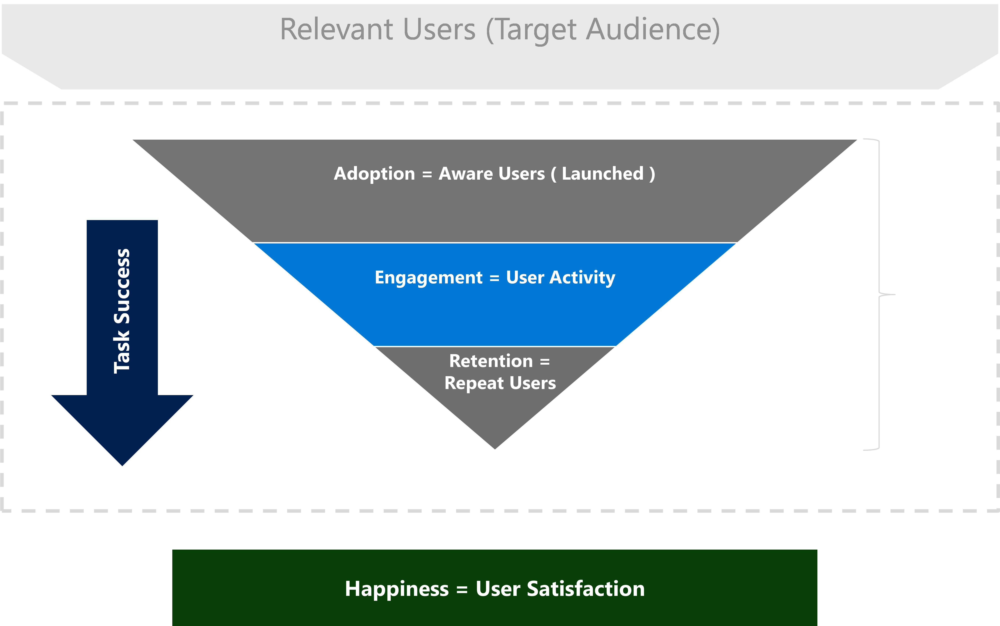
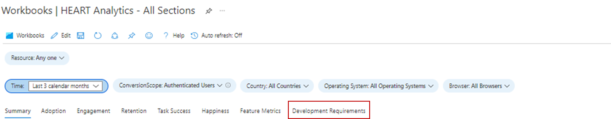

# HEART Workbook Overview
This workbook uses click analytics auto-collection plugin to understand usage in a wholistic manner. The HEART framework was originally introduced by Google. In this workbook, we are using a metrics based approach to understand the product usage and uncover key questions to build a user centric product. 

# Framework Dimensions
HEART is an acronym standing for Happiness, Engagement, Adoption, Retention and Task Success. The measurement framework was originally introduced by Google. It focuses on 5 customer experience dimensions: 

 

- Happiness: Measure of user attitude  
- Engagement: Level of user involvement 
- Adoption: Gaining new users 
- Retention: Rate at which users return  
- Task Success: Productivity empowerment 

Even though these dimensions are measured independently, they drive and interact with each other (As shown in below image)  

### Highlights  
- Adoption, engagement, and retention form a user activity funnel. Only a portion of the users that adopt the tool get retained. 
- Task success is the driver that progresses users down the funnel and moves them from adoption to retention. 
- Happiness is an outcome of the other dimensions and not a stand-alone measurement. Users who have progressed down the funnel and are showing a higher level of activity should be happier.   

  
  

These 5 dimensions are described in detail below:

## Happiness
### Defining Happiness	
Happiness is a user-reported dimension that measures how users feel about the experience offered to them. 

### Measuring Happiness
A common approach to measure this dimension is to ask users a Net Promoter Score (NPS) question such as “Would you recommend this experience to a co-worker?”. Users' responses on a 3 or a 5-point scale (e.g., no, maybe and yes) are aggregated to create an experience-level score ranging from 1-5 (with 5 being the highest). As user-initiated feedback tends to be negatively biased, HEART tracks Happiness from surveys displayed to users at pre-defined intervals.

### User Sentiment Data
Refer to the [Azure Monitor documentation regarding custom sources](https://docs.microsoft.com/en-us/azure/azure-monitor/agents/data-sources#custom-sources) to upload user sentiment data to calculate Happiness metrics. Common Happiness metrics include "Average Star Rating", "Net Promoter Score", etc.

## Engagement
### Measuring Engagement
It is challenging to measure engagement generically because engagement is driven both by expected usage and actual usage. While an experience such as Microsoft Teams would have high daily usage as employees rely on Teams for daily communication, other experiences might expect usage at a weekly or even monthly cadence (such as a rent payment portal). For this reason, the HEART Framework measures engagement using the concept of Active Users (users who voluntarily interact with the experinces) and will be assessing engagement by breaking active usage down into 3 sub-dimensions: 
1. Activity Depth – How many features are users leveraging each time the user interacts with the experience?
2. Activity Breadth – Over a given time period, how many features of the experience is a user leveraging?
3. Activity Frequency – How often does a user interact with the experience – daily, weekly, monthly?

### Defining Active Users	
Any user who performs a user-initiated action like clicking a button, typing an input, etc. is counted as an Active User. While Aware Users includes all users who have loaded the experience, Active Users must have performed an intentional action. This workbook considers any telemetry event with an actionType as an "intentional action". **For this reason, Engagement metrics require the [Click Analytics plugin for Application Insights](https://docs.microsoft.com/en-us/azure/azure-monitor/app/javascript-click-analytics-plugin) implemented in the application**.

 ## Adoption

### Measuring Adoption
The Adoption dimension measures how quickly an application is gaining new users. For this reason, Adoption metrics are useful for measuring the below scenarios:  
a. newly released products  
b. newly updated products  
c. marketing campaigns  

## Retention
### Defining Retention
A Retained User is an Active User who was active both this reporting period and the previous reporting period. As Active Users must have at least one telemetry event with an actionType, ** Retention metrics require the [Click Analytics plugin for Application Insights](https://docs.microsoft.com/en-us/azure/azure-monitor/app/javascript-click-analytics-plugin) implemented in the application**.

| Metric         | Definition                                                                          | Question Answered                                              |
|----------------|-------------------------------------------------------------------------------------|----------------------------------------------------------------|
| Retained Users | Count of Active Users who were also Active the previous period                      | How many users are staying engaged with the experience?        |
| Retention      | Proportion of Active Users from the previous period who are also Active this period | What percent of users are staying engaged with the experience? |

## Task Success
### Defining Task Success
Many experiences include structures designed to funnel users through completing a task. Some examples include the following: 
* *adding items to a cart* -> *purchasing items from the cart*
* *searching a keyword* -> *clicking on a result*
* *initiating a new account* -> *completing account registration* 

Task Success tracks whether users can perform a task efficiently and effectively using the capabilities provided by the experience. 

### Measuring Task Success
A successful task meets 3 requirements:
1.	Expected Task Flow – the intended task flow of the feature was completed (the task flow of the user aligned with the expected task flow)
2.	High Performance – the intended functionality of the feature was accomplished in a reasonable amount of time
3.	High Reliability – the intended functionality of the feature was accomplished without failure

A task is considered unsuccessful if any of the above requirements is not met. **Task Success metrics require the [Click Analytics plugin for Application Insights](https://docs.microsoft.com/en-us/azure/azure-monitor/app/javascript-click-analytics-plugin) implemented in the application**.

### Creating a task
Set up a custom task using the below parameters.

| Parameter         | Description                                                                                                                                                                                                                         |
|-------------------|-------------------------------------------------------------------------------------------------------------------------------------------------------------------------------------------------------------------------------------|
| First Step           | The feature that initiates the task. Using the cart/purchase example above, "adding items to a cart" would be the First Step.                                                                                                          |
| Expected Task Duration | The time window to consider a completed task a success. Any tasks completed outside of this constraint is considered a failure. Not all tasks necessarily have a time constraint: for such tasks, select "No Time Expectation". |
| Last Step        | The feature that completes the task. Using the cart/purchase example above, "purchasing items from the cart" would be the Last Step.                                                                                               |

# Getting Started with the HEART Workbooks
 Users can set up the [Click Analytics Auto-collection plugin](./javascript-click-analytics-plugin.md) via npm. (Note: This is a mandatory step to leverage the workbook). 

 

Once the plugin is configured, the next step is to open the workbook in the gallery under 'public templates'. The workbook will be shown in the section titled **"Product Analytics using the Click Analytics Plugin"**. 

Users will notice that there are 7 workbooks in this section (Below image).  

  

The workbook is designed in a way that users only have to interact with the master workbook. This workbook contains the rest of the 6 workbooks as tabs. If needed, users can access the individual workbooks related to reach tab through the gallery as well. In the next section, we will walk through the workbook titled **"HEART Analytics - All Sections"**. 

## HEART Analytics - All Sections Workbook

The first step after accessing the workbook would be validate that the telemetry has been correctly implemented and we are getting the data as expected to light up the metrics accurately. That can be done using the "Development Requirements" tab on the workbook as shown (image 2).  

  

### Workbook Structure
The workbook has visuals depicting metric trends for different HEART dimensions split over 8 tabs. The tabs in the workbook have descriptions on metric descriptions and how to interpret each of them. 

We recommend reading through the content in each tab to get a detailed understanding of interpretation within each tab. A brief description of the tabs can be seen below: 

- **Summary Tab** - Usage Funnel metrics giving a high level view of visits, interactions and repeat usage. 
- **Adoption** - This tab helps understand what is the penetration among the target audience, acquisition velocity and total user base*. 
- **Engagement** -  Frequency , Depth and Breadth of Usage. 
- **Retention** - Repeat Usage 
- **Task Success** - Enabling understanding of user flows and their time distributions. 
- **Happiness** -  We recommend using a survey tool to measure CSAT/NSAT over a 5 point scale. In this tab, we have provided the likelihood of happiness by using usage and performance metrics. 
- **Feature Metrics** - Enables understanding of HEART metrics at feature granularity. 

# FAQs 

 

 

# Next Steps
- How to set up the [Click Analytics Auto-collection plugin](./javascript-click-analytics-plugin.md) via npm

 

 
