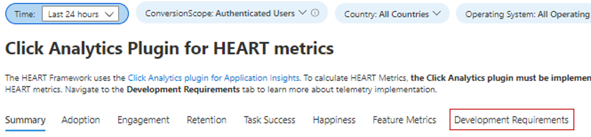
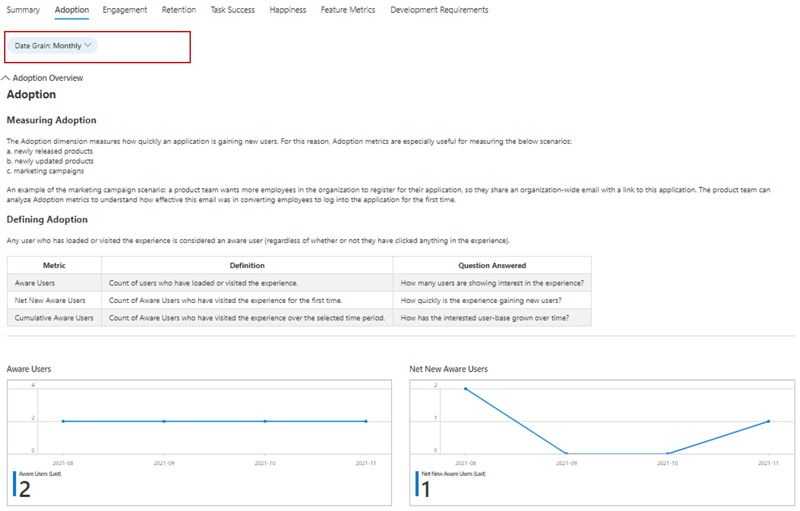
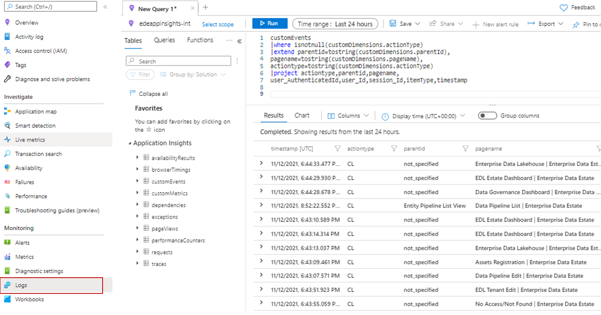
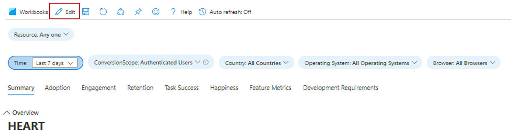
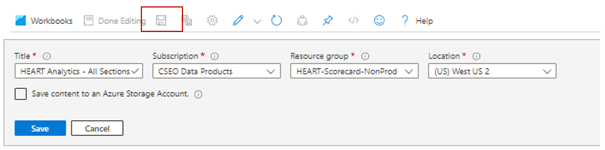
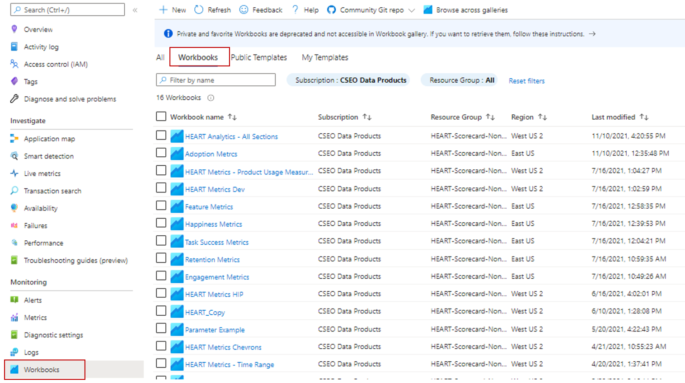

# Analyzing Product Usage with HEART
This article describes how to enable and use the Heart Workbook on Azure Monitor. The HEART workbook is based on the HEART measurement framework, originally introduced by Google. Several Microsoft internal teams use HEART to deliver better software.

 
## Overview
HEART is an acronym that stands for Happiness, Engagement, Adoption, Retention, and Task Success. It helps product teams deliver better software by focusing on the following five dimensions of customer experience:

 

- **Happiness**: Measure of user attitude  
- **Engagement**: Level of active user involvement 
- **Adoption**: Target audience penetration
- **Retention**: Rate at which users return  
- **Task Success**: Productivity empowerment 

These dimensions are measured independently, but they interact with each other as shown below:

- Adoption, engagement, and retention form a user activity funnel. Only a portion of users who adopt the tool come back to use it.
- Task success is the driver that progresses users down the funnel and moves them from adoption to retention.
- Happiness is an outcome of the other dimensions and not a stand-alone measurement. Users who have progressed down the funnel and are showing a higher level of activity should ideally be happier.   

## Get Started
 Users can set up the [Click Analytics Auto Collection Plugin](javascript-click-analytics-plugin.md) via npm. (Note: This step is mandatory to use the workbook). 

 

Once the plugin is configured, the next step is to open the workbook in the gallery under 'public templates'. The workbook will be shown in the section titled **"Product Analytics using the Click Analytics Plugin"**. 

Users will notice that there are seven workbooks in this section (Below image).  

  

The workbook is designed in a way that users only have to interact with the main workbook, 'HEART Analytics - All Sections'. This workbook contains the rest of the six workbooks as tabs. If needed, users can access the individual workbooks related to reach tab through the gallery as well.

### Confirm data is flowing

See the "Development Requirements" tab as shown below to validate that data is flowing as expected to light up the metrics accurately. 

  

## Workbook Structure
The workbook shows metric trends for the HEART dimensions split over eight tabs. Each tab contains descriptions of the metrics and how to use them.

A brief description of the tabs can be seen below: 

- **Summary Tab** - Usage funnel metrics giving a high-level view of visits, interactions, and repeat usage. 
- **Adoption** - This tab helps understand what is the penetration among the target audience, acquisition velocity, and total user base. 
- **Engagement** -  Frequency, depth, and breadth of usage. 
- **Retention** - Repeat usage 
- **Task Success** - Enabling understanding of user flows and their time distributions. 
- **Happiness** -  We recommend using a survey tool to measure customer satisfaction score (CSAT) over a 5-point scale. In this tab, we've provided the likelihood of happiness by using usage and performance metrics. 
- **Feature Metrics** - Enables understanding of HEART metrics at feature granularity. 

## How HEART dimensions are defined and measured

### Happiness
#### Defining Happiness	
Happiness is a user-reported dimension that measures how users feel about the product offered to them. 

#### Measuring Happiness
A common approach to measure this dimension is to ask users a Customer Satisfaction (CSAT) question like “How satisfied are you with this product?”. Users' responses on a three or a five-point scale (for example, no, maybe and yes) are aggregated to create a product-level score ranging from 1-5. As user-initiated feedback tends to be negatively biased, HEART tracks happiness from surveys displayed to users at pre-defined intervals.

#### User Sentiment Data
Refer to the [Azure Monitor documentation for custom sources](../agents/data-sources.md#custom-sources) to upload user sentiment data for calculating happiness metrics. Common happiness metrics include "Average Star Rating", "Customer Satisfaction Score", and so on.

### Engagement
#### Measuring Engagement
HEART Framework measures engagement using the concept of activity (intentional user actions such as clicks). Active usage can be broken down into three subdimensions: 
1. **Activity Frequency** – Measures how often a user interacts with the product (daily, weekly, monthly).
2. **Activity Breadth** – Measures the number of features users interact with over a given time period. For example, users interacted with a total of five features in June 2021.
3. **Activity Depth** – Measures the number of features users interact with each time they launch the product. For example, users interacted with two features on every launch.

Measuring engagement can vary based on the type of product being used. For example, a product like Microsoft Teams is expected to have a high daily usage, making it an important metric to track. But for a product like a 'Paycheck Portal', measurement would make more sense at a monthly or weekly level.  

#### Defining Active Users	
A user who does an intentional action such as clicking a button or typing an input is counted as an active user. **For this reason, Engagement metrics require the [Click Analytics plugin for Application Insights](javascript-click-analytics-plugin.md) implemented in the application**.

### Adoption

#### Measuring Adoption
The Adoption dimension enables understanding of penetration among the relevant/target users and how/who are we gaining as our user base. For this reason, adoption metrics are useful for measuring the below scenarios:  
a. Newly released products  
b. Newly updated products  
c. Marketing campaigns  

### Retention
#### Defining Retention
A Retained User is an active user who was active both this reporting period and the previous reporting period. As active users must have at least one telemetry event with an actionType, ** Retention metrics require the [Click Analytics plugin for Application Insights](javascript-click-analytics-plugin.md) implemented in the application**.

| Metric         | Definition                                                                          | Question Answered                                              |
|----------------|-------------------------------------------------------------------------------------|----------------------------------------------------------------|
| Retained users | Count of active users who were also Active the previous period                      | How many users are staying engaged with the product?        |
| Retention      | Proportion of active users from the previous period who are also Active this period | What percent of users are staying engaged with the product? |

### Task Success
#### Defining Task Success
Many products include structures designed to funnel users through completing a task. Some examples include: 
* *Adding items to a cart* -> *purchasing items from the cart*
* *Searching a keyword* -> *clicking on a result*
* *Starting a new account* -> *completing account registration* 

Task Success tracks whether users can do a task efficiently and effectively using the product's features.

#### Measuring Task Success
A successful task meets three requirements:
1.	Expected Task Flow – the intended task flow of the feature was completed (the task flow of the user aligned with the expected task flow)
2.	High Performance – the intended functionality of the feature was accomplished in a reasonable amount of time
3.	High Reliability – the intended functionality of the feature was accomplished without failure

A task is considered unsuccessful if any of the above requirements isn't met. **Task Success metrics require the [Click Analytics plugin for Application Insights](javascript-click-analytics-plugin.md) implemented in the application**.

#### Creating a task
Set up a custom task using the below parameters.

| Parameter         | Description                                                                                                                                                                                                                         |
|-------------------|-------------------------------------------------------------------------------------------------------------------------------------------------------------------------------------------------------------------------------------|
| First Step           | The feature that starts the task. Using the cart/purchase example above, "adding items to a cart" would be the First Step.                                                                                                          |
| Expected Task Duration | The time window to consider a completed task a success. Any tasks completed outside of this constraint is considered a failure. Not all tasks necessarily have a time constraint: for such tasks, select "No Time Expectation". |
| Last Step        | The feature that completes the task. Using the cart/purchase example above, "purchasing items from the cart" would be the Last Step.                                                                                               |

## FAQ 

### How do I view the data at different grains? (Daily, Monthly, Weekly)?
You can click on the 'Date Grain' filter to change the grain (As shown below)

  

### How do I access insights from my application that aren't available on the HEART workbooks?

You can dig into the data that feeds the HEART workbook if the visuals don't answer all your questions. To do this task, navigate to 'Logs' under 'Monitoring' section and query the customEvents table. Some of the click analytics attributes are contained within the customDimensions field. A sample query is shown in the image below:

  

### Can I edit visuals in the workbook?

Yes, when you click on the public template of the workbook, you can navigate to the top-left corner, click edit, and make your changes.

 

After making your changes, click 'Done Editing' and then the 'Save' icon.

  

To view your saved workbook, navigate to the 'Workbooks' section under 'Monitoring', and then click on the 'Workbooks' tab instead of the 'Public templates' tab. You'll see a copy of your customized workbook there (Shown below). You can make any further changes you want on this particular copy.

  
 

 

## Next Steps
- How to set up the [Click Analytics Auto Collection Plugin](javascript-click-analytics-plugin.md) via npm

 

 
