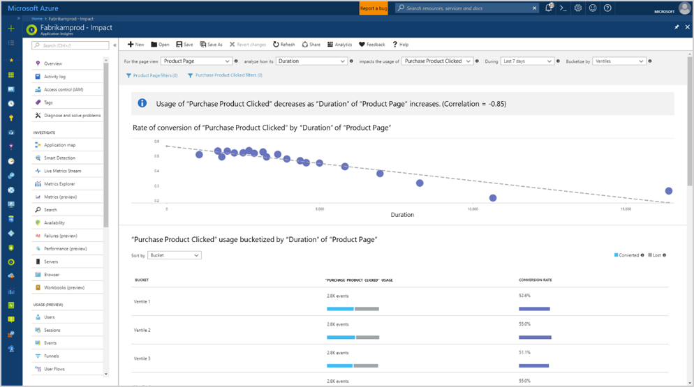
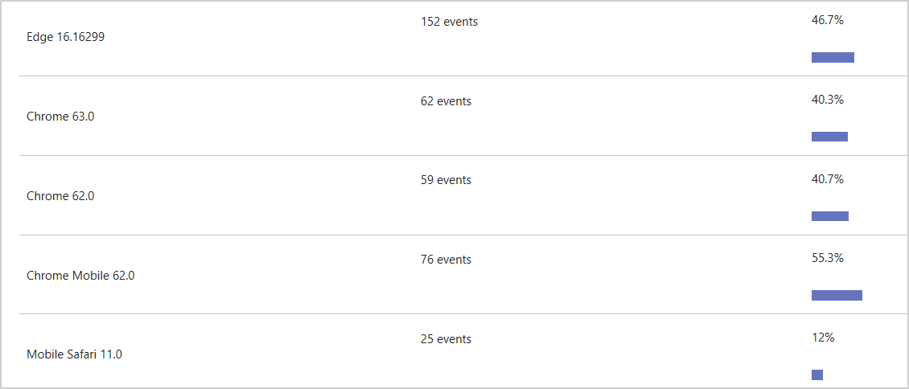
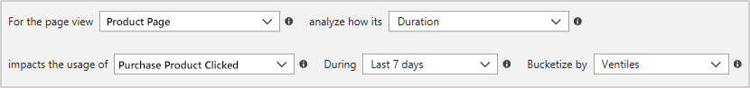
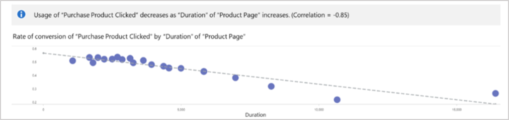

# Impact analysis with Application Insights

Impact analyzes how load times and other properties influence conversion rates for various parts of your app. To put it more precisely, it discovers how **any dimension** of a **page view**, **custom event**, or **request** affects the usage of a different **page view** or **custom event**. 

## Still not sure what Impact does?

One way to think of Impact is as the ultimate tool for settling arguments with someone on your team about how slowness in some aspect of your site is affecting whether users stick around. While users may tolerate a certain amount of slowness, Impact gives you insight into how best to balance optimization and performance to maximize user conversion.

But analyzing performance is just a subset of Impact's capabilities. Since Impact supports custom events and dimensions, answering questions like how does user browser choice correlate with different rates of conversion are just a few clicks away.

> [!NOTE]
> Your Application Insights resource must contain page views or custom events to use the Impact tool. [Learn how to set up your app to collect page views automatically with the Application Insights JavaScript SDK](../../azure-monitor/app/javascript.md). Also keep in mind that since you are analyzing correlation, sample size matters.
>
>

## Is page load time impacting how many people convert on my page?

To begin answering questions with the Impact tool, choose an initial page view, custom event, or request.

1. Select a page view from the **For the page view** dropdown.
2. Leave the **analyze how its** dropdown on the default selection of **Duration** (In this context **Duration** is an alias for **Page Load Time**.)
3. For the **impacts the usage of** dropdown, select a custom event. This event should correspond to a UI element on the page view you selected in step 1.

In this instance as **Product Page** load time increases the conversion rate to **Purchase Product clicked** goes down. Based on the distribution above, an optimal page load duration of 3.5 seconds could be targeted to achieve a potential 55% conversion rate. Further performance improvements to reduce load time below 3.5 seconds do not currently correlate with additional conversion benefits.

## What if I’m tracking page views or load times in custom ways?

Impact supports both standard and custom properties and measurements. Use whatever you want. Instead of duration,
use filters on the primary and secondary events to get more specific.

## Do users from different countries or regions convert at different rates?

1. Select a page view from the **For the page view** dropdown.
2. Choose “Country or region” in **analyze how its** dropdown
3. For the **impacts the usage of** dropdown, select a custom event that corresponds to a UI element on the page view you chose in step 1.

In this case, the results no longer fit into a continuous x-axis model as they did in the first example. Instead, a visualization similar to a segmented funnel is presented. Sort by **Usage** to view the variation of conversion to your custom event based on country/region.

## How does the Impact tool calculate these conversion rates?

Under the hood, the Impact tool relies on the [Pearson correlation coefficient](https://en.wikipedia.org/wiki/Pearson_correlation_coefficient). Results are computed between -1 and 1 with -1 representing a negative linear correlation and 1 representing a positive linear correlation.

The basic breakdown of how Impact Analysis works is as follows:

Let _A_ = the main page view/custom event/request you select in the first dropdown. (**For the page view**).

Let _B_ = the secondary page view/custom event you select (**impacts the usage of**).

Impact looks at a sample of all the sessions from users in the selected time range. For each session, it looks for each occurrence of _A_.

Sessions are then broken into two different kinds of _subsessions_ based on one of two conditions:

- A converted subsession consists of a session ending with a _B_ event and encompasses all _A_ events that occur prior to _B_.
- An unconverted subsession occurs when all _A_'s occur without a terminal _B_.

How Impact is ultimately calculated varies based on whether we are analyzing by metric or by dimension. For metrics all _A_'s in a subsession are averaged. Whereas for dimensions the value of each _A_ contributes _1/N_ to the value assigned to _B_ where _N_ is the number of _A_'s in the subsession.

## Next steps

- To enable usage experiences, start sending [custom events](https://docs.microsoft.com/azure/application-insights/app-insights-api-custom-events-metrics#trackevent) or [page views](https://docs.microsoft.com/azure/application-insights/app-insights-api-custom-events-metrics#page-views).
- If you already send custom events or page views, explore the Usage tools to learn how users use your service.
    - [Funnels](usage-funnels.md)
    - [Retention](usage-retention.md)
    - [User Flows](usage-flows.md)
    - [Workbooks](../../azure-monitor/platform/workbooks-overview.md)
    - [Add user context](usage-send-user-context.md)
