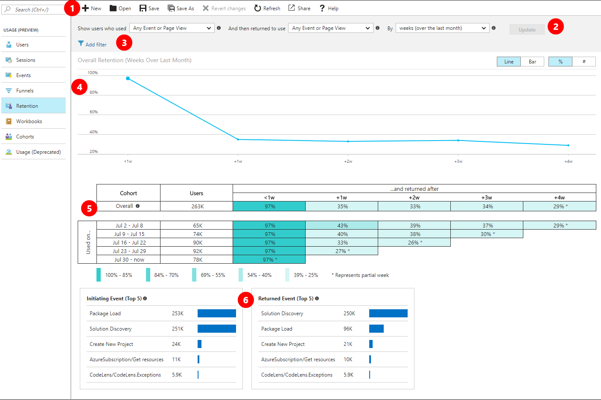

# User retention analysis for web applications with Application Insights

The retention feature in [Azure Application Insights](../../azure-monitor/app/app-insights-overview.md) helps you analyze how many users return to your app, and how often they perform particular tasks or achieve goals. For example, if you run a game site, you could compare the numbers of users who return to the site after losing a game with the number who return after winning. This knowledge can help you improve both your user experience and your business strategy.

## Get started

If you don't yet see data in the retention tool in the Application Insights portal, [learn how to get started with the usage tools](usage-overview.md).

## The Retention tool



1. The toolbar allows users to create new retention reports, open existing retention reports, save current retention report or save as, revert changes made to saved reports, refresh data on the report, share report via email or direct link, and access the documentation page. 
2. By default, retention shows all users who did anything then came back and did anything else over a period. You can select different combination of events to narrow the focus on specific user activities.
3. Add one or more filters on properties. For example, you can focus on users in a particular country or region. Click **Update** after setting the filters. 
4. The overall retention chart shows a summary of user retention across the selected time period. 
5. The grid shows the number of users retained according to the query builder in #2. Each row represents a cohort of users who performed any event in the time period shown. Each cell in the row shows how many of that cohort returned at least once in a later period. Some users may return in more than one period. 
6. The insights cards show top five initiating events, and top five returned events to give users a better understanding of their retention report. 


Users can hover over cells on the retention tool to access the analytics button and tool tips explaining what the cell means. The Analytics button takes users to the Analytics tool with a pre-populated query to generate users from the cell. 

## Use business events to track retention

To get the most useful retention analysis, measure events that represent significant business activities. 

For example, many users might open a page in your app without playing the game that it displays. Tracking just the page views would therefore provide an inaccurate estimate of how many people return to play the game after enjoying it previously. To get a clear picture of returning players, your app should send a custom event when a user actually plays.  

It's good practice to code custom events that represent key business actions, and use these for your retention analysis. To capture the game outcome, you need to write a line of code to send a custom event to Application Insights. If you write it in the web page code or in Node.JS, it looks like this:

```JavaScript
    appinsights.trackEvent("won game");
```

Or in ASP.NET server code:

```csharp
   telemetry.TrackEvent("won game");
```

[Learn more about writing custom events](../../azure-monitor/app/api-custom-events-metrics.md#trackevent).


## Next steps
- To enable usage experiences, start sending [custom events](https://docs.microsoft.com/azure/application-insights/app-insights-api-custom-events-metrics#trackevent) or [page views](https://docs.microsoft.com/azure/application-insights/app-insights-api-custom-events-metrics#page-views).
- If you already send custom events or page views, explore the Usage tools to learn how users use your service.
    - [Users, Sessions, Events](usage-segmentation.md)
    - [Funnels](usage-funnels.md)
    - [User Flows](usage-flows.md)
    - [Workbooks](../../azure-monitor/platform/workbooks-overview.md)
    - [Add user context](usage-send-user-context.md)


