# Create interactive reports with Azure Monitor workbooks

Workbooks combine text, [Analytics queries](https://docs.microsoft.com/azure/application-insights/app-insights-analytics), Azure Metrics, and parameters into rich interactive reports. Workbooks are editable by any other team members who have access to the same Azure resources.

Workbooks are helpful for scenarios like:

* Exploring the usage of your app when you don't know the metrics of interest in advance: numbers of users, retention rates, conversion rates, etc. Unlike other usage analytics tools, workbooks let you combine multiple kinds of visualizations and analyses, making them great for this kind of free-form exploration.
* Explaining to your team how a newly released feature is performing, by showing user counts for key interactions and other metrics.
* Sharing the results of an A/B experiment in your app with other members of your team. You can explain the goals for the experiment with text, then show each usage metric and Analytics query used to evaluate the experiment, along with clear call-outs for whether each metric was above- or below-target.
* Reporting the impact of an outage on the usage of your app, combining data, text explanation, and a discussion of next steps to prevent outages in the future.

## Starting with a template or saved workbook

A workbook is made up of sections consisting of independently editable charts, tables, text, and input controls. To better understand workbooks, it is best to open one up. 

Select **Workbooks** from the left-hand menu from inside the Application Insights experience for your app.

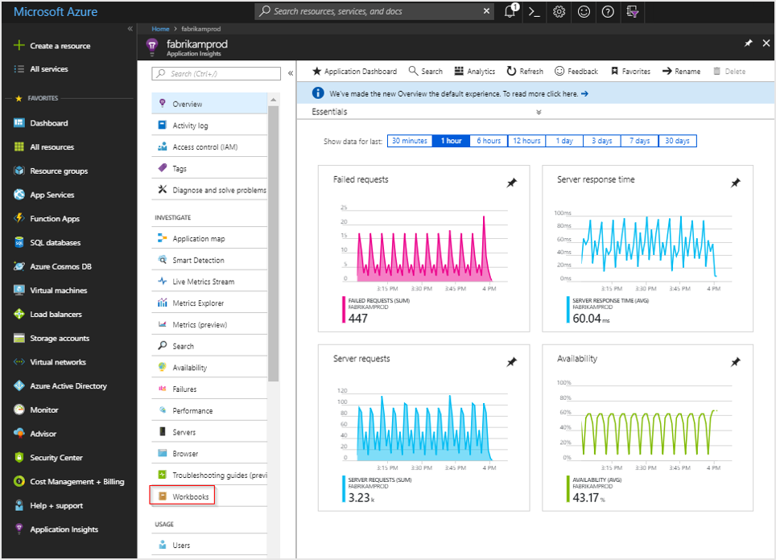

This launches a workbook gallery with a number of prebuilt workbooks to help you get started.

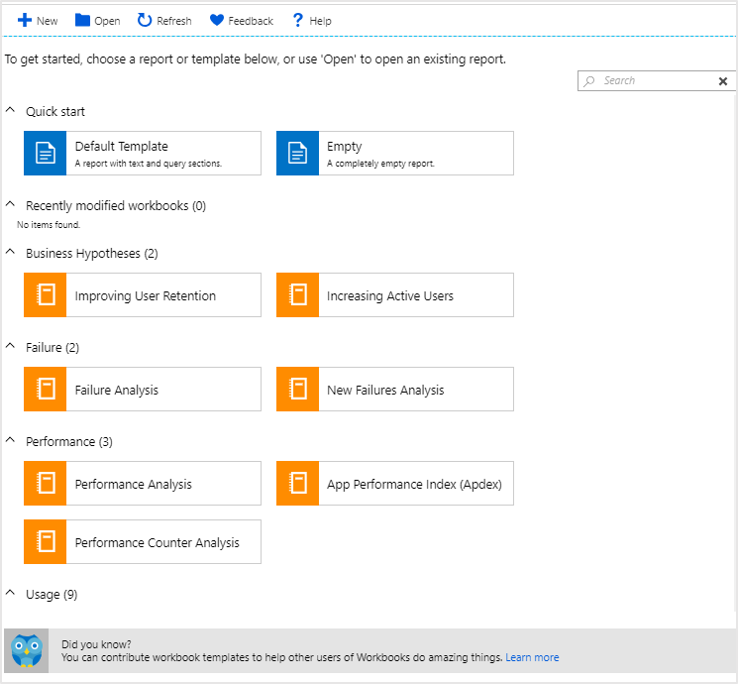

We'll start with the **Default Template**, which is located under the heading **Quick start**.

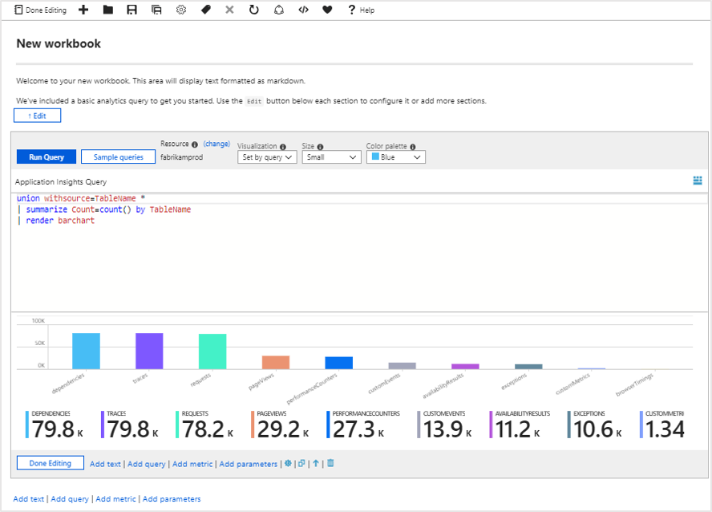

## Editing, rearranging, cloning, and deleting workbook sections

Workbooks have two modes: **editing mode**, and **reading mode**. When the default workbook is first launched, it opens in **editing mode**. This shows all the content of the workbook, including any steps and parameters that are otherwise hidden. **Reading mode** presents a simplified report style view. This allows you to abstract away the complexity that went into creating a report while still having the underlying mechanics only a few clicks away when needed for modification.

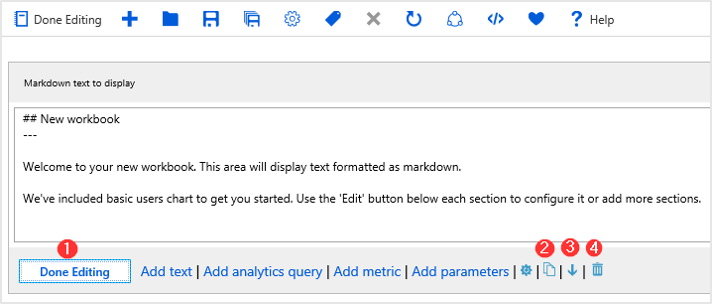

1. When you're done editing a section, click **Done Editing** in the bottom left corner of the section.

2. To create a duplicate of a section, click the **Clone this section** icon. Creating duplicate sections is a great to way to iterate on a query without losing previous iterations.

3. To move up a section in a workbook, click the **Move up** or **Move down** icon.

4. To remove a section permanently, click the **Remove** icon.

## Adding text and Markdown sections

Adding headings, explanations, and commentary to your workbooks helps turn a set of tables and charts into a narrative. Text sections in workbooks support the [Markdown syntax](https://daringfireball.net/projects/markdown/) for text formatting, like headings, bold, italics, and bulleted lists.

To add a text section to your workbook, use the **Add text** button at the bottom of the workbook, or at the bottom of any section.

## Adding query sections

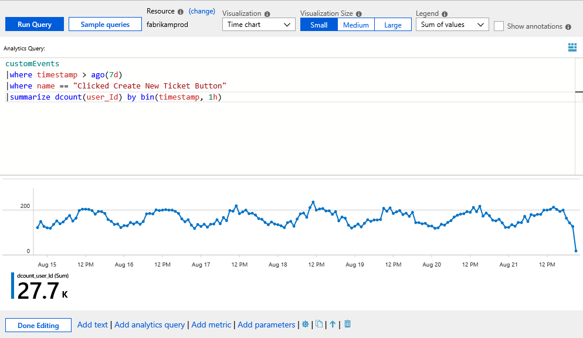

To add query section to your workbook, use the **Add query** button at the bottom of the workbook, or at the bottom of any section.

Query sections are highly flexible and can be used to answer questions like:

* How many exceptions did your site throw during the same time period as a decline in usage?
* What was the distribution of page load times for users viewing some page?
* How many users viewed some set of pages on your site, but not some other set of pages? This can be useful to understand if you have clusters of users who use different subsets of your site's functionality (use the `join` operator with the `kind=leftanti` modifier in the [Kusto query language](/azure/kusto/query/)).

You also aren't only limited to querying from the context of the application you launched the workbook from. You can query across multiple Application Insights monitored apps as well as Log Analytics workspaces as long as you have access permission to those resources.

To query from additional external Application Insights resources use the **app** identifier.

```
union app('app01').requests, app('app02').requests, requests
| summarize count() by bin(timestamp, 1h)
```  

This query is combining requests from three different applications. An app named app01, an app named app02, and the requests from the local Application Insights resource.

To pull in data from an external Log Analytics workspace use the **workspace** identifier.

To learn more about cross-resource queries refer to the [official guidance](https://docs.microsoft.com/azure/log-analytics/log-analytics-cross-workspace-search).

### Advanced analytic query settings

Each section has its own advanced settings, which are accessible via the settings icon  located to the right of the **Add parameters** button.

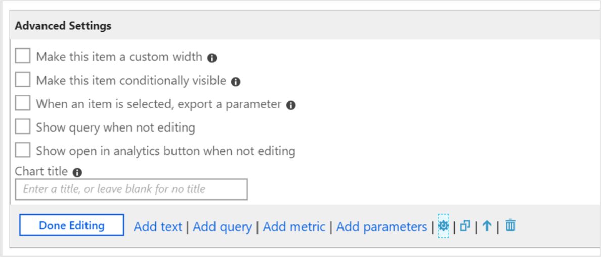

   |         |          |
   | ---------------- |:-----|
   | **Custom width**    | Set this to make an item an arbitrary size, so you can fit many items on a single line allowing you to better organize your charts and tables into rich interactive reports.  |
   | **Conditionally visible** | Use this to hide steps based on a parameter when in reading mode. |
   | **Export a parameter**| This allows a selected row in the grid or chart to cause later steps to change values or become visible.  |
   | **Show query when not editing** | This displays the query above the chart or table even when in reading mode.
   | **Show open in analytics button when not editing** | This adds the blue Analytics icon to the right-hand corner of the chart to allow one-click access.|

Most of these settings are fairly intuitive, but to understand **Export a parameter** it is better to examine a workbook that makes use of this functionality.

One of the prebuilt workbooks provides information on Active Users.

The first section of the workbook is based on Analytic query data:

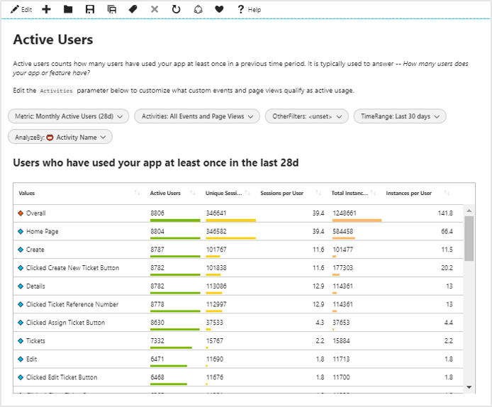

The second section is also based on analytic query data, but selecting a row in the first table will interactively update the contents of the chart:

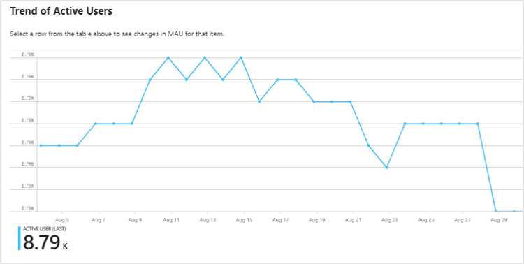

 This is possible through use of the **When an item is selected, export a parameter** advanced settings that are enabled in the table's Analytics query.

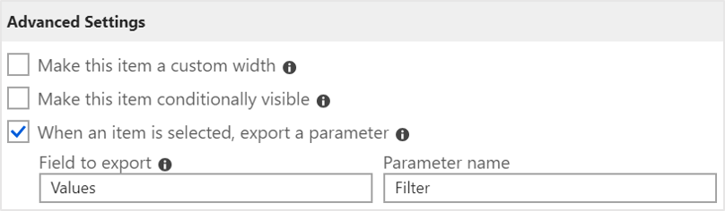

The second analytics query then utilizes the exported values when a row is selected. If no row is selected, it defaults to the row representing the overall values. 

```
let start = startofday(ago({TimeRange} + {Metric}));
union customEvents, pageViews
| where timestamp >= start
| where name in ({Activities}) or '*' in ({Activities}) or ('%' in ({Activities}) and itemType == 'pageView') or ('#' in ({Activities}) and itemType == 'customEvent')
{OtherFilters}
| where '{Filter}' == '' or '{Filter}' == '🔸 Overall' or {AnalyzeBy} == replace('🔹 ', '', '{Filter}')
| evaluate activity_engagement(user_Id, timestamp, start, now(), 1d, {Metric})
| where timestamp >= startofday(ago({TimeRange}))
| project timestamp, ["Active User"] = dcount_activities_outer
| render timechart 
```

## Adding metrics sections

Metrics sections give you full access to incorporate Azure Monitor metrics data into your interactive reports. Many of the prebuilt workbooks will contain both analytic query data and metric data allowing you to take full advantage of the best of both features all in one place. You also have the ability to pull in metric data from resources in any of the subscriptions you have access to.

Here is an example of Virtual machine data being pulled into a workbook to provide a grid visualization of CPU performance:

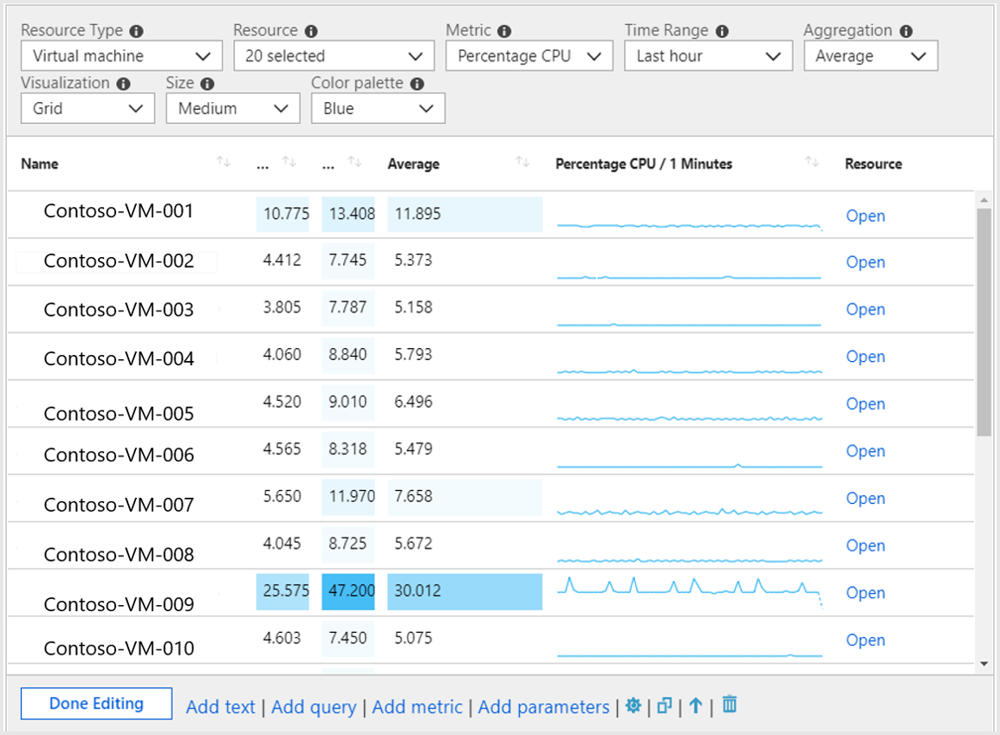

## Adding parameter sections

Workbook parameters allow you to change values in the workbook without having to manually edit the query or text sections.  This removes the requirement of needing to understand the underlying analytics query language and greatly expands the potential audience of workbook-based reporting.

The values of parameters are replaced in query, text or other parameter sections by putting the name of the parameter in braces, like ``{parameterName}``.  Parameter names are limited to similar rules as JavaScript identifiers, basically alphabetic characters or underscores, followed by alphanumeric characters or underscores. For example, **a1** is allowed, but **1a** is not allowed.

Parameters are linear, starting from the top of a workbook and flowing down to later steps.  Parameters declared later in a workbook can override those that were declared further up.  This also lets parameters that use queries to access the values from parameters defined further up.  Within a parameter's step itself, parameters are also linear, left to right, where parameters to the right can depend on a parameter declared earlier in that same step.
 
There are four different types of parameters which are currently supported:

  |         |          |
   | ---------------- |:-----|
   | **Text**    | the user will edit a text box, and you can optionally supply a query to fill in the default value. |
   | **Drop down** | The user will choose from a set of values. |
   | **Time range picker**| The user will choose from a predefined set of time range values, or pick from a custom time range.|
   | **Resource picker** | The user will choose from the resources selected for the workbook.|

### Using a text parameter

The value a user types in the textbox is replaced directly in the query, with no escaping or quoting. If the value you need is a string, the query should have quotes around the parameter (like **'{parameter}'**).

This allows the value in a text box to be used anywhere. It can be a table name, column name, function name, operator, etc.

The text parameter type has a setting **Get default value from analytics query**, which allows the workbook author to use a query to populate the default value for that textbox.

When using the default value from an analytics query, only the first value of the first row (row 0, column 0) is used as the default value. Therefore it is recommended to limit your query to return just one row and one column. Any other data returned by the query is ignored. 

Whatever value the query returns will be replaced directly with no escaping or quoting. If the query returns no rows, the result of the parameter is either an empty string (if the parameter is not required) or undefined (if the parameter is required).

### Using a dropdown

The dropdown parameter type lets you create a dropdown control, allowing the selection of one or many values.

The dropdown is populated by an analytics query. If the query returns one column, the values in that column are both the **value** and the **label** in the dropdown control. If the query returns two columns, the first column is the **value**, and the second column is the **label** shown in the dropdown.  If the query returns three columns, the 3rd column is used to indicate the default selection in that dropdown.  This column can be any type, but the simplest is to use bool or numeric types, where 0 is false, and 1 is true.

 If the column is a string type, null/empty string is considered false, and any other value is considered true. For single selection dropdowns, the first value with a true value is used as the default selection.  For multiple selection dropdowns, all values with a true value are used as the default selected set. The items in the dropdown are shown in whatever order the query returned rows. 

Let's look at the parameters present in the Active Users report. Click the edit symbol next to **TimeRange**.

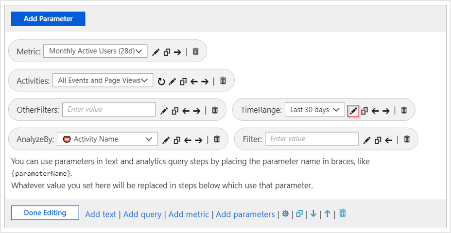

This will launch the Edit Parameter menu item:

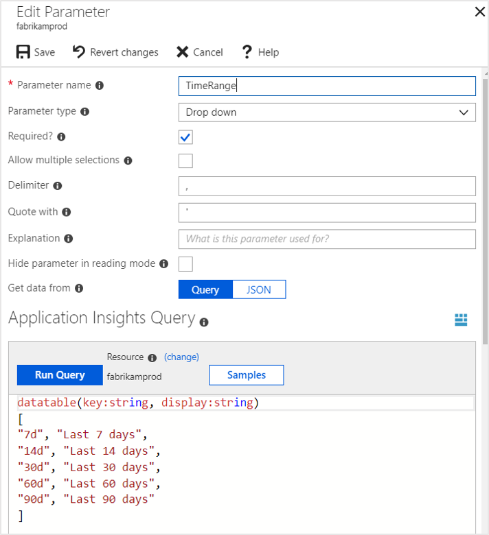

The query uses a feature of the analytics query language called a **datatable** that lets you generate an arbitrary table, full of content, out of thin air! For example, the following analytics query:

```
datatable( column1:string, column2:string )
[
 "row 1 column 1", "row 1 column 2",
"row 2 column 1", "row 2 column 2"
]
```

Generates the result:

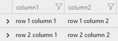

A more applicable example is using a dropdown to pick from a set of countries/regions by name:

```
customEvents
| where timestamp >= ago(14d)
| summarize count() by client_CountryOrRegion
| top 100 by count_
| project  client_CountryOrRegion 
| order by client_CountryOrRegion asc
```

The query will display results as follows:

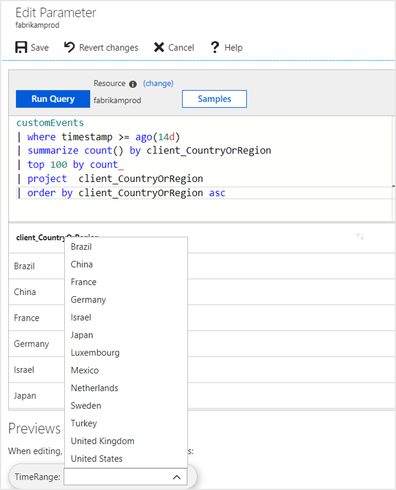

Dropdowns are incredibly powerful tools for customizing and creating interactive reports.

### Time range parameters

While you can make your own custom time range parameter via the dropdown parameter type, you can also use the out-of-box time range parameter type if you don't need the same degree of flexibility. 

Time range parameter types have 15 default ranges that go from five minutes to the last 90 days. There is also an option to allow custom time range selection, which allows the operator of the report to choose explicit start and stop values for the time range.

### Resource picker

The resource picker parameter type gives you the ability to scope your report to certain types of resources. An example of prebuilt workbook that leverages the resource picker type is the **Failure Insights** workbook.

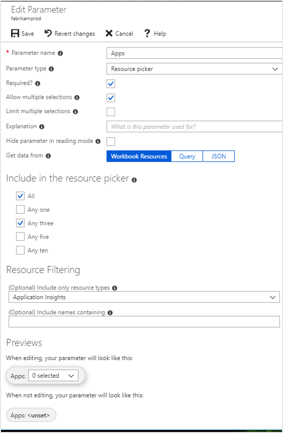

## Saving and sharing workbooks with your team

Workbooks are saved within an Application Insights resource, either in the **My Reports** section that's private to you or in the **Shared Reports** section that's accessible to everyone with access to the Application Insights resource. To view all the workbooks in the resource, click the **Open** button in the action bar.

To share a workbook that's currently in **My Reports**:

1. Click **Open** in the action bar
2. Click the "..." button beside the workbook you want to share
3. Click **Move to Shared Reports**.

To share a workbook with a link or via email, click **Share** in the action bar. Keep in mind that recipients of the link need access to this resource in the Azure portal to view the workbook. To make edits, recipients need at least Contributor permissions for the resource.

To pin a link to a workbook to an Azure Dashboard:

1. Click **Open** in the action bar
2. Click the "..." button beside the workbook you want to pin
3. Click **Pin to dashboard**.

## Contributing workbook templates

Have you created an awesome workbook template and want to share it with the community? To learn more, visit our [GitHub repo](https://github.com/Microsoft/Application-Insights-Workbooks/blob/master/README.md).

## Next steps
- To enable usage experiences, start sending [custom events](https://docs.microsoft.com/azure/application-insights/app-insights-api-custom-events-metrics#trackevent) or [page views](https://docs.microsoft.com/azure/application-insights/app-insights-api-custom-events-metrics#page-views).
- If you already send custom events or page views, explore the Usage tools to learn how users use your service.
    - [Users, Sessions, Events](../../azure-monitor/app/usage-segmentation.md)
    - [Funnels](../../azure-monitor/app/usage-funnels.md)
    - [Retention](../../azure-monitor/app/usage-retention.md)
    - [User Flows](../../azure-monitor/app/usage-flows.md)
    - [Add user context](../../azure-monitor/app/usage-send-user-context.md)