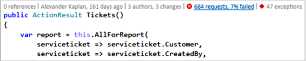
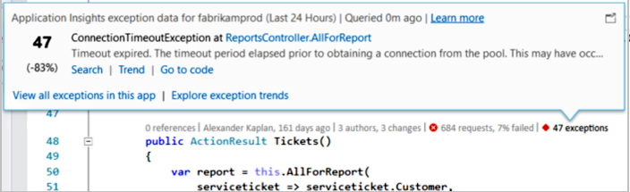
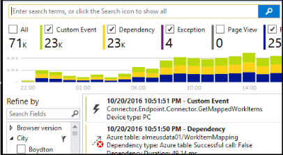

# Application Insights telemetry in Visual Studio CodeLens
Methods in the code of your web app can be annotated with telemetry about run-time exceptions and request response times. If you install [Azure Application Insights](../../azure-monitor/app/app-insights-overview.md) in your application, the telemetry appears in Visual Studio [CodeLens](https://msdn.microsoft.com/library/dn269218.aspx) - the notes at the top of each function where you're used to seeing useful information such as the number of places the function is referenced or the last person who edited it.

> [!NOTE]
> Application Insights in CodeLens is available in Visual Studio 2015 Update 3 and later, or with the latest version of [Developer Analytics Tools extension](https://visualstudiogallery.msdn.microsoft.com/82367b81-3f97-4de1-bbf1-eaf52ddc635a). CodeLens is available in the Enterprise and Professional editions of Visual Studio.
> 
> 

## Where to find Application Insights data
Look for Application Insights telemetry in the CodeLens indicators of the public request methods of your web application. 
CodeLens indicators are shown above method and other declarations in C# and Visual Basic code. If Application Insights data is available for a method, you'll see indicators for requests and exceptions such as "100 requests, 1% failed" or "10 exceptions." Click a CodeLens indicator for more details. 

> [!TIP]
> Application Insights request and exception indicators may take a few extra seconds to load after other CodeLens indicators appear.
> 
> 

## Exceptions in CodeLens

The exception CodeLens indicator shows the number of exceptions that have occurred in the past 24 hours from the 15 most frequently occurring exceptions in your application during that period, while processing the request served by the method.

To see more details, click the exceptions CodeLens indicator:

* The percentage change in number of exceptions from the most recent 24 hours relative to the prior 24 hours
* Choose **Go to code** to navigate to the source code for the function throwing the exception
* Choose **Search** to query all instances of this exception that have occurred in the past 24 hours
* Choose **Trend** to view a trend visualization for occurrences of this exception in the past 24 hours
* Choose **View all exceptions in this app** to query all exceptions that have occurred in the past 24 hours
* Choose **Explore exception trends** to view a trend visualization for all exceptions that have occurred in the past 24 hours. 

> [!TIP]
> If you see "0 exceptions" in CodeLens but you know there should be exceptions, check to make sure the right Application Insights resource is selected in CodeLens. To select another resource, right-click on your project in the Solution Explorer and choose **Application Insights > Choose Telemetry Source**. CodeLens is only shown for the 15 most frequently occurring exceptions in your application in the past 24 hours, so if an exception is the 16th most frequently or less, you'll see "0 exceptions." Exceptions from ASP.NET views may not appear on the controller methods that generated those views.
> 
> [!TIP]
> If you see "? exceptions" in CodeLens, you need to associate your Azure account with Visual Studio or your Azure account credential may have expired. In either case, click "? exceptions" and choose **Add an account...** to enter your credentials.
> 
> 

## Requests in CodeLens

The request CodeLens indicator shows the number of HTTP requests that been serviced by a method in the past 24 hours, plus the percentage of those requests that failed.

To see more details, click the requests CodeLens indicator:

* The absolute and percentage changes in number of requests, failed requests, and average response times over the past 24 hours compared to the prior 24 hours
* The reliability of the method, calculated as the percentage of requests that did not fail in the past 24 hours
* Choose **Search** for requests or failed requests to query all the (failed) requests that occurred in the past 24 hours
* Choose **Trend** to view a trend visualization for requests, failed requests, or average response times in the past 24 hours.
* Choose the name of the Application Insights resource in the upper left corner of the CodeLens details view to change which resource is the source for CodeLens data.

## Next steps
|  |  |
| --- | --- |
| **[Working with Application Insights in Visual Studio](../../azure-monitor/app/visual-studio.md)** Search telemetry, see data in CodeLens, and configure Application Insights. All within Visual Studio. | |
| **[Add more data](../../azure-monitor/app/asp-net-more.md)** Monitor usage, availability, dependencies, exceptions. Integrate traces from logging frameworks. Write custom telemetry. | |
| **[Working with the Application Insights portal](../../azure-monitor/app/overview-dashboard.md)** Dashboards, powerful diagnostic and analytic tools, alerts, a live dependency map of your application, and telemetry export. | |

