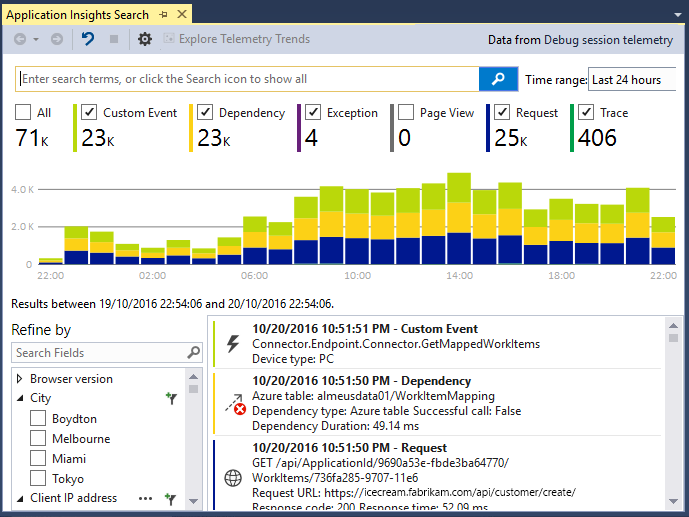
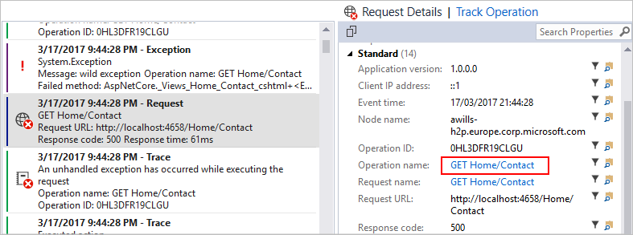
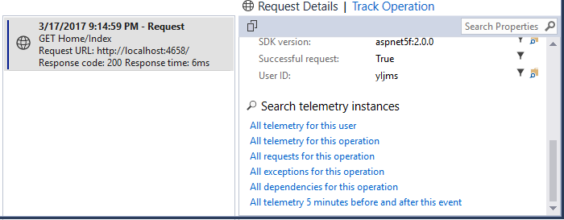
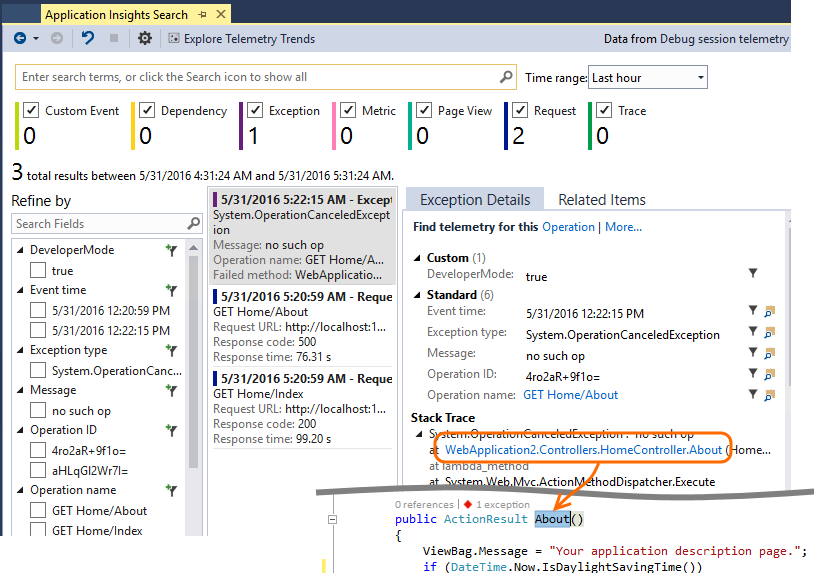

# Debug your applications with Application Insights in Visual Studio
In Visual Studio 2015 and later, you can analyze performance and diagnose issues in your ASP.NET web app both in debugging and in production by using telemetry from [Application Insights](./app-insights-overview.md).

If you created your ASP.NET web app by using Visual Studio 2017 or later, it already has the Application Insights SDK. Otherwise, if you haven't done so already, [add Application Insights to your app](./asp-net.md).

To monitor your app when it's in live production, you normally view the Application Insights telemetry in the [Azure portal](https://portal.azure.com), where you can set alerts and apply powerful monitoring tools. But for debugging, you can also search and analyze the telemetry in Visual Studio.

You can use Visual Studio to analyze telemetry both from your production site and from debugging runs on your development machine. In the latter case, you can analyze debugging runs even if you haven't yet configured the SDK to send telemetry to the Azure portal.

##  Debug your project
Run your web app in local debug mode by using F5. Open different pages to generate some telemetry.

In Visual Studio, you see a count of the events that were logged by the Application Insights module in your project.

Select the **Application Insights** button to search your telemetry.

## Application Insights Search
The **Application Insights Search** window shows logged events. If you signed in to Azure when you set up Application Insights, you can search the same events in the Azure portal. Right-click the project and select **Application Insights** > **Search**.

> [!NOTE]
> After you select or clear filters, select **Search** at the end of the text search field.
>
The free text search works on any fields in the events. For example, you can search for part of the URL of a page. You can also search for the value of a property, such as a client's city, or specific words in a trace log.

Select any event to see its detailed properties.

For requests to your web app, you can click through to the code.

.

You can also open related items to help diagnose failed requests or exceptions.

## View exceptions and failed requests
Exception reports show in the **Search** window. In some older types of ASP.NET application, you have to [set up exception monitoring](./asp-net-exceptions.md) to see exceptions that are handled by the framework.

Select an exception to get a stack trace. If the code of the app is open in Visual Studio, you can click through from the stack trace to the relevant line of the code.

## View request and exception summaries in the code
In the CodeLens line above each handler method, you see a count of the requests and exceptions logged by Application Insights in the past 24 hours.

> [!NOTE]
> CodeLens shows Application Insights data only if you've [configured your app to send telemetry to the Application Insights portal](./asp-net.md).
>

For more information, see [Application Insights telemetry in Visual Studio CodeLens.](./visual-studio-codelens.md)

## Local monitoring
From Visual Studio 2015 Update 2: If you haven't configured the SDK to send telemetry to the Application Insights portal so that there's no instrumentation key in ApplicationInsights.config, the diagnostics window displays telemetry from your latest debugging session.

This is desirable if you've already published a previous version of your app. You don't want the telemetry from your debugging sessions to be mixed up with the telemetry on the Application Insights portal from the published app.

It's also useful if you have some [custom telemetry](./api-custom-events-metrics.md) that you want to debug before you send telemetry to the portal.

For example, at first you might have fully configured Application Insights to send telemetry to the portal. But now you want to see the telemetry only in Visual Studio:

  * In the **Search** window's settings, there's an option to search local diagnostics even if your app sends telemetry to the portal.
  * To stop telemetry being sent to the portal, comment out the line `<instrumentationkey>...` from ApplicationInsights.config. When you're ready to send telemetry to the portal again, uncomment it.

[!INCLUDE [azure-monitor-log-analytics-rebrand](../../../includes/azure-monitor-instrumentation-key-deprecation.md)]

## Next steps

 [Work with the Application Insights portal](./overview-dashboard.md) where you can view dashboards, use powerful diagnostic and analytic tools, get alerts, see a live dependency map of your application, and view exported telemetry data.