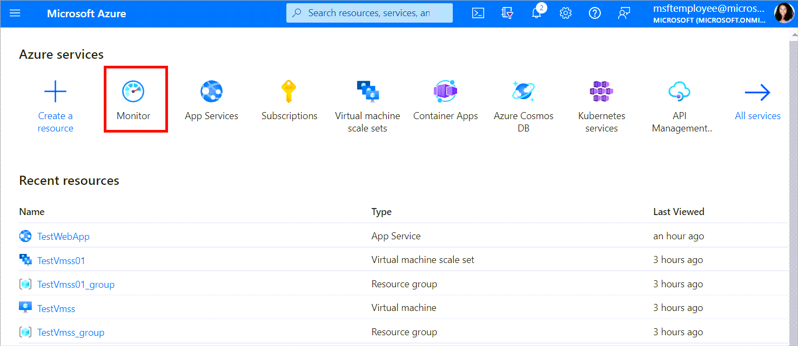
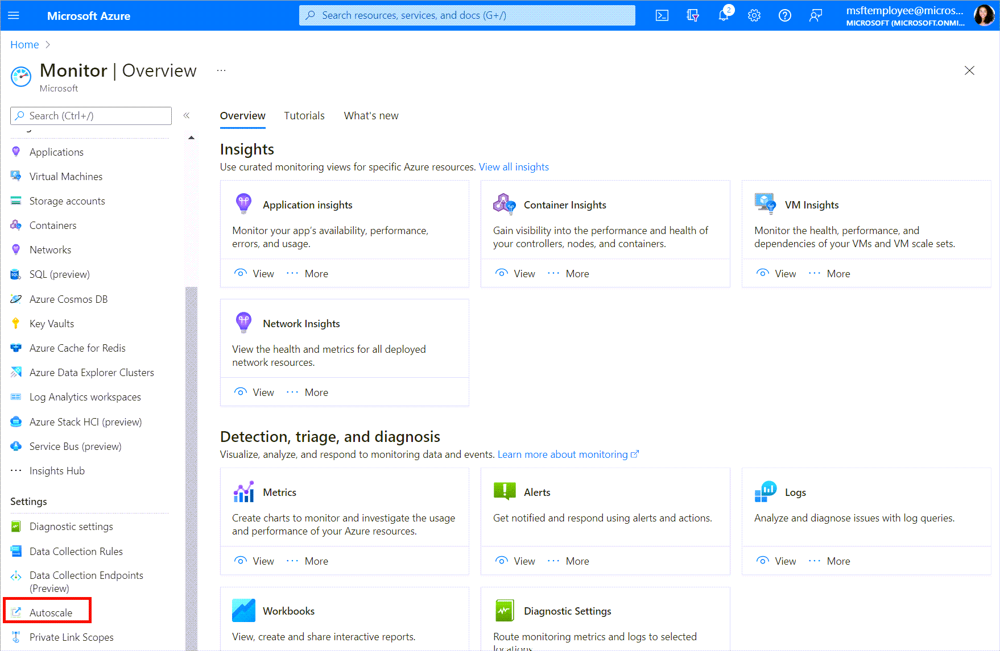
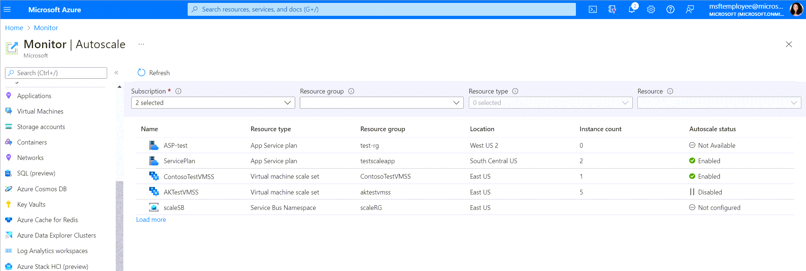
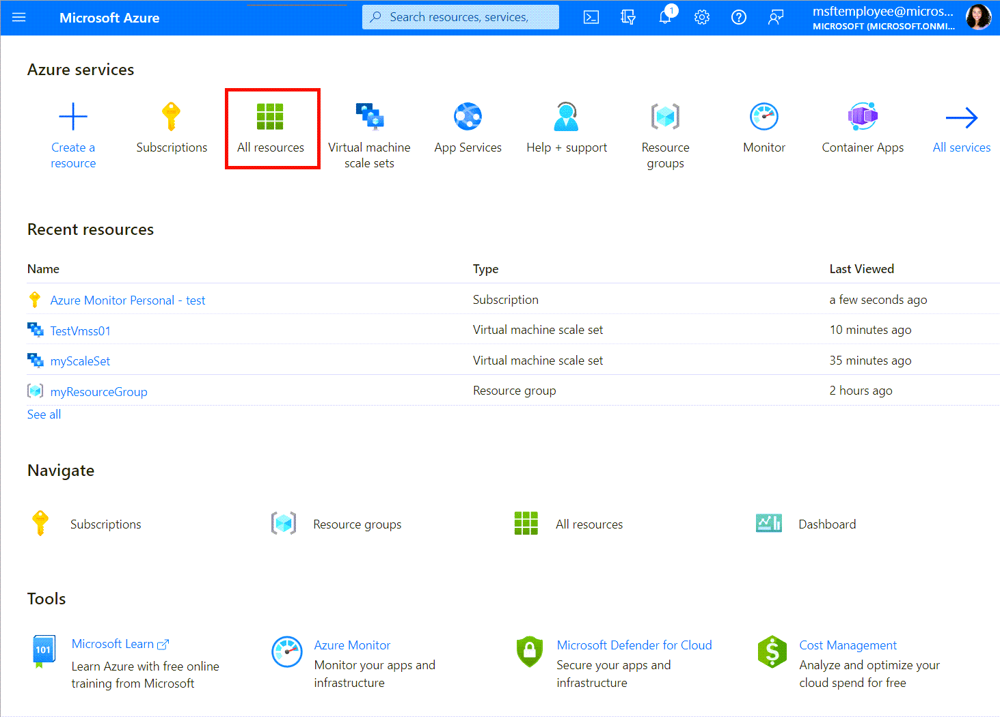
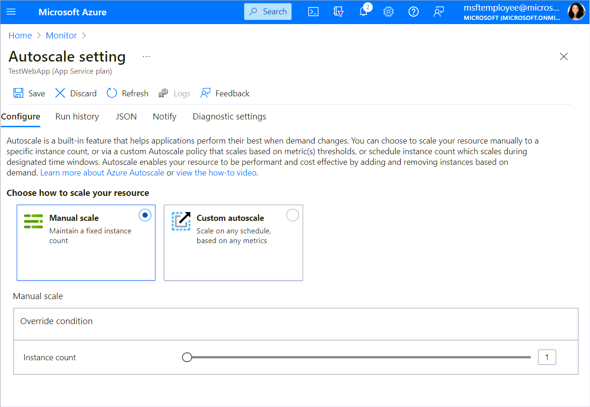
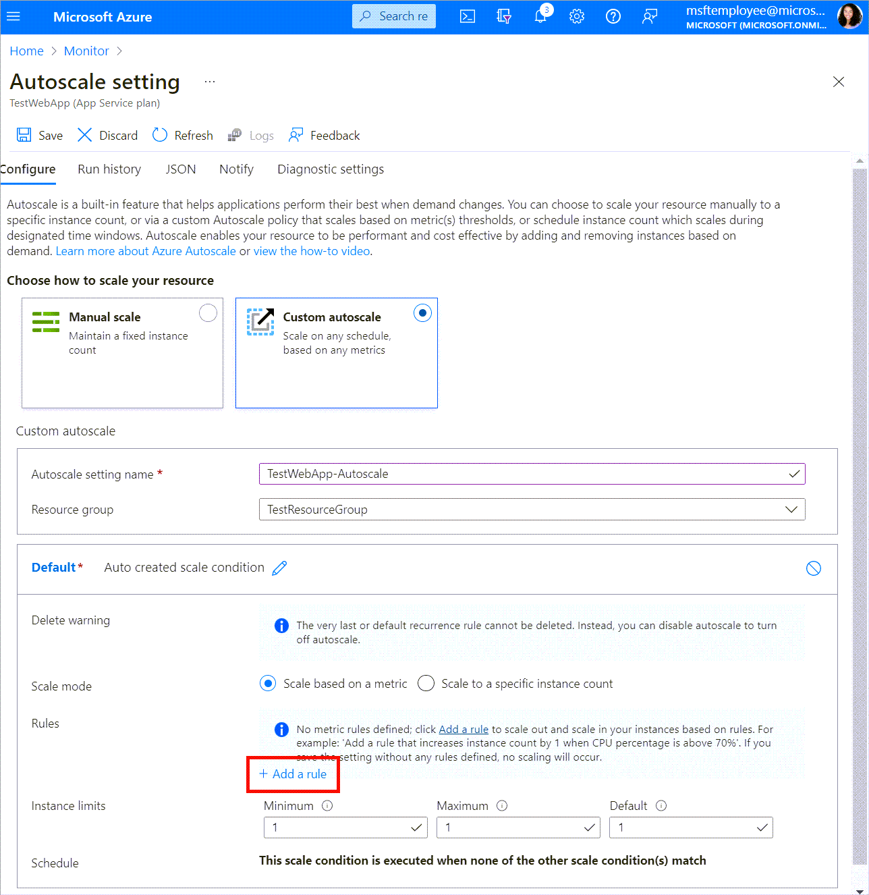
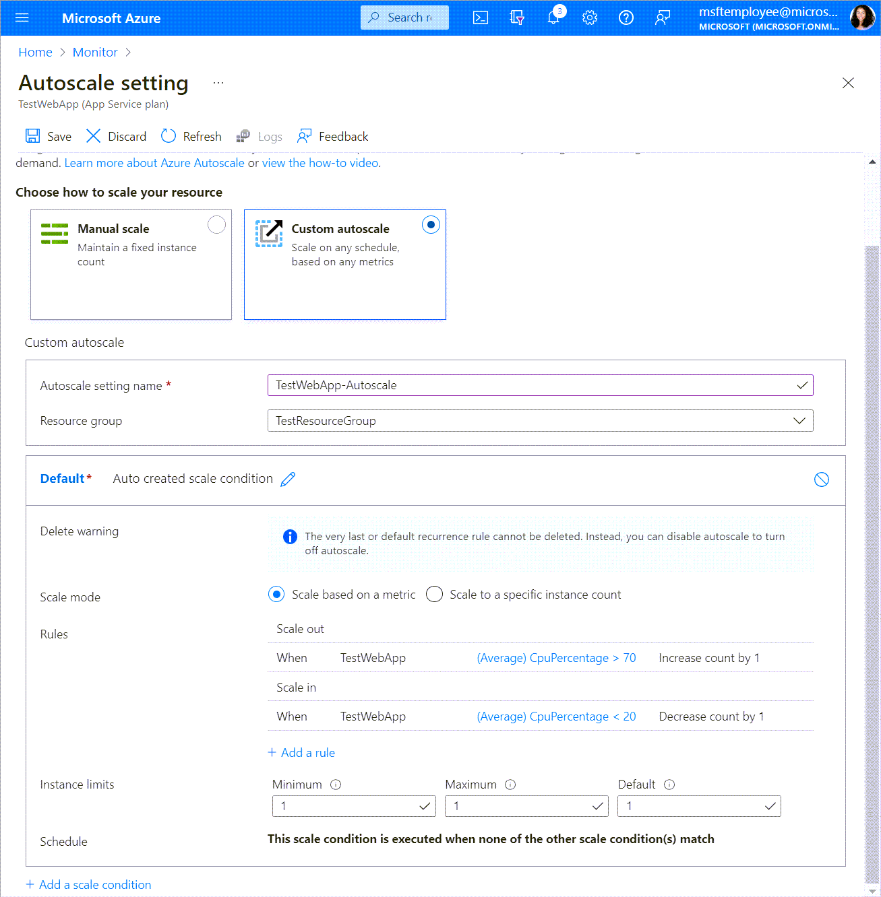
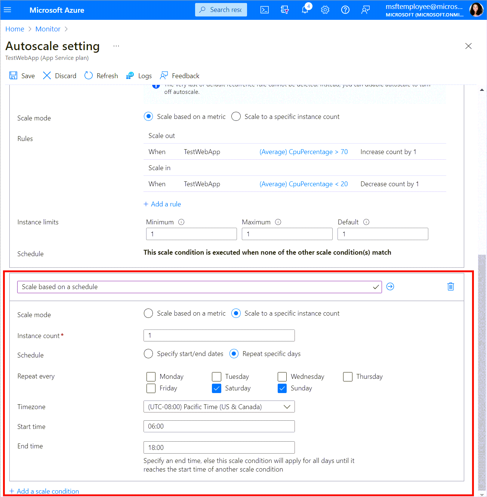
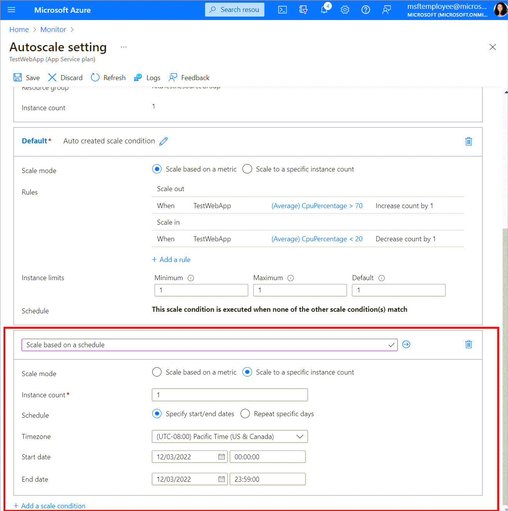
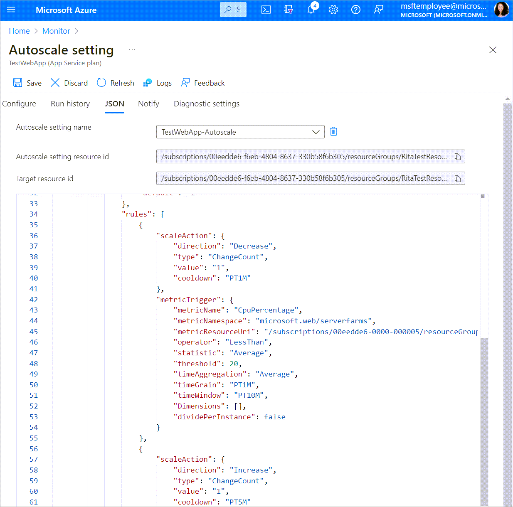

# Get started with autoscale in Azure

This article describes how to set up your autoscale settings for your resource in the Azure portal.

Azure Monitor autoscale applies only to [Azure Virtual Machine Scale Sets](https://azure.microsoft.com/services/virtual-machine-scale-sets/), [Azure Cloud Services](https://azure.microsoft.com/services/cloud-services/), [Azure App Service - Web Apps](https://azure.microsoft.com/services/app-service/web/), and [Azure API Management](../../api-management/api-management-key-concepts.md).

## Discover the autoscale settings in your subscription

> [!VIDEO https://www.microsoft.com/en-us/videoplayer/embed/RE4u7ts]

To discover all the resources for which autoscale is applicable in Azure Monitor, follow these steps.

1. Open the [Azure portal.][1]
1. Select the Azure Monitor icon at the top of the page.

   

1. Select **Autoscale** to view all the resources for which autoscale is applicable, along with their current autoscale status.

   
  
1. Use the filter pane at the top to scope down the list to select resources in a specific resource group, specific resource types, or a specific resource.

   

   For each resource, you'll find the current instance count and the autoscale status. The autoscale status can be:

   - **Not configured**: You haven't enabled autoscale yet for this resource.
   - **Enabled**: You've enabled autoscale for this resource.
   - **Disabled**: You've disabled autoscale for this resource.

   You can also reach the scaling page by selecting **All Resources** on the home page and filter to the resource you're interested in scaling.

    

1. After you've selected the resource that you're interested in, select the **Scaling** tab to configure autoscaling rules.

    

## Create your first autoscale setting

Let's now go through a step-by-step walkthrough to create your first autoscale setting.

1. Open the **Autoscale** pane in Azure Monitor and select a resource that you want to scale. The following steps use an App Service plan associated with a web app. You can [create your first ASP.NET web app in Azure in 5 minutes.][5]
1. The current instance count is 1. Select **Custom autoscale**.

   

1. Provide a name for the scale setting. Select **Add a rule** to open a context pane on the right side. By default, this action sets the option to scale your instance count by 1 if the CPU percentage of the resource exceeds 70 percent. Leave it at its default values and select **Add**.

   

1. You've now created your first scale rule. The UX recommends best practices and states that "It is recommended to have at least one scale in rule." To do so:

    1. Select **Add a rule**.
    1. Set **Operator** to **Less than**.
    1. Set **Threshold** to **20**.
    1. Set **Operation** to **Decrease count by**.

   You should now have a scale setting that scales out and scales in based on CPU usage.

   

1. Select **Save**.

Congratulations! You've now successfully created your first scale setting to autoscale your web app based on CPU usage.

> [!NOTE]
> The same steps are applicable to get started with a Virtual Machine Scale Sets or cloud service role.

## Other considerations

The following sections introduce other considerations for autoscaling.

### Scale based on a schedule

You can set your scale differently for specific days of the week.

1. Select **Add a scale condition**.
1. Setting the scale mode and the rules is the same as the default condition.
1. Select **Repeat specific days** for the schedule.
1. Select the days and the start/end time for when the scale condition should be applied.

### Scale differently on specific dates

You can set your scale differently for specific dates.

1. Select **Add a scale condition**.
1. Setting the scale mode and the rules is the same as the default condition.
1. Select **Specify start/end dates** for the schedule.
1. Select the start/end dates and the start/end time for when the scale condition should be applied.

### View the scale history of your resource

Whenever your resource is scaled up or down, an event is logged in the activity log. You can view the scale history of your resource for the past 24 hours by switching to the **Run history** tab.

![Screenshot that shows a Run history screen.][12]

To view the complete scale history for up to 90 days, select **Click here to see more details**. The activity log opens, with autoscale preselected for your resource and category.

### View the scale definition of your resource

Autoscale is an Azure Resource Manager resource. To view the scale definition in JSON, switch to the **JSON** tab.

You can make changes in JSON directly, if necessary. These changes will be reflected after you save them.

### Cool-down period effects

Autoscale uses a cool-down period to prevent "flapping," which is the rapid, repetitive up-and-down scaling of instances. For more information, see [Autoscale evaluation steps](autoscale-understanding-settings.md#autoscale-evaluation). For other valuable information on flapping and understanding how to monitor the autoscale engine, see [Flapping in Autoscale](autoscale-flapping.md) and [Troubleshooting autoscale](autoscale-troubleshoot.md), respectively.

## Route traffic to healthy instances (App Service)

When your Azure web app is scaled out to multiple instances, App Service can perform health checks on your instances to route traffic to the healthy instances. To learn more, see [Monitor App Service instances using Health check](../../app-service/monitor-instances-health-check.md).

## Move autoscale to a different region

This section describes how to move Azure autoscale to another region under the same subscription and resource group. You can use REST API to move autoscale settings.

### Prerequisites

- Ensure that the subscription and resource group are available and the details in both the source and destination regions are identical.
- Ensure that Azure autoscale is available in the [Azure region you want to move to](https://azure.microsoft.com/global-infrastructure/services/?products=monitor&regions=all).

### Move

Use [REST API](/rest/api/monitor/autoscalesettings/createorupdate) to create an autoscale setting in the new environment. The autoscale setting created in the destination region will be a copy of the autoscale setting in the source region.

[Diagnostic settings](../essentials/diagnostic-settings.md) that were created in association with the autoscale setting in the source region can't be moved. You'll need to re-create diagnostic settings in the destination region, after the creation of autoscale settings is completed.

### Learn more about moving resources across Azure regions

To learn more about moving resources between regions and disaster recovery in Azure, see [Move resources to a new resource group or subscription](../../azure-resource-manager/management/move-resource-group-and-subscription.md).

## Next steps

- [Create an activity log alert to monitor all autoscale engine operations on your subscription](https://github.com/Azure/azure-quickstart-templates/tree/master/demos/monitor-autoscale-alert)
- [Create an activity log alert to monitor all failed autoscale scale-in/scale-out operations on your subscription](https://github.com/Azure/azure-quickstart-templates/tree/master/demos/monitor-autoscale-failed-alert)

<!--Reference-->
[1]:https://portal.azure.com
[2]: ./media/autoscale-get-started/click-on-monitor-1.png
[3]: ./media/autoscale-get-started/click-on-autoscale-2.png
[4]: ./media/autoscale-get-started/view-all-resources-3.png
[5]: ../../app-service/quickstart-dotnetcore.md
[6]: ./media/autoscale-get-started/manual-scale-04.png
[7]: ./media/autoscale-get-started/custom-scale-add-rule-05.png
[8]: ./media/autoscale-get-started/scale-in-recommendation.png
[9]: ./media/autoscale-get-started/custom-scale-results-06.png
[10]: ./media/autoscale-get-started/scale-same-based-on-condition-07.png
[11]: ./media/autoscale-get-started/scale-different-based-on-time-08.png
[12]: ./media/autoscale-get-started/scale-history.png
[13]: ./media/autoscale-get-started/view-scale-definition-09.png
[14]: ./media/autoscale-get-started/disable-autoscale.png
[15]: ./media/autoscale-get-started/set-manualscale.png
[16]: ./media/autoscale-get-started/choose-all-resources.png
[17]: ./media/autoscale-get-started/scaling-page.png
