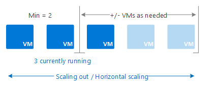
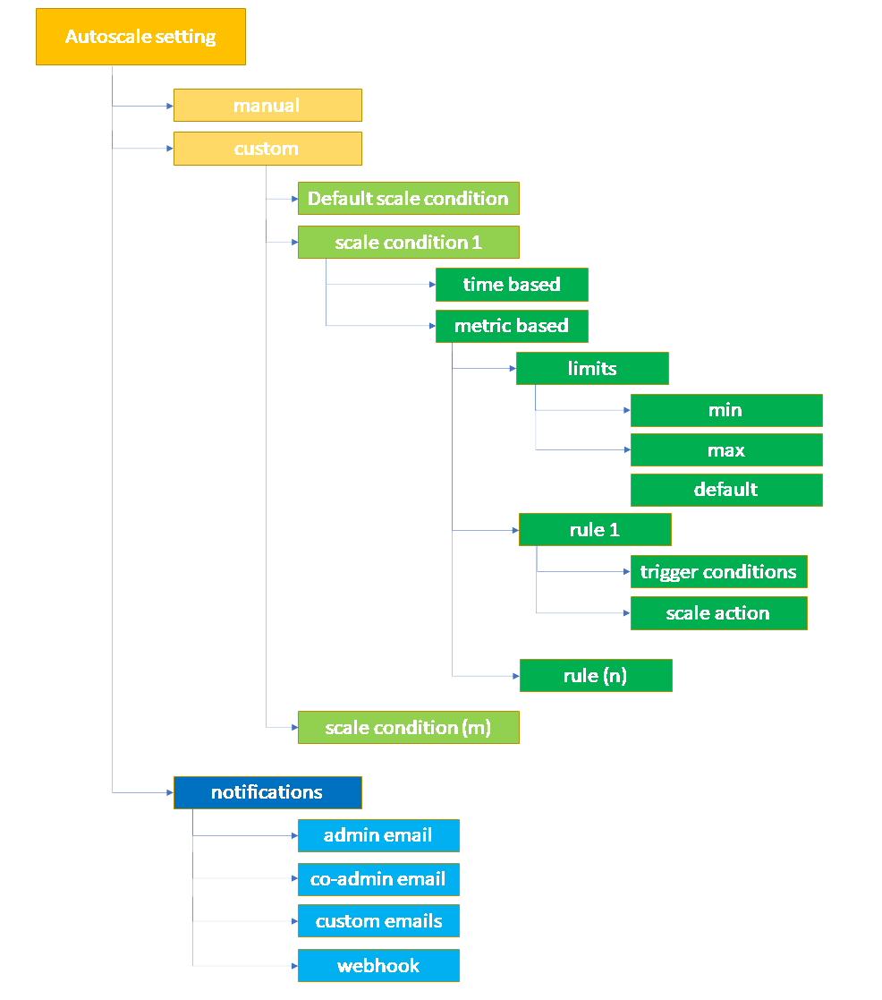

# Overview of autoscale in Microsoft Azure
This article describes Microsoft Azure autoscale and its benefits.

Azure autoscale supports a number of resource types. See the list of [supported resources](#supported-services-for-autoscale) for more details.

> [!NOTE]
> [Availability sets](/archive/blogs/kaevans/autoscaling-azurevirtual-machines) are an older scaling feature for Virtual Machines with limited support. We recommend migrating to [virtual machine scale sets](/azure/virtual-machine-scale-sets/overview) for faster and more reliable autoscale support. 

## What is autoscale
Autoscale allows you to automatically add and remove resources according to the load on your application. When your application experiences higher load, autoscale adds resources to handle the increased load. When load is low, autoscale reduces the number of resources, lowering your costs. You can also scale based on a scedule. 

Set a minimum level of resources that you need to run your application.
Set a maximum level of resources that will not be exceeded. 
Configure rules to add and remove resources within the minimum and maximum levels, based on metrics like CPU usage, queue length, available memory, or any other available metric.  

For example, scale out your application by adding VMs when the average CPU usage per VM is above 70% and scale it back in removing VMs when CPU usage drops to 40%.

 

When the conditions in the rules are met, one or more autoscale actions are triggered. You can add and remove VMs, or perform other actions like sending notifications or webhooks to trigger additional actions. 
### Predictive autoscale (preview)
[Predictive autoscale](/azure/azure-monitor/autoscale/autoscale-predictive) uses machine learning to help manage and scale Azure Virtual Machine Scale Sets with cyclical workload patterns. It forecasts the overall CPU load to your virtual machine scale set, based on your historical CPU usage patterns.  By observing and learning from historical usage, it predicts the overall CPU load ensuring scale-out occurs in time to meet the demand

## Architecture
The following diagram shows the autoscale architecture.  

 

### Resource Metrics
Resources generate metrics that are used in autoscale rules to trigger scale events. Virtual machine scale sets use telemetry data from Azure diagnostics agents to generate metrics. Telemetry for Web apps and Cloud services comes directly from the Azure Infrastructure. 

Some commonly used metrics include CPU usage, memory usage, thread counts, queue length, and disk usage. See [Autoscale Common Metrics](autoscale-common-metrics.md) for a list of available metrics..

### Custom Metrics
Use your own custom metrics that your application generates. Configure your application to send metrics to [Application Insights](azure/azure-monitor/app/app-insights-overview) so you can use those metrics decide when to scale.

### Time
Set up schedule-based rules to trigger scale events. Use schedule-based rules when you see time patterns in your load, and want to scale before an anticipated change in load occurs.   
 

### Rules
Rules define the conditions needed to trigger a scale event, the direction of the scaling, and the amount to scale by. Rules can be:
* Metric-based  
Trigger based on a metric value, for example when CPU usage is above 50%. Metric-based rules measure application load and add or remove VMs based on that load.
* Time-based  
Trigger based on a schedule, for example, every Saturday at 8am. 

You can combine multiple rules using different metrics, for example CPU usage and queue length.  
* The OR operator is used when scaling out with multiple rules.
* The AND operator is used when scaling in with multiple rules.

 
.
### Actions and automation
Rules can trigger one or more actions. Actions can be:

- Scale - Scale resources in or out.
- Email - Send email to subscription admins, co-admins, and/or additional email address you specify
- Webhooks  - Call webhooks to trigger multiple complex actions inside or outside Azure. External, third-party URLs outside Azure include services like Slack and Twilio. In Azure, you can:
     + Start an [Azure Automation runbook](/azure/automation/overview).
     + Call an [Azure Function](/azure/azure-functions/functions-overview).
     + Trigger an [Azure Logic App](/azure/logic-apps/logic-apps-overview).

## Autoscale Settings
Autoscale use the following terminology and structure.

- **Autoscale settings** Contains the autoscale configuration. It can be a fixed number of instances or a custom setting including rules and schedules. Autoscale settings also includes the setup for notifications. Custom autoscale configuration contains 1 or more scale conditions.

  - A **scale condition** can be time based or based on a metric. When based on a metric, a scale condition includes:
    - **A set of rules** defining a trigger and a scale action.
    - **Instance limits** setting the default, max and min number of instances.
    - **Schedule** setting when autoscale should put this profile into effect.

     You can have multiple scale conditions, which allow you to handle different and overlapping requirements. For example, you can have different scale conditions for different times of day, or days of the week.

  - A **notification setting** defines which notifications should be sent when an autoscale event occurs. Autoscale can notify one or more email addresses or make a call to a webhook.

The full list of configurable fields and descriptions is available in the [Autoscale REST API](/rest/api/monitor/autoscalesettings).

For code examples, see

* [Advanced Autoscale configuration using Resource Manager templates for VM Scale Sets](autoscale-virtual-machine-scale-sets.md)  
* [Autoscale REST API](/rest/api/monitor/autoscalesettings)

## Horizontal vs vertical scaling
Autoscale only scales horizontally, which is an increase ("out") or decrease ("in") in the number of VM instances.  Horizontal is more flexible in a cloud situation as it allows you to run potentially thousands of VMs to handle load.

In contrast, vertical scaling is different. It keeps the same number of VMs, but makes the VMs more ("up") or less ("down") powerful. Power is measured in memory, CPU speed, disk space, etc.  Vertical scaling has more limitations. It's dependent on the availability of larger hardware, which quickly hits an upper limit and can vary by region. Vertical scaling also usually requires a VM to stop and restart.

## Methods of access
You can set up autoscale via

* [Azure portal](autoscale-get-started.md)
* [PowerShell](../powershell-samples.md#create-and-manage-autoscale-settings)
* [Cross-platform Command Line Interface (CLI)](../cli-samples.md#autoscale)
* [Azure Monitor REST API](/rest/api/monitor/autoscalesettings)

## Supported services for autoscale
| Service | Schema & Docs |
| --- | --- |
| Web Apps |[Scaling Web Apps](autoscale-get-started.md) |
| Cloud Services |[Autoscale a Cloud Service](../../cloud-services/cloud-services-how-to-scale-portal.md) |
| Virtual Machines: Classic |[Scaling Classic Virtual Machine Availability Sets](/archive/blogs/kaevans/autoscaling-azurevirtual-machines) |
| Virtual Machines: Windows Scale Sets |[Scaling virtual machine scale sets in Windows](../../virtual-machine-scale-sets/tutorial-autoscale-powershell.md) |
| Virtual Machines: Linux Scale Sets |[Scaling virtual machine scale sets in Linux](../../virtual-machine-scale-sets/tutorial-autoscale-cli.md) |
| Virtual Machines: Windows Example |[Advanced Autoscale configuration using Resource Manager templates for VM Scale Sets](autoscale-virtual-machine-scale-sets.md) |
| Azure App Service |[Scale up an app in Azure App service](../../app-service/manage-scale-up.md)|
| API Management service|[Automatically scale an Azure API Management instance](../../api-management/api-management-howto-autoscale.md)
| Azure Data Explorer Clusters|[Manage Azure Data Explorer clusters scaling to accommodate changing demand](/azure/data-explorer/manage-cluster-horizontal-scaling)|
| Logic Apps |[Adding integration service environment (ISE) capacity](../../logic-apps/ise-manage-integration-service-environment.md#add-ise-capacity)|
| Spring Cloud |[Set up autoscale for microservice applications](../../spring-cloud/how-to-setup-autoscale.md)|
| Service Bus |[Automatically update messaging units of an Azure Service Bus namespace](../../service-bus-messaging/automate-update-messaging-units.md)|
| Azure SignalR Service | [Automatically scale units of an Azure SignalR service](../../azure-signalr/signalr-howto-scale-autoscale.md) |
| Media Services | [Autoscaling in Media Services](/azure/media-services/latest/release-notes#autoscaling) |
| Logic Apps - Integration Service Environment(ISE) | [Add ISE Environment](../../logic-apps/ise-manage-integration-service-environment.md#add-ise-capacity) |
| Azure App Service Environment | [Autoscaling and App Service Environment v1](../../app-service/environment/app-service-environment-auto-scale.md) |
| Service Fabric Managed Clusters | [Introduction to Autoscaling on Service Fabric managed clusters](../../service-fabric/how-to-managed-cluster-autoscale.md) |
| Azure Stream Analytics | [Autoscale streaming units (Preview)](../../stream-analytics/stream-analytics-autoscale.md) |
| Azure Machine Learning Workspace | [Autoscale an online endpoint](../../machine-learning/how-to-autoscale-endpoints.md) |

## Next steps
To learn more about autoscale, use the Autoscale Walkthroughs listed previously or refer to the following resources:

* [Azure Monitor autoscale common metrics](autoscale-common-metrics.md)
* [Best practices for Azure Monitor autoscale](autoscale-best-practices.md)
* [Use autoscale actions to send email and webhook alert notifications](autoscale-webhook-email.md)
* [Autoscale REST API](/rest/api/monitor/autoscalesettings)
* [Troubleshooting Virtual Machine Scale Sets Autoscale](../../virtual-machine-scale-sets/virtual-machine-scale-sets-troubleshoot.md)
