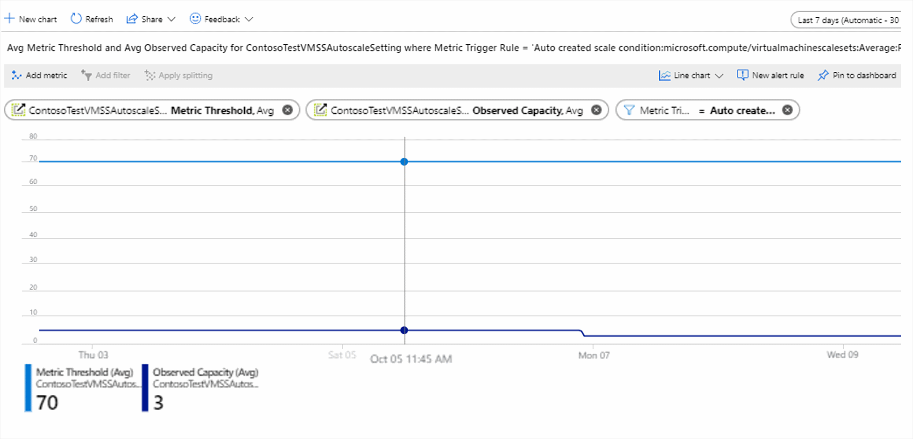
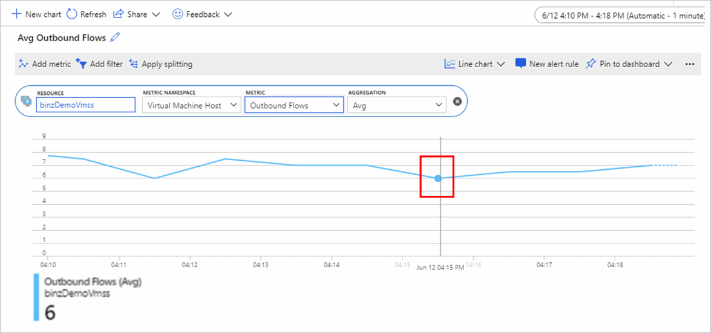
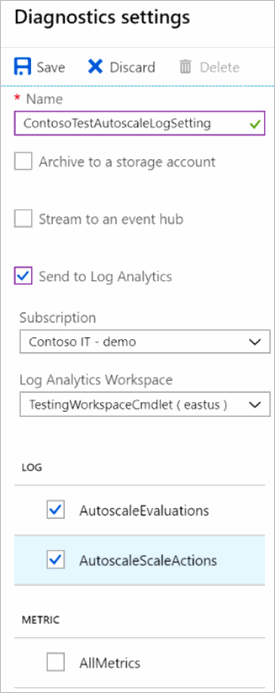

# Troubleshoot Azure Monitor autoscale

Azure Monitor autoscale helps you to have the right amount of resources running to handle the load on your application. It enables you to add resources to handle increases in load and also save money by removing resources that are sitting idle. You can scale based on a schedule, a fixed date-time, or a resource metric you choose. For more information, see [Autoscale overview](autoscale-overview.md).

The autoscale service provides metrics and logs to help you understand what scale actions occurred and the evaluation of the conditions that led to those actions. You can find answers to questions like:

- Why did my service scale-out or scale-in?
- Why did my service not scale?
- Why did an autoscale action fail?
- Why is an autoscale action taking time to scale?
  
## Autoscale metrics

Autoscale provides you with [four metrics](../essentials/metrics-supported.md#microsoftinsightsautoscalesettings) to understand its operation:

- **Observed Metric Value**: The value of the metric you chose to take the scale action on, as seen or computed by the autoscale engine. Because a single autoscale setting can have multiple rules and therefore multiple metric sources, you can filter by using "metric source" as a dimension.
- **Metric Threshold**: The threshold you set to take the scale action. Because a single autoscale setting can have multiple rules and therefore multiple metric sources, you can filter by using "metric rule" as a dimension.
- **Observed Capacity**: The active number of instances of the target resource as seen by the autoscale engine.
- **Scale Actions Initiated**: The number of scale-out and scale-in actions initiated by the autoscale engine. You can filter by scale-out versus scale-in actions.

You can use the [metrics explorer](../essentials/metrics-getting-started.md) to chart the preceding metrics all in one place. The chart should show the:

  - Actual metric.
  - Metric as seen/computed by autoscale engine.
  - Threshold for a scale action.
  - Change in capacity.

## Example 1: Analyze an autoscale rule

An autoscale setting for a virtual machine scale set:

- Scales out when the average CPU percentage of a set is greater than 70% for 10 minutes.
- Scales in when the CPU percentage of the set is less than 5% for more than 10 minutes.

Let's review the metrics from the autoscale service.

The following chart shows a **Percentage CPU** metric for a virtual machine scale set.


The next chart shows the **Observed Metric Value** metric for an autoscale setting.


The final chart shows the **Metric Threshold** and **Observed Capacity** metrics. The **Metric Threshold** metric at the top for the scale-out rule is 70. The **Observed Capacity** metric at the bottom shows the number of active instances, which is currently 3.



> [!NOTE]
> You can filter **Metric Threshold** by the metric trigger rule dimension scale-out (increase) rule to see the scale-out threshold and by the scale-in rule (decrease).

## Example 2: Advanced autoscaling for a virtual machine scale set

An autoscale setting allows a virtual machine scale set resource to scale out based on its own **Outbound Flows** metric. The **Divide metric by instance count** option for the metric threshold is selected.

The scale action rule is if the value of **Outbound Flow per instance** is greater than 10, the autoscale service should scale out by 1 instance.

In this case, the autoscale engine's observed metric value is calculated as the actual metric value divided by the number of instances. If the observed metric value is less than the threshold, no scale-out action is initiated.

The following screenshots show two metric charts.

The **Avg Outbound Flows** chart shows the value of the **Outbound Flows** metric. The actual value is 6.



The following chart shows a few values:

 - The **Observed Metric Value** metric in the middle is 3 because there are 2 active instances, and 6 divided by 2 is 3.
 - The **Observed Capacity** metric at the bottom shows the instance count seen by an autoscale engine.
 - The **Metric Threshold** metric at the top is set to 10.

   

If there are multiple scale action rules, you can use splitting or the **add filter** option in the metrics explorer chart to look at a metric by a specific source or rule. For more information on splitting a metric chart, see [Advanced features of metric charts - splitting](../essentials/metrics-charts.md#apply-splitting).

## Example 3: Understand autoscale events

In the autoscale setting screen, go to the **Run history** tab to see the most recent scale actions. The tab also shows the change in **Observed Capacity** over time. To find more information about all autoscale actions, including operations such as update/delete autoscale settings, view the activity log and filter by autoscale operations.


## Autoscale resource logs

The autoscale service provides [resource logs](../essentials/platform-logs-overview.md). There are two categories of logs:

- **Autoscale Evaluations**: The autoscale engine records log entries for every single condition evaluation every time it does a check. The entry includes details on the observed values of the metrics, the rules evaluated, and if the evaluation resulted in a scale action or not.
- **Autoscale Scale Actions**: The engine records scale action events initiated by the autoscale service and the results of those scale actions (success, failure, and how much scaling occurred as seen by the autoscale service).

As with any Azure Monitor supported service, you can use [diagnostic settings](../essentials/diagnostic-settings.md) to route these logs to:

- Your Log Analytics workspace for detailed analytics.
- Azure Event Hubs and then to non-Azure tools.
- Your Azure Storage account for archive.



The preceding screenshot shows the Azure portal autoscale **Diagnostics settings** pane. There you can select the **Diagnostic/Resource Logs** tab and enable log collection and routing. You can also perform the same action by using the REST API, the Azure CLI, PowerShell, and Azure Resource Manager templates for diagnostic settings by choosing the resource type as **Microsoft.Insights/AutoscaleSettings**.

## Troubleshoot by using autoscale logs

For the best troubleshooting experience, we recommend routing your logs to Azure Monitor Logs (Log Analytics) through a workspace when you create the autoscale setting. This process is shown in the screenshot in the previous section. You can validate the evaluations and scale actions better by using Log Analytics.

After you've configured your autoscale logs to be sent to the Log Analytics workspace, you can execute the following queries to check the logs.

To get started, try this query to view the most recent autoscale evaluation logs:

```Kusto
AutoscaleEvaluationsLog
| limit 50
```

Or try the following query to view the most recent scale action logs:

```Kusto
AutoscaleScaleActionsLog
| limit 50
```

Use the following sections to answer these questions.

## A scale action occurred that you didn't expect

First, execute the query for a scale action to find the scale action you're interested in. If it's the latest scale action, use the following query:

```Kusto
AutoscaleScaleActionsLog
| take 1
```

Select the `CorrelationId` field from the scale actions log. Use `CorrelationId` to find the right evaluation log. Executing the following query displays all the rules and conditions that were evaluated and led to that scale action.

```Kusto
AutoscaleEvaluationsLog
| where CorrelationId = "<correliationId>"
```

## What profile caused a scale action?

A scaled action occurred, but you have overlapping rules and profiles and need to track down which one caused the action.

Find the `CorrelationId` of the scale action, as explained in example 1. Then execute the query on evaluation logs to learn more about the profile.

```Kusto
AutoscaleEvaluationsLog
| where CorrelationId = "<correliationId_Guid>"
| where ProfileSelected == true
| project ProfileEvaluationTime, Profile, ProfileSelected, EvaluationResult
```

The whole profile evaluation can also be understood better by using the following query:

```Kusto
AutoscaleEvaluationsLog
| where TimeGenerated > ago(2h)
| where OperationName contains == "profileEvaluation"
| project OperationName, Profile, ProfileEvaluationTime, ProfileSelected, EvaluationResult
```

## A scale action didn't occur

You expected a scale action and it didn't occur. There might be no scale action events or logs.

Review the autoscale metrics if you're using a metric-based scale rule. It's possible that the **Observed Metric** value or **Observed Capacity** value aren't what you expected them to be, so the scale rule didn't fire. You would still see evaluations, but not a scale-out rule. It's also possible that the cool-down time kept a scale action from occurring.

 Review the autoscale evaluation logs during the time period when you expected the scale action to occur. Review all the evaluations it did and why it decided to not trigger a scale action.

```Kusto
AutoscaleEvaluationsLog
| where TimeGenerated > ago(2h)
| where OperationName == "MetricEvaluation" or OperationName == "ScaleRuleEvaluation"
| project OperationName, MetricData, ObservedValue, Threshold, EstimateScaleResult
```

## Scale action failed

There might be a case where the autoscale service took the scale action but the system decided not to scale or failed to complete the scale action. Use this query to find the failed scale actions:

```Kusto
AutoscaleScaleActionsLog
| where ResultType == "Failed"
| project ResultDescription
```

Create alert rules to get notified of autoscale actions or failures. You can also create alert rules to get notified on autoscale events.

## Schema of autoscale resource logs

For more information, see [Autoscale resource logs](autoscale-resource-log-schema.md).

## Next steps

Read information on [autoscale best practices](autoscale-best-practices.md).
