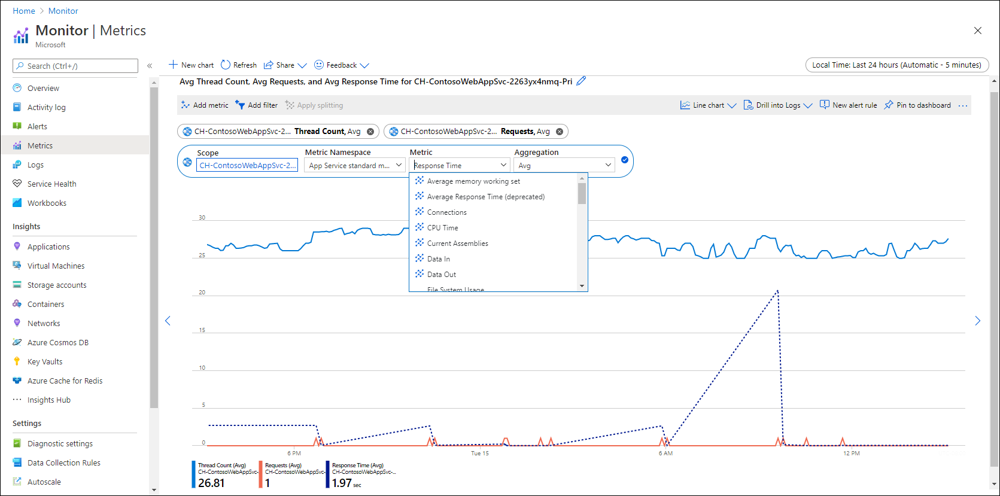
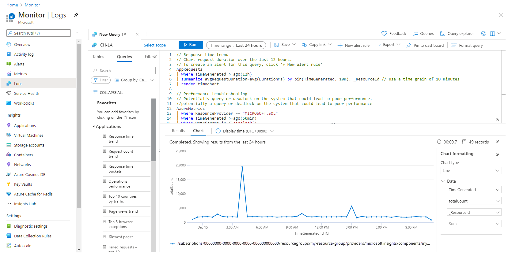
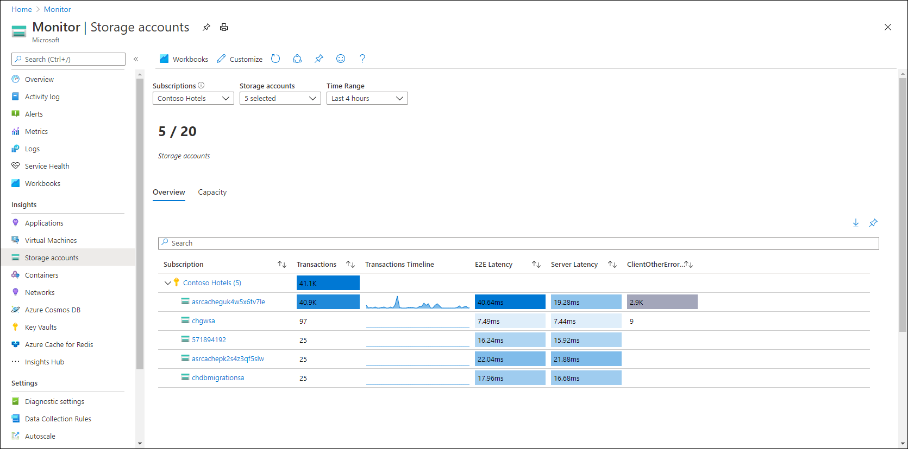
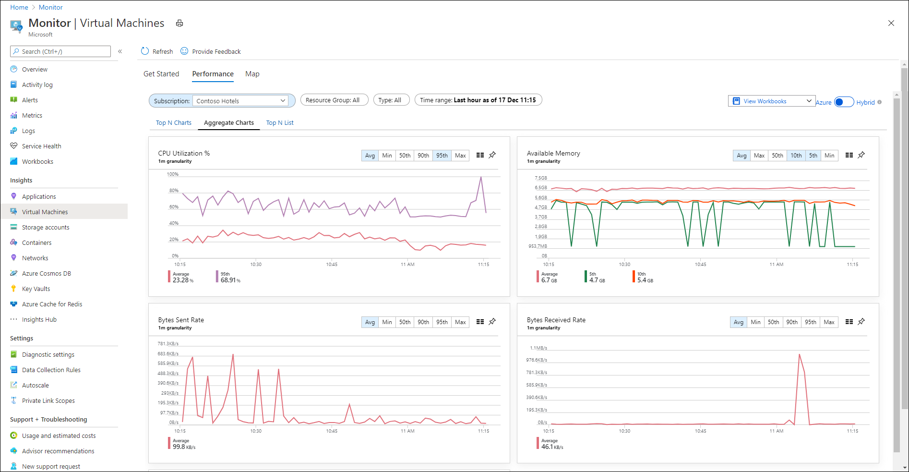
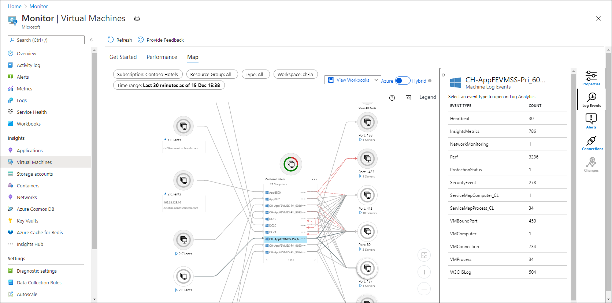

# Azure Monitor for existing Operations Manager customers
This article provides guidance for customers who currently use [System Center Operations Manager](/system-center/scom/welcome) and are planning a transition to [Azure Monitor](overview.md) as they migrate business applications and other resources into Azure. It assumes that your ultimate goal is a full transition into the cloud, replacing as much Operations Manager functionality as possible with Azure Monitor, without compromising your business and IT operational requirements. 

The specific recommendations made in this article will change as Azure Monitor and Operations Manager add features. The fundamental strategy though will remain consistent.

> [!IMPORTANT]
> There is a cost to implementing several Azure Monitor features described here, so you should evaluate their value before deploying across your entire environment.

## Prerequisites
This article assumes that you already use [Operations Manager](/system-center/scom) and at least have a basic understanding of [Azure Monitor](overview.md). For a complete comparison between the two, see [Cloud monitoring guide: Monitoring platforms overview](/azure/cloud-adoption-framework/manage/monitor/platform-overview). That article details specific feature differences between to the two to help you understand some of the recommendations made here. 

## General strategy
There are no migration tools to convert assets from Operations Manager to Azure Monitor since the platforms are fundamentally different. Your migration will instead constitute a [standard Azure Monitor implementation](best-practices.md) while you continue to use Operations Manager. As you customize Azure Monitor to meet your requirements for different applications and components and as it gains more features, then you can start to retire different management packs and agents in Operations Manager.

The general strategy recommended in this article is the same as in the [Cloud Monitoring Guide](/azure/cloud-adoption-framework/manage/monitor/), which recommends a [Hybrid cloud monitoring](/azure/cloud-adoption-framework/manage/monitor/cloud-models-monitor-overview#hybrid-cloud-monitoring) strategy that allows you to make a gradual transition to the cloud. Even though some features may overlap, this strategy will allow you to maintain your existing business processes as you become more familiar with the new platform. Only move away from Operations Manager functionality as you can replace it with Azure Monitor. Using multiple monitoring tools does add complexity, but it allows you to take advantage of Azure Monitor's ability to monitor next generation cloud workloads while retaining Operations Manager's ability to monitor server software and infrastructure components that may be on-premises or in other clouds. 

## Components to monitor
It helps to categorize the different types of workloads that you need to monitor in order to determine a distinct monitoring strategy for each. [Cloud monitoring guide: Formulate a monitoring strategy](/azure/cloud-adoption-framework/strategy/monitoring-strategy#high-level-modeling) provides a detailed breakdown of the different layers in your environment that need monitoring as you progress from legacy enterprise applications to modern applications in the cloud.

Before the cloud, you used Operations Manager to monitor all layers. As you start your transition with Infrastructure as a Service (IaaS), you continue to use Operations Manager for your virtual machines but start to use Azure Monitor for your cloud resources. As you further transition to modern applications using Platform as a Service (PaaS), you can focus more on Azure Monitor and start to retire Operations Manager functionality.

These layers can be simplified into the following categories, which are further described in the rest of this article. While every monitoring workload in your environment may not fit neatly into one of these categories, each should be close enough to a particular category for the general recommendations to apply.

**Business applications.** Applications that provide functionality specific to your business. They may be internal or external and are often developed internally using custom code. Your legacy applications will typically be hosted on virtual or physical machines running either Windows or Linux, while your newer applications will be based on application services in Azure such as Azure Web Apps and Azure Functions.

**Azure services.** Resources in Azure that support your business applications that have migrated to the cloud. This includes services such as Azure Storage, Azure SQL, and Azure IoT. This also includes Azure virtual machines since they are monitored like other Azure services, but the applications and software running on the guest operating system of those virtual machines require more  monitoring beyond the host.

**Server software.** Software running on virtual and physical machines that support your business applications or packaged applications that provide general functionality to your business. Examples include Internet Information Server (IIS), SQL Server, Exchange, and SharePoint. This also includes the Windows or Linux operating system on your virtual and physical machines.

**Local infrastructure.** Components specific to your on-premises environment that require monitoring. This includes such resources as physical servers, storage, and network components. These are the components that are virtualized when you move to the cloud.

## Sample walkthrough
The following is a hypothetical walkthrough of a migration from Operations Manager to Azure Monitor. This is not intended to represent the full complexity of an actual migration, but it does at least provide the basic steps and sequence. The sections below describe each of these steps in more detail.

Your environment prior to moving any components into Azure is based on virtual and physical machines located on-premises or with a managed service provider. It relies on Operations Manager to monitor business applications, server software, and other infrastructure components in your environment such as physical servers and networks. You use standard management packs for server software such as IIS, SQL Server, and various vendor software, and you tune those management packs for your specific requirements. You create custom management packs for your business applications and other components that can't be monitored with existing management packs and configure Operations Manager to support your business processes.

Your migration to Azure starts with IaaS, moving virtual machines supporting business applications into Azure. The monitoring requirements for these applications and the server software they depend on don't change, and you continue using Operations Manager on these servers with your existing management packs. 

Azure Monitor is enabled for your Azure services as soon as you create an Azure subscription. It automatically collects platform metrics and the Activity log, and you configure resource logs to be collected so you can interactively analyze all available telemetry using log queries. You enable VM insights on your virtual machines to analyze monitoring data across your entire environment together and to discover relationships between machines and processes. You extend your use of Azure Monitor to your on-premises physical and virtual machines by enabling Azure Arc-enabled servers on them. 

You enable Application Insights for each of your business applications. It identifies the different components of each application, begins to collect usage and performance data, and identifies any errors that occur in the code. You create availability tests to proactively test your external applications and alert you to any performance or availability problems. While Application Insights gives you powerful features that you don't have in Operations Manager, you continue to rely on custom management packs that you developed for your business applications since they include monitoring scenarios not yet covered by Azure Monitor. 

As you gain familiarity with Azure Monitor, you start to create alert rules that are able to replace some management pack functionality and start to evolve your business processes to use the new monitoring platform. This allows you to start removing machines and management packs from the Operations Manager management group. You continue to use management packs for critical server software and on-premises infrastructure but continue to watch for new features in Azure Monitor that will allow you to retire additional functionality.

## Monitor Azure services
Azure services actually require Azure Monitor to collect telemetry, and it's enabled the moment that you create an Azure subscription. The [Activity log](essentials/activity-log.md) is automatically collected for the subscription, and [platform metrics](essentials/data-platform-metrics.md) are automatically collected from any Azure resources you create. You can immediately start using [metrics explorer](essentials/metrics-getting-started.md), which is similar to performance views in the Operations console, but it provides interactive analysis and [advanced aggregations](essentials/metrics-charts.md) of data. [Create a metric alert](alerts/alerts-metric.md) to be notified when a value crosses a threshold or [save a chart to a dashboard or workbook](essentials/metrics-charts.md#saving-to-dashboards-or-workbooks) for visibility.

[Create a diagnostic setting](essentials/diagnostic-settings.md) for each Azure resource to send metrics and [resource logs](essentials/resource-logs.md), which provide details about the internal operation of each resource, to a Log Analytics workspace. This gives you all available telemetry for your resources and allows you to use [Log Analytics](logs/log-analytics-overview.md) to interactively analyze log and performance data using an advanced query language that has no equivalent in Operations Manager. You can also create [log query alerts](alerts/alerts-log-query.md), which can use complex logic to determine alerting conditions and correlate data across multiple resources.

[Insights](monitor-reference.md) in Azure Monitor are similar to management packs in that they provide unique monitoring for a particular Azure service. Insights are currently available for several services including networking, storage, and containers, and others are continuously being added.

Insights are based on [workbooks](visualize/workbooks-overview.md) in Azure Monitor, which combine metrics and log queries into rich interactive reports. Create your own workbooks to combine data from multiple services similar to how you might create custom views and reports in the Operations console.

### Azure management pack
The [Azure management pack](https://www.microsoft.com/download/details.aspx?id=50013) allows Operations Manager to discover Azure resources and monitor their health based on a particular set of monitoring scenarios. This management pack does require you to perform additional configuration for each resource in Azure, but it may be helpful to provide some visibility of your Azure resources in the Operations Console until you evolve your business processes to focus on Azure Monitor.

 You may choose to use the Azure Management pack if you want visibility for certain Azure resources in the Operations console and to integrate some basic alerting with your existing processes. It actually uses data collected by Azure Monitor. You should look to Azure Monitor though for long-term complete monitoring of your Azure resources. 

## Monitor server software and local infrastructure
When you move machines to the cloud, the monitoring requirements for their software don't change. You no longer need to monitor their physical components since they're virtualized, but the guest operating system and its workloads have the same requirements regardless of their environment.

[VM insights](vm/vminsights-overview.md) is the primary feature in Azure Monitor for monitoring virtual machines and their guest operating system and workloads. Similar to Operations Manager, VM insights uses an agent to collect data from the guest operating system of virtual machines. This is the same performance and event data typically used by management packs for analysis and alerting. There aren't preexisting rules though to identify and alert on issues for the business applications and server software running in those machines. You must create your own alert rules to be proactively notified of any detected issues.

Azure Monitor also doesn't measure the health of different applications and services running on a virtual machine. Metric alerts can automatically resolve when a value drops below a threshold, but Azure Monitor doesn't currently have the ability to define health criteria for applications and services running on the machine, nor does it provide health rollup to group the health of related components.

Monitoring the software on your machines in a hybrid environment will typically use a combination of VM insights and Operations Manager, depending on the requirements of each machine and on your maturity developing operational processes around Azure Monitor. The Microsoft Management Agent (referred to as the Log Analytics agent in Azure Monitor) is used by both platforms so that a single machine can be simultaneously monitored by both.

> [!NOTE]
> In the future, VM insights will transition to the [Azure Monitor agent](agents/azure-monitor-agent-overview.md), which is currently in public preview. It will be compatible  with the Microsoft Monitoring Agent so the same virtual machine will continue to be able to be monitored by both platforms.

Continue to use Operations Manager for functionality that cannot yet be provided by Azure Monitor. This includes management packs for critical server software like IIS, SQL Server, or Exchange. You may also have custom management packs developed for on-premises infrastructure that can't be reached with Azure Monitor. Also continue to use Operations Manager if it is tightly integrated into your operational processes until you can transition to modernizing your service operations where Azure Monitor and other Azure services can augment or replace. 

Use Azure Monitor fo VMs to enhance your current monitoring even if it doesn't immediately replace Operations Manager. Examples of features unique to Azure Monitor include the following:

- Discover and monitor relationships between virtual machines and their external dependencies.
- View aggregated performance data across multiple virtual machines in interactive charts and workbooks.
- Use [log queries](logs/log-query-overview.md) to interactively analyze telemetry from your virtual machines with data from your other Azure resources.
- Create [log alert rules](alerts/alerts-log-query.md) based on complex logic across multiple virtual machines.

In addition to Azure virtual machines, VM insights can monitor machines on-premises and in other clouds using [Azure Arc-enabled servers](../azure-arc/servers/overview.md). Azure Arc-enabled servers allow you to manage your Windows and Linux machines hosted outside of Azure, on your corporate network, or other cloud provider consistent with how you manage native Azure virtual machines.

## Monitor business applications
You typically require custom management packs to monitor your business applications with Operations Manager, leveraging agents installed on each virtual machine. Application Insights in Azure Monitor monitors web-based applications whether they're in Azure, other clouds, or on-premises, so it can be used for all of your applications whether or not they've been migrated to Azure.

If your monitoring of a business application is limited to functionality provided by the [.NET app performance template]() in Operations Manager, then you can most likely migrate to Application Insights with no loss of functionality. In fact, Application Insights will include a significant number of additional features including the following:

- Automatically discover and monitor application components.
- Collect detailed application usage and performance data such as response time, failure rates, and request rates.
- Collect browser data such as page views and load performance.
- Detect exceptions and drill into stack trace and related requests.
- Perform advanced analysis using features such as [distributed tracing](app/distributed-tracing.md) and [smart detection](alerts/proactive-diagnostics.md).
- Use [metrics explorer](essentials/metrics-getting-started.md) to interactively analyze performance data.
- Use [log queries](logs/log-query-overview.md) to interactively analyze collected telemetry together with data collected for Azure services and VM insights.

There are certain scenarios though where you may need to continue using Operations Manager in addition to Application Insights until you're able to achieve required functionality. Examples where you may need to continue with Operations Manager include the following:

-  [Availability tests](app/monitor-web-app-availability.md), which allow you to monitor and alert on the availability and responsiveness of your applications require incoming requests from the IP addresses of web test agents. If your policy won't allow such access, you may need to keep using [Web Application Availability Monitors](/system-center/scom/web-application-availability-monitoring-template) in Operations Manager.
- In Operations Manager you can set any polling interval for availability tests, with many customers checking every 60-120 seconds. Application Insights has a minimum polling interval of 5 minutes which may be too long for some customers.
- A significant amount of monitoring in Operations Manager is performed by collecting events generated by applications and by running scripts on the local agent. These aren't standard options in Application Insights, so you could require custom work to achieve your business requirements. This might include custom alert rules using event data stored in a Log Analytics workspace and scripts launched in a virtual machines guest using [hybrid runbook worker](../automation/automation-hybrid-runbook-worker.md).
- Depending on the language that your application is written in, you may be limited in the [instrumentation you can use with Application Insights](app/platforms.md).

Following the basic strategy in the other sections of this guide, continue to use Operations Manager for your business applications, but take advantage of additional features provided by Application Insights. As you're able to replace critical functionality with Azure Monitor, you can start to retire your custom management packs.

## Next steps

- See the [Cloud Monitoring Guide](/azure/cloud-adoption-framework/manage/monitor/) for a detailed comparison of Azure Monitor and System Center Operations Manager and more details on designing and implementing a hybrid monitoring environment.
- Read more about [monitoring Azure resources in Azure Monitor](essentials/monitor-azure-resource.md).
- Read more about [monitoring Azure virtual machines in Azure Monitor](vm/monitor-vm-azure.md).
- Read more about [VM insights](vm/vminsights-overview.md).
- Read more about [Application Insights](app/app-insights-overview.md).
