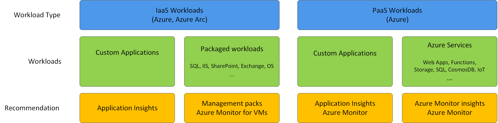

# Azure Monitor for existing Operations Manager customers
Many customers who are starting to move applications into Azure currently use System Center Operations Manager for monitoring their on-premises applications. You may be wondering whether to migrate to Azure Monitor, continue using Operations Manager, or use a combination of both. This article provides guidance on which workloads to move to Azure Monitor, which to keep on Operations Manager, and strategies for using the two together.

## Quick comparison
Read a complete comparison between Azure Monitor and Operations Manager in [Cloud monitoring guide: Monitoring platforms overview](/azure/cloud-adoption-framework/manage/monitor/platform-overview).

### Azure Monitor
Azure Monitor is a SaaS offering primarily designed to monitor Azure resources. You can have it running in a few minutes since it has minimal infrastructure and configuration requirements, and you pay only for the features you use and data you collect. While Azure Monitor runs completely in the Azure cloud, it can monitor applications and virtual machines in other clouds and on-premises. 

Since Azure Monitor is a SaaS offering, it doesn't provide granular control over monitoring, but most features require little or no configuration, and upgrades are made available automatically. In addition to general monitoring features, it as insights which provide a specialized experience for monitoring different Azure services.

### Operations Manager
Operations Manager was primarily designed to monitor virtual machines, but it can gather data from external resources including those in Azure. It has significant infrastructure and maintenance requirements, but it provides very granular control over monitoring. 

Operations Manager has an extensive library of management packs that monitor a variety of applications. 

## Hybrid monitoring
The Cloud Monitoring Guide defines a [hybrid cloud monitoring model](https:///azure/cloud-adoption-framework/manage/monitor/cloud-models-monitor-overview#hybrid-cloud-monitoring) that uses a combination of Azure Monitor and Operations Manager. The general strategy of this model is to use Azure Monitor for monitoring your Azure resources while using Operations Manager to monitor the workloads running in your virtual machines.

## Workloads to monitor
Each of the applications and services that you must monitor are each considered a workload. The following diagram illustrates the different types of workloads that need to be monitored and the recommendation for what to move to Azure Monitor as opposed to those that should continue to be monitored by management packs in Azure Monitor. 

The following table describes these recommendations in more detail.

| Workload | Description | Current | Recommendation |
|:---|:---|:---|:---|
| IaaS Custom Applications | These are your custom applications built on an IaaS platform including virtual machines and containers. | Custom applications are typically monitored by custom management packs that you develop and maintain. These management packs will typically identify different components of the application and measure its performance and availability. | Configure Application Insights for each custom application. Application Insights will provide rich monitoring of applications in any environment, leveraging the Azure Monitor platform. |
| IaaS Packaged Applications | Packaged applications in your IaaS environment include such applications and SQL Server, SharePoint, and Exchange. They also include your Windows and Linux operating systems and core services such as DNS, DHCP, and Active Directory. | Management packs are available for most of these applications that include predefined logic to discover and monitor their components. | Continue using management packs for these applications since Azure Monitor doesn't include built-in logic to monitor them. Enable Azure Monitor for VMs on your virtual machines to discover relationships with external processes and to collect telemetry for query analysis. |
| PaaS App Services | Includes your custom applications built on application services in Azure such as Azure App Service and Logic Apps. Also includes automation services such as Logic Apps. | These services would typically be monitored with the Azure Management pack and custom management packs for the application. | Configure Application Insights for each application. Configure resource logs to be collected for the Azure services and leverage core Azure Monitor features including insights for the services that have them. |
| PaaS Data Services | Azure services that store and process data including databases such as SQL and CosmosDB in addition to Azure Storage. | These services would typically be monitored with the Azure Management pack and custom management packs for the application. | Configure Application Insights for each application. Configure resource logs to be collected for the Azure services and leverage core Azure Monitor features including insights for the services that have them. |

## Monitor Azure resources and PaaS workloads

### Background
Azure resources actually require Azure Monitor to collect telemetry, and Azure Monitor is enabled the moment that you create an Azure subscription. The [Activity log]() is automtically collected for the subscription, and [Platform metrics]() are automatically collected from any Azure resources you create. Add a [diagnostic setting]() for each resource to send resource logs a Log Analytics workspace.

Analysis of telemetry collected by Azure resources is integrated into the Azure portal, and Azure Monitor includes tools for their analysis. Use [Metrics explorer]() to analyze platform metrics and [Log Analytics]() to analyze log and performance data. [Insights]() analyze and present this data to provide a customized experience for different services, similar to the function of a management pack in Operations Manager.

Operations Manager can discover Azure resources and monitor their health based on metric values using . You can set a threshold for each resource to determine a health state and create alerts. This is a limited view of each resource though since it doesn't include resource logs and isn't able to perform detailed analysis beyond a limited set of performance counters.

### Recommendation
Configure Azure Monitor to collect telemetry from your Azure resources. This will typically include [configuring Azure Policy]() to send resource logs for all your Azure resources to a Log Analytics workspace. Become familiar with insights that are available for the Azure services that you use in addition to Azure tools for monitoring Azure resources including [metrics explorer]() and [Log Analytics]().

If you want to integrate alerting for critical Azure services into your Operations Manager environment, then install and configure the Azure management pack.

## Monitor virtual machines and IaaS workloads

### Background
[Azure Monitor for VMs]() collects performance data from the guest operating system of virtual machines. You can also configure additional logs and metrics to be collected which is some of the same data used by management packs. There aren't preexisting rules though to identify issues in the virtual machine. You must create your own alert rules to be proactively notified of any detected issues. There also isn't a standard method, such as a scheduled PowerShell script, to collect data beyond the predefined set of data sources.

A new [guest health feature for Azure Monitor for VMs]() is now in public preview and does alert based on the health state of a set of performance metrics. This is currently limited though to a specific set of performance counters related to the guest operating system and not workloads running in the virtual machine.

Azure Monitor VMs does collect relationships between virtual machines and their external dependencies, visually presenting them for interactive analysis. This is not information that is not typically available from a management pack 

Operations Manager was designed for workloads running on virtual machines, and an extensive collection of management packs is available to monitor various applications. Each includes predefined logic to discover different components of the application, measure their health, and generate alerts when issues are detected. You may have also invested in custom management packs for any custom requirements.

### Recommendation
Keep using management packs the monitor 

1. Configure Azure Monitor for VMs and onboard a select group of virtual machines. 
2. Configure the workspace to [collect additional data sources]() on the virtual machines.
3. Configure gueat 
3. Evaluate whether 

## Monitor applications

### Azure Monitor
Application Insights in Azure Monitor monitors any web based application whether it's in Azure, another cloud, or on-premises. It automatically identifies different components of the application and monitors its performance and health. 

### Operations Manager

## Recommendations
If you don't have an existing monitoring solution and are getting started in Azure, then use Azure Monitor as your exclusive monitoring solution. Azure Monitor has no infrastructure requirements, and you can get started with minimal investment.

If you currently use Operations Manager and are starting to move workloads to Azure Monitor, consider the following strategy:

- Create diagnostic settings to send resource logs for your subscription and Azure resources to a Log Analytics workspace. 

The [Azure management pack](https://www.microsoft.com/download/details.aspx?id=50013) discovers and monitors your Azure resources. It's important to understand the type of monitoring that it will provide though. The Azure management pack is limited to monitoring metrics 

## Alerting

## Extending Operations Manager
Even for the workloads you continue to monitor in Operations Manager, you 

## Basic strategy
For most customers, the best strategy will be to leverage Azure Monitor for its rich monitoring of Azure resources, reduced infrastructure and maintenance requirements, superior data analysis. Keep using Operations Manager for those requirements that are not provided by Azure Monitor such as management packs for workloads running in virtual machines, state monitoring, and granular monitoring definitions. 

Evaluate any custom management packs that you've developed for your applications with Application Insights. Application Insights will automatically discover your application components and begin monitoring their performance and availability 

. As features are added to Azure Monitor, it may start to meet some of these requirements, while you may require Operations Manager for certain monitoring indefinitely.

1. Implement Azure Monitor. 
   1. Configure Azure Monitor to monitor your Azure resources.
   2. Evaluate insights in Azure Monitor and features such as Log Analytics.
   3. Evaluate the Azure management pack for Operations Manager.
2. Virtual Machines.
   1. Configure Azure Monitor for VMs and collection of critical events and performance data.
   2. Evaluate whether 
   3. Continue using Operations Manager and management packs for critical workloads.
3. Applications
   1. Enable Application Insights for critical applications.
