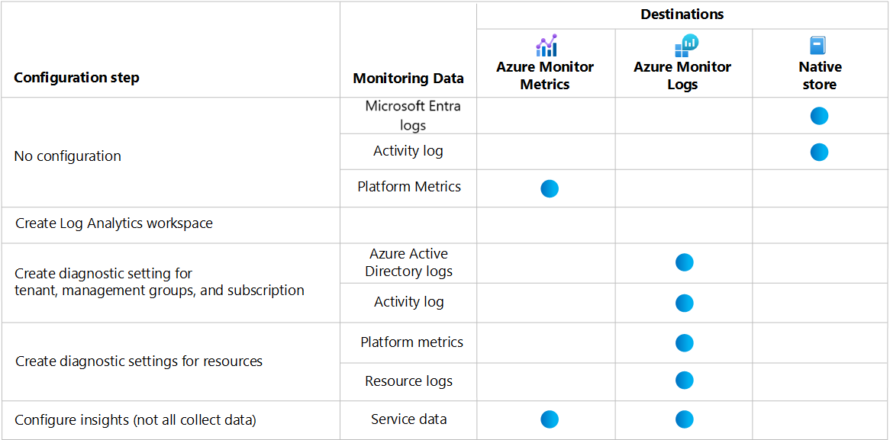

# Azure Monitor best practices: Configure data collection

This article is part of the scenario [Recommendations for configuring Azure Monitor](best-practices.md). It describes recommended steps to configure data collection required to enable Azure Monitor features for your Azure and hybrid applications and resources.

> [!IMPORTANT]
> The features of Azure Monitor and their configuration will vary depending on your business requirements balanced with the cost of the enabled features. Each of the following steps identifies whether there's potential cost, and you should assess these costs before proceeding. See [Azure Monitor pricing](https://azure.microsoft.com/pricing/details/monitor/) for complete pricing details.

## Design Log Analytics workspace architecture

You require at least one Log Analytics workspace to enable [Azure Monitor Logs](logs/data-platform-logs.md), which is required for:

- Collecting data such as logs from Azure resources.
- Collecting data from the guest operating system of Azure Virtual Machines.
- Enabling most Azure Monitor insights.

Other services such as Microsoft Sentinel and Microsoft Defender for Cloud also use a Log Analytics workspace and can share the same one that you use for Azure Monitor.

There's no cost for creating a Log Analytics workspace, but there's a potential charge after you configure data to be collected into it. See [Azure Monitor Logs pricing details](logs/cost-logs.md) for information on how log data is charged.  

See [Create a Log Analytics workspace in the Azure portal](logs/quick-create-workspace.md) to create an initial Log Analytics workspace, and see [Manage access to Log Analytics workspaces](logs/manage-access.md) to configure access. You can use scalable methods such as Resource Manager templates to configure workspaces, although this step is often not required because most environments will require a minimal number.

Start with a single workspace to support initial monitoring. See [Design a Log Analytics workspace configuration](logs/workspace-design.md) for guidance on when to use multiple workspaces and how to locate and configure them.

## Collect data from Azure resources

Some monitoring of Azure resources is available automatically with no configuration required. To collect more monitoring data, you must perform configuration steps.

The following table shows the configuration steps required to collect all available data from your Azure resources. It also shows at which step data is sent to Azure Monitor Metrics and Azure Monitor Logs. The following sections describe each step in further detail.

### Collect tenant and subscription logs

The [Microsoft Entra logs](../active-directory/reports-monitoring/overview-reports.md) for your tenant and the [activity log](essentials/platform-logs-overview.md) for your subscription are collected automatically. When you send them to a Log Analytics workspace, you can analyze these events with other log data by using log queries in Log Analytics. You can also create log query alerts, which are the only way to alert on Microsoft Entra logs and provide more complex logic than activity log alerts.

There's no cost for sending the activity log to a workspace, but there's a data ingestion and retention charge for Microsoft Entra logs.

See [Integrate Microsoft Entra logs with Azure Monitor logs](../active-directory/reports-monitoring/howto-integrate-activity-logs-with-log-analytics.md) and [Create diagnostic settings to send platform logs and metrics to different destinations](essentials/diagnostic-settings.md) to create a diagnostic setting for your tenant and subscription to send log entries to your Log Analytics workspace.

### Collect resource logs and platform metrics

Resources in Azure automatically generate [resource logs](essentials/platform-logs-overview.md) that provide details of operations performed within the resource. Unlike platform metrics, you need to configure resource logs to be collected. Create a diagnostic setting to send them to a Log Analytics workspace and combine them with the other data used with Azure Monitor Logs. The same diagnostic setting also can be used to send the platform metrics for most resources to the same workspace. This way, you can analyze metric data by using log queries with other collected data.

There's a cost for collecting resource logs in your Log Analytics workspace, so only select those log categories with valuable data. Collecting all categories will incur cost for collecting data with little value. See the monitoring documentation for each Azure service for a description of categories and recommendations for which to collect. Also see [Azure Monitor best practices - cost management](logs/cost-logs.md) for recommendations on optimizing the cost of your log collection.

See [Create diagnostic settings to collect resource logs and metrics in Azure](essentials/diagnostic-settings.md#create-diagnostic-settings) to create a diagnostic setting for an Azure resource.

Because a diagnostic setting needs to be created for each Azure resource, use Azure Policy to automatically create a diagnostic setting as each resource is created. Each Azure resource type has a unique set of categories that need to be listed in the diagnostic setting. Because of this, each resource type requires a separate policy definition. Some resource types have built-in policy definitions that you can assign without modification. For other resource types, you need to create a custom definition.

See [Create diagnostic settings at scale using Azure Policy](essentials/diagnostic-settings-policy.md) for a process for creating policy definitions for a particular Azure service and details for creating diagnostic settings at scale.

### Enable insights

Insights provide a specialized monitoring experience for a particular service. They use the same data already being collected such as platform metrics and resource logs, but they provide custom workbooks that assist you in identifying and analyzing the most critical data. Most insights will be available in the Azure portal with no configuration required, other than collecting resource logs for that service. See the monitoring documentation for each Azure service to determine whether it has an insight and if it requires configuration.

There's no cost for insights, but you might be charged for any data they collect.

See [What is monitored by Azure Monitor?](monitor-reference.md) for a list of available insights and solutions in Azure Monitor. See the documentation for each for any unique configuration or pricing information.

> [!IMPORTANT]
> The following insights are much more complex than others and have more guidance for their configuration:
>
> - [VM insights](#monitor-virtual-machines)
> - [Container insights](#monitor-containers)
> - [Monitor applications](#monitor-applications)

## Monitor virtual machines

Virtual machines generate similar data as other Azure resources, but they require an agent to collect data from the guest operating system. Virtual machines also have unique monitoring requirements because of the different workloads running on them. See [Monitoring Azure virtual machines with Azure Monitor](vm/monitor-vm-azure.md) for a dedicated scenario on monitoring virtual machines with Azure Monitor.

## Monitor containers

Containers generate similar data as other Azure resources, but they require a containerized version of the Log Analytics agent to collect required data. Container insights help you prepare your containerized environment for monitoring. It works in conjunction with third-party tools to provide comprehensive monitoring of Azure Kubernetes Service (AKS) and the workflows it supports. See [Monitoring Azure Kubernetes Service with Azure Monitor](../aks/monitor-aks.md?toc=/azure/azure-monitor/toc.json) for a dedicated scenario on monitoring AKS with Azure Monitor.

## Monitor applications

Azure Monitor monitors your custom applications by using [Application Insights](app/app-insights-overview.md), which you must configure for each application you want to monitor. The configuration process varies depending on the type of application being monitored and the type of monitoring that you want to perform. Data collected by Application Insights is stored in Azure Monitor Metrics, Azure Monitor Logs, and Azure Blob Storage, depending on the feature. Performance data is stored in both Azure Monitor Metrics and Azure Monitor Logs with no more configuration required.

### Create an application resource

Application Insights is the feature of Azure Monitor for monitoring your cloud native and hybrid applications.

You can create a resource in Application Insights for each application that you're going to monitor or a single application resource for multiple applications. Whether to use separate or a single application resource for multiple applications is a fundamental decision of your monitoring strategy. Separate resources can save costs and prevent mixing data from different applications, but a single resource can simplify your monitoring by keeping all relevant telemetry together. See [How many Application Insights resources should I deploy](app/create-workspace-resource.md#how-many-application-insights-resources-should-i-deploy) for criteria to help you make this design decision. 

When you create the application resource, you must select whether to use classic or workspace based. See [Create an Application Insights resource](/previous-versions/azure/azure-monitor/app/create-new-resource) to create a classic application.
See [Workspace-based Application Insights resources](app/create-workspace-resource.md) to create a workspace-based application. Log data collected by Application Insights is stored in Azure Monitor Logs for a workspace-based application. Log data for classic applications is stored separately from your Log Analytics workspace as described in [Data structure](logs/log-analytics-workspace-overview.md#data-structure).

### Configure codeless or code-based monitoring

To enable monitoring for an application, you must decide whether you'll use codeless or code-based monitoring. The configuration process varies depending on this decision and the type of application you're going to monitor.

**Codeless monitoring** is easiest to implement and can be configured after your code development. It doesn't require any updates to your code. For information on how to enable monitoring based on your application, see:

- [Applications hosted on Azure Web Apps](app/azure-web-apps.md)
- [Java applications](app/opentelemetry-enable.md?tabs=java)
- [ASP.NET applications hosted in IIS on Azure Virtual Machines or Azure Virtual Machine Scale Sets](app/azure-vm-vmss-apps.md)
- [ASP.NET applications hosted in IIS on-premises](app/application-insights-asp-net-agent.md)

**Code-based monitoring** is more customizable and collects more telemetry, but it requires adding a dependency to your code on the Application Insights SDK NuGet packages. For information on how to enable monitoring based on your application, see:

- [ASP.NET applications](app/asp-net.md)
- [ASP.NET Core applications](app/asp-net-core.md)
- [.NET console applications](app/console.md)
- [Java](app/opentelemetry-enable.md?tabs=java)
- [Node.js](app/nodejs.md)
- [Python](/previous-versions/azure/azure-monitor/app/opencensus-python)
- [Other platforms](app/app-insights-overview.md#supported-languages)

### Configure availability testing

Availability tests in Application Insights are recurring tests that monitor the availability and responsiveness of your application at regular intervals from points around the world. You can create a simple ping test for free. You can also create a sequence of web requests to simulate user transactions, which have associated costs.

See [Monitor the availability of any website](/previous-versions/azure/azure-monitor/app/monitor-web-app-availability) for a summary of the different kinds of tests and information on creating them.

### Configure Profiler

Profiler in Application Insights provides performance traces for .NET applications. It helps you identify the "hot" code path that takes the longest time when it's handling a particular web request. The process for configuring the profiler varies depending on the type of application.

See [Profile production applications in Azure with Application Insights](app/profiler-overview.md) for information on configuring Profiler.

### Configure Snapshot Debugger

Snapshot Debugger in Application Insights monitors exception telemetry from your .NET application. It collects snapshots on your top-throwing exceptions so that you have the information you need to diagnose issues in production. The process for configuring Snapshot Debugger varies depending on the type of application.

See [Debug snapshots on exceptions in .NET apps](app/snapshot-debugger.md) for information on configuring Snapshot Debugger.

## Next steps

With data collection configured for all your Azure resources, see [Analyze and visualize data](best-practices-analysis.md) to see options for analyzing this data.
