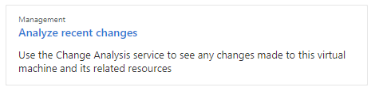

# Troubleshoot Azure Monitor's Change Analysis (preview)

## Trouble registering Microsoft.ChangeAnalysis resource provider from Change history tab.

If you're viewing Change history after its first integration with Azure Monitor's Change Analysis, you will see it automatically registering the **Microsoft.ChangeAnalysis** resource provider. The resource may fail and incur the following error messages: 

### You don't have enough permissions to register Microsoft.ChangeAnalysis resource provider.  
You're receiving this error message because your role in the current subscription is not associated with the **Microsoft.Support/register/action** scope. For example, you are not the owner of your subscription and instead received shared access permissions through a coworker (like view access to a resource group). 

To resolve the issue, contact the owner of your subscription to register the **Microsoft.ChangeAnalysis** resource provider. 
1. In the Azure portal, search for **Subscriptions**.
1. Select your subscription.
1. Navigate to **Resource providers** under **Settings** in the side menu.
1. Search for **Microsoft.ChangeAnalysis** and register via the UI, Azure PowerShell, or Azure CLI.

    Example for registering the resource provider through PowerShell:
    ```PowerShell
    # Register resource provider
    Register-AzResourceProvider -ProviderNamespace "Microsoft.ChangeAnalysis"
    ```

### Failed to register Microsoft.ChangeAnalysis resource provider.
This error message is likely a temporary internet connectivity issue, since:
* The UI sent the resource provider registration request.
* You've resolved your [permissions issue](#you-dont-have-enough-permissions-to-register-microsoftchangeanalysis-resource-provider).

Try refreshing the page and checking your internet connection. If the error persists, contact the [Change Analysis help team](mailto:changeanalysishelp@microsoft.com).

### This is taking longer than expected.
You'll receive this error message when the registration takes longer than 2 minutes. While unusual, it doesn't mean something went wrong. Restart your web app to see your registration changes. Changes should show up within a few hours of app restart.

If your changes still don't show after 6 hours, contact the [Change Analysis help team](mailto:changeanalysishelp@microsoft.com). 

## Azure Lighthouse subscription is not supported.

### Failed to query Microsoft.ChangeAnalysis resource provider.
Often, this message includes: `Azure Lighthouse subscription is not supported, the changes are only available in the subscription's home tenant`. 

Currently, the Change Analysis resource provider is limited to registration through Azure Lighthouse subscription for users outside of home tenant. We are working on addressing this limitation. 

If this is a blocking issue for you, we can provide a workaround that involves creating a service principal and explicitly assigning the role to allow the access. Contact the [Change Analysis help team](mailto:changeanalysishelp@microsoft.com) to learn more about it.

## An error occurred while getting changes. Please refresh this page or come back later to view changes.

When changes can't be loaded, Azure Monitor's Change Analysis service presents this general error message. A few known causes are:

- Internet connectivity error from the client device.
- Change Analysis service being temporarily unavailable.

Refreshing the page after a few minutes usually fixes this issue. If the error persists, contact the [Change Analysis help team](mailto:changeanalysishelp@microsoft.com).

## You don't have enough permissions to view some changes. Contact your Azure subscription administrator.

This general unauthorized error message occurs when the current user does not have sufficient permissions to view the change. At minimum, 
* To view infrastructure changes returned by Azure Resource Graph and Azure Resource Manager, reader access is required. 
* For web app in-guest file changes and configuration changes, contributor role is required. 

## Cannot see in-guest changes for newly enabled Web App.

You may not immediately see web app in-guest file changes and configuration changes. Restart your web app and you should be able to view changes within 30 minutes. If not, contact the [Change Analysis help team](mailto:changeanalysishelp@microsoft.com).

## Diagnose and solve problems tool for virtual machines

To troubleshoot virtual machine issues using the troubleshooting tool in the Azure portal:
1. Navigate to your virtual machine.
1. Select **Diagnose and solve problems** from the side menu.
1. Browse and select the troubleshooting tool that fits your issue.





## Next steps

Learn more about [Azure Resource Graph](../../governance/resource-graph/overview.md), which helps power Change Analysis.
