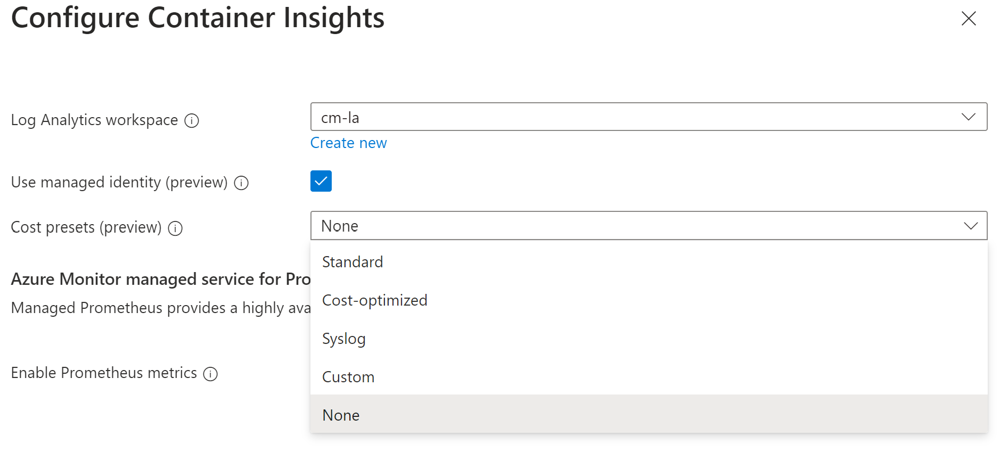
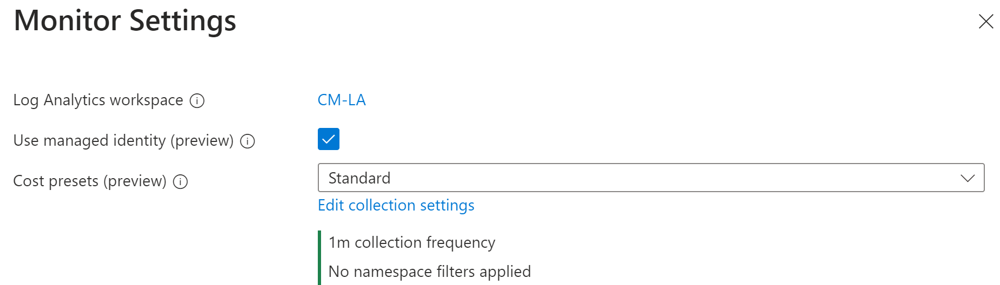
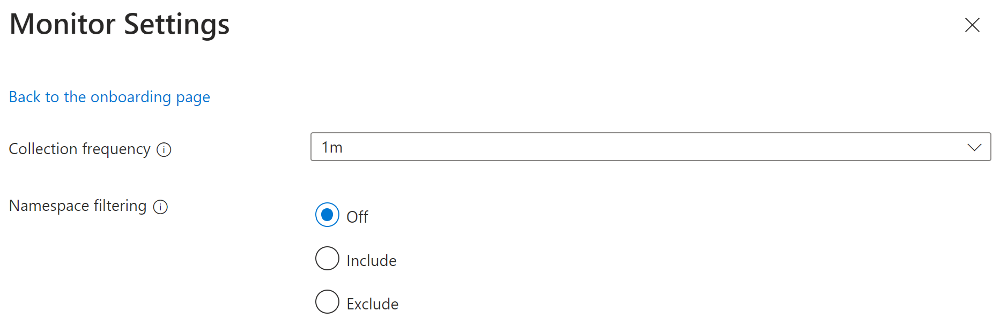

# Enable cost optimization settings

Cost optimization settings offer users the ability to customize and control the metrics data collected through the container insights agent. This feature supports the data collection settings for individual table selection, data collection intervals, and namespaces to exclude for the data collection through [Azure Monitor Data Collection Rules (DCR)](../essentials/data-collection-rule-overview.md). These settings control the volume of ingestion and reduce the monitoring costs of container insights.


## Data collection parameters

The container insights agent periodically checks for the data collection settings, validates and applies the applicable settings to applicable container insights Log Analytics tables and Custom Metrics. The data collection settings should be applied in the subsequent configured Data collection interval.

The following table describes the supported data collection settings:

| **Data collection setting** | **Allowed Values** | **Description** |
| -- | --- | -- |
| **interval**  | \[1m, 30m] in 1m intervals | This value determines how often the agent collects data. The default value is 1m, where m denotes the minutes. If the value is outside the allowed range, then this value defaults to _1 m_ (60 seconds). |
| **namespaceFilteringMode** | Include, Exclude, or Off | Choosing Include collects only data from the values in the namespaces field. Choosing Exclude collects data from all namespaces except for the values in the namespaces field. Off ignores any namespace selections and collect data on all namespaces.
| **namespaces** | An array of names that is, \["kube-system", "default"]  | Array of comma separated Kubernetes namespaces for which inventory and perf data are included or excluded based on the _namespaceFilteringMode_. For example, **namespaces** = ["kube-system", "default"] with an _Include_ setting collects only these two namespaces. With an _Exclude_ setting, the agent collects data from all other namespaces except for _kube-system_ and _default_. With an _Off_ setting, the agent collects data from all namespaces including _kube-system_ and _default_. Invalid and unrecognized namespaces are ignored. |

## Log Analytics data collection

The settings allow you specify which tables you want to collect using streams. The following table indicates the stream to table mapping to be used in the data collection settings.

| Stream | Container insights table |
| --- | --- |
| Microsoft-ContainerInventory | ContainerInventory |
| Microsoft-ContainerNodeInventory | ContainerNodeInventory |
| Microsoft-Perf | Perf |
| Microsoft-InsightsMetrics | InsightsMetrics |
| Microsoft-KubeMonAgentEvents | KubeMonAgentEvents |
| Microsoft-KubeServices | KubeServices |
| Microsoft-KubePVInventory | KubePVInventory |
| Microsoft-KubeNodeInventory | KubeNodeInventory |
| Microsoft-KubePodInventory | KubePodInventory |
| Microsoft-KubeEvents | KubeEvents |
| Microsoft-ContainerLogV2 | ContainerLogV2 |
| Microsoft-ContainerLog | ContainerLog |

This table outlines the list of the container insights Log Analytics tables for which data collection settings are applicable.

>[!NOTE]
>This feature configures settings for all container insights tables (excluding ContainerLog), to configure settings on the ContainerLog please update the ConfigMap listed in documentation for [agent data Collection settings](../containers/container-insights-agent-config.md).

| ContainerInsights Table Name | Is Data collection setting: interval applicable? | Is Data collection setting: namespaces applicable? | Remarks |
| --- | --- | --- | --- |
| ContainerInventory | Yes | Yes | |
| ContainerNodeInventory | Yes | No | Data collection setting for namespaces is not applicable since Kubernetes Node is not a namespace scoped resource |
| KubeNodeInventory | Yes | No | Data collection setting for namespaces is not applicable Kubernetes Node is not a namespace scoped resource |
| KubePodInventory | Yes | Yes ||
| KubePVInventory | Yes | Yes | |
| KubeServices | Yes | Yes | |
| KubeEvents | No | Yes | Data collection setting for interval is not applicable for the Kubernetes Events |
| Perf | Yes | Yes\* | \*Data collection setting for namespaces is not applicable for the Kubernetes Node related metrics since the Kubernetes Node is not a namespace scoped object. |
| InsightsMetrics| Yes\*\* | Yes\*\* | \*\*Data collection settings are only applicable for the metrics collecting the following namespaces: container.azm.ms/kubestate, container.azm.ms/pv and container.azm.ms/gpu |

## Custom metrics

| Metric namespace | Is Data collection setting: interval applicable? | Is Data collection setting: namespaces applicable? | Remarks |
| --- | --- | --- | --- |
| Insights.container/nodes| Yes | No | Node is not a namespace scoped resource |
|Insights.container/pods | Yes | Yes| |
| Insights.container/containers | Yes | Yes | |
| Insights.container/persistentvolumes | Yes | Yes | |

## Impact on default visualizations and existing alerts

The default container insights experience is powered through using all the existing data streams. Removing one or more of the default streams renders the container insights experience unavailable.

[](media/container-insights-cost-config/container-insights-cost-custom.png#lightbox)

If you are currently using the above tables for other custom alerts or charts, then modifying your data collection settings may degrade those experiences. If you are excluding namespaces or reducing data collection frequency, review your existing alerts, dashboards, and workbooks using this data.

To scan for alerts that may be referencing these tables, run the following Azure Resource Graph query:

```Kusto
resources
| where type in~ ('microsoft.insights/scheduledqueryrules') and ['kind'] !in~ ('LogToMetric')
| extend severity = strcat("Sev", properties["severity"])
| extend enabled = tobool(properties["enabled"])
| where enabled in~ ('true')
| where tolower(properties["targetResourceTypes"]) matches regex 'microsoft.operationalinsights/workspaces($|/.*)?' or tolower(properties["targetResourceType"]) matches regex 'microsoft.operationalinsights/workspaces($|/.*)?' or tolower(properties["scopes"]) matches regex 'providers/microsoft.operationalinsights/workspaces($|/.*)?'
| where properties contains "Perf" or properties  contains "InsightsMetrics" or properties  contains "ContainerInventory" or properties  contains "ContainerNodeInventory" or properties  contains "KubeNodeInventory" or properties  contains"KubePodInventory" or properties  contains "KubePVInventory" or properties  contains "KubeServices" or properties  contains "KubeEvents" 
| project id,name,type,properties,enabled,severity,subscriptionId
| order by tolower(name) asc
```

Reference the [Limitations](./container-insights-cost-config.md#limitations) section for information on migrating your Recommended alerts.

## Prerequisites

- AKS Cluster MUST be using either System or User Assigned Managed Identity
    - If the AKS Cluster is using Service Principal, you must upgrade to [Managed Identity](../../aks/use-managed-identity.md#enable-managed-identities-on-an-existing-aks-cluster)

- Azure CLI: Minimum version required for Azure CLI is 2.51.0. Run az --version to find the version, and run az upgrade to upgrade the version. If you need to install or upgrade, see [Install Azure CLI][install-azure-cli]
    - For AKS clusters, aks-preview version 0.5.147 or higher
    - For Arc enabled Kubernetes and AKS hybrid, k8s-extension version 1.4.3 or higher

## Cost presets and collection settings
Cost presets and collection settings are available for selection in the Azure portal to allow easy configuration. By default, container insights ships with the Standard preset, however, you may choose one of the following to modify your collection settings.

| Cost preset | Collection frequency | Namespace filters | Syslog collection |
| --- | --- | --- | --- |
| Standard | 1 m | None | Not enabled |
| Cost-optimized | 5 m | Excludes kube-system, gatekeeper-system, azure-arc | Not enabled |
| Syslog | 1 m | None | Enabled by default |

[](media/container-insights-cost-config/cost-profiles-options.png#lightbox)

## Custom data collection
Container insights Collected Data can be customized through the Azure portal, using the following options. Selecting any options other than **All (Default)** leads to the container insights experience becoming unavailable.

| Grouping | Tables | Notes |
| --- | --- | --- |
| All (Default) | All standard container insights tables | Required for enabling the default container insights visualizations |
| Performance | Perf, InsightsMetrics | |
| Logs and events | ContainerLog or ContainerLogV2, KubeEvents, KubePodInventory | Recommended if you have enabled managed Prometheus metrics |
| Workloads, Deployments, and HPAs | InsightsMetrics, KubePodInventory, KubeEvents, ContainerInventory, ContainerNodeInventory, KubeNodeInventory, KubeServices | |
| Persistent Volumes | InsightsMetrics, KubePVInventory | |

[](media/container-insights-cost-config/collected-data-options.png#lightbox)

## Configuring AKS data collection settings using Azure CLI

Using the CLI to enable monitoring for your AKS requires passing in configuration as a JSON file.

The default schema for the config file follows this format:

```json
{
  "interval": "string",
  "namespaceFilteringMode": "string",
  "namespaces": ["string"],
  "enableContainerLogV2": boolean, 
  "streams": ["string"]
}
```

* `interval`: The frequency of data collection, the input scheme must be a number between [1, 30] followed by m to denote minutes.
* `namespaceFilteringMode`: The filtering mode for the namespaces, the input must be either Include, Exclude, or Off.
* `namespaces`: An array of Kubernetes namespaces as strings for inclusion or exclusion
* `enableContainerLogV2`: Boolean flag to enable ContainerLogV2 schema. If set to true, the stdout/stderr Logs are ingested to [ContainerLogV2](container-insights-logging-v2.md) table, else the container logs are ingested to ContainerLog table, unless otherwise specified in the ConfigMap. When specifying the individual streams, you must include the corresponding table for ContainerLog or ContainerLogV2.
* `streams`: An array of container insights table streams. See the supported streams above to table mapping.

Example input:

```json
{
  "interval": "1m",
  "namespaceFilteringMode": "Include",
  "namespaces": ["kube-system"],
  "enableContainerLogV2": true, 
  "streams": ["Microsoft-Perf", "Microsoft-ContainerLogV2"]
}
```
Create a file and provide values for _interval_, _namespaceFilteringMode_, _namespaces_, _enableContainerLogV2_, and _streams_. The following CLI instructions use the name dataCollectionSettings.json.

## Onboarding to a new AKS cluster

> [!NOTE]
> Minimum Azure CLI version 2.51.0 or higher.

Use the following command to enable monitoring of your AKS cluster:

```azcli
az aks create -g myResourceGroup -n myAKSCluster --enable-managed-identity --node-count 1 --enable-addons monitoring --data-collection-settings dataCollectionSettings.json --generate-ssh-keys 
```

## Onboarding to an existing AKS Cluster

## [Azure CLI](#tab/create-CLI)

> [!NOTE]
> Minimum Azure CLI version 2.51.0 or higher.

### Onboard to a cluster without the monitoring addon

```azcli
az aks enable-addons -a monitoring -g <clusterResourceGroup> -n <clusterName> --data-collection-settings dataCollectionSettings.json
```

### Onboard to a cluster with an existing monitoring addon

```azcli    
# obtain the configured log analytics workspace resource id
az aks show -g <clusterResourceGroup> -n <clusterName> | grep -i "logAnalyticsWorkspaceResourceID"

# disable monitoring 
az aks disable-addons -a monitoring -g <clusterResourceGroup> -n <clusterName>

# enable monitoring with data collection settings
az aks enable-addons -a monitoring -g <clusterResourceGroup> -n <clusterName> --workspace-resource-id <logAnalyticsWorkspaceResourceId> --data-collection-settings dataCollectionSettings.json
```

## [Azure portal](#tab/create-portal)
1. In the Azure portal, select the AKS cluster that you wish to monitor.
2. From the resource pane on the left, select the 'Insights' item under the 'Monitoring' section.
3. If you have not previously configured Container Insights, select the 'Configure Azure Monitor' button. For clusters already onboarded to Insights, select the "Monitoring Settings" button in the toolbar.    
4. If you are configuring Container Insights for the first time or have not migrated to using [managed identity authentication](../containers/container-insights-onboard.md#authentication), select the "Use managed identity" checkbox.
[](media/container-insights-cost-config/cost-settings-onboarding.png#lightbox)
5. Using the dropdown, choose one of the "Cost presets", for more configuration, you may select the "Edit collection settings"
[](media/container-insights-cost-config/advanced-collection-settings.png#lightbox)
6. Click the blue "Configure" button to finish.


## [ARM](#tab/create-arm)

1. Download the Azure Resource Manager Template and Parameter files.

```bash
curl -L https://aka.ms/aks-enable-monitoring-costopt-onboarding-template-file -o existingClusterOnboarding.json
```

```bash
curl -L https://aka.ms/aks-enable-monitoring-costopt-onboarding-template-parameter-file -o existingClusterParam.json
```

2. Edit the values in the parameter file: existingClusterParam.json.

- For _aksResourceId_ and _aksResourceLocation_, use the values on the  **AKS Overview**  page for the AKS cluster.
- For _workspaceResourceId_, use the resource ID of your Log Analytics workspace.
- For _workspaceLocation_, use the Location of your Log Analytics workspace
- For _resourceTagValues_, use the existing tag values specified for the AKS cluster
- For _dataCollectionInterval_, specify the interval to use for the data collection interval. Allowed values are 1 m, 2 m … 30 m where m suffix indicates the minutes.
- For _namespaceFilteringModeForDataCollection_, specify if the namespace array is to be included or excluded for collection. If set to off, the agent ignores the namespaces field.
- For _namespacesForDataCollection_, specify array of the namespaces to exclude or include for the Data collection. For example, to exclude "kube-system" and "default" namespaces, you can specify the value as ["kube-system", "default"] with an Exclude value for namespaceFilteringMode.
- For _enableContainerLogV2_, specify this parameter to be true or false. By default, this parameter is set to true.
- For _streams_, select the container insights tables you want to collect. Refer to the above mapping for more details.

3. Deploy the ARM template.

```azcli
az login

az account set --subscription"Cluster Subscription Name"

az deployment group create --resource-group <ClusterResourceGroupName> --template-file ./existingClusterOnboarding.json --parameters @./existingClusterParam.json
```
---


## Onboarding to an existing AKS hybrid Cluster

## [Azure CLI](#tab/create-CLI)

```azcli
az k8s-extension create --name azuremonitor-containers --cluster-name <cluster-name> --resource-group <resource-group> --cluster-type provisionedclusters --cluster-resource-provider "microsoft.hybridcontainerservice" --extension-type Microsoft.AzureMonitor.Containers --configuration-settings amalogs.useAADAuth=true dataCollectionSettings='{"interval":"1m","namespaceFilteringMode":"Include", "namespaces": ["kube-system"],"enableContainerLogV2": true,"streams": ["<streams to be collected>"]}'
```

>[!NOTE]
> When deploying on a Windows machine, the dataCollectionSettings field must be escaped. For example, dataCollectionSettings={\"interval\":\"1m\",\"namespaceFilteringMode\": \"Include\", \"namespaces\": [ \"kube-system\"]} instead of dataCollectionSettings='{"interval":"1m","namespaceFilteringMode": "Include", "namespaces": [ "kube-system"]}'

The collection settings can be modified through the input of the `dataCollectionSettings` field.

* `interval`: The frequency of data collection, the input scheme must be a number between [1, 30] followed by m to denote minutes.
* `namespaceFilteringMode`: The filtering mode for the namespaces, the input must be either Include, Exclude, or Off.
* `namespaces`: An array of Kubernetes namespaces as strings, to be included or excluded.
* `enableContainerLogV2`: Boolean flag to enable ContainerLogV2 schema. If set to true, the stdout/stderr Logs are ingested to [ContainerLogV2](container-insights-logging-v2.md) table, else the container logs are ingested to ContainerLog table, unless otherwise specified in the ConfigMap. When specifying the individual streams, you must include the corresponding table for ContainerLog or ContainerLogV2.
* `streams`: An array of container insights table streams. See the supported streams above to table mapping.

## [Azure portal](#tab/create-portal)
1. In the Azure portal, select the AKS hybrid cluster that you wish to monitor.
2. From the resource pane on the left, select the 'Insights' item under the 'Monitoring' section.
3. If you have not previously configured Container Insights, select the 'Configure Azure Monitor' button. For clusters already onboarded to Insights, select the "Monitoring Settings" button in the toolbar.
[](media/container-insights-cost-config/cost-settings-onboarding.png#lightbox)
4. Using the dropdown, choose one of the "Cost presets", for more configuration, you may select the "Edit collection settings"
[](media/container-insights-cost-config/advanced-collection-settings.png#lightbox).
5. Click the blue "Configure" button to finish.


## [ARM](#tab/create-arm)


1. Download the Azure Resource Manager Template and Parameter files.

```bash
curl -L https://aka.ms/existingClusterOnboarding.json -o existingClusterOnboarding.json
```

```bash
curl -L https://aka.ms/existingClusterParam.json -o existingClusterParam.json
```

2. Edit the values in the parameter file: existingClusterParam.json.

- For _clusterResourceId_ and _clusterResourceLocation_, use the values on the  **Overview**  page for the AKS hybrid cluster.
- For _workspaceResourceId_, use the resource ID of your Log Analytics workspace.
- For _workspaceLocation_, use the Location of your Log Analytics workspace
- For _resourceTagValues_, use the existing tag values specified for the AKS hybrid cluster
- For _dataCollectionInterval_, specify the interval to use for the data collection interval. Allowed values are 1 m, 2 m … 30 m where m suffix indicates the minutes.
- For _namespaceFilteringModeForDataCollection_, specify if the namespace array is to be included or excluded for collection. If set to off, the agent ignores the namespaces field.
- For _namespacesForDataCollection_, specify array of the namespaces to exclude or include for the Data collection. For example, to exclude "kube-system" and "default" namespaces, you can specify the value as ["kube-system", "default"] with an Exclude value for namespaceFilteringMode.
- For _enableContainerLogV2_, specify this parameter to be true or false. By default, this parameter is set to true.
- For _streams_, select the container insights tables you want to collect. Refer to the above mapping for more details.


3. Deploy the ARM template.

```azcli
az login

az account set --subscription"Cluster Subscription Name"

az deployment group create --resource-group <ClusterResourceGroupName> --template-file ./existingClusterOnboarding.json --parameters @./existingClusterParam.json
```
---


## Onboarding to an existing Azure Arc K8s Cluster

## [Azure CLI](#tab/create-CLI)

```azcli
az k8s-extension create --name azuremonitor-containers --cluster-name <cluster-name> --resource-group <resource-group> --cluster-type connectedClusters --extension-type Microsoft.AzureMonitor.Containers --configuration-settings amalogs.useAADAuth=true dataCollectionSettings='{"interval":"1m","namespaceFilteringMode": "Include", "namespaces": [ "kube-system"],"enableContainerLogV2": true,"streams": ["<streams to be collected>"]}'
```

>[!NOTE]
> When deploying on a Windows machine, the dataCollectionSettings field must be escaped. For example, dataCollectionSettings={\"interval\":\"1m\",\"namespaceFilteringMode\": \"Include\", \"namespaces\": [ \"kube-system\"]} instead of dataCollectionSettings='{"interval":"1m","namespaceFilteringMode": "Include", "namespaces": [ "kube-system"]}'

The collection settings can be modified through the input of the `dataCollectionSettings` field.

* `interval`: The frequency of data collection, the input scheme must be a number between [1, 30] followed by m to denote minutes.
* `namespaceFilteringMode`: The filtering mode for the namespaces, the input must be either Include, Exclude, or Off.
* `namespaces`: An array of Kubernetes namespaces as strings, to be included or excluded
* `enableContainerLogV2`: Boolean flag to enable ContainerLogV2 schema. If set to true, the stdout/stderr Logs are ingested to [ContainerLogV2](container-insights-logging-v2.md) table, else the container logs are ingested to ContainerLog table, unless otherwise specified in the ConfigMap. When specifying the individual streams, you must include the corresponding table for ContainerLog or ContainerLogV2.
* `streams`: An array of container insights table streams. See the supported streams above to table mapping.

## [Azure portal](#tab/create-portal)
1. In the Azure portal, select the Arc cluster that you wish to monitor.
2. From the resource pane on the left, select the 'Insights' item under the 'Monitoring' section.
3. If you have not previously configured Container Insights, select the 'Configure Azure Monitor' button. For clusters already onboarded to Insights, select the "Monitoring Settings" button in the toolbar.    
4. If you are configuring Container Insights for the first time, select the "Use managed identity" checkbox
[](media/container-insights-cost-config/cost-settings-onboarding.png#lightbox).
5. Using the dropdown, choose one of the "Cost presets", for more configuration, you may select the "Edit advanced collection settings"
[](media/container-insights-cost-config/advanced-collection-settings.png#lightbox).
6. Click the blue "Configure" button to finish.


## [ARM](#tab/create-arm)

1. Download the Azure Resource Manager Template and Parameter files.

```bash
curl -L https://aka.ms/arc-k8s-enable-monitoring-costopt-onboarding-template-file -o existingClusterOnboarding.json 
```

```bash
curl -L https://aka.ms/arc-k8s-enable-monitoring-costopt-onboarding-template-parameter-file -o existingClusterParam.json 
```

2. Edit the values in the parameter file: existingClusterParam.json.

- For _clusterResourceId_ and  _clusterRegion_, use the values on the  **Overview**  page for the Arc enabled Kubernetes cluster.
- For _workspaceResourceId_, use the resource ID of your Log Analytics workspace.
- For _workspaceLocation_, use the Location of your Log Analytics workspace
- For _resourceTagValues_, use the existing tag values specified for the Arc cluster
- For _dataCollectionInterval_, specify the interval to use for the data collection interval. Allowed values are 1 m, 2 m … 30 m where m suffix indicates the minutes.
- For _namespaceFilteringModeForDataCollection_, specify if the namespace array is to be included or excluded for collection. If set to off, the agent ignores the namespaces field.
- For _namespacesForDataCollection_, specify array of the namespaces to exclude or include for the Data collection. For example, to exclude "kube-system" and "default" namespaces, you can specify the value as ["kube-system", "default"] with an Exclude value for namespaceFilteringMode.
- For _enableContainerLogV2_, specify this parameter to be true or false. By default, this parameter is set to true.
- For _streams_, select the container insights tables you want to collect. Refer to the above mapping for more details.

3. Deploy the ARM template.

```azcli
az login

az account set --subscription "Cluster's Subscription Name"

az deployment group create --resource-group <ClusterResourceGroupName> --template-file ./existingClusterOnboarding.json --parameters @./existingClusterParam.json
```
---

## Data Collection Settings Updates

To update your data collection Settings, modify the values in parameter files and redeploy the Azure Resource Manager Templates to your corresponding AKS or Azure Arc Kubernetes cluster. Or select your new options through the Monitoring Settings in the portal.

## Troubleshooting

- Only clusters using [managed identity authentication](../containers/container-insights-onboard.md#authentication), are able to use this feature.
- Missing data in your container insights charts is an expected behavior for namespace exclusion, if excluding all namespaces

## Limitations

- Recommended alerts will not work as intended if the Data collection interval is configured more than 1-minute interval. To continue using Recommended alerts, please migrate to the [Prometheus metrics addon](../essentials/prometheus-metrics-overview.md)
- There may be gaps in Trend Line Charts of Deployments workbook if configured Data collection interval more than time granularity of the selected Time Range.
