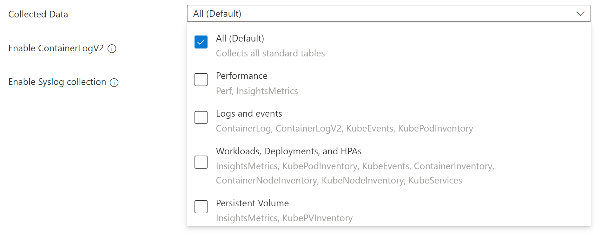
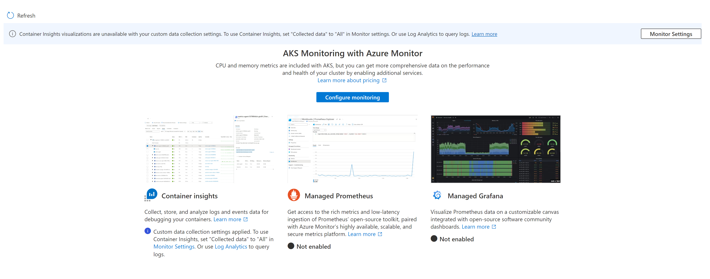

# Enable cost optimization settings in Container insights

Cost optimization settings allow you to reduce the monitoring costs of Container insights by controlling the volume of data ingested in your Log Analytics workspace. You can modify the settings for individual tables, data collection intervals, and namespaces to exclude for data collection.

## Cluster configurations
The following cluster configurations are supported for this customization:

- [AKS](../../aks/intro-kubernetes.md)
- [Arc-enabled Kubernetes](../../azure-arc/kubernetes/overview.md)
- [AKS hybrid](../../aks/hybrid/aks-hybrid-options-overview.md)

## Prerequisites

- AKS clusters must use either System or User Assigned Managed Identity. If cluster is using a Service Principal, you must [upgrade to Managed Identity](../../aks/use-managed-identity.md#enable-managed-identities-on-an-existing-aks-cluster).


## Enable cost settings
Following are the details for using different methods to enable cost optimization settings for a cluster. See [Data collection parameters](#data-collection-parameters) for details about the different available settings.

## [Azure portal](#tab/portal)
You can use the Azure portal to enable cost optimization on your existing cluster after Container insights has been enabled, or you can enable Container insights on the cluster along with cost optimization.

1. Select the cluster in the Azure portal.
2. Select the **Insights** menu in the **Monitoring** section.
3. If Container insights has already been enabled on the cluster, select the **Monitoring Settings** button. If not, select **Configure Azure Monitor** and see [Enable Container insights](container-insights-onboard.md) for details on enabling monitoring. 

    :::image type="content" source="media/container-insights-cost-config/monitor-settings-button.png" alt-text="Screenshot of AKS cluster with monitor settings button." lightbox="media/container-insights-cost-config/monitor-settings-button.png" :::


4. For AKS and Arc-enabled Kubernetes, select **Use managed identity** if you haven't yet migrated the cluster to [managed identity authentication](../containers/container-insights-onboard.md#authentication).
5. Select one of the cost presets described in [Cost presets](#cost-presets).

    :::image type="content" source="media/container-insights-cost-config/cost-settings-onboarding.png" alt-text="Screenshot that shows the onboarding options." lightbox="media/container-insights-cost-config/cost-settings-onboarding.png" :::

1. If you want to customize the settings, click **Edit collection settings**. See [Data collection parameters](#data-collection-parameters) for details on each setting.

    :::image type="content" source="media/container-insights-cost-config/advanced-collection-settings.png" alt-text="Screenshot that shows the collection settings options." lightbox="media/container-insights-cost-config/advanced-collection-settings.png" :::

1. Click **Configure** to save the settings.

## Custom data collection
When you configure cost optimization in the Azure portal, you can select from 
Container insights Collected Data can be customized through the Azure portal, using the following options. Selecting any options other than **All (Default)** leads to the container insights experience becoming unavailable.

| Grouping | Tables | Notes |
| --- | --- | --- |
| All (Default) | All standard container insights tables | Required for enabling the default container insights visualizations |
| Performance | Perf, InsightsMetrics | |
| Logs and events | ContainerLog or ContainerLogV2, KubeEvents, KubePodInventory | Recommended if you have enabled managed Prometheus metrics |
| Workloads, Deployments, and HPAs | InsightsMetrics, KubePodInventory, KubeEvents, ContainerInventory, ContainerNodeInventory, KubeNodeInventory, KubeServices | |
| Persistent Volumes | InsightsMetrics, KubePVInventory | |

[](media/container-insights-cost-config/collected-data-options.png#lightbox)

### Cost presets
When you use the Azure portal to configure cost optimization, you can select from the following preset configurations. You can select one of these or provide your own customized settings. By default, Container insights uses the Standard preset.

| Cost preset | Collection frequency | Namespace filters | Syslog collection |
| --- | --- | --- | --- |
| Standard | 1 m | None | Not enabled |
| Cost-optimized | 5 m | Excludes kube-system, gatekeeper-system, azure-arc | Not enabled |
| Syslog | 1 m | None | Enabled by default |


## [CLI](#tab/cli)

> [!NOTE]
> Minimum version required for Azure CLI is 2.51.0.
    - For AKS clusters, [aks-preview](../../aks/cluster-configuration.md#install-the-aks-preview-azure-cli-extension) version 0.5.147 or higher
    - For Arc enabled Kubernetes and AKS hybrid, [k8s-extension](../../azure-arc/kubernetes/extensions.md#prerequisites) version 1.4.3 or higher

## AKS cluster

When you use CLI to configure monitoring for your AKS cluster, you provide the configuration as a JSON file using the following format. Each of these settings is described in [Data collection parameters](#data-collection-parameters).

```json
{
  "interval": "1m",
  "namespaceFilteringMode": "Include",
  "namespaces": ["kube-system"],
  "enableContainerLogV2": true, 
  "streams": ["Microsoft-Perf", "Microsoft-ContainerLogV2"]
}
```

### New AKS cluster

Use the following command to create a new AKS cluster with monitoring enabled:

```azcli
az aks create -g <clusterResourceGroup> -n <clusterName> --enable-managed-identity --node-count 1 --enable-addons monitoring --data-collection-settings dataCollectionSettings.json --generate-ssh-keys 
```

### Existing AKS Cluster

**Cluster without the monitoring addon**

```azcli
az aks enable-addons -a monitoring -g <clusterResourceGroup> -n <clusterName> --data-collection-settings dataCollectionSettings.json
```

**Cluster with an existing monitoring addon**

```azcli    
# get the configured log analytics workspace resource id
az aks show -g <clusterResourceGroup> -n <clusterName> | grep -i "logAnalyticsWorkspaceResourceID"

# disable monitoring 
az aks disable-addons -a monitoring -g <clusterResourceGroup> -n <clusterName>

# enable monitoring with data collection settings
az aks enable-addons -a monitoring -g <clusterResourceGroup> -n <clusterName> --workspace-resource-id <logAnalyticsWorkspaceResourceId> --data-collection-settings dataCollectionSettings.json
```

## Arc-enabled Kubernetes cluster

```azcli
az k8s-extension create --name azuremonitor-containers --cluster-name <cluster-name> --resource-group <resource-group> --cluster-type connectedClusters --extension-type Microsoft.AzureMonitor.Containers --configuration-settings amalogs.useAADAuth=true dataCollectionSettings='{"interval":"1m","namespaceFilteringMode": "Include", "namespaces": [ "kube-system"],"enableContainerLogV2": true,"streams": ["<streams to be collected>"]}'
```

>[!NOTE]
> When deploying on a Windows machine, the dataCollectionSettings field must be escaped. For example, dataCollectionSettings={\"interval\":\"1m\",\"namespaceFilteringMode\": \"Include\", \"namespaces\": [ \"kube-system\"]} instead of dataCollectionSettings='{"interval":"1m","namespaceFilteringMode": "Include", "namespaces": [ "kube-system"]}'

## AKS hybrid Cluster

```azcli
az k8s-extension create --name azuremonitor-containers --cluster-name <cluster-name> --resource-group <resource-group> --cluster-type provisionedclusters --cluster-resource-provider "microsoft.hybridcontainerservice" --extension-type Microsoft.AzureMonitor.Containers --configuration-settings amalogs.useAADAuth=true dataCollectionSettings='{"interval":"1m","namespaceFilteringMode":"Include", "namespaces": ["kube-system"],"enableContainerLogV2": true,"streams": ["<streams to be collected>"]}'
```

>[!NOTE]
> When deploying on a Windows machine, the dataCollectionSettings field must be escaped. For example, dataCollectionSettings={\"interval\":\"1m\",\"namespaceFilteringMode\": \"Include\", \"namespaces\": [ \"kube-system\"]} instead of dataCollectionSettings='{"interval":"1m","namespaceFilteringMode": "Include", "namespaces": [ "kube-system"]}'

The collection settings can be modified through the input of the `dataCollectionSettings` field.


## [ARM](#tab/arm)


## AKS cluster

1. Download the Azure Resource Manager template and parameter files using the following commands.

    ```bash
    curl -L \<template file\> -o existingClusterOnboarding.json
    curl -L \<parameter file\> -o existingClusterParam.json
    ```

    **AKS cluster**
    - https://aka.ms/aks-enable-monitoring-costopt-onboarding-template-file
    - https://aka.ms/aks-enable-monitoring-costopt-onboarding-template-parameter-file 

    **Arc-enabled Kubernetes**
    - https://aka.ms/arc-k8s-enable-monitoring-costopt-onboarding-template-file
    - https://aka.ms/arc-k8s-enable-monitoring-costopt-onboarding-template-parameter-file

    **AKS hybrid cluster**
    - https://aka.ms/existingClusterOnboarding.json
    - https://aka.ms/existingClusterParam.json

1. Edit the values in the parameter file: existingClusterParam.json.

    **AKS cluster**
    For _aksResourceId_ and _aksResourceLocation_, use the values on the  **AKS Overview**  page for the AKS cluster.

    **Arc-enabled Kubernetes**
    - For _clusterResourceId_ and _clusterResourceLocation_, use the values on the  **Overview**  page for the AKS hybrid cluster.

    **AKS hybrid cluster**
    - For _clusterResourceId_ and  _clusterRegion_, use the values on the  **Overview**  page for the Arc enabled Kubernetes cluster.
    


1. Deploy the ARM template.

```azcli
az login
az account set --subscription"Cluster Subscription Name"
az deployment group create --resource-group <ClusterResourceGroupName> --template-file ./existingClusterOnboarding.json --parameters @./existingClusterParam.json
```


---

## Data collection parameters

The container insights agent periodically checks for the data collection settings, validates and applies the applicable settings to applicable container insights Log Analytics tables and Custom Metrics. The data collection settings should be applied in the subsequent configured Data collection interval.

The following table describes the supported data collection settings and the name used for each for different onboarding options.

| CLI | ARM | Azure portal | Description |
|:---|:---|:---|:---|
| interval | dataCollectionInterval | Collection frequency | Determines how often the agent collects data.  Valid values are 1m - 30m in 1m intervals The default value is 1m. If the value is outside the allowed range, then it defaults to *1 m*. |
| namespaceFilteringMode | namespaceFilteringModeForDataCollection | Namespace filtering | *Include*: Collects only data from the values in the *namespaces* field.<br>*Exclude*: Collects data from all namespaces except for the values in the *namespaces* field.<br>*Off*: Ignores any *namespace* selections and collect data on all namespaces.
| namespaces | namespacesForDataCollection | Namespace filtering | Array of comma separated Kubernetes namespaces to collect inventory and perf data based on the _namespaceFilteringMode_.<br>For example, *namespaces = \["kube-system", "default"]* with an _Include_ setting collects only these two namespaces. With an _Exclude_ setting, the agent collects data from all other namespaces except for _kube-system_ and _default_. With an _Off_ setting, the agent collects data from all namespaces including _kube-system_ and _default_. Invalid and unrecognized namespaces are ignored. |
| enableContainerLogV2 | enableContainerLogV2 | Enable ContainerLogV2 | Boolean flag to enable ContainerLogV2 schema. If set to true, the stdout/stderr Logs are ingested to [ContainerLogV2](container-insights-logging-v2.md) table. If not, the container logs are ingested to **ContainerLog** table, unless otherwise specified in the ConfigMap. When specifying the individual streams, you must include the corresponding table for ContainerLog or ContainerLogV2. |
| streams | streams | An array of container insights table streams. See the supported streams above to table mapping. |

### Applicable tables
The settings for collection frequency and namespace filtering do not apply to all Container insights data. The following table lists the tables int he Log Analytics workspace used by Container insights and the settings that apply to each. 


| Table name | Interval? | Namespaces? | Remarks |
|:---|:---:|:---:|:---|
| ContainerInventory | Yes | Yes | |
| ContainerNodeInventory | Yes | No | Data collection setting for namespaces is not applicable since Kubernetes Node is not a namespace scoped resource |
| KubeNodeInventory | Yes | No | Data collection setting for namespaces is not applicable Kubernetes Node is not a namespace scoped resource |
| KubePodInventory | Yes | Yes ||
| KubePVInventory | Yes | Yes | |
| KubeServices | Yes | Yes | |
| KubeEvents | No | Yes | Data collection setting for interval is not applicable for the Kubernetes Events |
| Perf | Yes | Yes | Data collection setting for namespaces is not applicable for the Kubernetes Node related metrics since the Kubernetes Node is not a namespace scoped object. |
| InsightsMetrics| Yes | Yes | Data collection settings are only applicable for the metrics collecting the following namespaces: container.azm.ms/kubestate, container.azm.ms/pv and container.azm.ms/gpu |

### Applicable metrics

| Metric namespace | Interval? | Namespaces? | Remarks |
|:---|:---:|:---:|:---|
| Insights.container/nodes| Yes | No | Node is not a namespace scoped resource |
|Insights.container/pods | Yes | Yes| |
| Insights.container/containers | Yes | Yes | |
| Insights.container/persistentvolumes | Yes | Yes | |


## Log Analytics data collection
When you specify the tables to collect using CLI or ARM, you specify a stream name that corresponds to a particular table in the Log Analytics workspace. The following table lists the stream name for each table.

| Stream | Container insights table |
| --- | --- |
| Microsoft-ContainerInventory | ContainerInventory |
| Microsoft-ContainerLog | ContainerLog |
| Microsoft-ContainerLogV2 | ContainerLogV2 |
| Microsoft-ContainerNodeInventory | ContainerNodeInventory |
| Microsoft-InsightsMetrics | InsightsMetrics |
| Microsoft-KubeEvents | KubeEvents |
| Microsoft-KubeMonAgentEvents | KubeMonAgentEvents |
| Microsoft-KubeNodeInventory | KubeNodeInventory |
| Microsoft-KubePodInventory | KubePodInventory |
| Microsoft-KubePVInventory | KubePVInventory |
| Microsoft-KubeServices | KubeServices |
| Microsoft-Perf | Perf |


## Impact on default visualizations and existing alerts

The default Container insights experience is depends on all the existing data streams. Removing one or more of the default streams makes the Container insights experience unavailable.

If you are currently using the above tables for other custom alerts or charts, then modifying your data collection settings may degrade those experiences. If you are excluding namespaces or reducing data collection frequency, review your existing alerts, dashboards, and workbooks using this data.

To scan for alerts that may be referencing these tables, run the following Azure Resource Graph query:

```Kusto
resources
| where type in~ ('microsoft.insights/scheduledqueryrules') and ['kind'] !in~ ('LogToMetric')
| extend severity = strcat("Sev", properties["severity"])
| extend enabled = tobool(properties["enabled"])
| where enabled in~ ('true')
| where tolower(properties["targetResourceTypes"]) matches regex 'microsoft.operationalinsights/workspaces($|/.*)?' or tolower(properties["targetResourceType"]) matches regex 'microsoft.operationalinsights/workspaces($|/.*)?' or tolower(properties["scopes"]) matches regex 'providers/microsoft.operationalinsights/workspaces($|/.*)?'
| where properties contains "Perf" or properties  contains "InsightsMetrics" or properties  contains "ContainerInventory" or properties  contains "ContainerNodeInventory" or properties  contains "KubeNodeInventory" or properties  contains"KubePodInventory" or properties  contains "KubePVInventory" or properties  contains "KubeServices" or properties  contains "KubeEvents" 
| project id,name,type,properties,enabled,severity,subscriptionId
| order by tolower(name) asc
```

Reference the [Limitations](./container-insights-cost-config.md#limitations) section for information on migrating your Recommended alerts.


## Data Collection Settings Updates

To update your data collection Settings, modify the values in parameter files and redeploy the Azure Resource Manager Templates to your corresponding AKS or Azure Arc Kubernetes cluster. Or select your new options through the Monitoring Settings in the portal.

## Troubleshooting

- Only clusters using [managed identity authentication](../containers/container-insights-onboard.md#authentication), are able to use this feature.
- Missing data in your container insights charts is an expected behavior for namespace exclusion, if excluding all namespaces

## Limitations

- Recommended alerts will not work as intended if the Data collection interval is configured more than 1-minute interval. To continue using Recommended alerts, please migrate to the [Prometheus metrics addon](../essentials/prometheus-metrics-overview.md)
- There may be gaps in Trend Line Charts of Deployments workbook if configured Data collection interval more than time granularity of the selected Time Range.


[](media/container-insights-cost-config/container-insights-cost-custom.png#lightbox)


>[!NOTE]
>This feature configures settings for all container insights tables (excluding ContainerLog), to configure settings on the ContainerLog please update the ConfigMap listed in documentation for [agent data Collection settings](../containers/container-insights-agent-config.md).