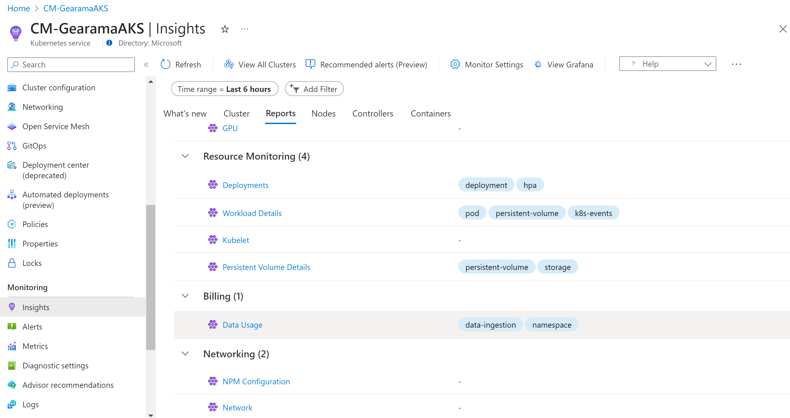
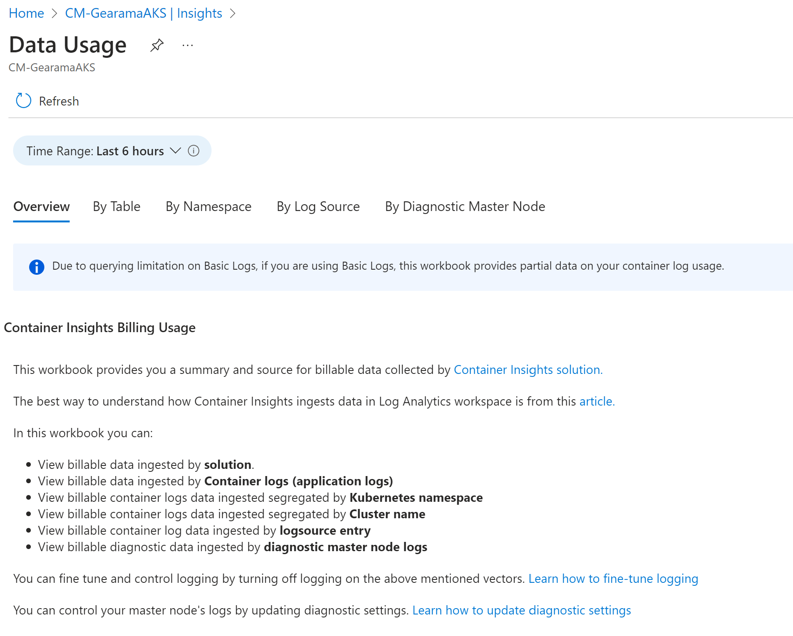
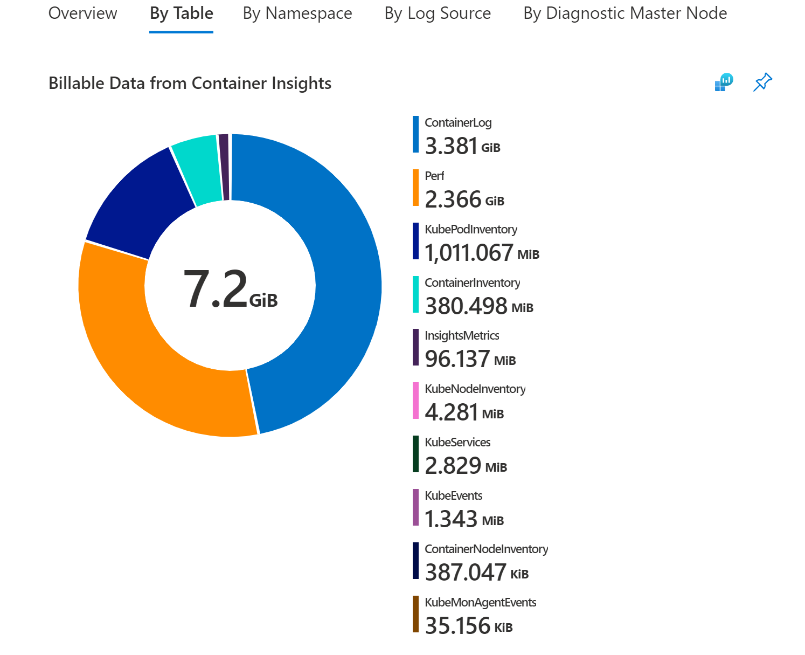

# Understand monitoring costs for Container insights

This article provides pricing guidance for Container insights to help you understand how to:

* Estimate costs up front before you enable Container insights.
* Measure costs after Container insights has been enabled for one or more containers.
* Control the collection of data and make cost reductions.

[!INCLUDE [azure-monitor-cost-optimization](../../../includes/azure-monitor-cost-optimization.md)]


The Azure Monitor pricing model is primarily based on the amount of data ingested in gigabytes per day into your Log Analytics workspace. The cost of a Log Analytics workspace isn't based only on the volume of data collected, it is also dependent on the plan selected, and how long you chose to store data generated from your clusters.

>[!NOTE]
>All sizes and pricing are for sample estimation only. See the Azure Monitor [pricing](https://azure.microsoft.com/pricing/details/monitor/) page for the most recent pricing based on your Azure Monitor Log Analytics pricing model and Azure region.

The following types of data collected from a Kubernetes cluster with Container insights influence cost and can be customized based on your usage:

- Perf, Inventory, InsightsMetrics, and KubeEvents can be controlled through [cost optimization settings](../containers/container-insights-cost-config.md)
- Stdout and stderr container logs from every monitored container in every Kubernetes namespace in the cluster via the [agent ConfigMap](../containers/container-insights-agent-config.md)
- Container environment variables from every monitored container in the cluster
- Completed Kubernetes jobs/pods in the cluster that don't require monitoring
- Active scraping of Prometheus metrics
- [Diagnostic log collection](../../aks/monitor-aks.md#resource-logs) of Kubernetes main node logs in your Azure Kubernetes Service (AKS) cluster to analyze log data generated by main components, such as `kube-apiserver` and `kube-controller-manager`.

## Estimating costs to monitor your AKS cluster

The following estimation is based on an AKS cluster with the following sizing example. The estimate applies only for metrics and inventory data collected. For container logs like stdout, stderr, and environmental variables, the estimate varies based on the log sizes generated by the workload. They're excluded from our estimation.

If you enabled monitoring of an AKS cluster configured as follows:

- Three nodes
- Two disks per node
- One network interface per node
- 20 pods (one container in each pod = 20 containers in total)
- Two Kubernetes namespaces
- Five Kubernetes services (includes kube-system pods, services, and namespace)
- Collection frequency = 60 secs (default)

You can see the tables and volume of data generated per hour in the assigned Log Analytics workspace. For more information about each of these tables, see [Azure Monitor Logs tables](../../aks/monitor-aks-reference.md#azure-monitor-logs-tables).

|Table | Size estimate (MB/hour) |
|------|---------------|
|Perf | 12.9 |
|InsightsMetrics | 11.3 |
|KubePodInventory | 1.5 |
|KubeNodeInventory | 0.75 |
|KubeServices | 0.13 |
|ContainerInventory | 3.6 |
|KubeHealth | 0.1 |
|KubeMonAgentEvents |0.005 |

Total = 31 MB/hour = 23.1 GB/month (one month = 31 days)

By using the default [pricing](https://azure.microsoft.com/pricing/details/monitor/) for Log Analytics, which is a pay-as-you-go model, you can estimate the Azure Monitor cost per month. After a capacity reservation is included, the price would be higher per month depending on the reservation selected.

## Control ingestion to reduce cost

Consider a scenario where your organization's different business units share Kubernetes infrastructure and a Log Analytics workspace. Each business unit is separated by a Kubernetes namespace. You can visualize how much data is ingested in each workspace by using the **Data Usage** runbook. The runbook is available from the **Reports** tab.

[](media/container-insights-cost/workbooks-dropdown.png#lightbox)

This workbook helps you visualize the source of your data without having to build your own library of queries from what we share in our documentation. In this workbook, you can view charts that present billable data such as the:

- Total billable data ingested in GB by solution.
- Billable data ingested by Container logs (application logs).
- Billable container logs data ingested by Kubernetes namespace.
- Billable container logs data ingested segregated by Cluster name.
- Billable container log data ingested by log source entry.
- Billable diagnostic data ingested by diagnostic main node logs.

[](media/container-insights-cost/data-usage-workbook.png#lightbox)

To learn about managing rights and permissions to the workbook, review [Access control](../visualize/workbooks-overview.md#access-control).

### Determining the root cause of the data ingestion

Container Insights data primarily consists of metric counters (Perf, Inventory, InsightsMetrics, and custom metrics) and logs (ContainerLog). Based on your cluster usage and size, you may have different requirements and monitoring needs.

By navigating to the By Table section of the Data Usage workbook, you can see the breakdown of table sizes for Container Insights.

[](media/container-insights-cost/data-usage-workbook-by-table.png#lightbox)

If the majority of your data comes from one of these following tables:
- Perf
- InsightsMetrics
- ContainerInventory
- ContainerNodeInventory	
- KubeNodeInventory
- KubePodInventory
- KubePVInventory
- KubeServices
- KubeEvents

You can adjust your ingestion using the [cost optimization settings](../containers/container-insights-cost-config.md) and/or migrating to the [Prometheus metrics addon](container-insights-prometheus.md)

Otherwise, the majority of your data belongs to the ContainerLog table. and you can follow the steps below to reduce your ContainerLog costs.

### Reducing your ContainerLog costs

After you finish your analysis to determine which sources are generating the data that's exceeding your requirements, you can reconfigure data collection. For more information on configuring collection of stdout, stderr, and environmental variables, see [Configure agent data collection settings](container-insights-agent-config.md).

The following examples show what changes you can apply to your cluster by modifying the ConfigMap file to help control cost.

1. Disable stdout logs across all namespaces in the cluster by modifying the following code in the ConfigMap file for the Azure Container insights service that's pulling the metrics:

    ```
    [log_collection_settings]       
       [log_collection_settings.stdout]          
          enabled = false
    ```

1. Disable collecting stderr logs from your development namespace. An example is `dev-test`. Continue collecting stderr logs from other namespaces, such as, `prod` and `default`, by modifying the following code in the ConfigMap file:

    >[!NOTE]
    >The kube-system log collection is disabled by default. The default setting is retained. Adding the `dev-test` namespace to the list of exclusion namespaces is applied to stderr log collection.

    ```
    [log_collection_settings.stderr]          
       enabled = true          
          exclude_namespaces = ["kube-system", "dev-test"]
    ```

1. Disable environment variable collection across the cluster by modifying the following code in the ConfigMap file. This modification applies to all containers in every Kubernetes namespace.

    ```
    [log_collection_settings.env_var]
        enabled = false
    ```

1. To clean up jobs that are finished, specify the cleanup policy in your job definition yaml. Following is example Job definition with clean-up policy. For more details, refer to [Kubernetes documentation](https://kubernetes.io/docs/concepts/workloads/controllers/job/#clean-up-finished-jobs-automatically).

    ```
    apiVersion: batch/v1
    kind: Job
    metadata:
      name: pi-with-ttl
    spec:
      ttlSecondsAfterFinished: 100
    ```

After you apply one or more of these changes to your ConfigMaps, apply it to your cluster with the command `kubectl apply -f <config3. map_yaml_file.yaml>`. For example, run the command `kubectl apply -f container-azm-ms-agentconfig.yaml` to open the file in your default editor to modify and then save it.

### Configure Basic Logs

You can save on data ingestion costs on ContainerLog in your Log Analytics workspace that you primarily use for debugging, troubleshooting, and auditing as Basic Logs. For more information, including the limitations of Basic Logs, see [Configure Basic Logs in Azure Monitor](../logs/basic-logs-configure.md). ContainerLogV2 is the configured version of Basic Logs that Container Insights uses. ContainerLogV2 includes verbose text-based log records.

You must be on the ContainerLogV2 schema to configure Basic Logs. For more information, see [Enable the ContainerLogV2 schema (preview)](container-insights-logging-v2.md).

### Prometheus metrics scraping

If you use [Prometheus metric scraping](container-insights-prometheus.md), make sure that you limit the number of metrics you collect from your cluster:

- Ensure that scraping frequency is optimally set. The default is 60 seconds. You can increase the frequency to 15 seconds, but you must ensure that the metrics you're scraping are published at that frequency. Otherwise, many duplicate metrics will be scraped and sent to your Log Analytics workspace at intervals that add to data ingestion and retention costs but are of less value.
- Container insights supports exclusion and inclusion lists by metric name. For example, if you're scraping **kubedns** metrics in your cluster, hundreds of them might get scraped by default. But you're most likely only interested in a subset of the metrics. Confirm that you specified a list of metrics to scrape, or exclude others except for a few to save on data ingestion volume. It's easy to enable scraping and not use many of those metrics, which will only add charges to your Log Analytics bill.
- When you scrape through pod annotations, ensure you filter by namespace so that you exclude scraping of pod metrics from namespaces that you don't use. An example is the `dev-test` namespace.

## Data collected from Kubernetes clusters

### Metric data
Container insights includes a predefined set of metrics and inventory items collected that are written as log data in your Log Analytics workspace. All metrics in the following table are collected every one minute.


| Type | Metrics |
|:---|:---|
| Node metrics | `cpuUsageNanoCores`<br>`cpuCapacityNanoCores`<br>`cpuAllocatableNanoCores`<br>`memoryRssBytes`<br>`memoryWorkingSetBytes`<br>`memoryCapacityBytes`<br>`memoryAllocatableBytes`<br>`restartTimeEpoch`<br>`used` (disk)<br>`free` (disk)<br>`used_percent` (disk)<br>`io_time` (diskio)<br>`writes` (diskio)<br>`reads` (diskio)<br>`write_bytes` (diskio)<br>`write_time` (diskio)<br>`iops_in_progress` (diskio)<br>`read_bytes` (diskio)<br>`read_time` (diskio)<br>`err_in` (net)<br>`err_out` (net)<br>`bytes_recv` (net)<br>`bytes_sent` (net)<br>`Kubelet_docker_operations` (kubelet)
| Container metrics | `cpuUsageNanoCores`<br>`cpuRequestNanoCores`<br>`cpuLimitNanoCores`<br>`memoryRssBytes`<br>`memoryWorkingSetBytes`<br>`memoryRequestBytes`<br>`memoryLimitBytes`<br>`restartTimeEpoch`

### Cluster inventory

The following list is the cluster inventory data collected by default:

- KubePodInventory – 1 per pod per minute
- KubeNodeInventory – 1 per node per minute
- KubeServices – 1 per service per minute
- ContainerInventory – 1 per container per minute
## Next steps

To help you understand what the costs are likely to be based on recent usage patterns from data collected with Container insights, see [Analyze usage in a Log Analytics workspace](../logs/analyze-usage.md).
