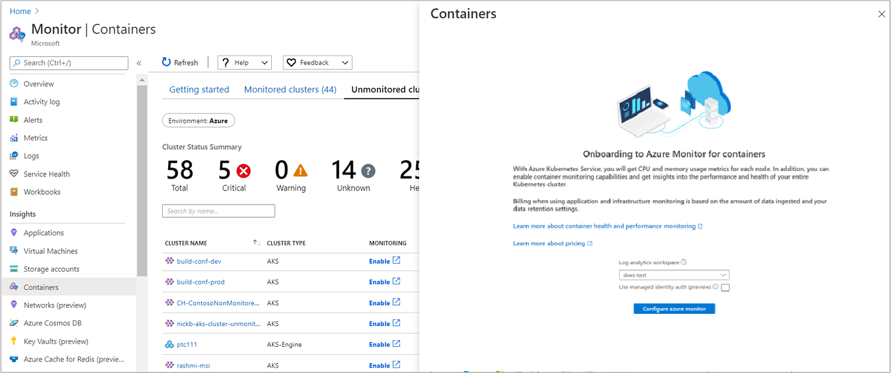
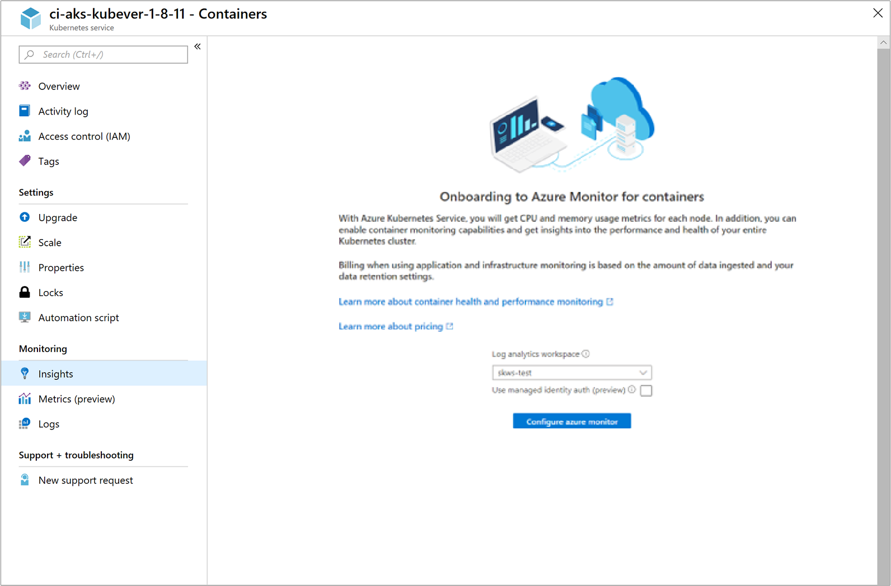

# Enable monitoring for existing Azure Kubernetes Service (AKS) cluster
This article describes how to set up Container insights to monitor managed Kubernetes cluster hosted on [Azure Kubernetes Service](../../aks/index.yml) that have already been deployed in your subscription.

If you're connecting an existing AKS cluster to an Azure Log Analytics workspace in another subscription, the Microsoft.ContainerService resource provider must be registered in the subscription in which the Log Analytics workspace was created. For more information, see [Register resource provider](../../azure-resource-manager/management/resource-providers-and-types.md#register-resource-provider).


## [CLI](#tab/azure-cli)

> [!NOTE]
> Azure CLI version 2.39.0 or higher required for managed identity authentication.

The following step enables monitoring of your AKS cluster using Azure CLI. In this example, you are not required to pre-create or specify an existing workspace. This command simplifies the process for you by creating a default workspace in the default resource group of the AKS cluster subscription if one does not already exist in the region.  The default workspace created resembles the format of *DefaultWorkspace-\<GUID>-\<Region>*.

```azurecli
az aks enable-addons -a monitoring -n MyExistingManagedCluster -g MyExistingManagedClusterRG
```

The output will resemble the following:

```output
provisioningState       : Succeeded
```

### Integrate with an existing workspace

If you would rather integrate with an existing workspace, perform the following steps to first identify the full resource ID of your Log Analytics workspace required for the `--workspace-resource-id` parameter, and then run the command to enable the monitoring add-on against the specified workspace.

1. List all the subscriptions that you have access to using the following command:

    ```azurecli
    az account list --all -o table
    ```

    The output will resemble the following:

    ```output
    Name                                  CloudName    SubscriptionId                        State    IsDefault
    ------------------------------------  -----------  ------------------------------------  -------  -----------
    Microsoft Azure                       AzureCloud   68627f8c-91fO-4905-z48q-b032a81f8vy0  Enabled  True
    ```

    Copy the value for **SubscriptionId**.

2. Switch to the subscription hosting the Log Analytics workspace using the following command:

    ```azurecli
    az account set -s <subscriptionId of the workspace>
    ```

3. The following example displays the list of workspaces in your subscriptions in the default JSON format.

    ```azurecli
    az resource list --resource-type Microsoft.OperationalInsights/workspaces -o json
    ```

    In the output, find the workspace name, and then copy the full resource ID of that Log Analytics workspace under the field **id**.

4. Switch to the subscription hosting the cluster using the following command:

    ```azurecli
    az account set -s <subscriptionId of the cluster>
    ```

5. Run the following command to enable the monitoring add-on, replacing the value for the `--workspace-resource-id` parameter. The string value must be within the double quotes:

    ```azurecli
    az aks enable-addons -a monitoring -n ExistingManagedCluster -g ExistingManagedClusterRG --workspace-resource-id "/subscriptions/<SubscriptionId>/resourceGroups/<ResourceGroupName>/providers/Microsoft.OperationalInsights/workspaces/<WorkspaceName>"
    ```

    The output will resemble the following:

    ```output
    provisioningState       : Succeeded
    ```

## [Terraform](#tab/terraform)
To enable monitoring using Terraform, do the following:

1. Add the **oms_agent** add-on profile to the existing [azurerm_kubernetes_cluster resource](https://registry.terraform.io/providers/hashicorp/azurerm/latest/docs/data-sources/kubernetes_cluster)

   ```
   addon_profile {
    oms_agent {
      enabled                    = true
      log_analytics_workspace_id = "${azurerm_log_analytics_workspace.test.id}"
     }
   }
   ```

2. Add the [azurerm_log_analytics_solution](https://registry.terraform.io/providers/hashicorp/azurerm/latest/docs/resources/log_analytics_solution) following the steps in the Terraform documentation.

3. The metrics are not collected by default through Terraform, so once onboarded, there is an additional step to assign the monitoring metrics publisher role, which is required to [enable the metrics](./container-insights-update-metrics.md#update-one-cluster-by-using-the-azure-cli). 

## [Azure Monitor portal](#tab/portal-azure-monitor)

To enable monitoring of your AKS cluster in the Azure portal from Azure Monitor, do the following:

1. In the Azure portal, select **Monitor**.

2. Select **Containers** from the list.

3. On the **Monitor - containers** page, select **Unmonitored clusters**.

4. From the list of unmonitored clusters, find the cluster in the list and click **Enable**.

5. On the **Onboarding to Container insights** page, if you have an existing Log Analytics workspace in the same subscription as the cluster, select it from the drop-down list.
    The list preselects the default workspace and location that the AKS container is deployed to in the subscription.

    

    >[!NOTE]
    >If you want to create a new Log Analytics workspace for storing the monitoring data from the cluster, follow the instructions in [Create a Log Analytics workspace](../logs/quick-create-workspace.md). Be sure to create the workspace in the same subscription that the AKS container is deployed to.

6. Select **Use managed identity** if you want to use [managed identity authentication with the Azure Monitor agent](container-insights-onboard.md#authentication). 

After you've enabled monitoring, it might take about 15 minutes before you can view health metrics for the cluster.

## [AKS portal](#tab/portal-aks)

To enable monitoring directly from one of your AKS clusters in the Azure portal, do the following:

1. In the Azure portal, select **All services**.

2. In the list of resources, begin typing **Containers**.  The list filters based on your input.

3. Select **Kubernetes services**.
    
4. In the list of Kubernetes services, select a service.

5. On the Kubernetes service overview page, select **Monitoring - Insights**.

6. On the **Onboarding to Container insights** page, if you have an existing Log Analytics workspace in the same subscription as the cluster, select it in the drop-down list.
    The list preselects the default workspace and location that the AKS container is deployed to in the subscription.

    

    >[!NOTE]
    >If you want to create a new Log Analytics workspace for storing the monitoring data from the cluster, follow the instructions in [Create a Log Analytics workspace](../logs/quick-create-workspace.md). Be sure to create the workspace in the same subscription that the AKS container is deployed to.

6. Select **Use managed identity** if you want to use [managed identity authentication with the Azure Monitor agent](container-insights-onboard.md#authentication). 


After you've enabled monitoring, it might take about 15 minutes before you can view operational data for the cluster.

## [Resource Manager template](#tab/arm)


This method includes two JSON templates. One template specifies the configuration to enable monitoring, and the other contains parameter values that you configure to specify the following:

* The AKS container resource ID.
* The resource group that the cluster is deployed in.

>[!NOTE]
>The template needs to be deployed in the same resource group as the cluster.


### Prerequisites
The Log Analytics workspace must be created before you deploy the Resource Manager template.


### Create or download templates

**If you want to enable [managed identity authentication (preview)](container-insights-onboard.md#authentication)**

1. Download the template at [https://aka.ms/aks-enable-monitoring-msi-onboarding-template-file](https://aka.ms/aks-enable-monitoring-msi-onboarding-template-file) and save it as **existingClusterOnboarding.json**.

2. Download the parameter file at [https://aka.ms/aks-enable-monitoring-msi-onboarding-template-parameter-file](https://aka.ms/aks-enable-monitoring-msi-onboarding-template-parameter-file) and save it as **existingClusterParam.json**.

3. Edit the values in the parameter file.

  - For **aksResourceId** and **aksResourceLocation**, use the values on the **AKS Overview** page for the AKS cluster. 
  - For **workspaceResourceId**, use the resource ID of your Log Analytics workspace.
  - For **resourceTagValues**, match the existing tag values specified for the existing Container insights extension DCR of the cluster and the name of the data collection rule, which will be MSCI-\<clusterName\>-\<clusterRegion\> and this resource created in AKS clusters Resource Group. If this first-time onboarding, you can set the arbitrary tag values.


**If you don't want to enable [managed identity authentication (preview)](container-insights-onboard.md#authentication)**

1. Save the following JSON as **existingClusterOnboarding.json**.

    ```json
    {
      "$schema": "https://schema.management.azure.com/schemas/2015-01-01/deploymentTemplate.json#",
      "contentVersion": "1.0.0.0",
      "parameters": {
        "aksResourceId": {
          "type": "string",
          "metadata": {
            "description": "AKS Cluster Resource ID"
          }
        },
        "aksResourceLocation": {
          "type": "string",
          "metadata": {
            "description": "Location of the AKS resource e.g. \"East US\""
          }
        },
        "aksResourceTagValues": {
          "type": "object",
          "metadata": {
            "description": "Existing all tags on AKS Cluster Resource"
          }
        },
        "workspaceResourceId": {
          "type": "string",
          "metadata": {
            "description": "Azure Monitor Log Analytics Resource ID"
          }
        }
      },
      "resources": [
        {
          "name": "[split(parameters('aksResourceId'),'/')[8]]",
          "type": "Microsoft.ContainerService/managedClusters",
          "location": "[parameters('aksResourceLocation')]",
          "tags": "[parameters('aksResourceTagValues')]",
          "apiVersion": "2018-03-31",
          "properties": {
            "mode": "Incremental",
            "id": "[parameters('aksResourceId')]",
            "addonProfiles": {
              "omsagent": {
                "enabled": true,
                "config": {
                  "logAnalyticsWorkspaceResourceID": "[parameters('workspaceResourceId')]"
                }
              }
            }
          }
        }
      ]
    }
    ```

2. Save the following JSON as **existingClusterParam.json**.

    ```json
    {
      "$schema": "https://schema.management.azure.com/schemas/2015-01-01/deploymentParameters.json#",
      "contentVersion": "1.0.0.0",
      "parameters": {
        "aksResourceId": {
          "value": "/subscriptions/<SubscriptionId>/resourcegroups/<ResourceGroup>/providers/Microsoft.ContainerService/managedClusters/<ResourceName>"
        },
        "aksResourceLocation": {
          "value": "<aksClusterLocation>"
        },
        "workspaceResourceId": {
          "value": "/subscriptions/<SubscriptionId>/resourceGroups/<ResourceGroup>/providers/Microsoft.OperationalInsights/workspaces/<workspaceName>"
        },
        "aksResourceTagValues": {
          "value": {
            "<existing-tag-name1>": "<existing-tag-value1>",
            "<existing-tag-name2>": "<existing-tag-value2>",
            "<existing-tag-nameN>": "<existing-tag-valueN>"
          }
        }
      }
    }
    ```

2. Download the parameter file at [https://aka.ms/aks-enable-monitoring-msi-onboarding-template-parameter-file](https://aka.ms/aks-enable-monitoring-msi-onboarding-template-parameter-file) and save as **existingClusterParam.json**.

3. Edit the values in the parameter file.

  - For **aksResourceId** and **aksResourceLocation**, use the values on the **AKS Overview** page for the AKS cluster. 
  - For **workspaceResourceId**, use the resource ID of your Log Analytics workspace.
  - For **aksResourceTagValues**, use the existing tag values specified for the AKS cluster.


### Deploy template

If you are unfamiliar with the concept of deploying resources by using a template, see:

* [Deploy resources with Resource Manager templates and Azure PowerShell](../../azure-resource-manager/templates/deploy-powershell.md)
* [Deploy resources with Resource Manager templates and the Azure CLI](../../azure-resource-manager/templates/deploy-cli.md)

If you choose to use the Azure CLI, you first need to install and use the CLI locally. You must be running the Azure CLI version 2.0.59 or later. To identify your version, run `az --version`. If you need to install or upgrade the Azure CLI, see [Install the Azure CLI](/cli/azure/install-azure-cli).


#### To deploy with Azure PowerShell:

```powershell
New-AzResourceGroupDeployment -Name OnboardCluster -ResourceGroupName <ResourceGroupName> -TemplateFile .\existingClusterOnboarding.json -TemplateParameterFile .\existingClusterParam.json
```

The configuration change can take a few minutes to complete. When it's completed, a message is displayed that's similar to the following and includes the result:

```output
provisioningState       : Succeeded
```

#### To deploy with Azure CLI, run the following commands:

```azurecli
az login
az account set --subscription "Subscription Name"
az deployment group create --resource-group <ResourceGroupName> --template-file ./existingClusterOnboarding.json --parameters @./existingClusterParam.json
```

The configuration change can take a few minutes to complete. When it's completed, a message is displayed that's similar to the following and includes the result:

```output
provisioningState       : Succeeded
```

After you've enabled monitoring, it might take about 15 minutes before you can view health metrics for the cluster.

---

## Verify agent and solution deployment

With agent version *06072018* or later, you can verify that both the agent and the solution were deployed successfully. With earlier versions of the agent, you can verify only agent deployment.

### Agent version 06072018 or later

Run the following command to verify that the agent is deployed successfully.

```
kubectl get ds omsagent --namespace=kube-system
```

The output should resemble the following, which indicates that it was deployed properly:

```output
User@aksuser:~$ kubectl get ds omsagent --namespace=kube-system
NAME       DESIRED   CURRENT   READY     UP-TO-DATE   AVAILABLE   NODE SELECTOR                 AGE
omsagent   2         2         2         2            2           beta.kubernetes.io/os=linux   1d
```

If there are Windows Server nodes on the cluster then you can run the following command to verify that the agent is deployed successfully.

```
kubectl get ds omsagent-win --namespace=kube-system
```

The output should resemble the following, which indicates that it was deployed properly:

```output
User@aksuser:~$ kubectl get ds omsagent-win --namespace=kube-system
NAME                   DESIRED   CURRENT   READY     UP-TO-DATE   AVAILABLE   NODE SELECTOR                   AGE
omsagent-win           2         2         2         2            2           beta.kubernetes.io/os=windows   1d
```

To verify deployment of the solution, run the following command:

```
kubectl get deployment omsagent-rs -n=kube-system
```

The output should resemble the following, which indicates that it was deployed properly:

```output
User@aksuser:~$ kubectl get deployment omsagent-rs -n=kube-system
NAME       DESIRED   CURRENT   UP-TO-DATE   AVAILABLE    AGE
omsagent   1         1         1            1            3h
```

### Agent version earlier than 06072018

To verify that the Log Analytics agent version released before *06072018* is deployed properly, run the following command:

```
kubectl get ds omsagent --namespace=kube-system
```

The output should resemble the following, which indicates that it was deployed properly:

```output
User@aksuser:~$ kubectl get ds omsagent --namespace=kube-system
NAME       DESIRED   CURRENT   READY     UP-TO-DATE   AVAILABLE   NODE SELECTOR                 AGE
omsagent   2         2         2         2            2           beta.kubernetes.io/os=linux   1d
```

## View configuration with CLI

Use the `aks show` command to get details such as is the solution enabled or not, what is the Log Analytics workspace resourceID, and summary details about the cluster.

```azurecli
az aks show -g <resourceGroupofAKSCluster> -n <nameofAksCluster>
```

After a few minutes, the command completes and returns JSON-formatted information about solution.  The results of the command should show the monitoring add-on profile and resembles the following example output:

```output
"addonProfiles": {
    "omsagent": {
      "config": {
        "logAnalyticsWorkspaceResourceID": "/subscriptions/<WorkspaceSubscription>/resourceGroups/<DefaultWorkspaceRG>/providers/Microsoft.OperationalInsights/workspaces/<defaultWorkspaceName>"
      },
      "enabled": true
    }
  }
```

## Migrate to managed identity authentication

### Existing clusters with service principal 
AKS Clusters with service principal must first disable monitoring and then upgrade to managed identity. Only Azure public cloud, Azure China cloud, and Azure Government cloud are currently supported for this migration.

1.	Get the configured Log Analytics workspace resource id:

```cli
az aks show -g <resource-group-name> -n <cluster-name> | grep -i "logAnalyticsWorkspaceResourceID"
```

2.	Disable monitoring with the following command:

  ```cli
  az aks disable-addons -a monitoring -g <resource-group-name> -n <cluster-name> 
  ```

3.	Upgrade cluster to system managed identity with the following command:

  ```cli
  az aks update -g <resource-group-name> -n <cluster-name> --enable-managed-identity
  ```

4.	Enable Monitoring addon with managed identity authentication option using Log Analytics workspace resource ID obtained in the first step:

  ```cli
  az aks enable-addons -a monitoring --enable-msi-auth-for-monitoring -g <resource-group-name> -n <cluster-name> --workspace-resource-id <workspace-resource-id>
  ```

### Existing clusters with system or user assigned identity
AKS Clusters with system assigned identity must first disable monitoring and then upgrade to managed identity. Only Azure public cloud, Azure China cloud, and Azure Government cloud are currently supported for clusters with system identity. For clusters with user assigned identity, only Azure Public cloud is supported.

1.	Get the configured Log Analytics workspace resource id: 

  ```cli
  az aks show -g <resource-group-name> -n <cluster-name> | grep -i "logAnalyticsWorkspaceResourceID"
  ```

2.	Disable monitoring with the following command:

  ```cli
  az aks disable-addons -a monitoring -g <resource-group-name> -n <cluster-name>
  ```

3.	Enable Monitoring addon with managed identity authentication option using Log Analytics workspace resource ID obtained in the first step:

  ```cli
  az aks enable-addons -a monitoring --enable-msi-auth-for-monitoring -g <resource-group-name> -n <cluster-name> --workspace-resource-id <workspace-resource-id>
  ```

## Private link
To enable network isolation by connecting your cluster to the Log Analytics workspace using [private link](../logs/private-link-security.md), your cluster must be using managed identity authentication with the Azure Monitor agent. 

1. Follow the steps in [Enable network isolation for the Azure Monitor agent](../agents/azure-monitor-agent-data-collection-endpoint.md) to create a data collection endpoint and add it to your AMPLS.
2. Create an association between the cluster and the data collection endpoint using the following API call. See [Data Collection Rule Associations - Create](/rest/api/monitor/data-collection-rule-associations/create) for details on this call. The DCR association name must be **configurationAccessEndpoint**, `resourceUri` is the resource Id of the AKS cluster.

    ```rest
    PUT https://management.azure.com/{cluster-resource-id}/providers/Microsoft.Insights/dataCollectionRuleAssociations/configurationAccessEndpoint?api-version=2021-04-01
    {
    "properties": {
        "dataCollectionEndpointId": "{data-collection-endpoint-resource-id}"
        }
    }
    ```

    Following is an example of this API call.

    ```rest
    PUT https://management.azure.com/subscriptions/00000000-0000-0000-0000-000000000000/resourceGroups/myResourceGroup/providers/Microsoft.ContainerService/managedClusters/my-aks-cluster/providers/Microsoft.Insights/dataCollectionRuleAssociations/configurationAccessEndpoint?api-version=2021-04-01

    {
    "properties": {
        "dataCollectionEndpointId": "/subscriptions/00000000-0000-0000-0000-000000000000/resourceGroups/myResourceGroup/providers/Microsoft.Insights/dataCollectionEndpoints/myDataCollectionEndpoint"
        }
    }
    ```

3. Enable monitoring with managed identity authentication option using the steps in [Migrate to managed identity authentication](#migrate-to-managed-identity-authentication).

## Limitations

- Enabling managed identity authentication (preview) is not currently supported using Terraform or Azure Policy.
- When you enable managed identity authentication (preview), a data collection rule is created with the name *MSCI-\<cluster-name\>-\<cluster-region\>*. This name cannot currently be modified.

## Next steps

* If you experience issues while attempting to onboard the solution, review the [troubleshooting guide](container-insights-troubleshoot.md)

* With monitoring enabled to collect health and resource utilization of your AKS cluster and workloads running on them, learn [how to use](container-insights-analyze.md) Container insights.
