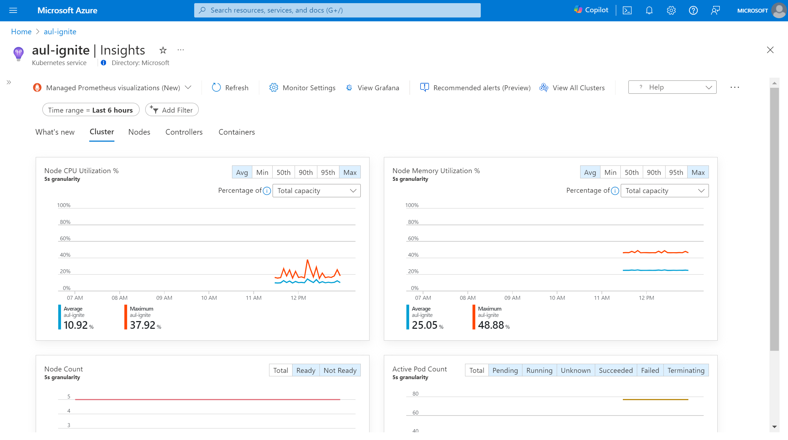
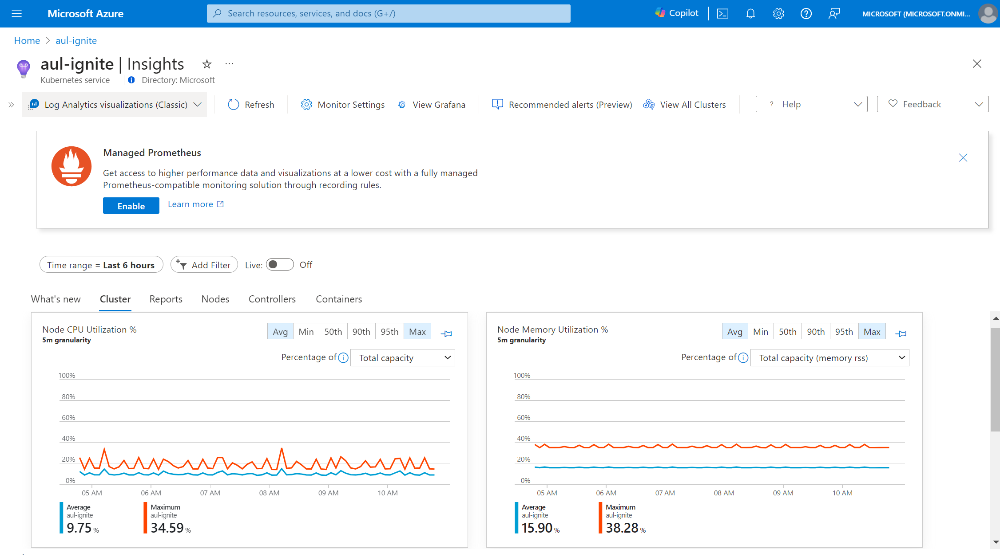
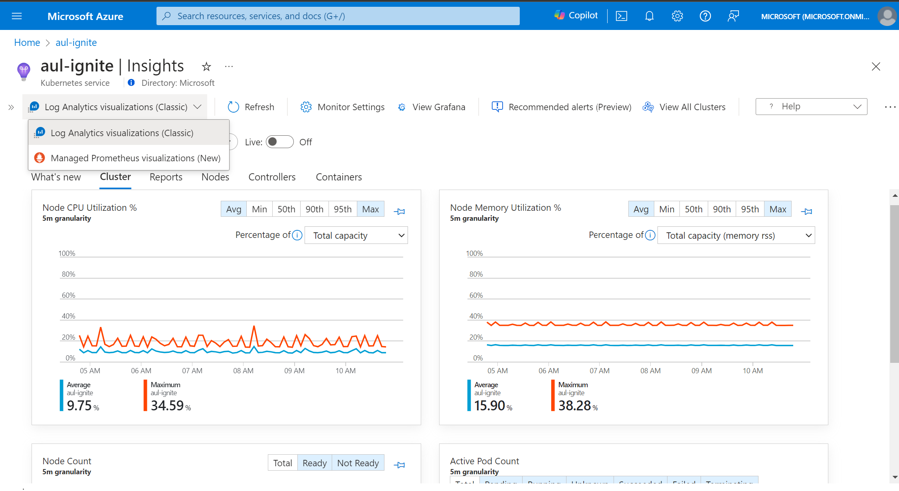
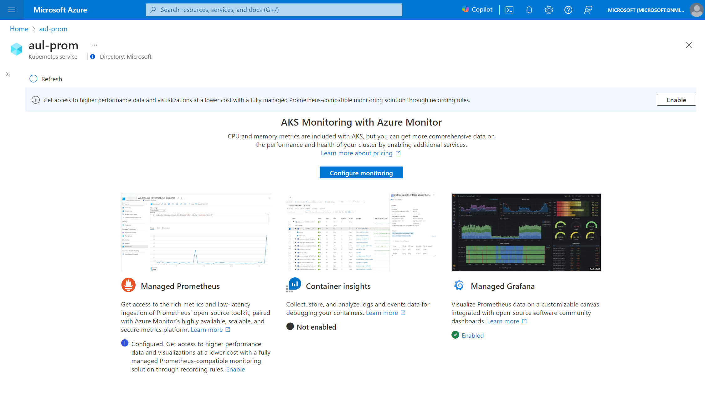
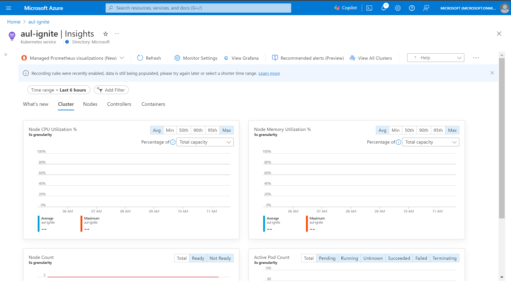

# Switch to using managed Prometheus for container insights (preview)

Container insights currently uses data from Log Analytics to power the visualizations in the Azure portal. However, with the release of managed Prometheus, this new format of metrics collection is cheaper and more efficient. Container insights now offers the ability to visualize using only managed Prometheus data. This article helps you with the setup to start using managed Prometheus as your primary container insights visualization tool.

> [!Note]
> This feature is currently in public preview. For additional information, please read the [Supplemental Terms of Use for Microsoft Azure Previews](https://azure.microsoft.com/support/legal/preview-supplemental-terms).

## Prerequisites

To view your container insights data using Prometheus, ensure the following steps are complete

* AKS cluster [configured with managed Prometheus](./kubernetes-monitoring-enable.md#existing-cluster-prometheus-only)
    * If your cluster does not yet have Prometheus enabled, you may follow the link above or steps below to enable 
* User has `Reader` permission or higher on the associated [Azure Monitor workspace](../essentials/azure-monitor-workspace-overview.md)
* Ad block is disabled or set to allow `monitor.azure.com` traffic
* For Windows clusters, [enable Windows metric collection](./kubernetes-monitoring-enable.md#enable-windows-metrics-collection-preview)

## Accessing Prometheus based container insights

Because Azure Monitor supports various levels of customization, your cluster may currently have logs-based Container Insights, managed Prometheus, or some other combination.

### [No Prometheus or logs-based Container Insights enabled](#tab/unmonitored)

1.) Open the Azure portal and navigate to your desired AKS cluster

2.) Choose the Insights menu item from the menu, which will display a splash screen indicating no monitoring enabled


3.) Select the Configure monitoring button to open up the monitoring configuration blade

4.) Underneath the advanced settings blade, choose the "Logs and events" from the Cost presets dropdown

5.) Click the Configure button to finish the setup

6.) Once the onboarding deployment completes, you should be able to see the Insights experience using Prometheus as the data source, indicated by the toolbar dropdown showing "Managed Prometheus visualizations"



### [Logs-based Container Insights enabled](#tab/LA)

1.) Open the Azure portal and navigate to your desired AKS cluster

2.) Choose the Insights menu item from the menu, a banner will be displayed at the top to configure managed Prometheus

3.) Using the banner, select the Configure button to complete onboarding to managed Prometheus or deploy the requisite recording rules.



If the banner was previously dismissed, you can instead us the dropdown in the toolbar that says "Log Analytics visualizations (classic)", and select the "Managed Prometheus visualizations (new)" option to complete onboarding



4.) Once the monitoring deployment is complete, the Insights blade should switch to using Prometheus as the data source, indicated by the toolbar dropdown showing "Managed Prometheus visualizations"

> [!Note]
> Some charts will only have partial data for the default time range until sufficient time has elapsed for the recording rules to collect data.


### [Prometheus enabled and logs-based Container Insights not enabled or with custom settings applied](#tab/Prom)

1.) Open the Azure portal and navigate to your desired AKS cluster

2.) Choose the Insights menu item from the menu, a screen will be displayed with a banner to enable Prometheus recording rules



3.) Click enable to deploy the recording rules

4.) Once the monitoring deployment is complete, the Insights blade should switch to using Prometheus as the data source, indicated by the toolbar dropdown showing "Managed Prometheus visualizations"




## Optional steps

While the above steps are sufficient, for the full visualization experience, a few optional steps can be completed.

### Node and Pod labels collection 

By default the labels for nodes and pods aren't available, but can be collected through re-enabling the addon. Node labels are required for filtering data by node pools.

1.) If the managed Prometheus addon is currently deployed, we must first disable it

```azurecli
az aks update --disable-azure-monitor-metrics -n <clusterName> -g <resourceGroup>
```

2.) Then, re-enable the addon with the flag `--ksm-metric-labels-allow-list`
    
```azurecli
az aks update -n <clusterName> -g <resourceGroup> --enable-azure-monitor-metrics --ksm-metric-labels-allow-list "nodes=[*], pods=[*]" --azure-monitor-workspace-resource-id <amw-id
```

### Disable Log Analytics data collection

If you're currently using the logs based container insights experience, then you can choose to stop ingesting metrics to Log Analytics to save on billing. Once you've confirmed the Prometheus backed container insights experience is sufficient for your purposes, complete the steps to stop metrics ingestion to Log Analytics.

1.) Navigate to the monitoring settings for your clusters by following the instructions on how to configure your [container insights DCR](./container-insights-data-collection-dcr.md#configure-data-collection)

2.) From the Cost presets dropdown, select "Logs and Events" and save to configure.

## Known limitations and issues

As this feature is currently in preview, there are several, known limitations, the following features aren't supported

* Environment variable details
* Filtering data by individual services
* Live data viewing on the Cluster tab
* Workbooks reports data
* Node memory working set and RSS metrics
* Partial or no data available in the multi-cluster view based on container insights DCR settings

## Troubleshooting
