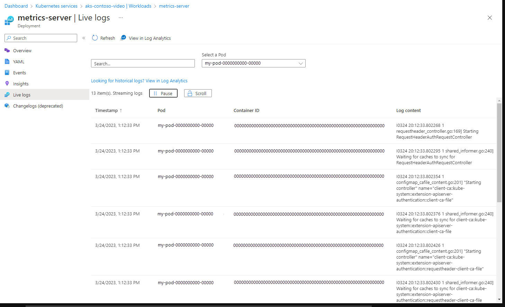
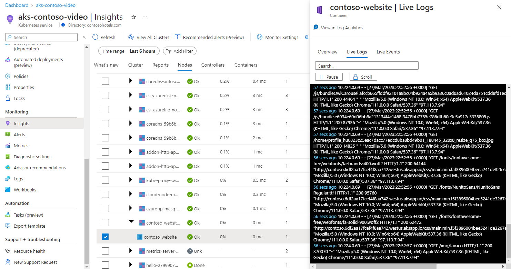
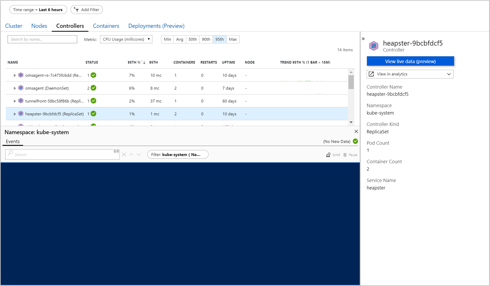
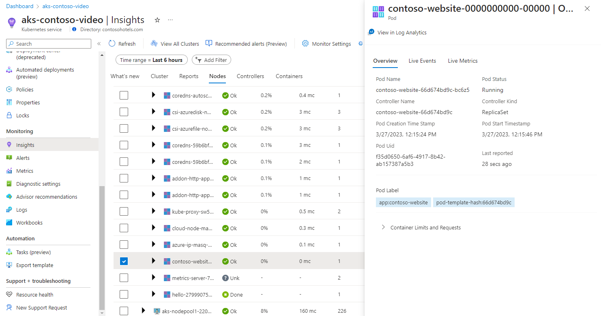
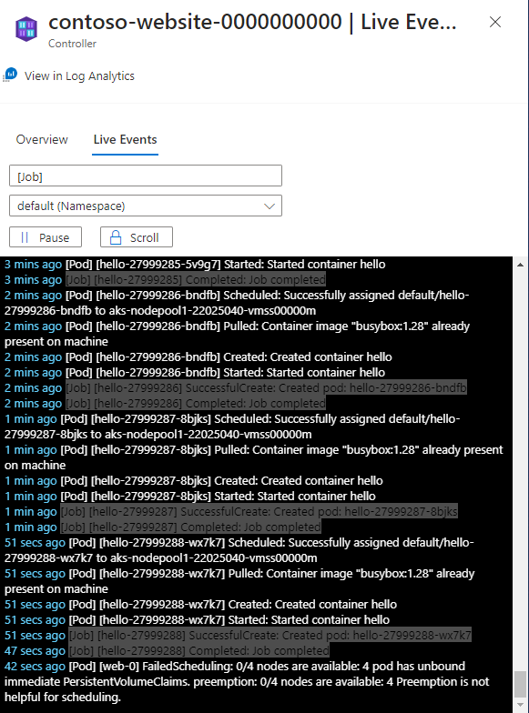
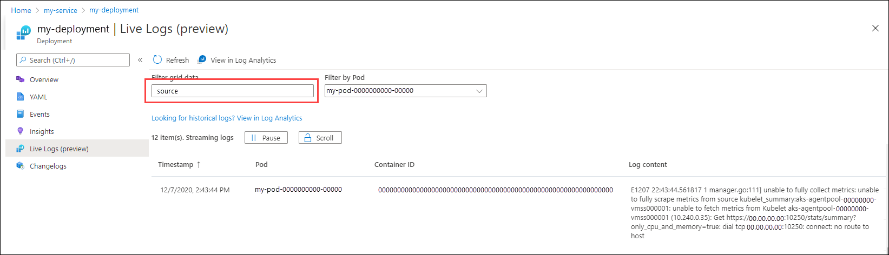
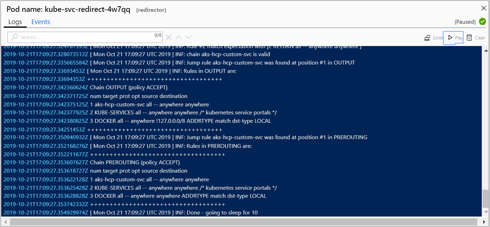
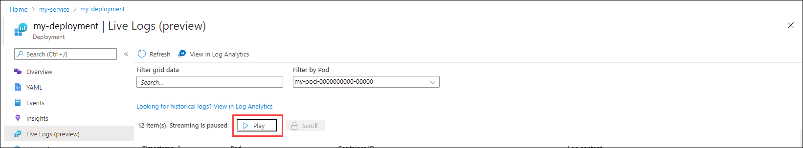

# View Kubernetes logs, events, and pod metrics in real time

Container insights includes the Live Data feature. You can use this advanced diagnostic feature for direct access to your Azure Kubernetes Service (AKS) container logs (stdout/stderror), events, and pod metrics. It exposes direct access to `kubectl logs -c`, `kubectl get` events, and `kubectl top pods`. A console pane shows the logs, events, and metrics generated by the container engine to help with troubleshooting issues in real time.

This article provides an overview of this feature and helps you understand how to use it.

For help with setting up or troubleshooting the Live Data feature, see the [Setup guide](container-insights-livedata-setup.md). This feature directly accesses the Kubernetes API. For more information about the authentication model, see [The Kubernetes API](https://kubernetes.io/docs/concepts/overview/kubernetes-api/).

## View AKS resource live logs

To view the live logs for pods, deployments, and replica sets with or without Container insights from the AKS resource view:

1. In the Azure portal, browse to the AKS cluster resource group and select your AKS resource.

1. Select **Workloads** in the **Kubernetes resources** section of the menu.

1. Select a pod, deployment, or replica set from the respective tab.

1. Select **Live Logs** from the resource's menu.

1. Select a pod to start collecting the live data.

    

## View logs

You can view real-time log data as it's generated by the container engine on the **Nodes**, **Controllers**, or **Containers** view. To view log data:

1. In the Azure portal, browse to the AKS cluster resource group and select your AKS resource.

1. On the AKS cluster dashboard, under **Monitoring** on the left side, select **Insights**.

1. Select the **Nodes**, **Controllers**, or **Containers** tab.

1. Select an object from the performance grid. In the **Properties** pane on the right side, select **View live data**. If the AKS cluster is configured with single sign-on by using Azure Active Directory (Azure AD), you're prompted to authenticate on first use during that browser session. Select your account and finish authentication with Azure.

    >[!NOTE]
    >To view the data from your Log Analytics workspace, select **View in analytics** in the **Properties** pane. The log search results potentially show **Nodes**, **Daemon Sets**, **Replica Sets**, **Jobs**, **Cron Jobs**, **Pods**, and **Containers**. These logs might no longer exist. Attempting to search logs for a container that isn't available in `kubectl` will also fail here. To learn more about viewing historical logs, events, and metrics, see [How to query logs from Container insights](container-insights-log-query.md).

After successful authentication, the Live Data console pane appears below the performance data grid. You can view log data here in a continuous stream. If the fetch status indicator shows a green check mark at the far right, it means data can be retrieved, and it begins streaming to your console.

The pane title shows the name of the pod the container is grouped with.

## View events

You can view real-time event data as it's generated by the container engine on the **Nodes**, **Controllers**, **Containers**, or **Deployments** view when a container, pod, node, ReplicaSet, DaemonSet, job, CronJob, or Deployment is selected. To view events:

1. In the Azure portal, browse to the AKS cluster resource group and select your AKS resource.

1. On the AKS cluster dashboard, under **Monitoring** on the left side, select **Insights**.

1. Select the **Nodes**, **Controllers**, **Containers**, or **Deployments** tab.

1. Select an object from the performance grid. In the **Properties** pane on the right side, select **View live data**. If the AKS cluster is configured with single sign-on by using Azure AD, you're prompted to authenticate on first use during that browser session. Select your account and finish authentication with Azure.

    >[!NOTE]
    >To view the data from your Log Analytics workspace, select **View in analytics** in the **Properties** pane. The log search results potentially show **Nodes**, **Daemon Sets**, **Replica Sets**, **Jobs**, **Cron Jobs**, **Pods**, and **Containers**. These logs might no longer exist. Attempting to search logs for a container that isn't available in `kubectl` will also fail here. To learn more about viewing historical logs, events, and metrics, see [How to query logs from Container insights](container-insights-log-query.md).

After successful authentication, the Live Data console pane appears below the performance data grid. If the fetch status indicator shows a green check mark at the far right, it means data can be retrieved, and it begins streaming to your console.

If the object you selected was a container, select the **Events** option in the pane. If you selected a node, pod, or controller, viewing events is automatically selected.

The pane title shows the name of the Pod the container is grouped with.

### Filter events

While you view events, you can also limit the results by using the **Filter** pill found to the right of the search bar. Depending on the resource you select, the pill lists a pod, namespace, or cluster to choose from.

## View metrics

You can view real-time metric data as it's generated by the container engine from the **Nodes** or **Controllers** view only when a **Pod** is selected. To view metrics:

1. In the Azure portal, browse to the AKS cluster resource group and select your AKS resource.

1. On the AKS cluster dashboard, under **Monitoring** on the left side, select **Insights**.

1. Select either the **Nodes** or **Controllers** tab.

1. Select a **Pod** object from the performance grid. In the **Properties** pane on the right side, select **View live data**. If the AKS cluster is configured with single sign-on by using Azure AD, you're prompted to authenticate on first use during that browser session. Select your account and finish authentication with Azure.

    >[!NOTE]
    >To view the data from your Log Analytics workspace, select the **View in analytics** option in the **Properties** pane. The log search results potentially show **Nodes**, **Daemon Sets**, **Replica Sets**, **Jobs**, **Cron Jobs**, **Pods**, and **Containers**. These logs might no longer exist. Attempting to search logs for a container that isn't available in `kubectl` will also fail here. To learn more about viewing historical logs, events, and metrics, see [How to query logs from Container insights](container-insights-log-query.md).

After successful authentication, the Live Data console pane appears below the performance data grid. Metric data is retrieved and begins streaming to your console for presentation in the two charts. The pane title shows the name of the pod the container is grouped with.

## Use live data views

The following sections describe functionality that you can use in the different live data views.

### Search

The Live Data feature includes search functionality. In the **Search** box, you can filter results by entering a keyword or term. Any matching results are highlighted to allow quick review. While you view the events, you can also limit the results by using the **Filter** feature to the right of the search bar. Depending on what resource you've selected, you can choose from a pod, namespace, or cluster.

### Scroll lock and pause

To suspend autoscroll and control the behavior of the pane so that you can manually scroll through the new data read, select the **Scroll** option. To re-enable autoscroll, select **Scroll** again. You can also pause retrieval of log or event data by selecting the **Pause** option. When you're ready to resume, select **Play**.

Suspend or pause autoscroll for only a short period of time while you're troubleshooting an issue. These requests might affect the availability and throttling of the Kubernetes API on your cluster.

>[!IMPORTANT]
>No data is stored permanently during the operation of this feature. All information captured during the session is deleted when you close your browser or navigate away from it. Data only remains present for visualization inside the five-minute window of the metrics feature. Any metrics older than five minutes are also deleted. The Live Data buffer queries within reasonable memory usage limits.

## Next steps

- To continue learning how to use Azure Monitor and monitor other aspects of your AKS cluster, see [View Azure Kubernetes Service health](container-insights-analyze.md).
- To see predefined queries and examples to create alerts and visualizations or perform further analysis of your clusters, see [How to query logs from Container insights](container-insights-log-query.md).
