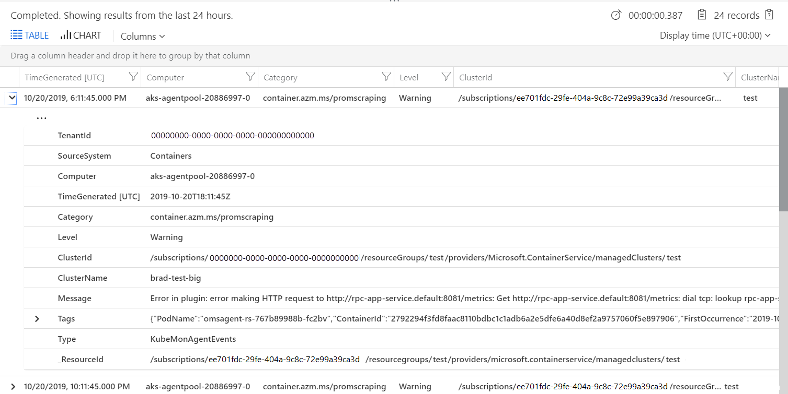

# How to query logs from Container insights

Container insights collects performance metrics, inventory data, and health state information from container hosts and containers. The data is collected every three minutes and forwarded to the Log Analytics workspace in Azure Monitor where it's available for [log queries(../logs/log-query-overview.md) using [Log Analytics](../logs/log-analytics-overview.md) in Azure Monitor. You can apply this data to scenarios that include migration planning, capacity analysis, discovery, and on-demand performance troubleshooting. Azure Monitor Logs can help you look for trends, diagnose bottlenecks, forecast, or correlate data that can help you determine whether the current cluster configuration is performing optimally.

See [Using queries in Azure Monitor Log Analytics](../logs/queries.md) for information on using these queries and [Log Analytics tutorial](../logs/log-analytics-tutorial.md) for a complete tutorial on using Log Analytics to run queries and work with their results.

## Open Log Analytics
There are multiple options for starting Log Analytics, each starting with a different [scope](../logs/scope.md). For access to all data in the workspace, select **Logs** from the **Monitor**. To limit the data to a single Kubernetes cluster, select **Logs** from that cluster's menu. 

:::image type="content" source="media/container-insights-log-query/start-log-analytics.png" alt-text="Start Log Analytics" lightbpx=media/container-insights-log-query/start-log-analytics.png:::

## Existing log queries
You don't necessarily need to understand how to write a log query to use Log Analytics. There are multiple prebuilt queries that you can select and either run without modification or use as a start to a custom query. Click **Queries** at the top of the Log Analytics screen and view queries with a **Resource type** of **Kubernetes Services**. 

:::image type="content" source="media/monitor-aks/log-analytics-queries.png" alt-text="Log Analytics queries for Kubernetes" lightbox="media/monitor-aks/log-analytics-queries.png":::

## Container tables
See [Azure Monitor table reference](/azure/azure-monitor/reference/tables/tables-resourcetype#kubernetes-services) for a list of tables and their detailed descriptions used by Container insights. All of these tables are available for log queries.


## Example log queries

It's often useful to build queries that start with an example or two and then modify them to fit your requirements. To help build more advanced queries, you can experiment with the following sample queries:

### List all of a container's lifecycle information

```kusto
ContainerInventory
| project Computer, Name, Image, ImageTag, ContainerState, CreatedTime, StartedTime, FinishedTime
| render table
```

### Kubernetes events

``` kusto
KubeEvents_CL
| where not(isempty(Namespace_s))
| sort by TimeGenerated desc
| render table
```
### Image inventory

``` kusto
ContainerImageInventory
| summarize AggregatedValue = count() by Image, ImageTag, Running
```

### Container CPU

``` kusto
Perf
| where ObjectName == "K8SContainer" and CounterName == "cpuUsageNanoCores" 
| summarize AvgCPUUsageNanoCores = avg(CounterValue) by bin(TimeGenerated, 30m), InstanceName 
```

### Container memory

```kusto
Perf
| where ObjectName == "K8SContainer" and CounterName == "memoryRssBytes"
| summarize AvgUsedRssMemoryBytes = avg(CounterValue) by bin(TimeGenerated, 30m), InstanceName
```

### Requests Per Minute with Custom Metrics

```kusto
InsightsMetrics
| where Name == "requests_count"
| summarize Val=any(Val) by TimeGenerated=bin(TimeGenerated, 1m)
| sort by TimeGenerated asc<br> &#124; project RequestsPerMinute = Val - prev(Val), TimeGenerated
| render barchart 
```
### Pods by name and namespace

```kusto
let startTimestamp = ago(1h);
KubePodInventory
| where TimeGenerated > startTimestamp
| project ContainerID, PodName=Name, Namespace
| where PodName contains "name" and Namespace startswith "namespace"
| distinct ContainerID, PodName
| join
(
    ContainerLog
    | where TimeGenerated > startTimestamp
)
on ContainerID
// at this point before the next pipe, columns from both tables are available to be "projected". Due to both
// tables having a "Name" column, we assign an alias as PodName to one column which we actually want
| project TimeGenerated, PodName, LogEntry, LogEntrySource
| extend TimeGenerated = TimeGenerated - 21600s | order by TimeGenerated desc
| summarize by TimeGenerated, LogEntry
| order by TimeGenerated desc
```

## Query Prometheus metrics data

The following example is a Prometheus metrics query showing disk reads per second per disk per node.

```
InsightsMetrics
| where Namespace == 'container.azm.ms/diskio'
| where TimeGenerated > ago(1h)
| where Name == 'reads'
| extend Tags = todynamic(Tags)
| extend HostName = tostring(Tags.hostName), Device = Tags.name
| extend NodeDisk = strcat(Device, "/", HostName)
| order by NodeDisk asc, TimeGenerated asc
| serialize
| extend PrevVal = iif(prev(NodeDisk) != NodeDisk, 0.0, prev(Val)), PrevTimeGenerated = iif(prev(NodeDisk) != NodeDisk, datetime(null), prev(TimeGenerated))
| where isnotnull(PrevTimeGenerated) and PrevTimeGenerated != TimeGenerated
| extend Rate = iif(PrevVal > Val, Val / (datetime_diff('Second', TimeGenerated, PrevTimeGenerated) * 1), iif(PrevVal == Val, 0.0, (Val - PrevVal) / (datetime_diff('Second', TimeGenerated, PrevTimeGenerated) * 1)))
| where isnotnull(Rate)
| project TimeGenerated, NodeDisk, Rate
| render timechart

```

To view Prometheus metrics scraped by Azure Monitor filtered by Namespace, specify "prometheus". Here's a sample query to view Prometheus metrics from the `default` kubernetes namespace.

```
InsightsMetrics 
| where Namespace == "prometheus"
| extend tags=parse_json(Tags)
| summarize count() by Name
```

Prometheus data can also be directly queried by name.

```
InsightsMetrics 
| where Namespace == "prometheus"
| where Name contains "some_prometheus_metric"
```

### Query config or scraping errors

To investigate any configuration or scraping errors, the following example query returns informational events from the `KubeMonAgentEvents` table.

```
KubeMonAgentEvents | where Level != "Info" 
```

The output shows results similar to the following example:



## Next steps

Container insights does not include a predefined set of alerts. Review the [Create performance alerts with Container insights](./container-insights-log-alerts.md) to learn how to create recommended alerts for high CPU and memory utilization to support your DevOps or operational processes and procedures.
