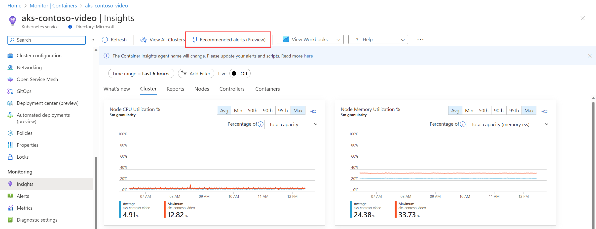
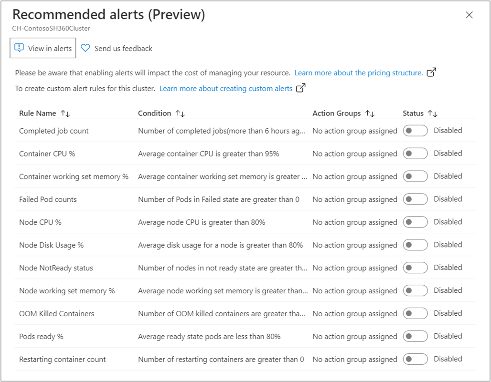
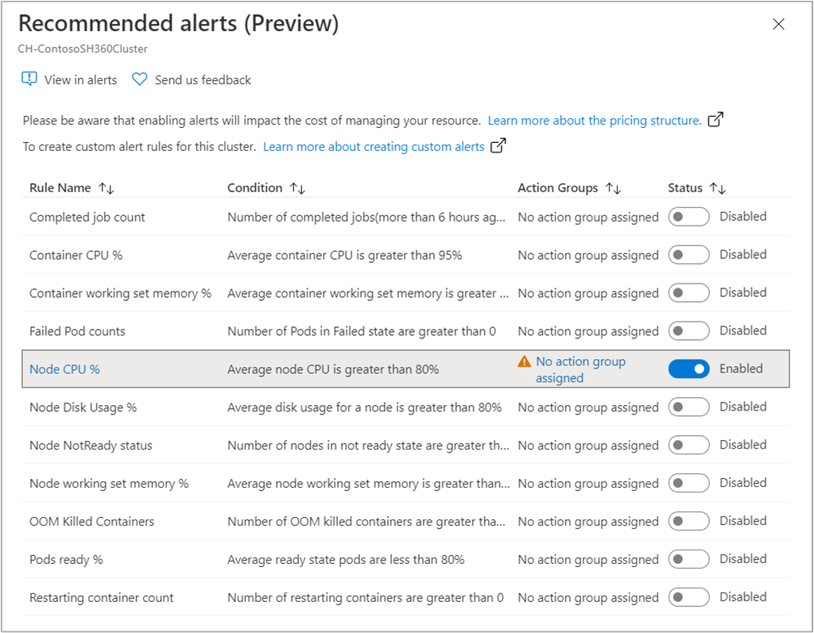
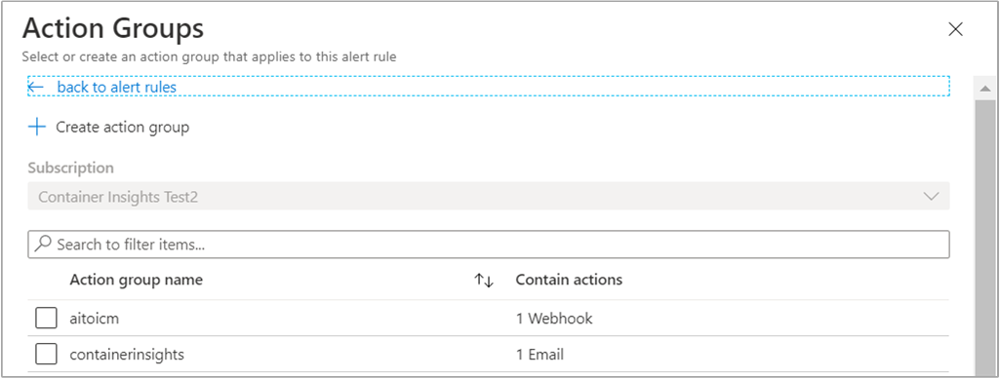

# Recommended metric alerts (preview) from Container insights

To alert on system resource issues when they are experiencing peak demand and running near capacity, with Container insights you would create a log alert based on performance data stored in Azure Monitor Logs. Container insights now includes pre-configured metric alert rules for your AKS and Azure Arc-enabled Kubernetes cluster, which is in public preview.

This article reviews the experience and provides guidance on configuring and managing these alert rules.

If you're not familiar with Azure Monitor alerts, see [Overview of alerts in Microsoft Azure](../alerts/alerts-overview.md) before you start. To learn more about metric alerts, see [Metric alerts in Azure Monitor](../alerts/alerts-metric-overview.md).

> [!NOTE]
> Beginning October 8, 2021, three alerts have been updated to correctly calculate the alert condition: **Container CPU %**, **Container working set memory %**, and **Persistent Volume Usage %**. These new alerts have the same names as their corresponding previously available alerts, but they use new, updated metrics. We recommend that you disable the alerts that use the "Old" metrics, described in this article, and enable the "New" metrics. The "Old" metrics will no longer be available in recommended alerts after they are disabled, but you can manually re-enable them.

## Prerequisites

Before you start, confirm the following:

* Custom metrics are only available in a subset of Azure regions. A list of supported regions is documented in [Supported regions](../essentials/metrics-custom-overview.md#supported-regions).

* To support metric alerts and the introduction of additional metrics, the minimum agent version required is **mcr.microsoft.com/azuremonitor/containerinsights/ciprod:ciprod05262020** for AKS and **mcr.microsoft.com/azuremonitor/containerinsights/ciprod:ciprod09252020** for Azure Arc-enabled Kubernetes cluster.

    To verify your cluster is running the newer version of the agent, you can either:

    * Run the command: `kubectl describe pod <azure-monitor-agent-pod-name> --namespace=kube-system`. In the status returned, note the value under **Image** for Azure Monitor agent in the *Containers* section of the output. 
    * On the **Nodes** tab, select the cluster node and on the **Properties** pane to the right, note the value under **Agent Image Tag**.

    The value shown for AKS should be version **ciprod05262020** or later. The value shown for Azure Arc-enabled Kubernetes cluster should be version **ciprod09252020** or later. If your cluster has an older version, see [How to upgrade the Container insights agent](container-insights-manage-agent.md#upgrade-agent-on-aks-cluster) for steps to get the latest version.

    For more information related to the agent release, see [agent release history](https://github.com/microsoft/docker-provider/tree/ci_feature_prod). To verify metrics are being collected, you can use Azure Monitor metrics explorer and verify from the **Metric namespace** that **insights** is listed. If it is, you can go ahead and start setting up the alerts. If you don't see any metrics collected, the cluster Service Principal or MSI is missing the necessary permissions. To verify the SPN or MSI is a member of the **Monitoring Metrics Publisher** role, follow the steps described in the section [Upgrade per cluster using Azure CLI](container-insights-update-metrics.md#update-one-cluster-by-using-the-azure-cli) to confirm and set role assignment.
    
> [!TIP]
> Download the new ConfigMap from [here](https://raw.githubusercontent.com/microsoft/Docker-Provider/ci_prod/kubernetes/container-azm-ms-agentconfig.yaml).

## Alert rules overview

To alert on what matters, Container insights includes the following metric alerts for your AKS and Azure Arc-enabled Kubernetes clusters:

|Name| Description |Default threshold |
|----|-------------|------------------|
|**(New)Average container CPU %** |Calculates average CPU used per container.|When average CPU usage per container is greater than 95%.| 
|**(New)Average container working set memory %** |Calculates average working set memory used per container.|When average working set memory usage per container is greater than 95%. |
|Average CPU % |Calculates average CPU used per node. |When average node CPU utilization is greater than 80% |
| Daily Data Cap Breach | When data cap is breached| When the total data ingestion to your Log Analytics workspace exceeds the [designated quota](../logs/daily-cap.md) |
|Average Disk Usage % |Calculates average disk usage for a node.|When disk usage for a node is greater than 80%. |
|**(New)Average Persistent Volume Usage %** |Calculates average PV usage per pod. |When average PV usage per pod is greater than 80%.|
|Average Working set memory % |Calculates average Working set memory for a node. |When average Working set memory for a node is greater than 80%. |
|Restarting container count |Calculates number of restarting containers. | When container restarts are greater than 0. |
|Failed Pod Counts |Calculates if any pod in failed state.|When a number of pods in failed state are greater than 0. |
|Node NotReady status |Calculates if any node is in NotReady state.|When a number of nodes in NotReady state are greater than 0. |
|OOM Killed Containers |Calculates number of OOM killed containers. |When a number of OOM killed containers is greater than 0. |
|Pods ready % |Calculates the average ready state of pods. |When ready state of pods is less than 80%.|
|Completed job count |Calculates number of jobs completed more than six hours ago. |When number of stale jobs older than six hours is greater than 0.|

There are common properties across all of these alert rules:

* All alert rules are metric based.

* All alert rules are disabled by default.

* All alert rules are evaluated once per minute and they look back at last 5 minutes of data.

* Alerts rules do not have an action group assigned to them by default. You can add an [action group](../alerts/action-groups.md) to the alert either by selecting an existing action group or creating a new action group while editing the alert rule.

* You can modify the threshold for alert rules by directly editing them. However, refer to the guidance provided in each alert rule before modifying its threshold.

The following alert-based metrics have unique behavior characteristics compared to the other metrics:

* *completedJobsCount* metric is only sent when there are jobs that are completed greater than six hours ago.

* *containerRestartCount* metric is only sent when there are containers restarting.

* *oomKilledContainerCount* metric is only sent when there are OOM killed containers.

* *cpuExceededPercentage*, *memoryRssExceededPercentage*, and *memoryWorkingSetExceededPercentage* metrics are sent when the CPU, memory Rss, and Memory Working set values exceed the configured threshold (the default threshold is 95%). *cpuThresholdViolated*, *memoryRssThresholdViolated*, and *memoryWorkingSetThresholdViolated* metrics are equal to 0 is the usage percentage is below the threshold and are equal to 1 if the usage percentage is above the threshold. These thresholds are exclusive of the alert condition threshold specified for the corresponding alert rule. Meaning, if you want to collect these metrics and analyze them from [Metrics explorer](../essentials/metrics-getting-started.md), we recommend you configure the threshold to a value lower than your alerting threshold. The configuration related to the collection settings for their container resource utilization thresholds can be overridden in the ConfigMaps file under the section `[alertable_metrics_configuration_settings.container_resource_utilization_thresholds]`. See the section [Configure alertable metrics ConfigMaps](#configure-alertable-metrics-in-configmaps) for details related to configuring your ConfigMap configuration file.

* *pvUsageExceededPercentage* metric is sent when the persistent volume usage percentage exceeds the configured threshold (the default threshold is 60%). *pvUsageThresholdViolated* metric is equal to 0 when the PV usage percentage is below the threshold and is equal 1 if the usage is above the threshold. This threshold is exclusive of the alert condition threshold specified for the corresponding alert rule. Meaning, if you want to collect these metrics and analyze them from [Metrics explorer](../essentials/metrics-getting-started.md), we recommend you configure the threshold to a value lower than your alerting threshold. The configuration related to the collection settings for persistent volume utilization thresholds can be overridden in the ConfigMaps file under the section `[alertable_metrics_configuration_settings.pv_utilization_thresholds]`. See the section [Configure alertable metrics ConfigMaps](#configure-alertable-metrics-in-configmaps) for details related to configuring your ConfigMap configuration file. Collection of persistent volume metrics with claims in the *kube-system* namespace are excluded by default. To enable collection in this namespace, use the section `[metric_collection_settings.collect_kube_system_pv_metrics]` in the ConfigMap file. See [Metric collection settings](./container-insights-agent-config.md#metric-collection-settings) for details.

## Metrics collected

The following metrics are enabled and collected, unless otherwise specified, as part of this feature. The metrics in **bold** with label "Old" are the ones replaced by "New" metrics collected for correct alert evaluation.

|Metric namespace |Metric |Description |
|---------|----|------------|
|Insights.container/nodes |cpuUsageMillicores |CPU utilization in millicores by host.|
|Insights.container/nodes |cpuUsagePercentage, cpuUsageAllocatablePercentage (preview) |CPU usage percentage by node and allocatable respectively.|
|Insights.container/nodes |memoryRssBytes |Memory RSS utilization in bytes by host.|
|Insights.container/nodes |memoryRssPercentage, memoryRssAllocatablePercentage (preview) |Memory RSS usage percentage by host and allocatable respectively.|
|Insights.container/nodes |memoryWorkingSetBytes |Memory Working Set utilization in bytes by host.|
|Insights.container/nodes |memoryWorkingSetPercentage, memoryRssAllocatablePercentage (preview) |Memory Working Set usage percentage by host and allocatable respectively.|
|Insights.container/nodes |nodesCount |Count of nodes by status.|
|Insights.container/nodes |diskUsedPercentage |Percentage of disk used on the node by device.|
|Insights.container/pods |podCount |Count of pods by controller, namespace, node, and phase.|
|Insights.container/pods |completedJobsCount |Completed jobs count older user configurable threshold (default is six hours) by controller, Kubernetes namespace. |
|Insights.container/pods |restartingContainerCount |Count of container restarts by controller, Kubernetes namespace.|
|Insights.container/pods |oomKilledContainerCount |Count of OOMkilled containers by controller, Kubernetes namespace.|
|Insights.container/pods |podReadyPercentage |Percentage of pods in ready state by controller, Kubernetes namespace.|
|Insights.container/containers |**(Old)cpuExceededPercentage** |CPU utilization percentage for containers exceeding user configurable threshold (default is 95.0) by container name, controller name, Kubernetes namespace, pod name.<br> Collected  |
|Insights.container/containers |**(New)cpuThresholdViolated** |Metric triggered when CPU utilization percentage for containers exceeding user configurable threshold (default is 95.0) by container name, controller name, Kubernetes namespace, pod name.<br> Collected  |
|Insights.container/containers |**(Old)memoryRssExceededPercentage** |Memory RSS percentage for containers exceeding user configurable threshold (default is 95.0) by container name, controller name, Kubernetes namespace, pod name.|
|Insights.container/containers |**(New)memoryRssThresholdViolated** |Metric triggered when Memory RSS percentage for containers exceeding user configurable threshold (default is 95.0) by container name, controller name, Kubernetes namespace, pod name.|
|Insights.container/containers |**(Old)memoryWorkingSetExceededPercentage** |Memory Working Set percentage for containers exceeding user configurable threshold (default is 95.0) by container name, controller name, Kubernetes namespace, pod name.|
|Insights.container/containers |**(New)memoryWorkingSetThresholdViolated** |Metric triggered when Memory Working Set percentage for containers exceeding user configurable threshold (default is 95.0) by container name, controller name, Kubernetes namespace, pod name.|
|Insights.container/persistentvolumes |**(Old)pvUsageExceededPercentage** |PV utilization percentage for persistent volumes exceeding user configurable threshold (default is 60.0) by claim name, Kubernetes namespace, volume name, pod name, and node name.|
|Insights.container/persistentvolumes |**(New)pvUsageThresholdViolated** |Metric triggered when PV utilization percentage for persistent volumes exceeding user configurable threshold (default is 60.0) by claim name, Kubernetes namespace, volume name, pod name, and node name.

## Enable alert rules

Follow these steps to enable the metric alerts in Azure Monitor from the Azure portal. To enable using a Resource Manager template, see [Enable with a Resource Manager template](#enable-with-a-resource-manager-template).

### From the Azure portal

This section walks through enabling Container insights metric alert (preview) from the Azure portal.

1. Sign in to the [Azure portal](https://portal.azure.com/).

2. Access to the Container insights metrics alert (preview) feature is available directly from an AKS cluster by selecting **Insights** from the left pane in the Azure portal.

3. From the command bar, select **Recommended alerts**.

    

4. The **Recommended alerts** property pane automatically displays on the right side of the page. By default, all alert rules in the list are disabled. After selecting **Enable**, the alert rule is created and the rule name updates to include a link to the alert resource.

    

    After selecting the **Enable/Disable** toggle to enable the alert, an alert rule is created and the rule name updates to include a link to the actual alert resource.

    

5. Alert rules are not associated with an [action group](../alerts/action-groups.md) to notify users that an alert has been triggered. Select **No action group assigned** and on the **Action Groups** page, specify an existing or create an action group by selecting **Add** or **Create**.

    

### Enable with a Resource Manager template

You can use an Azure Resource Manager template and parameters file to create the included metric alerts in Azure Monitor.

The basic steps are as follows:

1. Download one or all of the available templates that describe how to create the alert from [GitHub](https://github.com/microsoft/Docker-Provider/tree/ci_dev/alerts/recommended_alerts_ARM).

2. Create and use a [parameters file](../../azure-resource-manager/templates/parameter-files.md) as a JSON to set the values required to create the alert rule.

3. Deploy the template from the Azure portal, PowerShell, or Azure CLI.

#### Deploy through Azure portal

1. Download and save to a local folder, the Azure Resource Manager template and parameter file, to create the alert rule using the following commands:

2. To deploy a customized template through the portal, select **Create a resource** from the [Azure portal](https://portal.azure.com).

3. Search for **template**, and then select **Template deployment**.

4. Select **Create**.

5. You see several options for creating a template, select **Build your own template in editor**.

6. On the **Edit template page**, select **Load file** and then select the template file.

7. On the **Edit template** page, select **Save**.

8. On the **Custom deployment** page, specify the following and then when complete select **Purchase** to deploy the template and create the alert rule.

    * Resource group
    * Location
    * Alert Name
    * Cluster Resource ID

#### Deploy with Azure PowerShell or CLI

1. Download and save to a local folder, the Azure Resource Manager template and parameter file, to create the alert rule using the following commands:

2. You can create the metric alert using the template and parameters file using PowerShell or Azure CLI.

    Using Azure PowerShell

    ```powershell
    Connect-AzAccount

    Select-AzSubscription -SubscriptionName <yourSubscriptionName>
    New-AzResourceGroupDeployment -Name CIMetricAlertDeployment -ResourceGroupName ResourceGroupofTargetResource `
    -TemplateFile templateFilename.json -TemplateParameterFile templateParameterFilename.parameters.json
    ```

    Using Azure CLI

    ```azurecli
    az login

    az deployment group create \
    --name AlertDeployment \
    --resource-group ResourceGroupofTargetResource \
    --template-file templateFileName.json \
    --parameters @templateParameterFilename.parameters.json
    ```

    >[!NOTE]
    >While the metric alert could be created in a different resource group to the target resource, we recommend using the same resource group as your target resource.

## Edit alert rules

You can view and manage Container insights alert rules, to edit its threshold or configure an [action group](../alerts/action-groups.md) for your AKS cluster. While you can perform these actions from the Azure portal and Azure CLI, it can also be done directly from your AKS cluster in Container insights.

1. From the command bar, select **Recommended alerts**.

2. To modify the threshold, on the **Recommended alerts** pane, select the enabled alert. In the **Edit rule**, select the **Alert criteria** you want to edit.

    * To modify the alert rule threshold, select the **Condition**.
    * To specify an existing or create an action group, select **Add** or **Create** under **Action group**

To view alerts created for the enabled rules, in the **Recommended alerts** pane select **View in alerts**. You are redirected to the alert menu for the AKS cluster, where you can see all the alerts currently created for your cluster.

## Configure alertable metrics in ConfigMaps

Perform the following steps to configure your ConfigMap configuration file to override the default utilization thresholds. These steps are applicable only for the following alertable metrics:

* *cpuExceededPercentage*
* *cpuThresholdViolated*
* *memoryRssExceededPercentage*
* *memoryRssThresholdViolated*
* *memoryWorkingSetExceededPercentage*
* *memoryWorkingSetThresholdViolated*
* *pvUsageExceededPercentage*
* *pvUsageThresholdViolated*

1. Edit the ConfigMap YAML file under the section `[alertable_metrics_configuration_settings.container_resource_utilization_thresholds]` or `[alertable_metrics_configuration_settings.pv_utilization_thresholds]`.

   - To modify the *cpuExceededPercentage* threshold to 90% and begin collection of this metric when that threshold is met and exceeded, configure the ConfigMap file using the following example:

     ```
     [alertable_metrics_configuration_settings.container_resource_utilization_thresholds]
         # Threshold for container cpu, metric will be sent only when cpu utilization exceeds or becomes equal to the following percentage
         container_cpu_threshold_percentage = 90.0
         # Threshold for container memoryRss, metric will be sent only when memory rss exceeds or becomes equal to the following percentage
         container_memory_rss_threshold_percentage = 95.0
         # Threshold for container memoryWorkingSet, metric will be sent only when memory working set exceeds or becomes equal to the following percentage
         container_memory_working_set_threshold_percentage = 95.0
     ```

   - To modify the *pvUsageExceededPercentage* threshold to 80% and begin collection of this metric when that threshold is met and exceeded, configure the ConfigMap file using the following example:

     ```
     [alertable_metrics_configuration_settings.pv_utilization_thresholds]
         # Threshold for persistent volume usage bytes, metric will be sent only when persistent volume utilization exceeds or becomes equal to the following percentage
         pv_usage_threshold_percentage = 80.0
     ```

2. Run the following kubectl command: `kubectl apply -f <configmap_yaml_file.yaml>`.

    Example: `kubectl apply -f container-azm-ms-agentconfig.yaml`.

The configuration change can take a few minutes to finish before taking effect, and all Azure Monitor agent pods in the cluster will restart. The restart is a rolling restart for all Azure Monitor agent pods; they don't all restart at the same time. When the restarts are finished, a message is displayed that's similar to the following example and includes the result: `configmap "container-azm-ms-agentconfig" created`.

## Next steps

- View [log query examples](container-insights-log-query.md) to see pre-defined queries and examples to evaluate or customize for alerting, visualizing, or analyzing your clusters.

- To learn more about Azure Monitor and how to monitor other aspects of your Kubernetes cluster, see [View Kubernetes cluster performance](container-insights-analyze.md).
