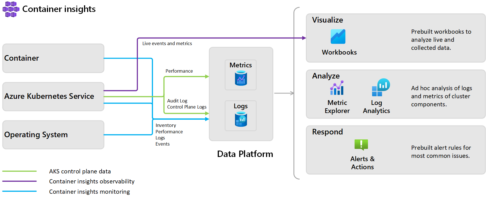
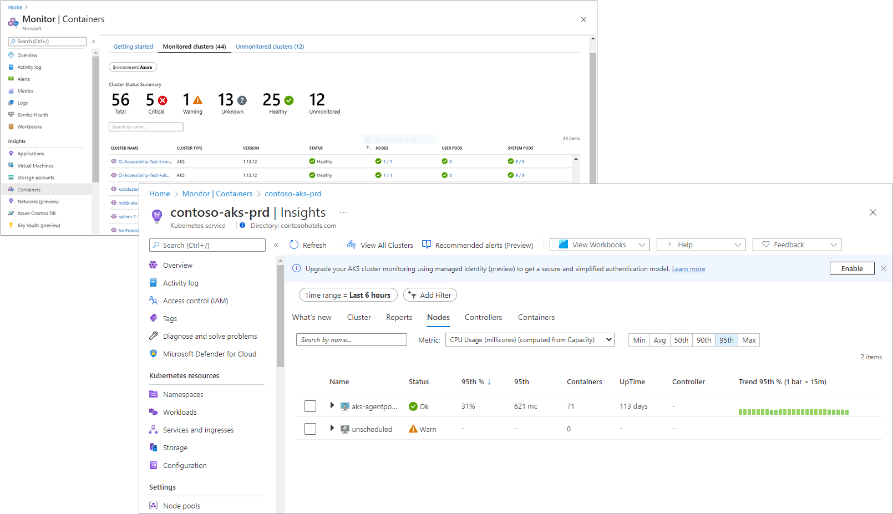

# Container insights overview

Container insights is a feature designed to monitor the performance of container workloads deployed to:

- Managed Kubernetes clusters hosted on [Azure Kubernetes Service (AKS)](../../aks/intro-kubernetes.md)
- Self-managed Kubernetes clusters hosted on Azure using [AKS Engine](https://github.com/Azure/aks-engine)
- [Azure Container Instances](../../container-instances/container-instances-overview.md)
- Self-managed Kubernetes clusters hosted on [Azure Stack](/azure-stack/user/azure-stack-kubernetes-aks-engine-overview) or on-premises
- [Azure Red Hat OpenShift](../../openshift/intro-openshift.md)
- [Azure Arc-enabled Kubernetes](../../azure-arc/kubernetes/overview.md) (preview)

Container insights supports clusters running the Linux and Windows Server 2019 operating system. The container runtimes it supports are Docker, Moby, and any CRI compatible runtime such as CRI-O and ContainerD.

Monitoring your containers is critical, especially when you're running a production cluster, at scale, with multiple applications.

Container insights gives you performance visibility by collecting memory and processor metrics from controllers, nodes, and containers that are available in Kubernetes through the Metrics API. Container logs are also collected.  After you enable monitoring from Kubernetes clusters, metrics and logs are automatically collected for you through a containerized version of the Log Analytics agent for Linux. Metrics are written to the metrics store and log data is written to the logs store associated with your [Log Analytics](../logs/log-query-overview.md) workspace.

## What does Container insights provide?

Container insights delivers a comprehensive monitoring experience using different features of Azure Monitor. These features enable you to understand the performance and health of your Kubernetes cluster running Linux and Windows Server 2019 operating system, and the container workloads. With Container insights you can:

* Identify AKS containers that are running on the node and their average processor and memory utilization. This knowledge can help you identify resource bottlenecks.
* Identify processor and memory utilization of container groups and their containers hosted in Azure Container Instances.
* Identify where the container resides in a controller or a pod. This knowledge can help you view the controller's or pod's overall performance.
* Review the resource utilization of workloads running on the host that are unrelated to the standard processes that support the pod.
* Understand the behavior of the cluster under average and heaviest loads. This knowledge can help you identify capacity needs and determine the maximum load that the cluster can sustain.
* Configure alerts to proactively notify you or record it when CPU and memory utilization on nodes or containers exceed your thresholds, or when a health state change occurs in the cluster at the infrastructure or nodes health rollup.
* Integrate with [Prometheus](https://prometheus.io/docs/introduction/overview/) to view application and workload metrics it collects from nodes and Kubernetes using [queries](container-insights-log-query.md) to create custom alerts, dashboards, and perform detailed analysis.
* Monitor container workloads [deployed to AKS Engine](https://github.com/Azure/aks-engine) on-premises and [AKS Engine on Azure Stack](/azure-stack/user/azure-stack-kubernetes-aks-engine-overview).
* Monitor container workloads [deployed to Azure Red Hat OpenShift](../../openshift/intro-openshift.md).

    >[!NOTE]
    >Support for Azure Red Hat OpenShift is a feature in public preview at this time.
    >

* Monitor container workloads [deployed to Azure Arc-enabled Kubernetes (preview)](../../azure-arc/kubernetes/overview.md).

The main differences in monitoring a Windows Server cluster compared to a Linux cluster are the following:

- Windows doesn't have a Memory RSS metric, and as a result it isn't available for Windows node and containers. The [Working Set](/windows/win32/memory/working-set) metric is available.
- Disk storage capacity information isn't available for Windows nodes.
- Only pod environments are monitored, not Docker environments.
- With the preview release, a maximum of 30 Windows Server containers are supported. This limitation doesn't apply to Linux containers.

Check out the following video providing an intermediate level deep dive to help you learn about monitoring your AKS cluster with Container insights.

> [!VIDEO https://www.youtube.com/embed/XEdwGvS2AwA]

## How do I access this feature?

You can access Container insights two ways, from Azure Monitor or directly from the selected AKS cluster. From Azure Monitor, you have a global perspective of all the containers deployed, which are monitored and which are not, allowing you to search and filter across your subscriptions and resource groups, and then drill into Container insights from the selected container.  Otherwise, you can access the feature directly from a selected AKS container from the AKS page.

If you are interested in monitoring and managing your Docker and Windows container hosts running outside of AKS to view configuration, audit, and resource utilization, see the [Container Monitoring solution](./containers.md).

## Next steps

To begin monitoring your Kubernetes cluster, review [How to enable Container insights](container-insights-onboard.md) to understand the requirements and available methods to enable monitoring.
