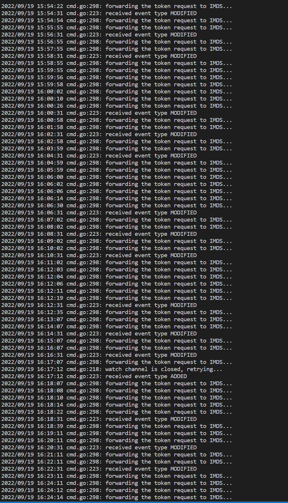
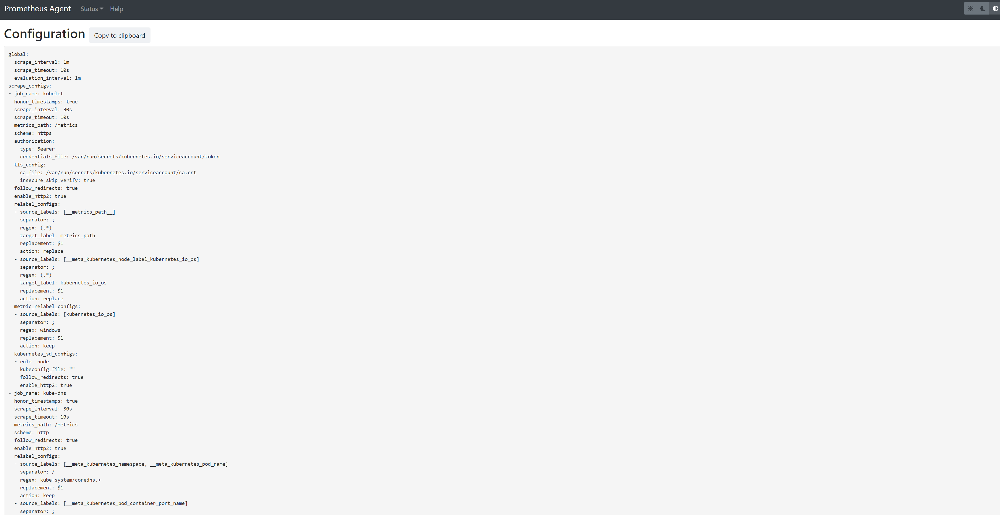
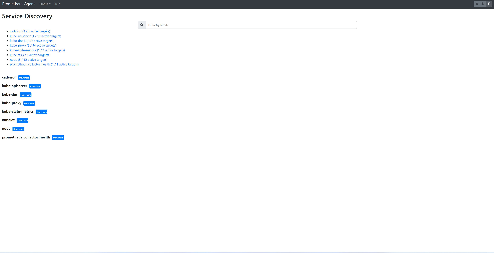
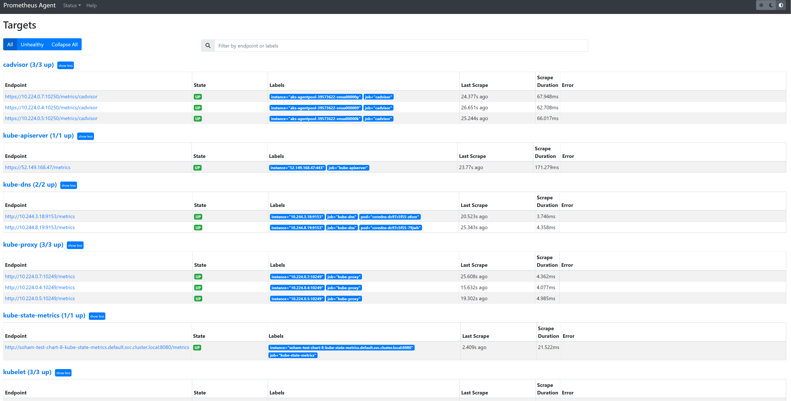
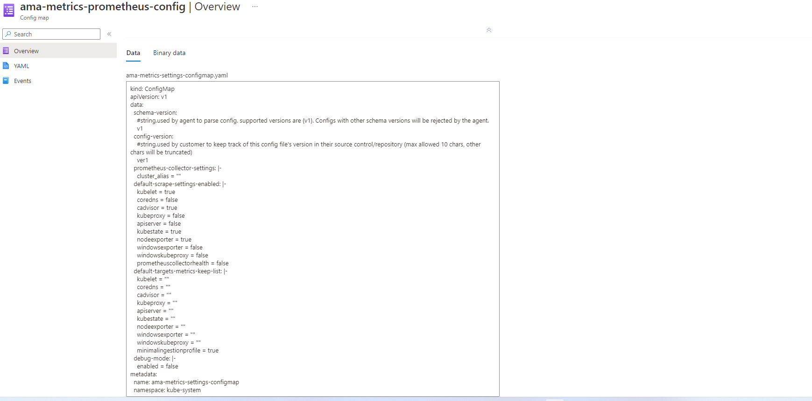
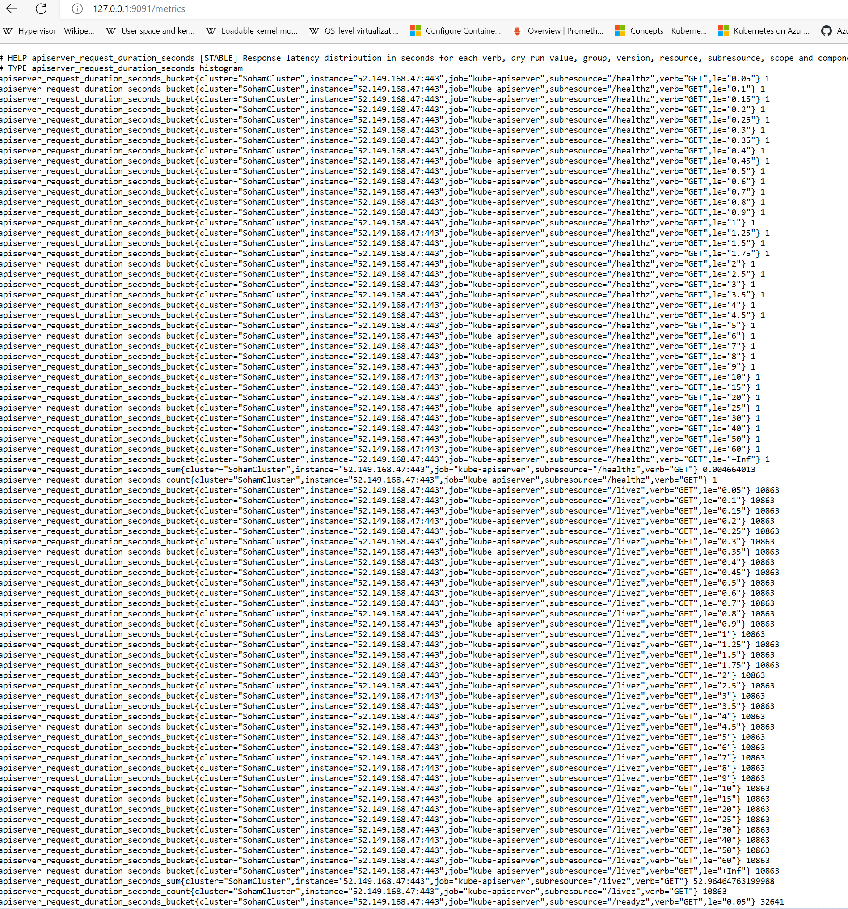

# Troubleshoot collection of Prometheus metrics

## Some or all of my metrics aren't in Grafana

### 1. Pods Status
* Check Azure Monitor Workspace throttling
* Check kubectl get pods -n kube-system | grep ama-metrics and check the status of the pod(s)   
* If pod state is `Running` but has restarts:
  * Run `kubectl describe pod <ama-metrics pod> -n kube-system`
  * If the reason for the restart is `OOMKilled`, the pod cannot keep up with the volume of metrics. The memory limit can be increased using the values in the helm chart for both the replicaset and the daemonset
  * Pod restarts are expected if configmap changes have been made

### 2. Container Logs
* Run `kubectl get logs <ama-metrics pod> -n kube-system`
* Check there are no errors with parsing the Prometheus config, merging with any default scrape targets enabled, and validating the full config
* Check if there are errors from MetricsExtension for authenticating wtih the MDM account
* Check if there are errors from the OpenTelemetry Collector for scraping
* Check `kubectl logs <ama-metrics pod> -n kube-system -c addon-token-adapter`   
* Check `kubectl logs <ama-metrics pod> -n kube-system -c prometheus-collector`   
  * At startup, any initial errors will be printed in red. Warnings will be printed in yellow.
    * To view color, use powershell version >= 7 or a linux distribution
  * Could be an issue getting the auth token
    * Will log every 5 minutes: No configuration present for the AKS resource
    * Will restart pod every 15 minutes to try again with the error: No configuration present for the AKS resource
* Check `kubectl describe pod ama-metrics -n kube-system`
  * Will have reason for restarts
  * If otelcollector is not running, the container may have been OOM-killed. See the scale recommendations for the volume of metrics.

### 3. Prometheus UI
* We can port forward into either the replicaset or the daemonset to check the config, service discovery and targets endpoints as described below.
* Run `kubectl port-forward <ama-metrics pod> -n kube-system 9090`   
* Go to `127.0.0.1:9090/config` in a browser. This will have the full scrape configs. Check that the job is there   
* `127.0.0.1:9090/service-discovery` will have targets discovered by the service discovery object specified and what the relabel_configs have filtered the targets to   
* `127.0.0.1:9090/targets` will have all jobs, the last time the endpoint for that job was scraped, and any errors   
*    Check that all custom configs are correct, the targets have been discovered for the job, and there are no errors scraping specific targets
  * Example: I am missing metrics from a certain pod.
    * Go to /config to check if scrape job is present with correct settings
    * Go to /service-discovery to find the url of the discovered pod
    * Go to /targets to see if there is an issue scraping that url
    * If there is no issue, follow debug-mode instructions and see if metrics expected are there
    * If metrics are not there, it could be an issue with the name length or number of labels. See the limitations below

### 4. Debug Mode
* The addon agent can be configured to run in debug mode by updating the setting 'enabled' to true following from [here](https://github.com/Azure/prometheus-collector/blob/temp/documentation/otelcollector/docs/publicpreviewdocs/rashmi/ama-metrics-settings-readme.md#debug-mode).   
* An extra server is created that hosts all the metrics scraped. Run `kubectl port-forward <ama-metrics pod> -n kube-system 9091` and go to `127.0.0.1:9091/metrics` in a browser to see if the metrics were scraped by the OpenTelemetry Collector. This can be done for both the replicaset and daemonset pods if advanced mode is enabled   
* This mode can affect performance and should only be enabled for a short time for debugging purposes

### 5. Metric names, label names & label values
* We currently enforce the below limits for agent based scraping
  * Label name length - less than or equal to 511 characters. When this limit is exceeded for any time-series in a job, the entire scrape job will be failed and metrics will be dropped from that job before ingestion. You can see up=0 for that job and also target Ux will show the reason for up=0.
  * Label value length  - less than or equal to 1023 characters. When this limit is exceeded for any time-series in a job, the entire scrape job will be failed and metrics will be dropped from that job before ingestion. You can see up=0 for that job and also target Ux will show the reason for up=0.
  * Number of labels per timeseries - less than or equal to 63. When this limit is exceeded for any time-series in a job, the entire scrape job will be failed and metrics will be dropped from that job before ingestion. You can see up=0 for that job and also target Ux will show the reason for up=0.
  * Metric name length - less than or equal to 511 characters. When this limit is exceeded for any time-series in a job, only that particular series will be dropped. MetricextensionConsoleDebugLog will have traces for the dropped metric.

## Next steps

