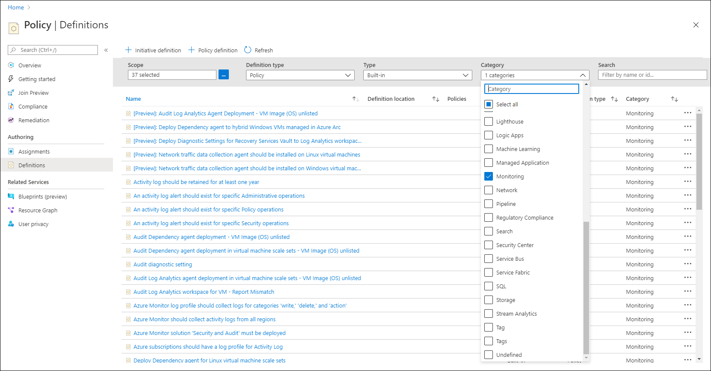

# Deploy Azure Monitor at scale by using Azure Policy
Although some Azure Monitor features are configured once or a limited number of times, others must be repeated for each resource that you want to monitor. This article describes methods for using Azure Policy to implement Azure Monitor at scale. The goal is to ensure that monitoring is consistently and accurately configured for all your Azure resources.

For example, you need to create a diagnostic setting for all your existing Azure resources and for each new resource that you create. You also need to have an agent installed and configured each time you create a virtual machine. You can use methods such as PowerShell or the Azure CLI to perform these actions, because these methods are available for all features of Azure Monitor. But by using Azure Policy, you can have logic in place that will automatically perform the appropriate configuration each time you create or modify a resource.

## Azure Policy
This section provides a brief introduction to [Azure Policy](../governance/policy/overview.md). You can use the Azure Policy service to assess and enforce organizational standards across your entire Azure subscription or management group with minimal effort. For complete details, see the [Azure Policy documentation](../governance/policy/overview.md).

With Azure Policy, you can specify configuration requirements for any resources that are created and take one of these actions:

- Identify resources that are out of compliance.
- Block the resources from being created.
- Add the required configuration. 

Azure Policy works by intercepting calls to create a new resource or to modify an existing resource. It can respond with such effects as denying the request if it doesn't match with the properties expected in a policy definition, flagging it for noncompliance, or deploying a related resource. You can remediate existing resources with a **deployIfNotExists** or **modify** policy definition.

Azure Policy consists of the objects in the following table. For a more detailed explanation of each, see [Azure Policy objects](../governance/policy/overview.md#azure-policy-objects).

| Item | Description |
|:---|:---|
| Policy definition | This object describes resource compliance conditions and the effect to take if a condition is met. It might be all resources of a particular type or only resources that match certain properties. The effect might be to simply flag the resource for compliance or to deploy a related resource. Policy definitions are written in JSON, as described in [Azure Policy definition structure](../governance/policy/concepts/definition-structure.md). Effects are described in [Understand Azure Policy effects](../governance/policy/concepts/effects.md).
| Policy initiative | A group of policy definitions that should be applied together is called an initiative. For example, you might have one policy definition to send resource logs to a Log Analytics workspace and another to send resource logs to an event hub. Create an initiative that includes both policy definitions, and apply the initiative to resources instead of the individual policy definitions. Initiatives are written in JSON, as described in [Azure Policy initiative structure](../governance/policy/concepts/initiative-definition-structure.md). |
| Assignment | A policy definition or initiative doesn't take effect until it's assigned to a scope. For example, assign a policy to a resource group to apply it to all resources created in that resource, or assign it to a subscription to apply it to all resources in that subscription. For more information, see [Azure Policy assignment structure](../governance/policy/concepts/assignment-structure.md). |

## Built-in policy definitions for Azure Monitor
Azure Policy includes several prebuilt definitions related to Azure Monitor. You can assign these policy definitions to your existing subscription or use them as a basis to create your own custom definitions. For a complete list of the built-in policies in the **Monitoring** category, see [Azure Policy built-in definitions for Azure Monitor](.//policy-reference.md).

To view the built-in policy definitions related to monitoring:

1. Go to **Azure Policy** in the Azure portal.
2. Select **Definitions**.
3. For **Type**, select **Built-in**. For **Category**, select **Monitoring**.

## Azure Monitor agent
The [Azure Monitor agent](agents/azure-monitor-agent-overview.md) collects monitoring data from the guest operating system of Azure virtual machines and delivers it to Azure Monitor. The Azure Monitor agent uses [data collection rules](agents/data-collection-rule-overview.md) to configure data to collect from other agents. Data collection rules enable manageability of collection settings at scale while still enabling unique, scoped configurations for subsets of machines.

## VM insights
[VM insights](vm/vminsights-overview.md) is the primary tool in Azure Monitor for monitoring virtual machines. Enabling VM insights installs both the Log Analytics agent and the Dependency agent. Rather than perform these tasks manually, use Azure Policy to have each virtual machine configured as you create it.

> [!NOTE]
> VM insights includes a feature called **VM insights Policy Coverage** that helps you discover and remediate noncompliant VMs in your environment. You can use this feature instead of working directly with Azure Policy for Azure VMs and for hybrid virtual machines connected with Azure Arc. For Azure virtual machine scale sets, you must create the assignment by using Azure Policy. 

### Virtual machines
Instead of creating assignments for these initiatives by using the Azure Policy interface, VM insights includes a feature that allows you to inspect the number of virtual machines in each scope to determine whether the initiative has been applied. You can then configure the workspace and create any required assignments by using that interface.

For details of this process, see [Enable VM insights by using Azure Policy](./vm/vminsights-enable-policy.md).

### Virtual machine scale sets

### Log Analytics agent
You might have scenarios where you want to install the Log Analytics agent but not the Dependency agent. There is no built-in initiative for just the agent, but you can create your own based on the built-in policy definitions provided by VM insights. The following table lists the policies.

> [!NOTE]
> There would be no reason to deploy the Dependency agent on its own, because it requires the Log Analytics agent to deliver its data to Azure Monitor.

|Name |Description |
|-----|------------|
|Audit Log Analytics agent deployment – VM image (OS) unlisted |Report VMs as noncompliant if the VM image (OS) isn't defined in the list and the agent isn't installed. |
|Deploy Log Analytics agent for Linux VMs |Deploy Log Analytics agent for Linux VMs if the VM image (OS) is defined in the list and the agent isn't installed. |
|Deploy Log Analytics agent for Windows VMs |Deploy Log Analytics agent for Windows VMs if the VM image (OS) is defined in the list and the agent isn't installed. |
| [Preview]: Log Analytics agent should be installed on your Linux Azure Arc machines |Report hybrid Azure Arc machines as noncompliant for Linux VMs if the VM image (OS) is defined in the list and the agent isn't installed. |
| [Preview]: Log Analytics agent should be installed on your Windows Azure Arc machines |Report hybrid Azure Arc machines as noncompliant for Windows VMs if the VM image (OS) is defined in the list and the agent isn't installed. |
| [Preview]: Deploy Log Analytics agent to Linux Azure Arc machines |Deploy Log Analytics agent for Linux hybrid Azure Arc machines if the VM image (OS) is defined in the list and the agent isn't installed. |
| [Preview]: Deploy Log Analytics agent to Windows Azure Arc machines |Deploy Log Analytics agent for Windows hybrid Azure Arc machines if the VM image (OS) is defined in the list and the agent isn't installed. |
|Audit Dependency agent deployment in virtual machine scale sets – VM image (OS) unlisted |Report virtual machine scale set as noncompliant if the VM image (OS) isn't defined in the list and the agent isn't installed. |
|Audit Log Analytics agent deployment in virtual machine scale sets – VM image (OS) unlisted |Report virtual machine scale set as noncompliant if the VM image (OS) isn't defined in the list and the agent isn't installed. |
|Deploy Log Analytics agent for Linux virtual machine scale sets |Deploy Log Analytics agent for Linux virtual machine scale sets if the VM Image (OS) is defined in the list and the agent isn't installed. |
|Deploy Log Analytics agent for Windows virtual machine scale sets |Deploy Log Analytics agent for Windows virtual machine scale sets if the VM image (OS) is defined in the list and the agent isn't installed. |

## Next steps

- Read more about [Azure Policy](../governance/policy/overview.md).
- Read more about [diagnostic settings](essentials/diagnostic-settings.md).
