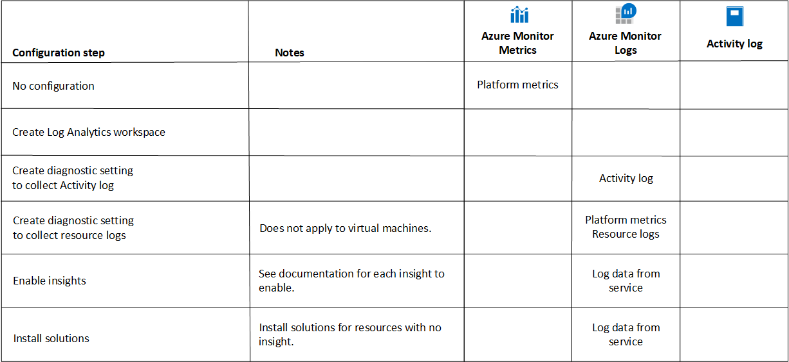
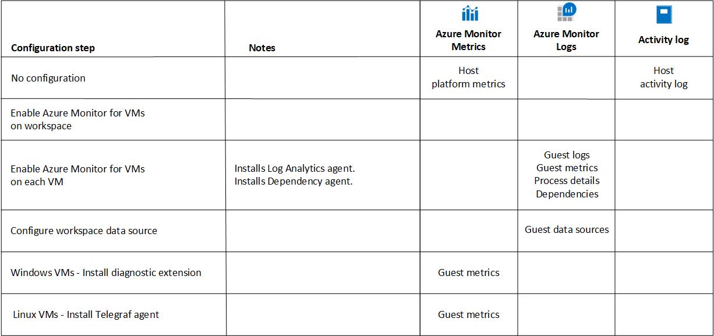

# Deploy Azure Monitor
Enabling Azure Monitor to monitor of all your Azure resources is a combination of configuring Azure Monitor components and configuring Azure resources to generate monitoring data for Azure Monitor to collect. This article describes the different steps required for a complete implementation of Azure Monitor using a common configuration to monitor all of the resources in your Azure subscription. Basic descriptions for each step are provided with links to other documentation for detailed configuration requirements.

> [!IMPORTANT]
> The features of Azure Monitor and their configuration will vary depending on your business requirements balanced with the cost of the enabled features. Each step below will identify whether there is potential cost, and you should assess these costs before proceeding with that step. See [Azure Monitor pricing](https://azure.microsoft.com/pricing/details/monitor/) for complete pricing details.

## Configuration goals
The goal of a complete implementation of Azure Monitor is to collect all available data from all of your cloud resources and applications and enable as many features in Azure Monitor as possible based on that data.

Data collected by Azure Monitor is sent to either [Azure Monitor Metrics](platform/data-platform-metrics.md) or [Azure Monitor Logs](platform/data-platform-logs.md). Each stores different kinds of data and enables different kinds of analysis and alerting. See [Compare Azure Monitor Metrics and Logs](platform/data-platform.md) for a comparison of the two and [Overview of alerts in Microsoft Azure](platform/alerts-overview.md) for a description of different alert types. 

Some data can be sent to both Metrics and Logs in order to leverage it using different features. In these cases, you may need to configure each separately. For example, metric data is automatically sent by Azure resources to Metrics, which supports metrics explorer and metric alerts. You have to create a diagnostic setting for each resource to send that same metric data to Logs, which allows you to analyze performance trends with other log data using Log Analytics. The sections below identify where data is sent and includes each step required to send data to all possible locations.

You may have additional requirements such as monitoring resources outside of Azure and sending data outside of Azure Monitor. Requirements such as these can be achieved with additional configuration of the features described in this article. Follow the links to documentation in each step for additional configuration options.

## Collect data from Azure resources

> [!NOTE]
> See [Monitoring Azure resources with Azure Monitor](insights/monitor-azure-resource.md) for a complete guide on monitoring virtual machines with Azure Monitor.

Some monitoring of Azure resources is available automatically with no configuration required, while you must perform configuration steps to collect additional monitoring data. The following table illustrates the configuration steps required to collect all available data from your Azure resources, including at which step data is sent to Azure Monitor Metrics and Azure Monitor Logs. The sections below describe each step in further detail.

### No configuration
The following features of Azure Monitor are enabled with no configuration required when you create an Azure subscription. There is no cost associated with this monitoring.

[Azure Active Directory logs](../active-directory/reports-monitoring/overview-reports.md) - Provides tenant-level history of sign-in activity and audit trail of changes made in Azure Active Directory. See [Audit activity reports in the Azure Active Directory portal](../active-directory/reports-monitoring/concept-audit-logs.md) and [Sign-in activity reports in the Azure Active Directory portal](../active-directory/reports-monitoring/concept-sign-ins.md) for details of the Azure Active Directory logs and how to view them in the Azure portal.

[Activity log](platform/platform-logs-overview.md) - Provides insight into management group and subscription-level events that have occurred in Azure. Events are automatically written to the Activity log when you create a new Azure resource, modify a resource, or perform a significant activity. You can view events in the Azure portal and create Activity log alerts when particular events are created. See [Azure Activity log](platform/activity-log.md) for details of the Activity log and how to view it in the Azure portal.

[Platform metrics](platform/metrics-supported.md) - Collected automatically from Azure services into [Azure Monitor Metrics](platform/data-platform-metrics.md). This data is often presented on the **Overview** page in the Azure portal for different services. See [Getting started with Azure Metrics Explorer](platform/metrics-getting-started.md) for details on analyzing platform metrics in the Azure portal. 

### Create Log Analytics workspace
You require at least one Log Analytics workspace to enable [Azure Monitor Logs](platform/data-platform-logs.md), which is required for collecting such data as logs from Azure resources, collecting data from the guest operating system of Azure virtual machines, and for most Azure Monitor insights. Other services such as Azure Sentinel and Azure Security Center also use a Log Analytics workspace and can share the same one that you use for Azure Monitor. You can start with a single workspace to support this monitoring, but see  [Designing your Azure Monitor Logs deployment](platform/design-logs-deployment.md) for guidance on when to use multiple workspaces.

There is no cost for creating a Log Analytics workspace, but there is a potential charge once you configure data to be collected into it. See [Manage usage and costs with Azure Monitor Logs](platform/manage-cost-storage.md) for details.  

See [Create a Log Analytics workspace in the Azure portal](learn/quick-create-workspace.md) to create an initial Log Analytics workspace. See [Manage access to log data and workspaces in Azure Monitor](platform/manage-access.md) to configure access. 

### Create diagnostic setting to collect tenant and subscription logs
While the [Azure Active Directory logs](../active-directory/reports-monitoring/overview-reports.md) for your tenant and the [Activity log](platform/platform-logs-overview.md) for your subscription are collected automatically, sending them to a Log Analytics workspace enables you to analyze these events with other log data using log queries in Log Analytics. This also allows you to create log query alerts which is the only way to alert on Azure Active Directory logs and provide more complex logic than Activity log alerts.

There's no cost for sending the Activity log to a workspace, but there is a data ingestion and retention charge for Azure Active Directory logs. 

See [Integrate Azure AD logs with Azure Monitor logs](../active-directory/reports-monitoring/howto-integrate-activity-logs-with-log-analytics.md) and [Create diagnostic settings to send platform logs and metrics to different destinations](platform/diagnostic-settings.md) to create a diagnostic setting for your tenant and subscription to send log entries to your Log Analytics workspace. 

### Create diagnostic setting to collect resource logs and platform metrics
Resources in Azure automatically generate [resource logs](platform/platform-logs-overview.md) that provide details of operations performed within the resource. Unlike platform metrics though, you need to configure resource logs to be collected. Create a diagnostic setting to send them to a Log Analytics workspace to combine them with the other data used with Azure Monitor Logs. The same diagnostic setting can be used to also send the platform metrics for most resources to the same workspace, which allows you to analyze metric data using log queries with other collected data.

There is a cost for this collection so refer to [Azure Monitor pricing](https://azure.microsoft.com/pricing/details/monitor/) before implementing across a significant number of resources. Also see [Manage usage and costs with Azure Monitor Logs](platform/manage-cost-storage.md) for details on optimizing the cost of your log collection.

See [Create diagnostic setting to collect resource logs and metrics in Azure](platform/diagnostic-settings.md#create-in-azure-portal) to create a diagnostic setting for an Azure resource. Since a diagnostic setting needs to be created for each Azure resource, see [Deploy Azure Monitor at scale](deploy-scale.md) for details on using [Azure policy](../governance/policy/overview.md) to have settings automatically created each time an Azure resource is created.

### Enable insights and solutions
Insights and solutions provide specialized monitoring for a particular service or solution. Insights use more recent features of Azure Monitor such as workbooks, so you should use an insight if it's available for your service. They are automatically available in every Azure subscription but may require some configuration for full functionality. They will typically use platform metrics and resources logs that you previously configured and could collect additional data.

Solutions must be added to each subscription and work exclusively with data from Azure Monitor Logs and may collect additional log data.

There is no cost for solutions or insights, but you may be charged for any data they collect.

See [What is monitored by Azure Monitor?](monitor-reference.md) for a list of available insights and solutions in Azure Monitor. See the documentation for each for any unique configuration or pricing information. 

## Collect data from virtual machines

> [!NOTE]
> See [Monitoring Azure virtual machines with Azure Monitor](insights/monitor-vm-azure.md) for a complete guide on monitoring virtual machines with Azure Monitor. 

Virtual machines generate similar data as other Azure resources, but you need an agent to collect data from the guest operating system. See [Overview of Azure Monitor agents](platform/agents-overview.md) for a comparison of the agents used by Azure Monitor. 

[Azure Monitor for VMs](insights/vminsights-overview.md) uses the Log Analytics agent and Dependency agent to collect data from the guest operating system of virtual machines, so you can deploy these agents as part of the implementation of this insight. This enables the Log Analytics agent for other services that use it such as Azure Security Center.

### Configure workspace for Azure Monitor for VMs
Azure Monitor for VMs requires a Log Analytics workspace which will typically be the same as the one created to collect data from other Azure resources. Before you enable any virtual machines, you must add the solution required for Azure Monitor for VMs to the workspace.

See [Configure Log Analytics workspace for Azure Monitor for VMs](insights/vminsights-configure-workspace.md) for details on configuring your Log Analytics workspace for Azure Monitor for VMs.

### Enable Azure Monitor for VMs on each virtual machine
Once a workspace has been configured, you can enable each virtual machine by installing the Log Analytics agent and Dependency agent. There are multiple methods for installing these agents including Azure Policy which allows you automatically configure each virtual machine as it's created. Performance data and process details collected by Azure Monitor for VMs is stored in Azure Monitor Logs.

See [Enable Azure Monitor for VMs overview](insights/vminsights-enable-overview.md) for options to deploy the agents to your virtual machines and enable them for monitoring.

### Configure workspace to collect events
Azure Monitor for VMs will collect performance data and the details and dependencies of processes from the guest operating system of each virtual machine. The Log Analytics agent can also collect logs from the guest including the event log from Windows and syslog from Linux. It retrieves the configuration for these logs from the Log Analytics workspace it's connected to. You only need to configure the workspace once, and each time an agent connects, it will download any configuration changes. 

See [Agent data sources in Azure Monitor](platform/agent-data-sources.md) for details on configuring your Log Analytics workspace to collect additional data from your agent virtual machines.

> [!NOTE]
> You can also configure the workspace to collect performance counters, but this will most likely be redundant with performance data collected by Azure Monitor for VMs. Performance data collected by the workspace will be stored in the *Perf* table, while performance data collected by Azure Monitor for VMs is stored in the *InsightsMetrics* table. Configure performance collection in the workspace only if you require counters that aren't already collected by Azure Monitor for VMs.

### Diagnostic extension and Telegraf agent
Azure Monitor for VMs uses the Log Analytics agent which sends performance data to a Log Analytics workspace but not to Azure Monitor Metrics. Sending this data to Metrics allows it to be analyzed with Metrics Explorer and used with metric alerts. This requires the diagnostic extension on Windows and the Telegraf agent on Linux.

See [Install and configure Windows Azure diagnostics extension (WAD)](platform/diagnostics-extension-windows-install.md) and [Collect custom metrics for a Linux VM with the InfluxData Telegraf agent](platform/collect-custom-metrics-linux-telegraf.md) for details on installing and configuring these agents.

## Monitor applications
Azure Monitor monitors your custom applications using [Application Insights](app/app-insights-overview.md), which you must configure for each application you want to monitor. The configuration process will vary depending on the type of application being monitored and the type of monitoring that you want to perform. Data collected by Application Insights is stored in Azure Monitor Metrics, Azure Monitor Logs, and Azure blob storage, depending on the feature. Performance data is stored in both Azure Monitor Metrics and Azure Monitor Logs with no additional configuration required.

### Create an application resource
You must create a resource in Application Insights for each application that you're going to monitor. Log data collected by Application Insights is stored in Azure Monitor Logs for a workspace-based application. Log data for classic applications is stored separate from your Log Analytics workspace as described in [Structure of data](platform/data-platform-logs.md#structure-of-data).

 When you create the application, you must select whether to use classic or workspace-based. See [Create an Application Insights resource](app/create-new-resource.md) to create a classic application. 
See [Workspace-based Application Insights resources (preview)](app/create-workspace-resource.md) to create a workspace-based application.

### Configure codeless or code-based monitoring
To enable monitoring for an application, you must decide whether you will use codeless or code-based monitoring. The configuration process will vary depending on this decision and the type of application you're going to monitor.

**Codeless monitoring** is easiest to implement and can be configured after your code development. It doesn't require any updates to your code. See the following resources for details on enabling monitoring depending on the your application.

- [Applications hosted on Azure Web Apps](app/azure-web-apps.md)
- [Java applications](app/java-in-process-agent.md)
- [ASP.NET applications hosted in IIS on Azure VM or Azure virtual machine scale set](app/azure-vm-vmss-apps.md)
- [ASP.NET applications hosted in IIS on-premises VM](app/monitor-performance-live-website-now.md)

**Code-based monitoring** is more customizable and collects additional telemetry, but it requires adding a dependency to your code on the Application Insights SDK NuGet packages. See the following resources for details on enabling monitoring depending on your application.

- [ASP.NET Applications](app/asp-net.md)
- [ASP.NET Core Applications](app/asp-net-core.md)
- [.NET Console Applications](app/console.md)
- [Java](app/java-get-started.md)
- [Node.js](app/nodejs.md)
- [Python](app/opencensus-python.md)
- [Other platforms](app/platforms.md)

### Configure availability testing
Availability tests in Application Insights are recurring tests that monitor the availability and responsiveness of your application at regular intervals from points around the world. You can create a simple ping test for free or create a sequence of web requests to simulate user transactions which has associated cost. 

See [Monitor the availability of any website](app/monitor-web-app-availability.md) for summary of the different kinds of test and details on creating them.

### Configure Profiler
Profiler in Application Insights provides performance traces for .NET applications. It helps you identify the "hot" code path that takes the longest time when it's handling a particular web request. The process for configuring the profiler varies depending on the type of application. 

See [Profile production applications in Azure with Application Insights](app/profiler-overview.md) for details on configuring Profiler.

### Configure Snapshot Debugger
Snapshot Debugger in Application Insights monitors exception telemetry from your .NET application and collects snapshots on your top-throwing exceptions so that you have the information you need to diagnose issues in production. The process for configuring Snapshot Debugger varies depending on the type of application. 

See [Debug snapshots on exceptions in .NET apps](app/snapshot-debugger.md) for details on configuring Snapshot Debugger.

## Visualize data
Insights and solutions will include their own workbooks and views for analyzing their data. In addition to these, you can create your own [visualizations](visualizations.md) including workbooks for Azure Monitor data and dashboards to combine Azure Monitor data with data from other services in Azure.

### Create workbooks
[Workbooks](platform/workbooks-overview.md) in Azure Monitor allow you to create rich visual reports in the Azure portal. You can combine different sets of data from Azure Monitor Metrics and Azure Monitor Logs to create unified interactive experiences. You can access a gallery of workbooks in the **Workbooks** tab of the Azure Monitor menu. 

See [Azure Monitor Workbooks](platform/workbooks-overview.md) for details on creating custom workbooks.

### Create dashboards
[Azure dashboards](../azure-portal/azure-portal-dashboards.md) are the primary dashboarding technology for Azure and allow you to combine Azure Monitor data with data from other services to provide a single pane of glass over your Azure infrastructure. See [Create and share dashboards of Log Analytics data](learn/tutorial-logs-dashboards.md) for details on creating a dashboard that includes data from Azure Monitor Logs. 

See [Create custom KPI dashboards using Azure Application Insights](learn/tutorial-app-dashboards.md) for details on creating a dashboard that includes data from Application Insights. 

## Alerts
Alerts in Azure Monitor proactively notify you of important data or patterns identified in your monitoring data. Some insights will generate alerts without configuration. For other scenarios, you need to create [alert rules](platform/alerts-overview.md) that include the data to analyze and the criteria for when to generate an alert, and action groups which define the action to take when an alert is generated. 

### Create action groups
[Action groups](platform/action-groups.md) are a collection of notification preferences used by alert rules to determine the action to perform when an alert is triggered. Examples of actions include sending a mail or text, calling a webhook, or send data to an ITSM tool. Each alert rule requires at least one action group, and a single action group can be used by multiple alert rules.

See [Create and manage action groups in the Azure portal](platform/action-groups.md) for details on creating an action group and a description of the different actions it can include.

### Create alert rules
There are multiple types of alert rules defined by the type of data that they use. Each has different capabilities, and a different cost. The basic strategy you should follow is to use the alert rule type with the lowest cost that provides the logic that you require.

- [Activity log rules](platform/activity-log-alerts.md). Creates an alert in response to a new Activity log event that matches specified conditions. There is no cost to these alerts so they should be your first choice. See [Create, view, and manage activity log alerts by using Azure Monitor](platform/alerts-activity-log.md) for details on creating an Activity log alert.
- [Metric alert rules](platform/alerts-metric-overview.md). Creates an alert in response to one or more metric values exceeding a threshold. Metric alerts are stateful meaning that the alert will automatically close when the value drops below the threshold, and it will only send out notifications when the state changes. There is a cost to metric alerts, but this is significantly less than log alerts. See [Create, view, and manage metric alerts using Azure Monitor](platform/alerts-metric.md) for details on creating a metric alert.
- [Log alert rules](platform/alerts-unified-log.md). Creates an alert when the results of a schedule query matches specified criteria. They are the most expensive of the alert rules, but they allow the most complex criteria. See [Create, view, and manage log alerts using Azure Monitor](platform/alerts-log.md) for details on creating a log query alert.
- [Application alerts](app/monitor-web-app-availability.md) allow you to perform proactive performance and availability testing of your web application. You can perform a simple ping test at no cost, but there is a cost to more complex testing. See [Monitor the availability of any website](app/monitor-web-app-availability.md) for a description of the different tests and details on creating them.

## Next steps

- See [Deploy Azure Monitor at scale using Azure Policy](deploy-scale.md).