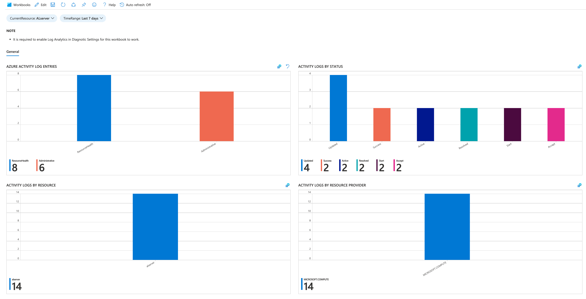
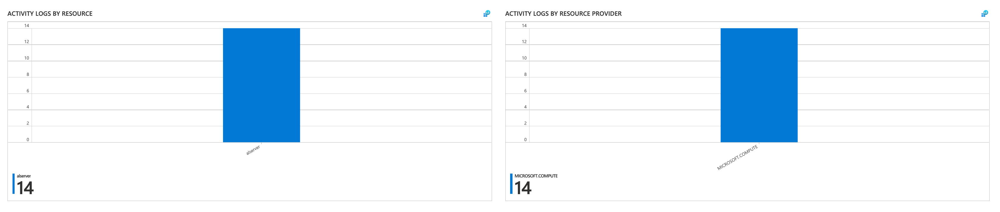

# Azure Activity log insights (Preview)

In an Azure subscription, a lot of activity can occur. Administrators can delete, update or create resources. Moreover, several users in a single subscription can do these tasks if they have the right permissions. To trace activities, Activity logs are attached to each resource and resource group in Azure. 

 All information is centralized and you can review quickly who has made the most change and the status of change (failed, succeeded, etc.)

 To view the data use the Activity Logs Insights workbook.

## General information
Activity log data in a Log Analytics workspace is stored in a table called AzureActivity that you can retrieve with a log query in Log Analytics. 
* Use the Azure activities by Category Value to view a count of Activity log records for each category.
 

* Use the Azure activities by Category status to view a count of Activity log records by each status.

* If you are on a scale level - a subscription or a resource group, use the Azure activities by Resource and by resource provider to view a count of Activity log records for each selected resource and provider.

## Next steps
* [Read an overview of platform logs](./platform-logs-overview.md)
* [Review Activity log event schema](activity-log-schema.md)
* [Create diagnostic setting to send Activity logs to other destinations](./diagnostic-settings.md)