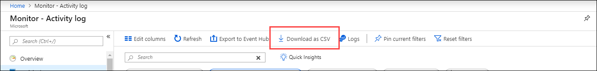
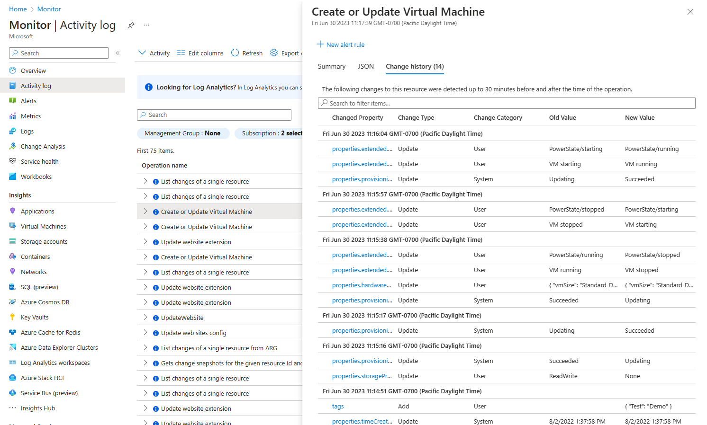
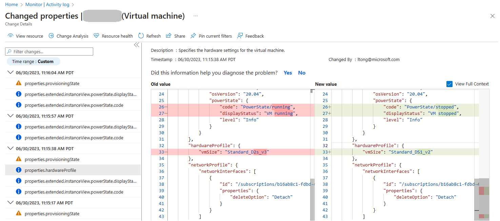
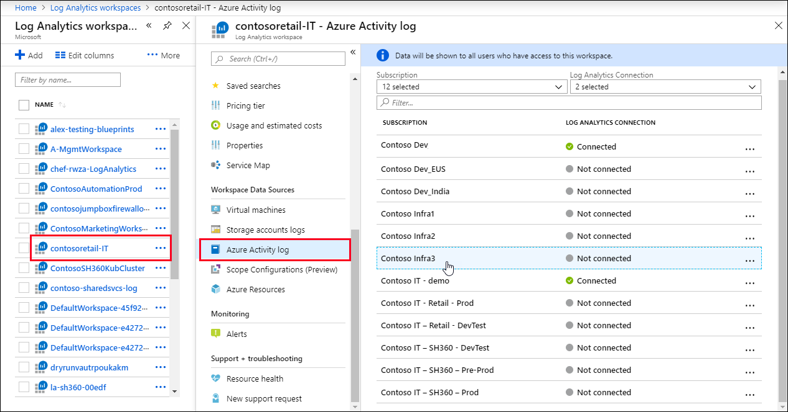
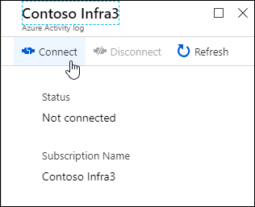

# Azure Activity log
The Activity log is a [platform log](./platform-logs-overview.md) in Azure that provides insight into subscription-level events. Activity log includes such information as when a resource is modified or when a virtual machine is started. You can view the Activity log in the Azure portal or retrieve entries with PowerShell and CLI.   This article provides details on viewing the Activity log and sending it to different destinations.

For more functionality, you should create a diagnostic setting to send the Activity log to one or more of these locations for the following reasons: 
-	to [Azure Monitor Logs](../logs/data-platform-logs.md) for more complex querying and alerting, and longer retention (up to two years) 
-	to Azure Event Hubs to forward outside of Azure
-	to Azure Storage for cheaper, long-term archiving

See [Create diagnostic settings to send platform logs and metrics to different destinations](./diagnostic-settings.md) for details on creating a diagnostic setting.

> [!NOTE]
> Entries in the Activity Log are system generated and cannot be changed or deleted.

## Retention Period 

Activity log events are retained in Azure for **90 days** and then deleted. There's no charge for entries during this time regardless of volume. For more functionality such as longer retention, you should create a diagnostic setting and route the entires to another location based on your needs. See the criteria in the earlier section of this article. 

## View the Activity log
You can access the Activity log from most menus in the Azure portal. The menu that you open it from determines its initial filter. If you open it from the **Monitor** menu, then the only filter will be on the subscription. If you open it from a resource's menu, then the filter is set to that resource. You can always change the filter though to view all other entries. Select **Add Filter** to add more properties to the filter.


For a description of Activity log categories see [Azure Activity Log event schema](activity-log-schema.md#categories).

## Download the Activity log
Select **Download as CSV** to download the events in the current view.



### View change history

For some events, you can view the Change history, which shows what changes happened during that event time. Select an event from the Activity Log you want to look deeper into. Select the **Change history (Preview)** tab to view any associated changes with that event.



If there are any associated changes with the event, you'll see a list of changes that you can select. This opens up the **Change history (Preview)** page. On this page, you see the changes to the resource. In the following example, you can see not only that the VM changed sizes, but what the previous VM size was before the change and what it was changed to. To learn more about change history, see [Get resource changes](../../governance/resource-graph/how-to/get-resource-changes.md).




### Other methods to retrieve Activity log events
You can also access Activity log events using the following methods:

- Use the [Get-AzLog](/powershell/module/az.monitor/get-azlog) cmdlet to retrieve the Activity Log from PowerShell. See [Azure Monitor PowerShell samples](../powershell-samples.md#retrieve-activity-log).
- Use [az monitor activity-log](/cli/azure/monitor/activity-log) to retrieve the Activity Log from CLI.  See [Azure Monitor CLI samples](../cli-samples.md#view-activity-log).
- Use the [Azure Monitor REST API](/rest/api/monitor/) to retrieve the Activity Log from a REST client. 


## Send to Log Analytics workspace
 Send the Activity log to a Log Analytics workspace to enable the features of [Azure Monitor Logs](../logs/data-platform-logs.md) which includes the following:

- Correlate Activity log data with other monitoring data collected by Azure Monitor.
- Consolidate log entries from multiple Azure subscriptions and tenants into one location for analysis together.
- Use log queries to perform complex analysis and gain deep insights on Activity Log entries.
- Use log alerts with Activity entries allowing for more complex alerting logic.
- Store Activity log entries for longer than the Activity Log retention period.
- No data ingestion charges for Activity log data stored in a Log Analytics workspace.
- No data retention charges for the first 90 days for Activity log data stored in a Log Analytics workspace.

 Select **Export Activity Logs**.

   

to send the Activity log to a Log Analytics workspace. You can send the Activity log from any single subscription to up to five workspaces. 

Activity log data in a Log Analytics workspace is stored in a table called *AzureActivity* that you can retrieve with a [log query](../logs/log-query-overview.md) in [Log Analytics](../logs/log-analytics-tutorial.md). The structure of this table varies depending on the [category of the log entry](activity-log-schema.md). For a description of the table properties, see the [Azure Monitor data reference](/azure/azure-monitor/reference/tables/azureactivity).

For example, to view a count of Activity log records for each category, use the following query:

```kusto
AzureActivity
| summarize count() by CategoryValue
```

To retrieve all records in the administrative category, use the following query:

```kusto
AzureActivity
| where CategoryValue == "Administrative"
```


## Send to Azure Event Hubs
Send the Activity Log to Azure Event Hubs to send entries outside of Azure, for example to a third-party SIEM or other log analytics solutions. Activity log events from Event Hubs are consumed in JSON format with a `records` element containing the records in each payload. The schema depends on the category and is described in [Schema from Storage Account and Event Hubs](activity-log-schema.md).

Following is sample output data from Event Hubs for an Activity log:

``` JSON
{
    "records": [
        {
            "time": "2019-01-21T22:14:26.9792776Z",
            "resourceId": "/subscriptions/s1/resourceGroups/MSSupportGroup/providers/microsoft.support/supporttickets/115012112305841",
            "operationName": "microsoft.support/supporttickets/write",
            "category": "Write",
            "resultType": "Success",
            "resultSignature": "Succeeded.Created",
            "durationMs": 2826,
            "callerIpAddress": "111.111.111.11",
            "correlationId": "c776f9f4-36e5-4e0e-809b-c9b3c3fb62a8",
            "identity": {
                "authorization": {
                    "scope": "/subscriptions/s1/resourceGroups/MSSupportGroup/providers/microsoft.support/supporttickets/115012112305841",
                    "action": "microsoft.support/supporttickets/write",
                    "evidence": {
                        "role": "Subscription Admin"
                    }
                },
                "claims": {
                    "aud": "https://management.core.windows.net/",
                    "iss": "https://sts.windows.net/72f988bf-86f1-41af-91ab-2d7cd011db47/",
                    "iat": "1421876371",
                    "nbf": "1421876371",
                    "exp": "1421880271",
                    "ver": "1.0",
                    "http://schemas.microsoft.com/identity/claims/tenantid": "00000000-0000-0000-0000-000000000000",
                    "http://schemas.microsoft.com/claims/authnmethodsreferences": "pwd",
                    "http://schemas.microsoft.com/identity/claims/objectidentifier": "2468adf0-8211-44e3-95xq-85137af64708",
                    "http://schemas.xmlsoap.org/ws/2005/05/identity/claims/upn": "admin@contoso.com",
                    "puid": "20030000801A118C",
                    "http://schemas.xmlsoap.org/ws/2005/05/identity/claims/nameidentifier": "9vckmEGF7zDKk1YzIY8k0t1_EAPaXoeHyPRn6f413zM",
                    "http://schemas.xmlsoap.org/ws/2005/05/identity/claims/givenname": "John",
                    "http://schemas.xmlsoap.org/ws/2005/05/identity/claims/surname": "Smith",
                    "name": "John Smith",
                    "groups": "cacfe77c-e058-4712-83qw-f9b08849fd60,7f71d11d-4c41-4b23-99d2-d32ce7aa621c,31522864-0578-4ea0-9gdc-e66cc564d18c",
                    "http://schemas.xmlsoap.org/ws/2005/05/identity/claims/name": " admin@contoso.com",
                    "appid": "c44b4083-3bq0-49c1-b47d-974e53cbdf3c",
                    "appidacr": "2",
                    "http://schemas.microsoft.com/identity/claims/scope": "user_impersonation",
                    "http://schemas.microsoft.com/claims/authnclassreference": "1"
                }
            },
            "level": "Information",
            "location": "global",
            "properties": {
                "statusCode": "Created",
                "serviceRequestId": "50d5cddb-8ca0-47ad-9b80-6cde2207f97c"
            }
        }
    ]
}
```

## Send to Azure storage
Send the Activity Log to an Azure Storage Account if you want to retain your log data longer than 90 days for audit, static analysis, or backup. If you only must retain your events for 90 days or less you don't need to set up archival to a Storage Account, since Activity Log events are retained in the Azure platform for 90 days.

When you send the Activity log to Azure, a storage container is created in the Storage Account as soon as an event occurs. The blobs in the container use the following naming convention:

```
insights-activity-logs/resourceId=/SUBSCRIPTIONS/{subscription ID}/y={four-digit numeric year}/m={two-digit numeric month}/d={two-digit numeric day}/h={two-digit 24-hour clock hour}/m=00/PT1H.json
```

For example, a particular blob might have a name similar to the following:

```
insights-logs-networksecuritygrouprulecounter/resourceId=/SUBSCRIPTIONS/00000000-0000-0000-0000-000000000000/y=2020/m=06/d=08/h=18/m=00/PT1H.json
```

Each PT1H.json blob contains a JSON blob of events that occurred within the hour specified in the blob URL (for example, h=12). During the present hour, events are appended to the PT1H.json file as they occur. The minute value (m=00) is always 00, since resource log events are broken into individual blobs per hour.

Each event is stored in the PT1H.json file with the following format that uses a common top-level schema but is otherwise unique for each category as described in  [Activity log schema](activity-log-schema.md).

``` JSON
{ "time": "2020-06-12T13:07:46.766Z", "resourceId": "/SUBSCRIPTIONS/00000000-0000-0000-0000-000000000000/RESOURCEGROUPS/MY-RESOURCE-GROUP/PROVIDERS/MICROSOFT.COMPUTE/VIRTUALMACHINES/MV-VM-01", "correlationId": "0f0cb6b4-804b-4129-b893-70aeeb63997e", "operationName": "Microsoft.Resourcehealth/healthevent/Updated/action", "level": "Information", "resultType": "Updated", "category": "ResourceHealth", "properties": {"eventCategory":"ResourceHealth","eventProperties":{"title":"This virtual machine is starting as requested by an authorized user or process. It will be online shortly.","details":"VirtualMachineStartInitiatedByControlPlane","currentHealthStatus":"Unknown","previousHealthStatus":"Unknown","type":"Downtime","cause":"UserInitiated"}}}
```


## Legacy collection methods
This section describes legacy methods for collecting the Activity log that were used prior to diagnostic settings. If you're using these methods, you should consider transitioning to diagnostic settings that provide better functionality and consistency with resource logs.

### Log profiles
Log profiles are the legacy method for sending the Activity log to Azure storage or Event Hubs. Use the following procedure to continue working with a log profile or to disable it in preparation for migrating to a diagnostic setting.

1. From the **Azure Monitor** menu in the Azure portal, select **Activity log**.
3. Select **Export Activity Logs**.

   

4. Select the purple banner for the legacy experience.

    


### Configure log profile using PowerShell

If a log profile already exists, you first must remove the existing log profile and then create new one.

1. Use `Get-AzLogProfile` to identify if a log profile exists.  If a log profile does exist, note the *name* property.

1. Use `Remove-AzLogProfile` to remove the log profile using the value from the *name* property.

    ```powershell
    # For example, if the log profile name is 'default'
    Remove-AzLogProfile -Name "default"
    ```

3. Use `Add-AzLogProfile` to create a new log profile:

    ```powershell
    Add-AzLogProfile -Name my_log_profile -StorageAccountId /subscriptions/s1/resourceGroups/myrg1/providers/Microsoft.Storage/storageAccounts/my_storage -serviceBusRuleId /subscriptions/s1/resourceGroups/Default-ServiceBus-EastUS/providers/Microsoft.ServiceBus/namespaces/mytestSB/authorizationrules/RootManageSharedAccessKey -Location global,westus,eastus -RetentionInDays 90 -Category Write,Delete,Action
    ```

    | Property | Required | Description |
    | --- | --- | --- |
    | Name |Yes |Name of your log profile. |
    | StorageAccountId |No |Resource ID of the Storage Account where the Activity Log should be saved. |
    | serviceBusRuleId |No |Service Bus Rule ID for the Service Bus namespace you would like to have Event Hubs created in. This is a string with the format: `{service bus resource ID}/authorizationrules/{key name}`. |
    | Location |Yes |Comma-separated list of regions for which you would like to collect Activity Log events. |
    | RetentionInDays |Yes |Number of days for which events should be retained in the Storage Account, from 1 through 365. A value of zero stores the logs indefinitely. |
    | Category |No |Comma-separated list of event categories that should be collected. Possible values are _Write_, _Delete_, and _Action_. |

### Example script
Following is a sample PowerShell script to create a log profile that writes the Activity Log to both a Storage Account and an Event Hub.

   ```powershell
   # Settings needed for the new log profile
   $logProfileName = "default"
   $locations = (Get-AzLocation).Location
   $locations += "global"
   $subscriptionId = "<your Azure subscription Id>"
   $resourceGroupName = "<resource group name your Event Hub belongs to>"
   $eventHubNamespace = "<Event Hub namespace>"

   # Build the service bus rule Id from the settings above
   $serviceBusRuleId = "/subscriptions/$subscriptionId/resourceGroups/$resourceGroupName/providers/Microsoft.EventHub/namespaces/$eventHubNamespace/authorizationrules/RootManageSharedAccessKey"

   # Build the Storage Account Id from the settings above
   $storageAccountId = "/subscriptions/$subscriptionId/resourceGroups/$resourceGroupName/providers/Microsoft.Storage/storageAccounts/$storageAccountName"

   Add-AzLogProfile -Name $logProfileName -Location $locations -StorageAccountId  $storageAccountId -ServiceBusRuleId $serviceBusRuleId
   ```


### Configure log profile using Azure CLI

If a log profile already exists, you first must remove the existing log profile and then create a log profile.

1. Use `az monitor log-profiles list` to identify if a log profile exists.
2. Use `az monitor log-profiles delete --name "<log profile name>` to remove the log profile using the value from the *name* property.
3. Use `az monitor log-profiles create` to create a log profile:

   ```azurecli-interactive
   az monitor log-profiles create --name "default" --location null --locations "global" "eastus" "westus" --categories "Delete" "Write" "Action"  --enabled false --days 0 --service-bus-rule-id "/subscriptions/<YOUR SUBSCRIPTION ID>/resourceGroups/<RESOURCE GROUP NAME>/providers/Microsoft.EventHub/namespaces/<Event Hub NAME SPACE>/authorizationrules/RootManageSharedAccessKey"
   ```
    | Property | Required | Description |
    | --- | --- | --- |
    | name |Yes |Name of your log profile. |
    | storage-account-id |Yes |Resource ID of the Storage Account to which Activity Logs should be saved. |
    | locations |Yes |Space-separated list of regions for which you would like to collect Activity Log events. You can view a list of all regions for your subscription using `az account list-locations --query [].name`. |
    | days |Yes |Number of days for which events should be retained, from 1 through 365. A value of zero will store the logs indefinitely (forever).  If zero, then the enabled parameter should be set to false. |
    |enabled | Yes |True or False.  Used to enable or disable the retention policy.  If True, then the days parameter must be a value greater than 0.
    | categories |Yes |Space-separated list of event categories that should be collected. Possible values are Write, Delete, and Action. |


### Log Analytics workspace
The legacy method for sending the Activity log into a Log Analytics workspace is connecting the sign in the workspace configuration. 

1. From the **Log Analytics workspaces** menu in the Azure portal, select the workspace to collect the Activity Log.
1. In the **Workspace Data Sources** section of the workspace's menu, select **Azure Activity log**.
1. Select the subscription that you want to connect.

    

2. Select **Connect** to connect the Activity sign in the subscription to the selected workspace. If the subscription is already connected to another workspace, select **Disconnect** first to disconnect it.

    


To disable the setting, perform the same procedure and select **Disconnect** to remove the subscription from the workspace.

### Data structure changes
The Export activity logs experience, sends the same data as the legacy method used to send the Activity log with some changes to the structure of the *AzureActivity* table.

The columns in the following table have been deprecated in the updated schema. They still exist in *AzureActivity* but they have no data. The replacements for these columns aren't new, but they contain the same data as the deprecated column. They are in a different format, so you might need to modify log queries that use them. 

|Activity Log JSON | 	Log Analytics column name<br/>*(older deprecated)*	| New Log Analytics column name |	Notes |
|:---------|:---------|:---------|:---------|
|category |	Category | CategoryValue ||
|status<br/><br/>*values are (success, start, accept, failure)*	|ActivityStatus <br/><br/>*values same as JSON*	|ActivityStatusValue<br/><br/>*values change to (succeeded, started, accepted, failed)*	|The valid values change as shown| 
|subStatus	|ActivitySubstatus	|ActivitySubstatusValue||
|operationName	| OperationName | 	OperationNameValue |REST API localizes operation name value. Log Analytics UI always shows English.  |
|resourceProviderName	| ResourceProvider 	| ResourceProviderValue	||

> [!Important]
> In some cases, the values in these columns may be in all uppercase. If you have a query that includes these columns, you should use the [=~ operator](/azure/kusto/query/datatypes-string-operators) to do a case insensitive comparison.

The following columns have been added to *AzureActivity* in the updated schema:

- Authorization_d
- Claims_d
- Properties_d

## Activity log insights

Activity log insights let you view information about changes to resources and resource groups in a subscription. The dashboards also present data about which users or services performed activities in the subscription and the activities' status. This article explains how to view Activity log insights in the Azure portal.

Before using Activity log insights, you'll have to [enable sending logs to your Log Analytics workspace](./diagnostic-settings.md).

### How does Activity log insights work?

Activity logs you send to a [Log Analytics workspace](/articles/azure-monitor/logs/log-analytics-workspace-overview.md) are stored in a table called AzureActivity. 

Activity log insights are a curated [Log Analytics workbook](/articles/azure-monitor/visualize/workbooks-overview.md) with dashboards that visualize the data in the AzureActivity table. For example, which administrators deleted, updated or created resources, and whether the activities failed or succeeded.

:::image type="content" source="media/activity-log/activity-logs-insights-main-screen.png" lightbox= "media/activity-log/activity-logs-insights-main-screen.png" alt-text="A screenshot showing Azure Activity logs insights dashboards.":::

### View Activity log insights - Resource group / Subscription level

To view Activity log insights on a resource group or a subscription level:

1. In the Azure portal, select **Monitor** > **Workbooks**.
1. Select **Activity Logs Insights** in the **Insights** section. 

    :::image type="content" source="media/activity-log/open-activity-log-insights-workbook.png" lightbox= "media/activity-log/open-activity-log-insights-workbook.png" alt-text="A screenshot showing how to locate and open the Activity logs insights workbook on a scale level.":::

1. At the top of the **Activity Logs Insights** page, select:
    1. One or more subscriptions from the **Subscriptions** dropdown.
    1. Resources and resource groups from the **CurrentResource** dropdown.
    1. A time range for which to view data from the **TimeRange** dropdown.
### View Activity log insights on any Azure resource

>[!Note]
> * Currently Applications Insights resources are not supported for this workbook.

To view Activity log insights on a resource level:

1. In the Azure portal, go to your resource, select **Workbooks**.
1. Select **Activity Logs Insights** in the **Activity Logs Insights** section. 

    :::image type="content" source="media/activity-log/activity-log-resource-level.png" lightbox= "media/activity-log/activity-log-resource-level.png" alt-text="A screenshot showing how to locate and open the Activity logs insights workbook on a resource level.":::

1. At the top of the **Activity Logs Insights** page, select:
    
    1. A time range for which to view data from the **TimeRange** dropdown.
    * **Azure Activity Log Entries** shows the count of Activity log records in each [activity log category](/articles/azure-monitor/essentials/activity-log-schema#categories).
     
        :::image type="content" source="media/activity-log/activity-logs-insights-category-value.png" lightbox= "media/activity-log/activity-logs-insights-category-value.png" alt-text="Screenshot of Azure Activity Logs by Category Value":::
    
    * **Activity Logs by Status** shows the count of Activity log records in each status.
    
        :::image type="content" source="media/activity-log/activity-logs-insights-status.png" lightbox= "media/activity-log/activity-logs-insights-status.png" alt-text="Screenshot of Azure Activity Logs by Status":::
    
    * At the subscription and resource group level, **Activity Logs by Resource** and **Activity Logs by Resource Provider** show the count of Activity log records for each resource and resource provider.
    
        :::image type="content" source="media/activity-log/activity-logs-insights-resource.png" lightbox= "media/activity-log/activity-logs-insights-resource.png" alt-text="Screenshot of Azure Activity Logs by Resource":::
    
## Next steps
* [Read an overview of platform logs](./platform-logs-overview.md)
* [Review Activity log event schema](activity-log-schema.md)
* [Create diagnostic setting to send Activity logs to other destinations](./diagnostic-settings.md)
