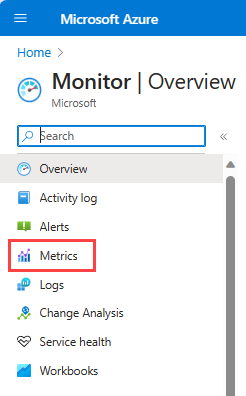

# Send guest OS metrics to the Azure Monitor metric store by using an Azure Resource Manager template for a Windows virtual machine scale set

[!INCLUDE [updated-for-az](../../../includes/updated-for-az.md)]

By using the Azure Monitor [Windows Azure Diagnostics (WAD) extension](../agents/diagnostics-extension-overview.md), you can collect metrics and logs from the guest operating system (guest OS) that runs as part of a virtual machine, cloud service, or Azure Service Fabric cluster. The extension can send telemetry to many different locations listed in the previously linked article.  

This article describes the process to send guest OS performance metrics for a Windows virtual machine scale set to the Azure Monitor data store. Starting with Windows Azure Diagnostics version 1.11, you can write metrics directly to the Azure Monitor metrics store, where standard platform metrics are already collected. By storing them in this location, you can access the same actions that are available for platform metrics. Actions include near real-time alerting, charting, routing, access from the REST API, and more. In the past, the Windows Azure Diagnostics extension wrote to Azure Storage but not the Azure Monitor data store.  

If you're new to Resource Manager templates, learn about [template deployments](../../azure-resource-manager/management/overview.md) and their structure and syntax.  

## Prerequisites

- Your subscription must be registered with [Microsoft.Insights](../../azure-resource-manager/management/resource-providers-and-types.md). 

- You need to have [Azure PowerShell](/powershell/azure) installed, or you can use [Azure Cloud Shell](../../cloud-shell/overview.md). 

- Your VM resource must be in a [region that supports custom metrics](./metrics-custom-overview.md#supported-regions).

## Set up Azure Monitor as a data sink 
The Azure Diagnostics extension uses a feature called **data sinks** to route metrics and logs to different locations. The following steps show how to use a Resource Manager template and PowerShell to deploy a VM by using the new Azure Monitor data sink. 

## Author a Resource Manager template 
For this example, you can use a publicly available [sample template](https://github.com/Azure/azure-quickstart-templates/tree/master/quickstarts/microsoft.compute/vmss-windows-autoscale):  

- **Azuredeploy.json** is a preconfigured Resource Manager template for deployment of a virtual machine scale set.

- **Azuredeploy.parameters.json** is a parameters file that stores information like what username and password you want to set for your VM. During deployment, the Resource Manager template uses the parameters set in this file. 

Download and save both files locally. 

###  Modify azuredeploy.parameters.json
Open the **azuredeploy.parameters.json** file:  
 
- Provide a **vmSKU** you want to deploy. We recommend Standard_D2_v3. 
- Specify a **windowsOSVersion** you want for your virtual machine scale set. We recommend 2016-Datacenter. 
- Name the virtual machine scale set resource to be deployed by using a **vmssName** property. An example is **VMSS-WAD-TEST**.    
- Specify the number of VMs you want to run on the virtual machine scale set by using the **instanceCount** property.
- Enter values for **adminUsername** and **adminPassword** for the virtual machine scale set. These parameters are used for remote access to the VMs in the scale set. To avoid having your VM hijacked, **do not** use the ones in this template. Bots scan the internet for usernames and passwords in public GitHub repositories. They're likely to be testing VMs with these defaults. 


###  Modify azuredeploy.json
Open the **azuredeploy.json** file. 

Add a variable to hold the storage account information in the Resource Manager template. Any logs or performance counters specified in the diagnostics config file are written to both the Azure Monitor metric store and the storage account you specify here: 

```json
"variables": { 
//add this line       
"storageAccountName": "[concat('storage', uniqueString(resourceGroup().id))]", 
```
 
Find the virtual machine scale set definition in the resources section and add the **identity** section to the configuration. This addition ensures that Azure assigns it a system identity. This step also ensures that the VMs in the scale set can emit guest metrics about themselves to Azure Monitor:  

```json
    { 
      "type": "Microsoft.Compute/virtualMachineScaleSets", 
      "name": "[variables('namingInfix')]", 
      "location": "[resourceGroup().location]", 
      "apiVersion": "2017-03-30", 
      //add these lines below
      "identity": { 
           "type": "systemAssigned" 
       }, 
       //end of lines to add
```

In the virtual machine scale set resource, find the **virtualMachineProfile** section. Add a new profile called **extensionsProfile** to manage extensions.  


In the **extensionProfile**, add a new extension to the template as shown in the **VMSS-WAD-extension** section.  This section is the managed identities for Azure resources extension that ensures the metrics being emitted are accepted by Azure Monitor. The **name** field can contain any name. 

The following code from the MSI extension also adds the diagnostics extension and configuration as an extension resource to the virtual machine scale set resource. Feel free to add or remove performance counters as needed: 

```json
          "extensionProfile": { 
            "extensions": [ 
            // BEGINNING of added code  
            // Managed identities for Azure resources   
                { 
                 "name": "VMSS-WAD-extension", 
                 "properties": { 
                       "publisher": "Microsoft.ManagedIdentity", 
                       "type": "ManagedIdentityExtensionForWindows", 
                       "typeHandlerVersion": "1.0", 
                       "autoUpgradeMinorVersion": true, 
                       "settings": { 
                             "port": 50342 
                           }, 
                       "protectedSettings": {} 
                     } 
                                
            }, 
            // add diagnostic extension. (Remove this comment after pasting.)
            { 
              "name": "[concat('VMDiagnosticsVmExt','_vmNodeType0Name')]", 
              "properties": { 
                   "type": "IaaSDiagnostics", 
                   "autoUpgradeMinorVersion": true, 
                   "protectedSettings": { 
                        "storageAccountName": "[variables('storageAccountName')]", 
                        "storageAccountKey": "[listKeys(resourceId('Microsoft.Storage/storageAccounts', variables('storageAccountName')),'2015-05-01-preview').key1]", 
                        "storageAccountEndPoint": "https://core.windows.net/" 
                   }, 
                   "publisher": "Microsoft.Azure.Diagnostics", 
                   "settings": { 
                        "WadCfg": { 
                              "DiagnosticMonitorConfiguration": { 
                                   "overallQuotaInMB": "50000", 
                                   "PerformanceCounters": { 
                                       "scheduledTransferPeriod": "PT1M", 
                                       "sinks": "AzMonSink", 
                                       "PerformanceCounterConfiguration": [ 
                                          { 
              "counterSpecifier": "\\Memory\\% Committed Bytes In Use", 
                                              "sampleRate": "PT15S" 
           }, 
           { 
              "counterSpecifier": "\\Memory\\Available Bytes", 
              "sampleRate": "PT15S" 
           }, 
           { 
              "counterSpecifier": "\\Memory\\Committed Bytes", 
              "sampleRate": "PT15S" 
           } 
                                       ] 
                                 }, 
                                 "EtwProviders": { 
                                       "EtwEventSourceProviderConfiguration": [ 
                                           { 
                                              "provider": "Microsoft-ServiceFabric-Actors", 
                                              "scheduledTransferKeywordFilter": "1", 
                                              "scheduledTransferPeriod": "PT5M", 
                                              "DefaultEvents": { 
                                              "eventDestination": "ServiceFabricReliableActorEventTable" 
                                           } 
                                           }, 
                                           { 
                                              "provider": "Microsoft-ServiceFabric-Services", 
                                              "scheduledTransferPeriod": "PT5M", 
                                              "DefaultEvents": { 
                                                   "eventDestination": "ServiceFabricReliableServiceEventTable" 
                                              } 
                                           } 
                                     ], 
                                     "EtwManifestProviderConfiguration": [ 
                                           { 
                                              "provider": "cbd93bc2-71e5-4566-b3a7-595d8eeca6e8", 
                                              "scheduledTransferLogLevelFilter": "Information", 
                                              "scheduledTransferKeywordFilter": "4611686018427387904", 
                                              "scheduledTransferPeriod": "PT5M", 
                                              "DefaultEvents": { 
                                                   "eventDestination": "ServiceFabricSystemEventTable" 
                                              } 
                                          } 
                                     ] 
                               } 
                               }, 
                               "SinksConfig": { 
                                     "Sink": [ 
                                          { 
                                              "name": "AzMonSink", 
                                              "AzureMonitor": {} 
                                          } 
                                      ] 
                               } 
                         }, 
                         "StorageAccount": "[variables('storageAccountName')]" 
                         }, 
                        "typeHandlerVersion": "1.11" 
                  } 
           } 
            ] 
          }
          }
      }
    },
    //end of added code plus a few brackets. Be sure that the number and type of brackets match properly when done. 
    {
      "type": "Microsoft.Insights/autoscaleSettings",
...
```


Add a **dependsOn** for the storage account to ensure it's created in the correct order: 

```json
"dependsOn": [ 
"[concat('Microsoft.Network/loadBalancers/', variables('loadBalancerName'))]", 
"[concat('Microsoft.Network/virtualNetworks/', variables('virtualNetworkName'))]" 
//add this line below
"[concat('Microsoft.Storage/storageAccounts/', variables('storageAccountName'))]" 
```

Create a storage account if one isn't already created in the template: 

```json
"resources": [
// add this code    
{
    "type": "Microsoft.Storage/storageAccounts",
    "name": "[variables('storageAccountName')]",
    "apiVersion": "2015-05-01-preview",
    "location": "[resourceGroup().location]",
    "properties": {
    "accountType": "Standard_LRS"
    }
},
// end added code
{ 
    "type": "Microsoft.Network/virtualNetworks",
    "name": "[variables('virtualNetworkName')]",
```

Save and close both files. 

## Deploy the Resource Manager template 

> [!NOTE]  
> You must be running the Azure Diagnostics extension version 1.5 or higher **and** have the **autoUpgradeMinorVersion:** property set to **true** in your Resource Manager template. Azure then loads the proper extension when it starts the VM. If you don't have these settings in your template, change them and redeploy the template. 


To deploy the Resource Manager template, use Azure PowerShell:  

1. Launch PowerShell. 
1. Sign in to Azure using `Login-AzAccount`.
1. Get your list of subscriptions by using `Get-AzSubscription`.
1. Set the subscription you'll create, or update the virtual machine: 

   ```powershell
   Select-AzSubscription -SubscriptionName "<Name of the subscription>" 
   ```
1. Create a new resource group for the VM being deployed. Run the following command: 

   ```powershell
    New-AzResourceGroup -Name "VMSSWADtestGrp" -Location "<Azure Region>" 
   ```

   > [!NOTE]  
   > Remember to use an Azure region that's enabled for custom metrics. Remember to use an [Azure region that's enabled for custom metrics](./metrics-custom-overview.md#supported-regions).
 
1. Run the following commands to deploy the VM:  

   > [!NOTE]  
   > If you want to update an existing scale set, add **-Mode Incremental** to the end of the command. 
 
   ```powershell
   New-AzResourceGroupDeployment -Name "VMSSWADTest" -ResourceGroupName "VMSSWADtestGrp" -TemplateFile "<File path of your azuredeploy.JSON file>" -TemplateParameterFile "<File path of your azuredeploy.parameters.JSON file>"  
   ```

1. After your deployment succeeds, you should find the virtual machine scale set in the Azure portal. It should emit metrics to Azure Monitor. 

   > [!NOTE]  
   > You might run into errors around the selected **vmSkuSize**. In that case, go back to your **azuredeploy.json** file and update the default value of the **vmSkuSize** parameter. We recommend that you try **Standard_DS1_v2**. 


## Chart your metrics 

1. Sign in to the Azure portal. 

1. In the left-hand menu, select **Monitor**. 

1. On the **Monitor** page, select **Metrics**. 

    

1. Change the aggregation period to **Last 30 minutes**.  

1. In the resource drop-down menu, select the virtual machine scale set you created.  

1. In the namespaces drop-down menu, select **azure.vm.windows.guest**. 

1. In the metrics drop-down menu, select **Memory\%Committed Bytes in Use**.  

You can then also choose to use the dimensions on this metric to chart it for a particular VM or to plot each VM in the scale set. 


## Next steps
- Learn more about [custom metrics](./metrics-custom-overview.md).