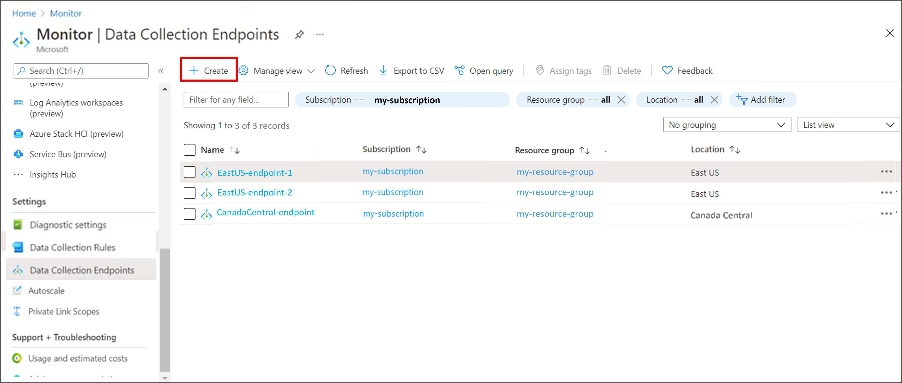
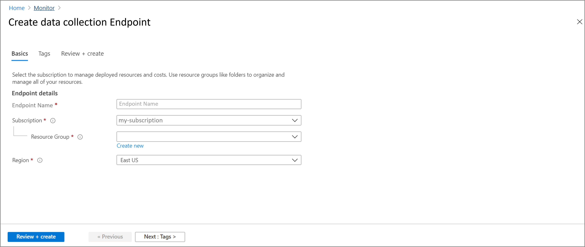

# Data collection endpoints in Azure Monitor

The [Logs ingestion API](../logs/logs-ingestion-api-overview.md) and [Azure Monitor Agent](../agents/agents-overview.md) use data collection endpoints to receive configuration files from Azure Monitor and to send collected data for processing and ingestion into Azure Monitor. 

Azure Monitor Agent uses data collection endpoints to collect:

- IIS logs
- Firewall logs
- Custom logs

This article provides an overview of data collection endpoints and explains how to create and set them up based on your deployment.

## Components of a data collection endpoint
A data collection endpoint includes the following components:

| Component | Description |
|:---|:---|
| Configuration access endpoint | The endpoint from which Azure Monitor Agent retrieves data collection rules. Example: `<unique-dce-identifier>.<regionname>-1.handler.control`. The configuration access endpoint needs to be in the same region as the monitored resources. |
| Logs ingestion endpoint | The endpoint used to ingest logs to the data ingestion pipeline. Example: `<unique-dce-identifier>.<regionname>-1.ingest`. The Logs ingestion endpoint needs to be in the same region as the destination Log Analytics workspace. |
| Network access control lists | Network access control rules for the endpoints. |

## How to set up data collection endpoints based on your deployment

- **Scenario: All monitored resources are in the same region as the destination Log Analytics workspace**

    Set up one data collection endpoint to send configuration files and receive collected data.
    
    :::image type="content" source="media/data-collection-endpoint-overview/data-collection-endpoint-one-region.png" alt-text="A diagram that shows resources in a single region sending data and receiving configuration files using a data collection endpoint.":::

- **Scenario: Monitored resources in multiple regions sending data to one or more Log Analytics workspaces in a single region**

    - Create a data collection endpoint in each region to send configuration files to the resources in that region.
    - Send data from all resources to a data collection endpoint in the region where your destintation Log Analytics workspaces are located. 
    
    :::image type="content" source="media/data-collection-endpoint-overview/data-collection-endpoint-regionality.png" alt-text="A diagram that shows resources in two regions sending data and receiving configuration files using data collection endpoints.":::

- **Scenario: Monitored resources in multiple regions sending data to multiple Log Analytics workspaces in different regions**

     - Create a data collection endpoint in each region with monitored resources to send configuration files to the resources in that region.
     - Create a data collection endpoint in each region a destination Log Analytics workspaces to send data to the Log Analytics workspaces in that region.
     - Send data from each monitored resource to the data collection endpoint in the region where the destination Log Analytics workspace is located.
      
     :::image type="content" source="media/data-collection-endpoint-overview/data-collection-endpoint-regionality-multiple-workspaces.png" alt-text="A diagram that shows monitored resources in multiple regions sending data to multiple Log Analytics workspaces in different regions using data collection endpoints.":::

## Create a data collection endpoint

> [!IMPORTANT]
> If agents will connect to your DCE, it must be created in the same region. If you have agents in different regions, you'll need multiple DCEs.

# [Azure portal](#tab/portal)

1. On the **Azure Monitor** menu in the Azure portal, select **Data Collection Endpoints** under the **Settings** section. Select **Create** to create a new DCR and assignment.

   

1. Select **Create** to create a new endpoint. Provide a **Rule name** and specify a **Subscription**, **Resource Group**, and **Region**. This information specifies where the DCE will be created.

   

1. Select **Review + create** to review the details of the DCE. Select **Create** to create it.

# [REST API](#tab/restapi)

Create DCRs by using the [DCE REST APIs](/cli/azure/monitor/data-collection/endpoint).

Create associations between endpoints to your target machines or resources by using the [DCRA REST APIs](/rest/api/monitor/datacollectionruleassociations/create#examples).

---

## Sample data collection endpoint
For a sample DCE, see [Sample data collection endpoint](data-collection-endpoint-sample.md).

## Limitations
Data collection endpoints only support Log Analytics workspaces as a destination for collected data. [Custom metrics (preview)](../essentials/metrics-custom-overview.md) collected and uploaded via Azure Monitor Agent aren't currently controlled by DCEs. Data collection endpoints also can't be configured over private links.

## Next steps
- [Associate endpoints to machines](../agents/data-collection-rule-azure-monitor-agent.md#create-a-data-collection-rule)
- [Add an endpoint to an Azure Monitor Private Link Scope resource](../logs/private-link-configure.md#connect-azure-monitor-resources)
