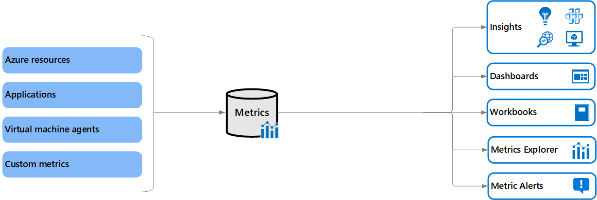

# Azure Monitor Metrics overview

Azure Monitor Metrics is a feature of Azure Monitor that collects numeric data from [monitored resources](../monitor-reference.md) into a time-series database. Metrics are numerical values that are collected at regular intervals and describe some aspect of a system at a particular time.

> [!NOTE]
> Azure Monitor Metrics is one half of the data platform that supports Azure Monitor. The other half is [Azure Monitor Logs](../logs/data-platform-logs.md), which collects and organizes log and performance data. You can analyze that data by using a rich query language.

## Types of metrics
There are multiple types of metrics supported by Azure Monitor Metrics:

- Native metrics use tools in Azure Monitor for analysis and alerting.
  - Platform metrics are collected from Azure resources. They require no configuration and have no cost.
  - Custom metrics are collected from different sources that you configure including applications and agents running on virtual machines.
- Prometheus metrics are collected from Kubernetes clusters including Azure Kubernetes service (AKS) and use industry standard tools for analyzing and alerting such as PromQL and Grafana.

The differences between each of the metrics are summarized in the following table.

| Category | Native platform metrics | Native custom metrics | Prometheus metrics |
|:---|:---|:---|:---|
| Sources | Azure resources | Azure Monitor agent Application insights REST API | Azure Kubernetes service (AKS) cluster Any Kubernetes cluster through remote-write |
| Configuration | None | Varies by source | Enable Azure Monitor managed service for Prometheus |
| Stored | Subscription | Subscription | [Azure Monitor workspace](azure-monitor-workspace-overview.md) |
| Cost | No | Yes | Yes (free during preview) |
| Aggregation | pre-aggregated | pre-aggregated | raw data |
| Analyze | [Metrics Explorer](metrics-charts.md) | [Metrics Explorer](metrics-charts.md) | PromQL Grafana dashboards |
| Alert  | [metrics alert rule](../alerts/tutorial-metric-alert.md) | [metrics alert rule](../alerts/tutorial-metric-alert.md) | [Prometheus alert rule](../essentials/prometheus-rule-groups.md) |
| Visualize | [Workbooks](../visualize/workbooks-overview.md) [Azure dashboards](../app/tutorial-app-dashboards.md) [Grafana](../visualize/grafana-plugin.md) | [Workbooks](../visualize/workbooks-overview.md) [Azure dashboards](../app/tutorial-app-dashboards.md) [Grafana](../visualize/grafana-plugin.md) | [Grafana](../../managed-grafana/overview.md) |
| Retrieve | [Azure CLI](/cli/azure/monitor/metrics) [Azure PowerShell cmdlets](/powershell/module/az.monitor) [REST API](./rest-api-walkthrough.md) or client library [.NET](/dotnet/api/overview/azure/Monitor.Query-readme) [Go](https://pkg.go.dev/github.com/Azure/azure-sdk-for-go/sdk/monitor/azquery) [Java](/java/api/overview/azure/monitor-query-readme) [JavaScript](/javascript/api/overview/azure/monitor-query-readme) [Python](/python/api/overview/azure/monitor-query-readme) | [Azure CLI](/cli/azure/monitor/metrics) [Azure PowerShell cmdlets](/powershell/module/az.monitor) [REST API](./rest-api-walkthrough.md) or client library [.NET](/dotnet/api/overview/azure/Monitor.Query-readme) [Go](https://pkg.go.dev/github.com/Azure/azure-sdk-for-go/sdk/monitor/azquery) [Java](/java/api/overview/azure/monitor-query-readme) [JavaScript](/javascript/api/overview/azure/monitor-query-readme) [Python](/python/api/overview/azure/monitor-query-readme) | [Grafana](../../managed-grafana/overview.md) |

## Data collection

Azure Monitor collects metrics from the following sources. After these metrics are collected in the Azure Monitor metric database, they can be evaluated together regardless of their source:

- **Azure resources**: Platform metrics are created by Azure resources and give you visibility into their health and performance. Each type of resource creates a [distinct set of metrics](./metrics-supported.md) without any configuration required. Platform metrics are collected from Azure resources at one-minute frequency unless specified otherwise in the metric's definition.
- **Applications**: Application Insights creates metrics for your monitored applications to help you detect performance issues and track trends in how your application is being used. Values include _Server response time_ and _Browser exceptions_.
- **Virtual machine agents**: Metrics are collected from the guest operating system of a virtual machine. You can enable guest OS metrics for Windows virtual machines by using the [Windows diagnostic extension](../agents/diagnostics-extension-overview.md) and for Linux virtual machines by using the [InfluxData Telegraf agent](https://www.influxdata.com/time-series-platform/telegraf/).
- **Custom metrics**: You can define metrics in addition to the standard metrics that are automatically available. You can [define custom metrics in your application](../app/api-custom-events-metrics.md) that's monitored by Application Insights. You can also create custom metrics for an Azure service by using the [custom metrics API](./metrics-store-custom-rest-api.md).
- **Kubernetes clusters**: Kubernetes clusters typically send metric data to a local Prometheus server that you must maintain. [Azure Monitor managed service for Prometheus ](prometheus-metrics-overview.md) provides a managed service that collects metrics from Kubernetes clusters and store them in Azure Monitor Metrics.

For a complete list of data sources that can send data to Azure Monitor Metrics, see [What is monitored by Azure Monitor?](../monitor-reference.md).

## REST API 
Azure Monitor provides REST APIs that allow you to get data in and out of Azure Monitor Metrics.
- **Custom metrics API** - [Custom metrics](./metrics-custom-overview.md) allow you to load your own metrics into the Azure Monitor Metrics database. Those metrics can then be used by the same analysis tools that process Azure Monitor platform metrics. 
- **Azure Monitor Metrics REST API** - Allows you to access Azure Monitor platform metrics definitions and values. For more information, see [Azure Monitor REST API](/rest/api/monitor/).  For information on how to use the API, see the [Azure monitoring REST API walkthrough](./rest-api-walkthrough.md).
- **Azure Monitor Metrics Data plane REST API**  - [Azure Monitor Metrics data plane API](/rest/api/monitor/metrics-data-plane/) is a high-volume API designed for customers with large volume metrics queries. It's similar to the existing standard Azure Monitor Metrics REST API, but provides the capability to retrieve metric data for up to 50 resource IDs in the same subscription and region in a single batch API call. This improves query throughput and reduces the risk of throttling.   

## Security

All communication between connected systems and the Azure Monitor service is encrypted using the TLS 1.2 (HTTPS) protocol. The Microsoft SDL process is followed to ensure all Azure services are up-to-date with the most recent advances in cryptographic protocols.  

Secure connection is established between the agent and the Azure Monitor service using certificate-based authentication and TLS with port 443. Azure Monitor uses a secret store to generate and maintain keys. Private keys are rotated every 90 days and are stored in Azure and are managed by the Azure operations who follow strict regulatory and compliance practices. For more information on security, see  [Encryption of data in transit](../../security/fundamentals/encryption-overview.md#encryption-of-data-in-transit), [Encryption of data at rest](../../security/fundamentals/encryption-atrest.md), and [Azure Monitor Logs data security](../logs/data-security.md)

## Metrics Explorer

Use [Metrics Explorer](metrics-charts.md) to interactively analyze the data in your metric database and chart the values of multiple metrics over time. You can pin the charts to a dashboard to view them with other visualizations. You can also retrieve metrics by using the [Azure monitoring REST API](./rest-api-walkthrough.md).

For more information, see [Getting started with Azure Monitor Metrics Explorer](./metrics-getting-started.md).

## Data structure

Data that Azure Monitor Metrics collects, is stored in a time-series database that's optimized for analyzing time-stamped data. Each set of metric values is a time series with the following properties:

* The time when the value was collected.
* The resource that the value is associated with.
* A namespace that acts like a category for the metric.
* A metric name.
* The value itself.
* [Multiple dimensions](#multi-dimensional-metrics) when they're present. Custom metrics are limited to 10 dimensions.

## Multi-dimensional metrics
One of the challenges to metric data is that it often has limited information to provide context for collected values. Azure Monitor addresses this challenge with multi-dimensional metrics.

Metric dimensions are name/value pairs that carry more data to describe the metric value. For example, a metric called _Available disk space_ might have a dimension called _Drive_ with values _C:_ and _D:_. That dimension would allow viewing available disk space across all drives or for each drive individually.

See [Apply dimension filters and splitting](metrics-getting-started.md?#apply-dimension-filters-and-splitting) for details on viewing metric dimensions in metrics explorer.

### Nondimensional metric
The following table shows sample data from a nondimensional metric, network throughput. It can only answer a basic question like "What was my network throughput at a given time?"

| Timestamp     | Metric value |
| ------------- |:-------------|
| 8/9/2017 8:14 | 1,331.8 Kbps |
| 8/9/2017 8:15 | 1,141.4 Kbps |
| 8/9/2017 8:16 | 1,110.2 Kbps |

### Network throughput and two dimensions ("IP" and "Direction")
The following table shows sample data from a multidimensional metric, network throughput with two dimensions called *IP* and *Direction*. It can answer questions such as "What was the network throughput for each IP address?" and "How much data was sent versus received?" 

| Timestamp     | Dimension "IP"   | Dimension "Direction" | Metric value|
| ------------- |:-----------------|:------------------- |:-----------|
| 8/9/2017 8:14 | IP="192.168.5.2" | Direction="Send"    | 646.5 Kbps |
| 8/9/2017 8:14 | IP="192.168.5.2" | Direction="Receive" | 420.1 Kbps |
| 8/9/2017 8:14 | IP="10.24.2.15"  | Direction="Send"    | 150.0 Kbps |
| 8/9/2017 8:14 | IP="10.24.2.15"  | Direction="Receive" | 115.2 Kbps |
| 8/9/2017 8:15 | IP="192.168.5.2" | Direction="Send"    | 515.2 Kbps |
| 8/9/2017 8:15 | IP="192.168.5.2" | Direction="Receive" | 371.1 Kbps |
| 8/9/2017 8:15 | IP="10.24.2.15"  | Direction="Send"    | 155.0 Kbps |
| 8/9/2017 8:15 | IP="10.24.2.15"  | Direction="Receive" | 100.1 Kbps |

> [!NOTE]
> Dimension names and dimension values are case-insenstive.

## Retention of metrics

### Platform and custom metrics
Platform and custom metrics are stored for **93 days** with the following exceptions:

- **Classic guest OS metrics**: These performance counters are collected by the [Windows diagnostic extension](../agents/diagnostics-extension-overview.md) or the [Linux diagnostic extension](../../virtual-machines/extensions/diagnostics-linux.md) and routed to an Azure Storage account. Retention for these metrics is guaranteed to be at least 14 days, although no expiration date is written to the storage account.
  
  For performance reasons, the portal limits how much data it displays based on volume. So, the actual number of days that the portal retrieves can be longer than 14 days if the volume of data being written isn't large.

- **Guest OS metrics sent to Azure Monitor Metrics**: These performance counters are collected by the [Windows diagnostic extension](../agents/diagnostics-extension-overview.md) and sent to the [Azure Monitor data sink](../agents/diagnostics-extension-overview.md#data-destinations), or the [InfluxData Telegraf agent](https://www.influxdata.com/time-series-platform/telegraf/) on Linux machines, or the newer [Azure Monitor agent](../agents/azure-monitor-agent-overview.md) via data-collection rules. Retention for these metrics is 93 days.

- **Guest OS metrics collected by the Log Analytics agent**: These performance counters are collected by the Log Analytics agent and sent to a Log Analytics workspace. Retention for these metrics is 31 days and can be extended up to 2 years.

- **Application Insights log-based metrics**: Behind the scenes, [log-based metrics](../app/pre-aggregated-metrics-log-metrics.md) translate into log queries. Their retention is variable and matches the retention of events in underlying logs, which is 31 days to 2 years. For Application Insights resources, logs are stored for 90 days.

> [!NOTE]
> You can [send platform metrics for Azure Monitor resources to a Log Analytics workspace](./resource-logs.md#send-to-log-analytics-workspace) for long-term trending.

While platform and custom metrics are stored for 93 days, you can only query (in the **Metrics** tile) for a maximum of 30 days' worth of data on any single chart. This limitation doesn't apply to log-based metrics. If you see a blank chart or your chart displays only part of metric data, verify that the difference between start and end dates in the time picker doesn't exceed the 30-day interval. After you've selected a 30-day interval, you can [pan](./metrics-charts.md#pan) the chart to view the full retention window.

### Prometheus metrics
Prometheus metrics are stored for **18 months**, but a PromQL query can only span a maximum of 32 days.

## Next steps

- Learn more about the [Azure Monitor data platform](../data-platform.md).
- Learn about [log data in Azure Monitor](../logs/data-platform-logs.md).
- Learn about the [monitoring data available](../data-sources.md) for various resources in Azure.
