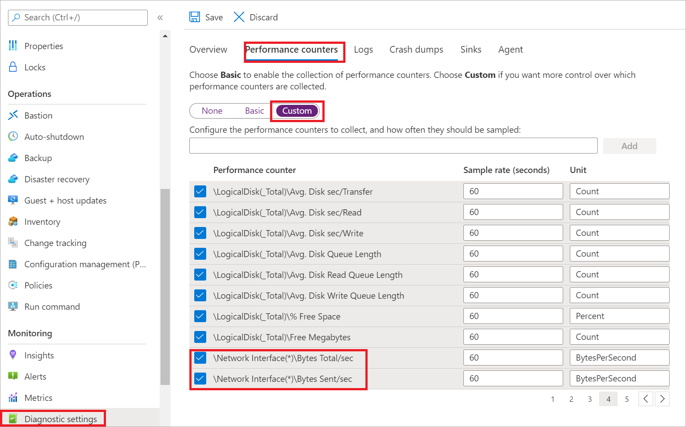
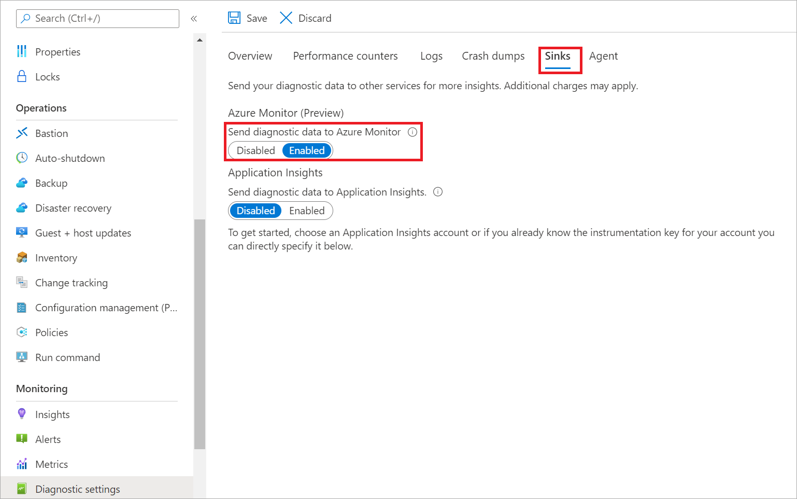
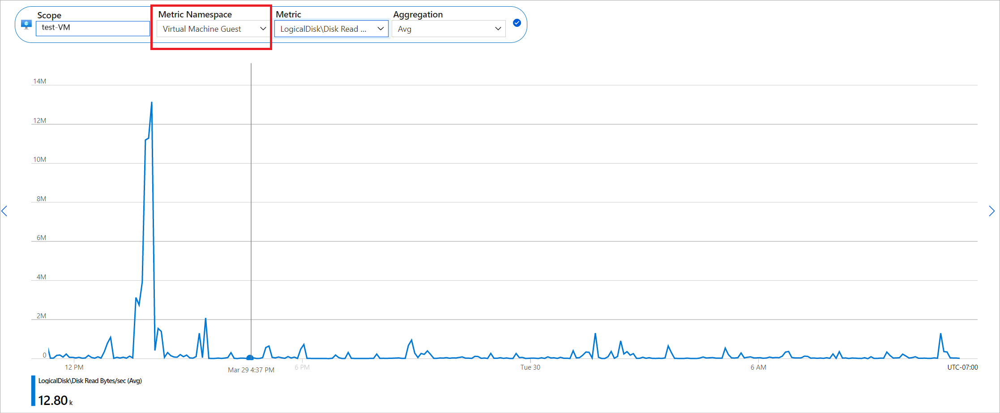
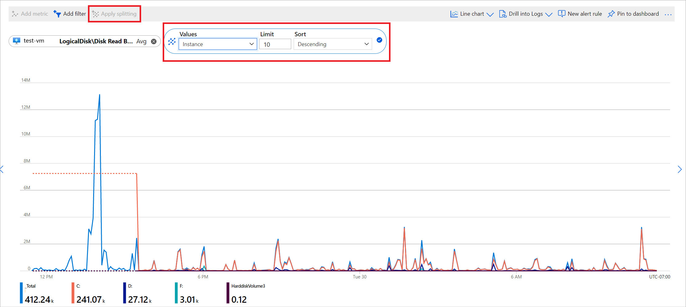

# Azure Monitor Metrics overview

Azure Monitor Metrics is a feature of Azure Monitor that collects numeric data from [monitored resources](../monitor-reference.md) into a time-series database. Metrics are numerical values that are collected at regular intervals and describe some aspect of a system at a particular time.

Metrics in Azure Monitor are lightweight and capable of supporting near-real-time scenarios. For these reasons, they're useful for alerting and fast detection of issues. You can:

- Analyze them interactively by using Metrics Explorer.
- Be proactively notified with an alert when a value crosses a threshold.
- Visualize them in a workbook or dashboard.

> [!NOTE]
> Azure Monitor Metrics is one half of the data platform that supports Azure Monitor. The other half is [Azure Monitor Logs](../logs/data-platform-logs.md), which collects and organizes log and performance data. You can analyze that data by using a rich query language.
>
> The Azure Monitor Metrics feature can only store numeric data in a particular structure. The Azure Monitor Logs feature can store a variety of datatypes, each with its own structure. You can also perform complex analysis on log data by using log queries, which you can't use for analysis of metric data.

## What can you do with Azure Monitor Metrics?

The following table lists the ways that you can use the Azure Monitor Metrics feature.

| Uses | Description |
|:---|:---|
| Analyze | Use [Metrics Explorer](metrics-charts.md) to analyze collected metrics on a chart and compare metrics from various resources. |
| Alert | Configure a [metric alert rule](../alerts/alerts-metric.md) that sends a notification or takes [automated action](../alerts/action-groups.md) when the metric value crosses a threshold. |
| Visualize | Pin a chart from Metrics Explorer to an [Azure dashboard](../app/tutorial-app-dashboards.md). Create a [workbook](../visualize/workbooks-overview.md) to combine with multiple sets of data in an interactive report.  Export the results of a query to [Grafana](../visualize/grafana-plugin.md) to use its dashboards and combine with other data sources. |
| Automate |  Use [Autoscale](../autoscale/autoscale-overview.md) to increase or decrease resources based on a metric value crossing a threshold. |
| Retrieve | Access metric values from a:<ul><li>Command line via the [Azure CLI](/cli/azure/monitor/metrics) or [Azure PowerShell cmdlets](/powershell/module/az.monitor).</li><li>Custom app via the [REST API](./rest-api-walkthrough.md) or client library for [.NET](/dotnet/api/overview/azure/Monitor.Query-readme), [Java](/java/api/overview/azure/monitor-query-readme), [JavaScript](/javascript/api/overview/azure/monitor-query-readme), or [Python](/python/api/overview/azure/monitor-query-readme).</li></ul> |
| Export | [Route metrics to logs](./resource-logs.md#send-to-azure-storage) to analyze data in Azure Monitor Metrics together with data in Azure Monitor Logs and to store metric values for longer than 93 days. Stream metrics to an [event hub](./stream-monitoring-data-event-hubs.md) to route them to external systems. |
| Archive | [Archive](./platform-logs-overview.md) the performance or health history of your resource for compliance, auditing, or offline reporting purposes. |

## Data collection

Azure Monitor collects metrics from the following sources. After these metrics are collected in the Azure Monitor metric database, they can be evaluated together regardless of their source:

- **Azure resources**: Platform metrics are created by Azure resources and give you visibility into their health and performance. Each type of resource creates a [distinct set of metrics](./metrics-supported.md) without any configuration required. Platform metrics are collected from Azure resources at one-minute frequency unless specified otherwise in the metric's definition.
- **Applications**: Application Insights creates metrics for your monitored applications to help you detect performance issues and track trends in how your application is being used. Values include _Server response time_ and _Browser exceptions_.
- **Virtual machine agents**: Metrics are collected from the guest operating system of a virtual machine. You can enable guest OS metrics for Windows virtual machines by using the [Windows diagnostic extension](../agents/diagnostics-extension-overview.md) and for Linux virtual machines by using the [InfluxData Telegraf agent](https://www.influxdata.com/time-series-platform/telegraf/).
- **Custom metrics**: You can define metrics in addition to the standard metrics that are automatically available. You can [define custom metrics in your application](../app/api-custom-events-metrics.md) that's monitored by Application Insights. You can also create custom metrics for an Azure service by using the [custom metrics API](./metrics-store-custom-rest-api.md).

For a complete list of data sources that can send data to Azure Monitor Metrics, see [What is monitored by Azure Monitor?](../monitor-reference.md).

## Metrics Explorer

Use [Metrics Explorer](metrics-charts.md) to interactively analyze the data in your metric database and chart the values of multiple metrics over time. You can pin the charts to a dashboard to view them with other visualizations. You can also retrieve metrics by using the [Azure monitoring REST API](./rest-api-walkthrough.md).

For more information, see [Getting started with Azure Monitor Metrics Explorer](./metrics-getting-started.md).

## Data structure

Data that Azure Monitor Metrics collects is stored in a time-series database that's optimized for analyzing time-stamped data. Each set of metric values is a time series with the following properties:

* The time when the value was collected.
* The resource that the value is associated with.
* A namespace that acts like a category for the metric.
* A metric name.
* The value itself.
* [Multiple dimensions](#multi-dimensional-metrics) when they're present. Custom metrics are limited to 10 dimensions.

## Multi-dimensional metrics

One of the challenges to metric data is that it often has limited information to provide context for collected values. Azure Monitor addresses this challenge with multi-dimensional metrics.

Dimensions of a metric are name/value pairs that carry more data to describe the metric value. For example, a metric called _Available disk space_ might have a dimension called _Drive_ with values _C:_ and _D:_. That dimension would allow viewing available disk space across all drives or for each drive individually.

The following example illustrates two datasets for a hypothetical metric called _Network throughput_. The first dataset has no dimensions. The second dataset shows the values with two dimensions, _IP_ and _Direction_.

### Network throughput

| Timestamp     | Metric value |
| ------------- |:-------------|
| 8/9/2017 8:14 | 1,331.8 Kbps |
| 8/9/2017 8:15 | 1,141.4 Kbps |
| 8/9/2017 8:16 | 1,110.2 Kbps |

This nondimensional metric can only answer a basic question like "What was my network throughput at a given time?"

### Network throughput and two dimensions ("IP" and "Direction")

| Timestamp     | Dimension "IP"   | Dimension "Direction" | Metric value|
| ------------- |:-----------------|:------------------- |:-----------|
| 8/9/2017 8:14 | IP="192.168.5.2" | Direction="Send"    | 646.5 Kbps |
| 8/9/2017 8:14 | IP="192.168.5.2" | Direction="Receive" | 420.1 Kbps |
| 8/9/2017 8:14 | IP="10.24.2.15"  | Direction="Send"    | 150.0 Kbps |
| 8/9/2017 8:14 | IP="10.24.2.15"  | Direction="Receive" | 115.2 Kbps |
| 8/9/2017 8:15 | IP="192.168.5.2" | Direction="Send"    | 515.2 Kbps |
| 8/9/2017 8:15 | IP="192.168.5.2" | Direction="Receive" | 371.1 Kbps |
| 8/9/2017 8:15 | IP="10.24.2.15"  | Direction="Send"    | 155.0 Kbps |
| 8/9/2017 8:15 | IP="10.24.2.15"  | Direction="Receive" | 100.1 Kbps |

This metric can answer questions such as "What was the network throughput for each IP address?" and "How much data was sent versus received?" Multi-dimensional metrics carry more analytical and diagnostic value compared to nondimensional metrics.

### View multi-dimensional performance counter metrics in Metrics Explorer

It's not possible to send performance counter metrics that contain an asterisk (\*) to Azure Monitor via the Classic Guest Metrics API. This API can't display metrics that contain an asterisk because it's a multi-dimensional metric, which classic metrics don't support.

To configure and view multi-dimensional guest OS performance counter metrics by using the Azure Diagnostic extension:

1. Go to the **Diagnostic settings** page for your virtual machine.
1. Select the **Performance counters** tab.
1. Select **Custom** to configure the performance counters that you want to collect.

   

1. Select **Sinks**. Then select **Enabled** to send your data to Azure Monitor.

   

1. To view your metric in Azure Monitor, select **Virtual Machine Guest** in the **Metric Namespace** dropdown.

   

1. Select **Apply splitting** and fill in the details to split the metric by instance. You can then see the metric broken down by each of the possible values represented by the asterisk in the configuration. In this example, the asterisk represents the logical disk volumes plus the total.

   

## Retention of metrics

For most resources in Azure, platform metrics are stored for 93 days. There are some exceptions:

- **Classic guest OS metrics**: These performance counters are collected by the [Windows diagnostic extension](../agents/diagnostics-extension-overview.md) or the [Linux diagnostic extension](../../virtual-machines/extensions/diagnostics-linux.md) and routed to an Azure Storage account. Retention for these metrics is guaranteed to be at least 14 days, although no expiration date is written to the storage account.
  
  For performance reasons, the portal limits how much data it displays based on volume. So, the actual number of days that the portal retrieves can be longer than 14 days if the volume of data being written isn't large.

- **Guest OS metrics sent to Azure Monitor Metrics**: These performance counters are collected by the [Windows diagnostic extension](../agents/diagnostics-extension-overview.md) and sent to the [Azure Monitor data sink](../agents/diagnostics-extension-overview.md#data-destinations), or the [InfluxData Telegraf agent](https://www.influxdata.com/time-series-platform/telegraf/) on Linux machines, or the newer [Azure Monitor agent](../agents/azure-monitor-agent-overview.md) via data-collection rules. Retention for these metrics is 93 days.

- **Guest OS metrics collected by the Log Analytics agent**: These performance counters are collected by the Log Analytics agent and sent to a Log Analytics workspace. Retention for these metrics is 31 days and can be extended up to 2 years.

- **Application Insights log-based metrics**: Behind the scenes, [log-based metrics](../app/pre-aggregated-metrics-log-metrics.md) translate into log queries. Their retention is variable and matches the retention of events in underlying logs, which is 31 days to 2 years. For Application Insights resources, logs are stored for 90 days.

> [!NOTE]
> You can [send platform metrics for Azure Monitor resources to a Log Analytics workspace](./resource-logs.md#send-to-azure-storage) for long-term trending.

As mentioned earlier, for most resources in Azure, platform metrics are stored for 93 days. However, you can only query (in the **Metrics** tile) for a maximum of 30 days' worth of data on any single chart. This limitation doesn't apply to log-based metrics.

If you see a blank chart or your chart displays only part of metric data, verify that the difference between start and end dates in the time picker doesn't exceed the 30-day interval. After you've selected a 30-day interval, you can [pan](./metrics-charts.md#pan) the chart to view the full retention window.

## Next steps

- Learn more about the [Azure Monitor data platform](../data-platform.md).
- Learn about [log data in Azure Monitor](../logs/data-platform-logs.md).
- Learn about the [monitoring data available](../data-sources.md) for various resources in Azure.