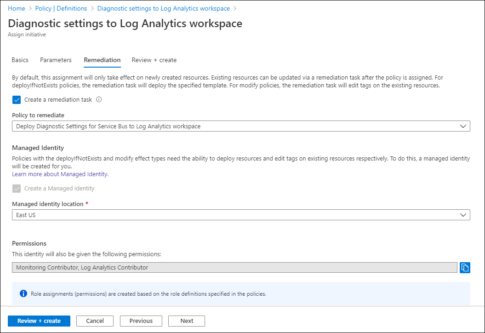

# Create diagnostic settings to send Azure Monitor platform logs and metrics to different destinations

This article provides details on creating and configuring diagnostic settings to send Azure platform metrics and logs to different destinations.

[Platform metrics](./metrics-supported.md) are sent automatically to [Azure Monitor Metrics](./data-platform-metrics.md) by default and without configuration.

[Platform logs](./platform-logs-overview.md), including the Azure Activity log and resource logs, provide detailed diagnostic and auditing information for Azure resources and the Azure platform they depend on. The Activity Log exists on its own but can be routed to other locations.  Resource logs are not collected until they are routed to a destination.

Each Azure resource requires its own diagnostic setting, which defines the following criteria:

- Sources - The type of metric and log data to send to the destinations defined in the setting. The available types vary by resource type.
- Destinations - One or more destinations to send to.

A single diagnostic setting can define no more than one of each of the destinations. If you want to send data to more than one of a particular destination type (for example, two different Log Analytics workspaces), then create multiple settings. Each resource can have up to 5 diagnostic settings.

The following video walks you through routing platform logs with diagnostic settings. The video was done at an earlier time and doesn't include the following:
 - There are now 4 destinations. You can send platform metrics and logs to certain Azure Monitor partners. 
 - A new feature called category groups was introduced in Nov 2021. 

Information on these newer features is included in this article. 

> [!VIDEO https://www.microsoft.com/en-us/videoplayer/embed/RE4AvVO]

## Sources

Here are the source options.

### Metrics

The **AllMetrics** setting routes a resource's platform metrics to additional destinations. This option may not be present for all resource providers.  

### Logs

With logs, you can select the log categories you want to route individually or choose a category group.

> [!NOTE]
> Category groups do not apply to metrics. Not all resources have category groups available.

**Category groups** allow you to dynamically collect resource logs based on predefined groupings instead of selecting individual log categories. Microsoft defines the groupings to help monitor specific use cases across all Azure services. Over time, the categories in the group may be updated as new logs are rolled out or as assessments change. When logs categories are added or removed from a category group, your log collection is modified automatically without you having to update your diagnostic settings.

When you use category groups, you: 
- No longer can individually select resource logs based on individual category types
- No longer can apply retention settings to logs sent to Azure Storage

Currently, there are two category groups:
- **All** - Every resource log offered by the resource.
- **Audit** - All resource logs that record customer interactions with data or the settings of the service.

## Destinations
Platform logs and metrics can be sent to the destinations in the following table. 

| Destination | Description |
|:---|:---|
| [Log Analytics workspace](../logs/design-logs-deployment.md) | Metrics are converted to log form. This option may not be available for all resource types. Sending them to the Azure Monitor Logs store (which is searchable via Log Analytics) helps you to integrate them into queries, alerts, and visualizations with existing log data.  
| [Azure storage account](../../storage/blobs/index.yml) | Archiving logs and metrics to an Azure storage account is useful for audit, static analysis, or backup. Compared to Azure Monitor Logs and a Log Analytics workspace, Azure storage is less expensive and logs can be kept there indefinitely.  | 
| [Event Hubs](../../event-hubs/index.yml) | Sending logs and metrics to Event Hubs allows you to stream data to external systems such as third-party SIEMs  and other Log Analytics solutions.  |
| [Azure Monitor partner integrations](../../partner-solutions/overview.md)| Specialized integrations between Azure Monitor and other non-Microsoft monitoring platforms. Useful when you are already using one of the partners.  |

## Requirements and limitations

### Metrics as a source
There are certain limitations with exporting metrics.

- **Sending multi-dimensional metrics via diagnostic settings is not currently supported** - Metrics with dimensions are exported as flattened single dimensional metrics, aggregated across dimension values. *For example*: The 'IOReadBytes' metric on a Blockchain can be explored and charted on a per node level. However, when exported via diagnostic settings, the metric exported shows all read bytes for all nodes.
- **Not all metrics are exportable with diagnostic settings** -  Due to internal limitations not all metrics are exportable to Azure Monitor Logs / Log Analytics. For more information, see the exportable column in the [list of supported metrics](./metrics-supported.md)

To get around these limitations for specific metrics, you can manually extract them using the [Metrics REST API](/rest/api/monitor/metrics/list) and import them into Azure Monitor Logs using the [Azure Monitor Data collector API](../logs/data-collector-api.md).

### Activity log as a source

> [!IMPORTANT]
> Before you create a diagnostic setting for the Activity log, you should first disable any legacy configuration. See [Legacy collection methods](../essentials/activity-log.md#legacy-collection-methods) for details.


### Destination limitations

Any destinations for the diagnostic setting must be created before creating the diagnostic settings. The destination does not have to be in the same subscription as the resource sending logs as long as the user who configures the setting has appropriate Azure RBAC access to both subscriptions. Using Azure Lighthouse, it is also possible to have diagnostic settings sent to a workspace in another Azure Active Directory tenant. The following table provides unique requirements for each destination including any regional restrictions.

| Destination | Requirements |
|:---|:---|
| Log Analytics workspace | The workspace does not need to be in the same region as the resource being monitored.|
| Azure storage account | Do not use an existing storage account that has other, non-monitoring data stored in it so that you can better control access to the data. If you are archiving the Activity log and resource logs together though, you may choose to use the same storage account to keep all monitoring data in a central location.<br><br>To send the data to immutable storage, set the immutable policy for the storage account as described in [Set and manage immutability policies for Blob storage](../../storage/blobs/immutable-policy-configure-version-scope.md). You must follow all steps in this linked article including enabling protected append blobs writes.<br><br>The storage account needs to be in the same region as the resource being monitored if the resource is regional.|
| Event Hubs | The shared access policy for the namespace defines the permissions that the streaming mechanism has. Streaming to Event Hubs requires Manage, Send, and Listen permissions. To update the diagnostic setting to include streaming, you must have the ListKey permission on that Event Hubs authorization rule.<br><br>The event hub namespace needs to be in the same region as the resource being monitored if the resource is regional. <br><br> Diagnostic settings can't access Event Hubs resources when virtual networks are enabled. You have to enable the *Allow trusted Microsoft services* to bypass this firewall setting in Event Hub, so that Azure Monitor (Diagnostic Settings) service is granted access to your Event Hubs resources.|
| Partner integrations | Varies by partner.  Check the [Azure Monitor partner integrations documentation](../../partner-solutions/overview.md) for details.  

### Azure Data Lake Storage Gen2 as a destination

> [!NOTE]
> Azure Data Lake Storage Gen2 accounts are not currently supported as a destination for diagnostic settings even though they may be listed as a valid option in the Azure portal.

## Create in Azure portal

You can configure diagnostic settings in the Azure portal either from the Azure Monitor menu or from the menu for the resource.

1. Where you configure diagnostic settings in the Azure portal depends on the resource.

   - For a single resource, click **Diagnostic settings** under **Monitor** in the resource's menu.

        

   - For one or more resources, click **Diagnostic settings** under **Settings** in the Azure Monitor menu and then click on the resource.

        

   - For the Activity log, click **Activity log** in the **Azure Monitor** menu and then **Diagnostic settings**. Make sure you disable any legacy configuration for the Activity log. See [Disable existing settings](./activity-log.md#legacy-collection-methods) for details.

        

2. If no settings exist on the resource you have selected, you are prompted to create a setting. Click **Add diagnostic setting**.

   

   If there are existing settings on the resource, you see a list of settings already configured. Either click **Add diagnostic setting** to add a new setting or **Edit setting** to edit an existing one. Each setting can have no more than one of each of the destination types.

   :::image type="Add diagnostic setting - existing settings" source="media/diagnostic-settings/edit-setting.png" alt-text="Add a diagnostic setting for existing settings":::

3. Give your setting a name if it doesn't already have one.

      :::image type="Add diagnostic setting" source="media/diagnostic-settings/setting-new-blank.png" alt-text="Name your diagnostic setting":::

4. **Logs and metrics to route** - For logs, either choose a category group or check the individual boxes for each category of data you want to send to the destinations specified later. The list of categories varies for each Azure service. Choose *allMetrics* if you want to store metrics into Azure Monitor Logs as well. 

5. **Destination details** - Check the box for each destination. When you check each box, options appear to allow you to add additional information.

      

    1. **Log Analytics** - Enter the subscription and workspace.  If you don't have a workspace, you need to [create one before proceeding](../logs/quick-create-workspace.md).

    1. **Event Hubs** - Specify the following criteria:
       - The subscription that the event hub is part of
       - The Event Hub namespace - If you do not yet have one, you'll need [to create one](../../event-hubs/event-hubs-create.md)
       - An Event Hub name (optional) to send all data to. If you don't specify a name, an event hub is created for each log category. If you are sending multiple categories, you may want to specify a name to limit the number of event hubs created. See [Azure Event Hubs quotas and limits](../../event-hubs/event-hubs-quotas.md) for details.
       - An Event Hub policy (optional) A policy defines the permissions that the streaming mechanism has. For more information, see [Event-hubs-features](../../event-hubs/event-hubs-features.md#publisher-policy).

    1. **Storage** - Choose the subscription, storage account, and retention policy.

        

        > [!TIP]
        > Consider setting the retention policy to 0 and either use [Azure Storage Lifecycle Policy](../../storage/blobs/lifecycle-management-policy-configure.md) or delete your data from storage using a scheduled job. These strategies are likely to provide more consistent behavior. 
        >
        > First, if you are using storage for archiving, you generally want your data around for more than 365 days. Second, if you choose a retention policy that is greater than 0, the expiration date is attached to the logs at the time of storage. You can't change the date for those logs once stored. For example, if you set the retention policy for *WorkflowRuntime* to 180 days and then 24 hours later set it to 365 days, the logs stored during those first 24 hours will be automatically deleted after 180 days, while all subsequent logs of that type will be automatically deleted after 365 days. Changing the retention policy later doesn't make the first 24 hours of logs stay around for 365 days.

     1. **Partner integration** - You must first install a partner integration into your subscription. Configuration options will vary by partner. For more information, see [Azure Monitor Partner integrations](../../partner-solutions/overview.md). 
    
6. Click **Save**.

After a few moments, the new setting appears in your list of settings for this resource, and logs are streamed to the specified destinations as new event data is generated. It may take up to 15 minutes between when an event is emitted and when it [appears in a Log Analytics workspace](../logs/data-ingestion-time.md).

## Create using PowerShell

Use the [Set-AzDiagnosticSetting](/powershell/module/az.monitor/set-azdiagnosticsetting) cmdlet to create a diagnostic setting with [Azure PowerShell](../powershell-samples.md). See the documentation for this cmdlet for descriptions of its parameters.

> [!IMPORTANT]
> You cannot use this method for the Azure Activity log. Instead, use [Create diagnostic setting in Azure Monitor using a Resource Manager template](./resource-manager-diagnostic-settings.md) to create a Resource Manager template and deploy it with PowerShell.

Following is an example PowerShell cmdlet to create a diagnostic setting using all three destinations.

```powershell
Set-AzDiagnosticSetting -Name KeyVault-Diagnostics -ResourceId /subscriptions/xxxxxxxx-xxxx-xxxx-xxxx-xxxxxxxxxxxx/resourceGroups/myresourcegroup/providers/Microsoft.KeyVault/vaults/mykeyvault -Category AuditEvent -MetricCategory AllMetrics -Enabled $true -StorageAccountId /subscriptions/xxxxxxxx-xxxx-xxxx-xxxx-xxxxxxxxxxxx/resourceGroups/myresourcegroup/providers/Microsoft.Storage/storageAccounts/mystorageaccount -WorkspaceId /subscriptions/xxxxxxxx-xxxx-xxxx-xxxx-xxxxxxxxxxxx/resourcegroups/oi-default-east-us/providers/microsoft.operationalinsights/workspaces/myworkspace  -EventHubAuthorizationRuleId /subscriptions/xxxxxxxx-xxxx-xxxx-xxxx-xxxxxxxxxxxx/resourceGroups/myresourcegroup/providers/Microsoft.EventHub/namespaces/myeventhub/authorizationrules/RootManageSharedAccessKey
```

## Create using Azure CLI

Use the [az monitor diagnostic-settings create](/cli/azure/monitor/diagnostic-settings#az_monitor_diagnostic_settings_create) command to create a diagnostic setting with [Azure CLI](/cli/azure/monitor). See the documentation for this command for descriptions of its parameters.

> [!IMPORTANT]
> You cannot use this method for the Azure Activity log. Instead, use [Create diagnostic setting in Azure Monitor using a Resource Manager template](./resource-manager-diagnostic-settings.md) to create a Resource Manager template and deploy it with CLI.

Following is an example CLI command to create a diagnostic setting using all three destinations. The syntax is slightly difference depending on your client.

# [CMD](#tab/CMD)
```azurecli
az monitor diagnostic-settings create  ^
--name KeyVault-Diagnostics ^
--resource /subscriptions/xxxxxxxx-xxxx-xxxx-xxxx-xxxxxxxxxxxx/resourceGroups/myresourcegroup/providers/Microsoft.KeyVault/vaults/mykeyvault ^
--logs    "[{""category"": ""AuditEvent"",""enabled"": true}]" ^
--metrics "[{""category"": ""AllMetrics"",""enabled"": true}]" ^
--storage-account /subscriptions/xxxxxxxx-xxxx-xxxx-xxxx-xxxxxxxxxxxx/resourceGroups/myresourcegroup/providers/Microsoft.Storage/storageAccounts/mystorageaccount ^
--workspace /subscriptions/xxxxxxxx-xxxx-xxxx-xxxx-xxxxxxxxxxxx/resourcegroups/myresourcegroup/providers/microsoft.operationalinsights/workspaces/myworkspace ^
--event-hub-rule /subscriptions/xxxxxxxx-xxxx-xxxx-xxxx-xxxxxxxxxxxx/resourceGroups/myresourcegroup/providers/Microsoft.EventHub/namespaces/myeventhub/authorizationrules/RootManageSharedAccessKey
```
# [PowerShell](#tab/PowerShell)
```azurecli
az monitor diagnostic-settings create  `
--name KeyVault-Diagnostics `
--resource /subscriptions/xxxxxxxx-xxxx-xxxx-xxxx-xxxxxxxxxxxx/resourceGroups/myresourcegroup/providers/Microsoft.KeyVault/vaults/mykeyvault `
--logs    '[{""category"": ""AuditEvent"",""enabled"": true}]' `
--metrics '[{""category"": ""AllMetrics"",""enabled"": true}]' `
--storage-account /subscriptions/xxxxxxxx-xxxx-xxxx-xxxx-xxxxxxxxxxxx/resourceGroups/myresourcegroup/providers/Microsoft.Storage/storageAccounts/mystorageaccount `
--workspace /subscriptions/xxxxxxxx-xxxx-xxxx-xxxx-xxxxxxxxxxxx/resourcegroups/myresourcegroup/providers/microsoft.operationalinsights/workspaces/myworkspace `
--event-hub-rule /subscriptions/xxxxxxxx-xxxx-xxxx-xxxx-xxxxxxxxxxxx/resourceGroups/myresourcegroup/providers/Microsoft.EventHub/namespaces/myeventhub/authorizationrules/RootManageSharedAccessKey
```
# [Bash](#tab/Bash)
```azurecli
az monitor diagnostic-settings create  \
--name KeyVault-Diagnostics \
--resource /subscriptions/xxxxxxxx-xxxx-xxxx-xxxx-xxxxxxxxxxxx/resourceGroups/myresourcegroup/providers/Microsoft.KeyVault/vaults/mykeyvault \
--logs    '[{"category": "AuditEvent","enabled": true}]' \
--metrics '[{"category": "AllMetrics","enabled": true}]' \
--storage-account /subscriptions/xxxxxxxx-xxxx-xxxx-xxxx-xxxxxxxxxxxx/resourceGroups/myresourcegroup/providers/Microsoft.Storage/storageAccounts/mystorageaccount \
--workspace /subscriptions/xxxxxxxx-xxxx-xxxx-xxxx-xxxxxxxxxxxx/resourcegroups/myresourcegroup/providers/microsoft.operationalinsights/workspaces/myworkspace \
--event-hub-rule /subscriptions/xxxxxxxx-xxxx-xxxx-xxxx-xxxxxxxxxxxx/resourceGroups/myresourcegroup/providers/Microsoft.EventHub/namespaces/myeventhub/authorizationrules/RootManageSharedAccessKey
```
---

## Create using Resource Manager template
See [Resource Manager template samples for diagnostic settings in Azure Monitor](./resource-manager-diagnostic-settings.md) to create or update diagnostic settings with a Resource Manager template.

## Create using REST API
See [Diagnostic Settings](/rest/api/monitor/diagnosticsettings) to create or update diagnostic settings using the [Azure Monitor REST API](/rest/api/monitor/).

## Create at scale using Azure Policy

Since a diagnostic setting needs to be created for each Azure resource, Azure Policy can be used to automatically create a diagnostic setting as each resource is created. Each Azure resource type has a unique set of categories that need to be listed in the diagnostic setting. Because of this fact, each resource type requires a separate policy definition. Some resource types have built-in policy definitions that you can assign without modification. For other resource types, you need to create a custom definition. 

With the addition of resource log category groups, you can now choose options that dynamically update as the log categories change.  For more information, see [diagnostic settings sources](#sources) listed earlier in this article. All resource types have the "All" category. Some have the "Audit" category.  

### Built-in policy definitions for Azure Monitor
There are two built-in policy definitions for each resource type: one to send to a Log Analytics workspace and another to send to an event hub. If you need only one location, assign that policy for the resource type. If you need both, assign both policy definitions for the resource.

For example, the following image shows the built-in diagnostic setting policy definitions for Azure Data Lake Analytics.


### Custom policy definitions
For resource types that don't have a built-in policy, you need to create a custom policy definition. You could do this manually in the Azure portal by copying an existing built-in policy and then modifying it for your resource type. It's more efficient, though, to create the policy programmatically by using a script in the PowerShell Gallery.

The script [Create-AzDiagPolicy](https://www.powershellgallery.com/packages/Create-AzDiagPolicy) creates policy files for a particular resource type that you can install by using PowerShell or the Azure CLI. Use the following procedure to create a custom policy definition for diagnostic settings:

1. Ensure that you have [Azure PowerShell](/powershell/azure/install-az-ps) installed.
2. Install the script by using the following command:
  
    ```azurepowershell
    Install-Script -Name Create-AzDiagPolicy
    ```

3. Run the script by using the parameters to specify where to send the logs. You'll be prompted to specify a subscription and resource type. 

   For example, to create a policy definition that sends logs to a Log Analytics workspace and an event hub, use the following command:

   ```azurepowershell
   Create-AzDiagPolicy.ps1 -ExportLA -ExportEH -ExportDir ".\PolicyFiles"  
   ```

   Alternatively, you can specify a subscription and resource type in the command. For example, to create a policy definition that sends logs to a Log Analytics workspace and an event hub for SQL Server databases, use the following command:

   ```azurepowershell
   Create-AzDiagPolicy.ps1 -SubscriptionID xxxxxxxx-xxxx-xxxx-xxxx-xxxxxxxxxxxx -ResourceType Microsoft.Sql/servers/databases  -ExportLA -ExportEH -ExportDir ".\PolicyFiles"  
   ```

5. The script creates separate folders for each policy definition. Each folder contains three files named *azurepolicy.json*, *azurepolicy.rules.json*, and *azurepolicy.parameters.json*. If you want to create the policy manually in the Azure portal, you can copy and paste the contents of *azurepolicy.json* because it includes the entire policy definition. Use the other two files with PowerShell or the Azure CLI to create the policy definition from a command line.

   The following examples show how to install the policy definition from both PowerShell and the Azure CLI. Each example includes metadata to specify a category of **Monitoring** to group the new policy definition with the built-in policy definitions.

   ```azurepowershell
   New-AzPolicyDefinition -name "Deploy Diagnostic Settings for SQL Server database to Log Analytics workspace" -policy .\Apply-Diag-Settings-LA-Microsoft.Sql-servers-databases\azurepolicy.rules.json -parameter .\Apply-Diag-Settings-LA-Microsoft.Sql-servers-databases\azurepolicy.parameters.json -mode All -Metadata '{"category":"Monitoring"}'
   ```

   ```azurecli
   az policy definition create --name 'deploy-diag-setting-sql-database--workspace' --display-name 'Deploy Diagnostic Settings for SQL Server database to Log Analytics workspace'  --rules 'Apply-Diag-Settings-LA-Microsoft.Sql-servers-databases\azurepolicy.rules.json' --params 'Apply-Diag-Settings-LA-Microsoft.Sql-servers-databases\azurepolicy.parameters.json' --subscription 'AzureMonitor_Docs' --mode All
   ```

### Initiative
Rather than create an assignment for each policy definition, a common strategy is to create an initiative that includes the policy definitions to create diagnostic settings for each Azure service. Create an assignment between the initiative and a management group, subscription, or resource group, depending on how you manage your environment. This strategy offers the following benefits:

- Create a single assignment for the initiative instead of multiple assignments for each resource type. Use the same initiative for multiple monitoring groups, subscriptions, or resource groups.
- Modify the initiative when you need to add a new resource type or destination. For example, your initial requirements might be to send data only to a Log Analytics workspace, but later you want to add an event hub. Modify the initiative instead of creating new assignments.

For details on creating an initiative, see [Create and assign an initiative definition](../../governance/policy/tutorials/create-and-manage.md#create-and-assign-an-initiative-definition). Consider the following recommendations:

- Set **Category** to **Monitoring** to group it with related built-in and custom policy definitions.
- Instead of specifying the details for the Log Analytics workspace and the event hub for policy definitions included in the initiative, use a common initiative parameter. This parameter allows you to easily specify a common value for all policy definitions and change that value if necessary.


### Assignment 
Assign the initiative to an Azure management group, subscription, or resource group, depending on the scope of your resources to monitor. A [management group](../../governance/management-groups/overview.md) is useful for scoping policy, especially if your organization has multiple subscriptions.


By using initiative parameters, you can specify the workspace or any other details once for all of the policy definitions in the initiative. 


### Remediation
The initiative will apply to each virtual machine as it's created. A [remediation task](../../governance/policy/how-to/remediate-resources.md) deploys the policy definitions in the initiative to existing resources, so you can create diagnostic settings for any resources that were already created.

When you create the assignment by using the Azure portal, you have the option of creating a remediation task at the same time. See [Remediate non-compliant resources with Azure Policy](../../governance/policy/how-to/remediate-resources.md) for details on the remediation.



## Troubleshooting

### Metric category is not supported

When deploying a diagnostic setting, you receive an error message, similar to *Metric category 'xxxx' is not supported*. You may receive this error even though your previous deployment succeeded. 

The problem occurs when using a Resource Manager template, REST API, Azure CLI, or Azure PowerShell. Diagnostic settings created via the Azure portal are not affected as only the supported category names are presented.

The problem is caused by a recent change in the underlying API. Metric categories other than 'AllMetrics' are not supported and never were except for a few specific Azure services. In the past, other category names were ignored when deploying a diagnostic setting. The Azure Monitor backend redirected these categories to 'AllMetrics'.  As of February 2021, the backend was updated to specifically confirm the metric category provided is accurate. This change has caused some deployments to fail.

If you receive this error, update your deployments to replace any metric category names with 'AllMetrics' to fix the issue. If the deployment was previously adding multiple categories, only one with the 'AllMetrics' reference should be kept. If you continue to have the problem, contact Azure support through the Azure portal. 

### Setting disappears due to non-ASCII characters in resourceID

Diagnostic settings do not support resourceIDs with non-ASCII characters (for example, Preproducción). Since you cannot rename resources in Azure, your only option is to create a new resource without the non-ASCII characters. If the characters are in a resource group, you can move the resources under it to a new one. Otherwise, you'll need to recreate the resource.

## Next steps

- [Read more about Azure platform Logs](./platform-logs-overview.md)
