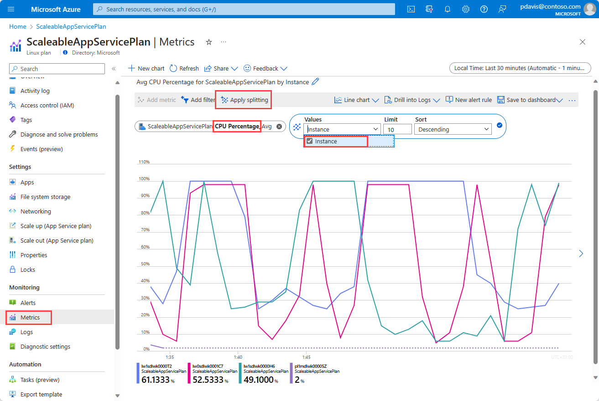
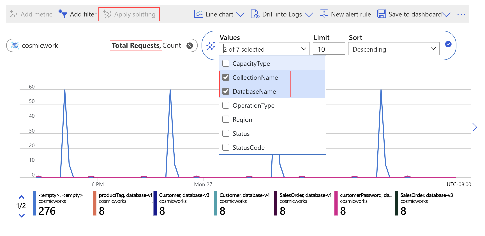

# Metric chart examples 

The Azure platform offers [over a thousand metrics](./metrics-supported.md), many of which have dimensions. By using [dimension filters](./metrics-charts.md), applying [splitting](./metrics-charts.md), controlling chart type, and adjusting chart settings you can create powerful diagnostic views and dashboards that provide insight into the health of your infrastructure and applications. This article shows some examples of the charts that you can build using [Metrics Explorer](./metrics-charts.md) and explains the necessary steps to configure each of these charts.

Want to share your great charts examples with the world? Contribute to this page on GitHub and share your own chart examples here!

## Website CPU utilization by server instances

This chart shows if CPU for an App Service was within the acceptable range and breaks it down by instance to determine whether the load was properly distributed. You can see from the chart that the app was running on a single server instance before 6 AM, and then scaled up by adding another instance.

### How to configure this chart?

Select your App Service resource and find the **CPU Percentage** metric. Then click on **Apply splitting** and select the **Instance** dimension.

## Application availability by region

View your application's availability by region to identify which geographic locations are having problems. This chart shows the Application Insights availability metric. You can see that the monitored application has no problem with availability from the East US datacenter, but it is experiencing a partial availability problem from West US, and East Asia.

### How to configure this chart?

You first need to turn on [Application Insights availability](/previous-versions/azure/azure-monitor/app/monitor-web-app-availability) monitoring for your website. After that, pick your Application Insights resource and select the Availability metric. Apply splitting on the **Run location** dimension.

## Volume of failed storage account transactions by API name

Your storage account resource is experiencing an excess volume of failed transactions. You can use the transactions metric to identify which API is responsible for the excess failure. Notice that the following chart is configured with the same dimension (API name) in splitting and filtered by failed response type:

### How to configure this chart?

In the metric picker, select your storage account and the **Transactions** metric. Switch chart type to **Bar chart**. Click **Apply splitting** and select dimension **API name**. Then click on the **Add filter** and pick the **API name** dimension once again. In the filter dialog, select the APIs that you want to plot on the chart.

## Total requests of Cosmos DB by Database Names and Collection Names

You want to identify which collection in which database of your Cosmos DB instance is having maximum requests to adjust your costs for Cosmos DB.

### How to configure this chart?

In the metric picker, select your Cosmos DB resource and the **Total Requests** metric. Click **Apply splitting** and select dimensions **DatabaseName** and **CollectionName**.

## Next steps

* Learn about Azure Monitor [Workbooks](../visualize/workbooks-overview.md)
* Learn more about [Metric Explorer](metrics-charts.md)
