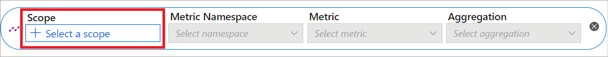
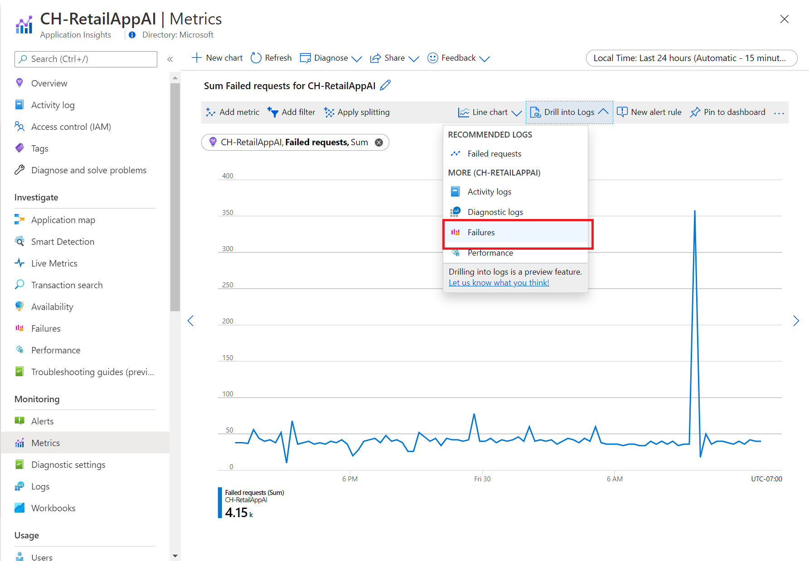

# Advanced features of Metrics Explorer in Azure Monitor

> [!NOTE]
> This article assumes you're familiar with basic features of the Metrics Explorer feature of Azure Monitor. If you're a new user and want to learn how to create your first metric chart, see [Getting started with the Metrics Explorer](./metrics-getting-started.md).

In Azure Monitor, [metrics](data-platform-metrics.md) are a series of measured values and counts that are collected and stored over time. Metrics can be standard (also called "platform") or custom. 

Standard metrics are provided by the Azure platform. They reflect the health and usage statistics of your Azure resources. 

## Resource scope picker

The resource scope picker allows you to view metrics across single resources and multiple resources. The following sections explain how to use the resource scope picker. 

### Select a single resource

In the Azure portal, select **Metrics** from the **Monitor** menu or from the **Monitoring** section of a resource's menu. Then choose **Select a scope** to open the scope picker.

Use the scope picker to select the resources whose metrics you want to see. If you opened the Azure Metrics Explorer from a resource's menu, the scope should be populated.

For some resources, you can view only one resource's metrics at a time. In the **Resource types** menu, these resources are in the **All resource types** section.

After selecting a resource, you see all subscriptions and resource groups that contain that resource.

> [!TIP]
> If you want the capability to view the metrics for multiple resources at the same time, or to view metrics across a subscription or resource group, select **Upvote**.

When you're satisfied with your selection, select **Apply**.

### Select multiple resources

Some resource types can query for metrics over multiple resources. The resources must be within the same subscription and location. Find these resource types at the top of the **Resource types** menu. 

For more information, see [Select multiple resources](./metrics-dynamic-scope.md#select-multiple-resources).

For types that are compatible with multiple resources, you can query for metrics across a subscription or multiple resource groups. For more information, see [Select a resource group or subscription](./metrics-dynamic-scope.md#select-a-resource-group-or-subscription).

## Multiple metric lines and charts

In the Azure Metrics Explorer, you can create charts that plot multiple metric lines or show multiple metric charts at the same time. This functionality allows you to:

- Correlate related metrics on the same graph to see how one value relates to another.
- Display metrics that use different units of measure in close proximity.
- Visually aggregate and compare metrics from multiple resources.

For example, imagine you have five storage accounts, and you want to know how much space they consume together. You can create a stacked area chart that shows the individual values and the sum of all the values at points in time.

### Multiple metrics on the same chart

To view multiple metrics on the same chart, first [create a new chart](./metrics-getting-started.md#create-your-first-metric-chart). Then select **Add metric**. Repeat this step to add another metric on the same chart.

> [!NOTE]
> Typically, your charts shouldn't mix metrics that use different units of measure. For example, avoid mixing one metric that uses milliseconds with another that uses kilobytes. Also avoid mixing metrics whose scales differ significantly. 
>
> In these cases, consider using multiple charts instead. In Metrics Explorer, select **New chart** to create a new chart.

### Multiple charts

To create another chart that uses a different metric, select **New chart**.

To reorder or delete multiple charts, select the ellipsis (**...**) button to open the chart menu. Then choose **Move up**, **Move down**, or **Delete**.

## Time range controls

In addition to changing the time range using the [time picker panel](metrics-getting-started.md#select-a-time-range), you can also pan and zoom using the controls in the chart area.

### Pan

To pan, select the left and right arrows at the edge of the chart.  The arrow control moves the selected time range back and forward by one half the chart's time span.  For example, if you're viewing the past 24 hours, clicking on the left arrow causes the time range to shift to span a day and a half to 12 hours ago.

Most metrics support 93 days of retention but only let you view 30 days at a time.  Using the pan controls, you look at the past 30 days and then easily walk back 15 days at a time to view the rest of the retention period.

### Zoom

You can select and drag on the chart to zoom into a section of a chart. Zooming updates the chart's time range to span your selection. If the time grain is set to Automatic, zooming selects a smaller time grain. The new time range applies to all charts in Metrics.

## Aggregation

When you add a metric to a chart, Metrics Explorer applies a default aggregation. The default makes sense in basic scenarios, but you can use a different aggregation to gain more insights about the metric.

Before you use different aggregations on a chart, you should understand how Metrics Explorer handles them. Metrics are a series of measurements (or "metric values") that are captured over a time period. When you plot a chart, the values of the selected metric are separately aggregated over the *time granularity*.

You select the size of the time grain by using Metrics Explorer's time picker panel. If you don't explicitly select the time grain, the currently selected time range is used by default. After the time grain is determined, the metric values that were captured during each time grain are aggregated on the chart, one data point per time grain.

:::image type="content" source="media/metrics-charts/time-granularity.png" alt-text="A screenshot showing the time range and granularity selector.":::  

For example, suppose a chart shows the *Server response time* metric. It uses the *average* aggregation over time span of the *last 24 hours*. In this example:

- If the time granularity is set to 30 minutes, the chart is drawn from 48 aggregated data points. That is, 2 data points per hour for 24 hours. The line chart connects 48 dots in the chart plot area. Each data point represents the *average* of all captured response times for server requests that occurred during each of the relevant 30-minute time periods.
- If you switch the time granularity to 15 minutes, you get 96 aggregated data points.  That is, 4 data points per hour for 24 hours.

Metrics Explorer has five aggregation types:
- **Sum**: The sum of all values captured during the aggregation interval. The *sum* aggregation is sometimes called the *total* aggregation.
- **Count**: The number of measurements captured during the aggregation interval.
  When the metric is always captured with the value of 1, the count aggregation is equal to the sum aggregation. This scenario is common when the metric tracks the count of distinct events and each measurement represents one event. The code emits a metric record every time a new request arrives.
- **Average**: The average of the metric values captured during the aggregation interval.
- **Min**: The smallest value captured during the aggregation interval.
- **Max**: The largest value captured during the aggregation interval.

  :::image type="content" source="media/metrics-charts/aggregations.png" alt-text="A screenshot showing the aggregation dropdown." lightbox="media/metrics-charts/aggregations.png":::

Metrics Explorer hides the aggregations that are irrelevant and can't be used. 

For a deeper discussion of how metric aggregation works, see [Azure Monitor metrics aggregation and display explained](metrics-aggregation-explained.md).

## Filters

You can apply filters to charts whose metrics have dimensions. For example, imagine a *Transaction count* metric that has a *Response type* dimension. This dimension indicates whether the response from transactions succeeded or failed. If you filter on this dimension, a chart line is displayed for only successful or only failed transactions.

### Add a filter

1. Above the chart, select **Add filter**.

1. Select a dimension from the **Property** dropdown to filter.

   :::image type="content" source="./media/metrics-charts/filter-property.png" alt-text="Screenshot that shows the filter properties dropdown." lightbox="./media/metrics-charts/filter-property.png":::

1. Select the operator you want to apply against the dimension (property). The default operator is = (equals)
  :::image type="content" source="./media/metrics-charts/filter-operator.png" alt-text="Screenshot that shows the operator you can use with the filter." lightbox="./media/metrics-charts/filter-operator.png":::

1. Select which dimension values you want to apply to the filter when plotting the chart. This example shows filtering out the successful storage transactions.
    :::image type="content" source="./media/metrics-charts/filter-values.png" alt-text="Screenshot that shows the filter values dropdown." lightbox="./media/metrics-charts/filter-values.png":::  

1. After selecting the filter values, click away from the filter selector to close it. The chart shows how many storage transactions have failed:
    :::image type="content" source="./media/metrics-charts/filtered-chart.png" alt-text="Screenshot that shows the successful filtered storage transactions." lightbox="./media/metrics-charts/filtered-chart.png":::

1. Repeat these steps to apply multiple filters to the same charts.

## Metric splitting

You can split a metric by dimension to visualize how different segments of the metric compare. Splitting can also help you identify the outlying segments of a dimension.

### Apply splitting

1. Above the chart, select **Apply splitting**.
   
1. Choose dimensions on which to segment your chart:
    :::image type="content" source="./media/metrics-charts/apply-splitting.png" alt-text="Screenshot that shows the selected dimension on which to segment the chart." lightbox="./media/metrics-charts/apply-splitting.png":::

   The chart shows multiple lines, one for each dimension segment:
    :::image type="content" source="./media/metrics-charts/segment-dimension.png" alt-text="Screenshot that shows multiple lines, one for each segment of dimension." lightbox="./media/metrics-charts/segment-dimension.png":::

1. Choose a limit on the number of values to be displayed after splitting by selected dimension. The default limit is 10 as shown in the above chart. The range of limit is 1 - 50.
       :::image type="content" source="./media/metrics-charts/segment-dimension-limit.png" alt-text="Screenshot that shows split limit, which restricts the number of values after splitting." lightbox="./media/metrics-charts/segment-dimension-limit.png":::

1. Choose the sort order on segments: **Ascending** or **Descending**. The default selection is **Descending**.

 
    :::image type="content" source="./media/metrics-charts/segment-dimension-sort.png" alt-text="Screenshot that shows sort order on split values." lightbox="./media/metrics-charts/segment-dimension-sort.png":::

1. Segment by multiple segments by selecting multiple dimensions from the values dropdown. The legends shows a comma-separated list of dimension values for each segment
    :::image type="content" source="./media/metrics-charts/segment-dimension-multiple.png" alt-text="Screenshot that shows multiple segments selected, and the corresponding chart." lightbox="./media/metrics-charts/segment-dimension-multiple.png":::
   
1. Click away from the grouping selector to close it.

   > [!TIP]
   > To hide segments that are irrelevant for your scenario and to make your charts easier to read, use both filtering and splitting on the same dimension.

## Locking the range of the y-axis

Locking the range of the value (y) axis becomes important in charts that show small fluctuations of large values.

For example, a drop in the volume of successful requests from 99.99 percent to 99.5 percent might represent a significant reduction in the quality of service. Noticing a small numeric value fluctuation would be difficult or even impossible if you're using the default chart settings. In this case, you could lock the lowest boundary of the chart to 99 percent to make a small drop more apparent.

Another example is a fluctuation in the available memory. In this scenario, the value technically never reaches 0. Fixing the range to a higher value might make drops in available memory easier to spot. 

1. To control the y-axis range, open the chart menu **...**. Then select **Chart settings** to access advanced chart settings.
  :::image source="./media/metrics-charts/select-chart-settings.png" alt-text="Screenshot that highlights the chart settings selection." lightbox="./media/metrics-charts/select-chart-settings.png":::

1. Modify the values in the **Y-axis range** section, or select **Auto** to revert to the default values.
  :::image type="content" source="./media/metrics-charts/chart-settings.png" alt-text="Screenshot that shows the Y-axis range section." lightbox="./media/metrics-charts/chart-settings.png"::: 
 

> [!NOTE]
> If you lock the boundaries of the y-axis for charts that tracks count, sum, min, or max aggregations over a period of time, specify a fixed time granularity. Don't rely on the automatic defaults.  
>
> A fixed time granularity is chosen because chart values change when the time granularity is automatically modified when a user resizes a browser window or changes screen resolution. The resulting change in time granularity affects the appearance of the chart, invalidating the selection of the y-axis range.

## Line colors

Chart lines are automatically assigned a color from a default palette.  

To change the color of a chart line, select the colored bar in the legend that corresponds to the line on the chart. Use the color picker to select the line color.

:::image source="./media/metrics-charts/line-colors.png" alt-text="Screenshot that shows how to change color." lightbox="./media/metrics-charts/line-colors.png":::

Customized colors are preserved when you pin the chart to a dashboard. The following section shows how to pin a chart.

## Saving to dashboards or workbooks

After you configure a chart, you can add it to a dashboard or workbook. By adding a chart to a dashboard or workbook, you can make it accessible to your team.  You can also gain insights by viewing it in the context of other monitoring information.

- To pin a configured chart to a dashboard, in the upper-right corner of the chart, select **Save to dashboard** and then **Pin to dashboard**.
- To save a configured chart to a workbook, in the upper-right corner of the chart, select **Save to dashboard** and then **Save to workbook**.

:::image type="content" source="media/metrics-charts/save-to-dashboard.png" alt-text="Screenshot showing how to pin a chart to a dashboard." lightbox="media/metrics-charts/save-to-dashboard.png":::

## Alert rules

You can use your visualization criteria to create a metric-based alert rule. The new alert rule includes your chart's target resource, metric, splitting, and filter dimensions. You can modify these settings by using the alert rule creation pane.

To create an alert rule,
1. Select **New alert rule** in the upper-right corner of the chart
:::image source="./media/metrics-charts/new-alert.png" alt-text="Screenshot that shows the New alert rule button." lightbox="./media/metrics-charts/new-alert.png":::

1. On the **Condition** tab, the **Signal name** is defaulted to the metric from your chart. You can choose a different metric.

1. Enter a **Threshold value**. The threshold value is the value that triggers the alert. The Preview chart shows the threshold value as a horizontal line over the metric values.

1. Select the **Details** tab.
:::image source="./media/metrics-charts/alert-rule-condition.png" alt-text="Screenshot that shows the condition tab on the rule creation page." lightbox="./media/metrics-charts/alert-rule-condition.png":::

1. On the **Details** tab, enter a **Name** and **Description** for the alert rule.

1. Select a **Severity** level for the alert rule. Severities include Critical, Error Warning, Informational, and Verbose.  

1. Select **Review + create** to review the alert rule, then select **Create** to create the alert rule.
:::image source="./media/metrics-charts/alert-rule-details.png" alt-text="Screenshot that shows the details tab on the rule creation page." lightbox="./media/metrics-charts/alert-rule-details.png":::

For more information, see [Create, view, and manage metric alerts](../alerts/alerts-metric.md).

## Correlate metrics to logs

**Drill into Logs** helps you diagnose the root cause of anomalies in your metrics chart. Drilling into logs allows you to correlate spikes in your metrics chart to logs and queries.

The following table summarizes the types of logs and queries provided:

| Term             | Definition  | 
|------------------|-------------|
| Activity logs    | Provides insight into the operations on each Azure resource in the subscription from the outside (the management plane) in addition to updates on Service Health events. Use the Activity log to determine the what, who, and when for any write operations (PUT, POST, DELETE) taken on the resources in your subscription. There's a single Activity log for each Azure subscription.  |
| Diagnostic log   | Provides insight into operations that were performed within an Azure resource (the data plane). For example, getting a secret from a Key Vault or making a request to a database. The content of resource logs varies by the Azure service and resource type. You must enable logs for the resource. |  
| Recommended log | Scenario-based queries that you can use to investigate anomalies in Metrics Explorer.  |

Currently, Drill into Logs is available for select resource providers. The following resource providers offer the complete Drill into Logs experience:

- Application Insights
- Autoscale
- App Services
- Storage

    :::image source="./media/metrics-charts/drill-into-log-ai.png" alt-text="Screenshot that shows a spike in failures in app insights metrics pane." lightbox="./media/metrics-charts/drill-into-log-ai.png":::

1. To diagnose the spike in failed requests, select **Drill into Logs**.

   

1. Select **Failures** to open a custom failure pane that provides you with the failed operations, top exceptions types, and dependencies.

   

## Next steps

To create actionable dashboards by using metrics, see [Creating custom KPI dashboards](../app/tutorial-app-dashboards.md).
