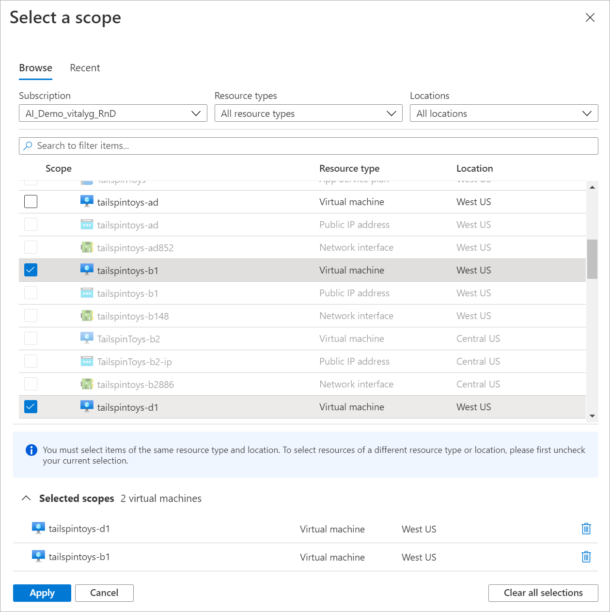
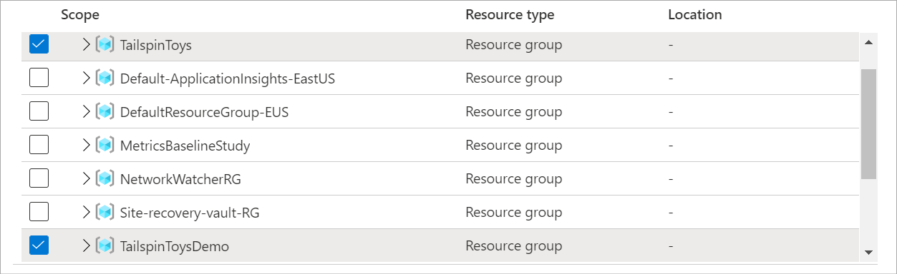
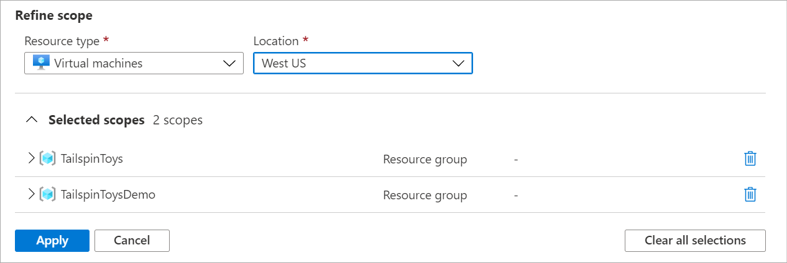

# View multiple resources in the Azure metrics explorer

The resource scope picker allows you to view metrics across multiple resources that are within the same subscription and region. This article explains how to view multiple resources by using the Azure metrics explorer feature of Azure Monitor. 

## Select a resource 

Select **Metrics** from the **Azure Monitor** menu or from the **Monitoring** section of a resource's menu. Then choose **Select a scope** to open the scope picker. 

Use the scope picker to select the resources whose metrics you want to see. The scope should be populated if you opened the metrics explorer from a resource's menu. 

## Select multiple resources 

Some resource types can query for metrics over multiple resources. The metrics must be within the same subscription and location. Find these resource types at the top of the **Resource types** menu.

> [!WARNING] 
> You must have Monitoring Reader permission at the subscription level to visualize metrics across multiple resources, resource groups, or a subscription. For more information, see [Assign Azure roles using the Azure portal](../../role-based-access-control/role-assignments-portal.md).

To visualize metrics over multiple resources, start by selecting multiple resources within the resource scope picker. 

> [!NOTE]
> The resources you select must be within the same resource type, location, and subscription. Resources that don't fit these criteria aren't selectable. 

When you finish, choose **Apply** to save your selections. 

## Select a resource group or subscription 

> [!WARNING]
> You must have Monitoring Reader permission at the subscription level to visualize metrics across multiple resources, resource groups, or a subscription. 

For types that are compatible with multiple resources, you can query for metrics across a subscription or multiple resource groups. Start by selecting a subscription or one or more resource groups: 

Select a resource type and location. 

You can expand the selected scopes to verify the resources your selections apply to.

When you finish selecting scopes, select **Apply**. 

## Split and filter by resource group or resources

After plotting your resources, you can use splitting and filtering to gain more insight into your data. 

Splitting allows you to visualize how different segments of the metric compare with each other. For instance, when you plot a metric for multiple resources, you can choose **Apply splitting** to split by resource ID or resource group. The split allows you to compare a single metric across multiple resources or resource groups.  

For example, the following chart shows the percentage CPU across nine VMs. When you split by resource ID, you see how percentage CPU differs by VM. 

Along with splitting, you can use filtering to display only the resource groups that you want to see.  For instance, to view the percentage CPU for VMs for a certain resource group, you can select **Add filter** to filter by resource group. 

In this example, we filter by TailspinToysDemo. Here, the filter removes metrics associated with resources in TailspinToys. 

## Pin multiple-resource charts 

Multiple-resource charts that visualize metrics across resource groups and subscriptions require the user to have *Monitoring Reader* permission at the subscription level. Ensure that all users of the dashboards to which you pin multiple-resource charts have sufficient permissions. For more information, see [Assign Azure roles using the Azure portal](../../role-based-access-control/role-assignments-portal.md).

To pin your multiple-resource chart to a dashboard, see [Saving to dashboards or workbooks](../essentials/metrics-charts.md#saving-to-dashboards-or-workbooks). 

## Next steps

* [Troubleshoot the metrics explorer](../essentials/metrics-troubleshoot.md)
* [See a list of available metrics for Azure services](./metrics-supported.md)
* [See examples of configured charts](../essentials/metric-chart-samples.md)