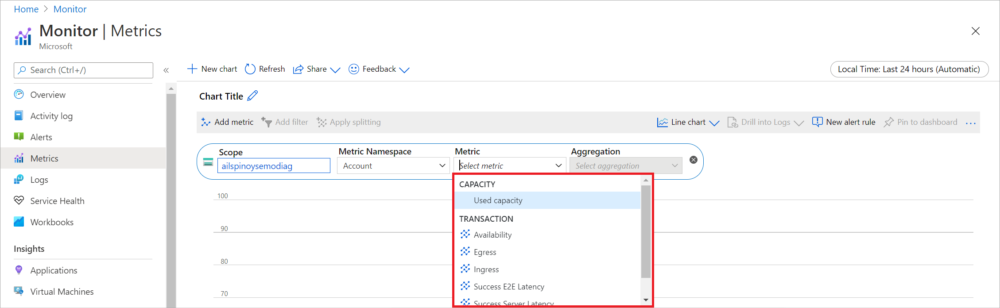
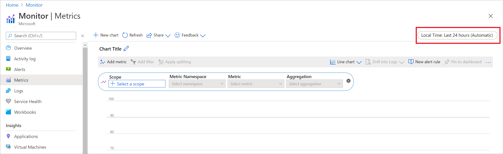

# Get started with metrics explorer

Azure Monitor metrics explorer is a component of the Azure portal that you can use to plot charts, visually correlate trends, and investigate spikes and dips in metrics' values. Use metrics explorer to investigate the health and utilization of your resources.

## Where do I start?

Start in the following order:

1. [Pick a resource and a metric](#create-your-first-metric-chart) and you see a basic chart. Then [select a time range](#select-a-time-range) that's relevant for your investigation.

1. Try [applying dimension filters and splitting](#apply-dimension-filters-and-splitting). The filters and splitting allow you to analyze which segments of the metric contribute to the overall metric value and identify possible outliers.

1. Use [advanced settings](#advanced-chart-settings) to customize the chart before you pin it to dashboards. [Configure alerts](../alerts/alerts-metric-overview.md) to receive notifications when the metric value exceeds or drops below a threshold.

## Create your first metric chart

To create a metric chart, from your resource, resource group, subscription, or Azure Monitor view, open the **Metrics** tab and follow these steps:

1. Select the **Select a scope** button to open the resource scope picker. You can use the picker to select the resources you want to see metrics for. The resource should already be populated if you opened metrics explorer from the resource's menu. To learn how to view metrics across multiple resources, see [View multiple resources in Azure Monitor metrics explorer](./metrics-dynamic-scope.md).

    > 

1. For some resources, you must pick a namespace. The namespace is a way to organize metrics so that you can easily find them. For example, storage accounts have separate namespaces for storing metrics for files, tables, blobs, and queues. Many resource types have only one namespace.

1. Select a metric from a list of available metrics.

    > 

1. Optionally, you can [change the metric aggregation](../essentials/metrics-charts.md#aggregation). For example, you might want your chart to show minimum, maximum, or average values of the metric.

> [!TIP]
> Select **Add metric** and repeat these steps to see multiple metrics plotted in the same chart. For multiple charts in one view, select **Add chart**.

## Select a time range

> [!WARNING]
> [Most metrics in Azure are stored for 93 days](../essentials/data-platform-metrics.md#retention-of-metrics). You can query no more than 30 days' worth of data on any single chart. You can [pan](metrics-charts.md#pan) the chart to view the full retention. The 30-day limitation doesn't apply to [log-based metrics](../app/pre-aggregated-metrics-log-metrics.md#log-based-metrics).

By default, the chart shows the most recent 24 hours of metrics data. Use the **time picker** panel to change the time range, zoom in, or zoom out on your chart.

> [!TIP]
> Use the **time brush** to investigate an interesting area of the chart like a spike or a dip. Position the mouse pointer at the beginning of the area, select and hold the left mouse button, drag to the other side of the area, and then release the button. The chart will zoom in on that time range.

## Apply dimension filters and splitting

[Filtering](../essentials/metrics-charts.md#filters) and [splitting](../essentials/metrics-charts.md#apply-splitting) are powerful diagnostic tools for the metrics that have dimensions. These features show how various metric segments ("dimension values") affect the overall value of the metric. You can use them to identify possible outliers.

- **Filtering** lets you choose which dimension values are included in the chart. For example, you might want to show successful requests when you chart the *server response time* metric. You apply the filter on the *success of request* dimension.
- **Splitting** controls whether the chart displays separate lines for each value of a dimension or aggregates the values into a single line. For example, you can see one line for an average response time across all server instances. Or you can see separate lines for each server. You apply splitting on the *server instance* dimension to see separate lines.

For examples that have filtering and splitting applied, see [Metric chart examples](../essentials/metric-chart-samples.md). The article shows the steps that were used to configure the charts.

## Share your metric chart

There are three ways to share your metric chart. See the following instructions on how to share information from your metric charts by using Excel, a link, or a workbook.

### Download to Excel

Select **Share** > **Download to Excel**. Your download should start immediately.

:::image type="content" source="media/metrics-getting-started/share-excel.png" alt-text="Screenshot that shows how to share a metric chart by using Excel.":::

### Share a link

Select **Share** > **Copy link**. You should get a notification that the link was copied successfully.

:::image type="content" source="media/metrics-getting-started/share-link.png" alt-text="Screenshot that shows how to share a metric chart by using a link.":::

### Send to workbook

Select **Share** > **Send to Workbook**. In the **Send to Workbook** window, you can send the metric chart to a new or existing workbook.

:::image type="content" source="media/metrics-getting-started/share-workbook.png" alt-text="Screenshot that shows how to share a metric chart to a workbook.":::

## Advanced chart settings

You can customize the chart style and title, and modify advanced chart settings. When you're finished with customization, pin the chart to a dashboard or save it to a workbook. You can also configure metrics alerts. Follow [product documentation](../essentials/metrics-charts.md) to learn about these and other advanced features of Azure Monitor metrics explorer.

## Next steps

* [Learn about advanced features of metrics explorer](../essentials/metrics-charts.md)
* [Viewing multiple resources in metrics explorer](./metrics-dynamic-scope.md)
* [Troubleshooting metrics explorer](metrics-troubleshoot.md)
* [See a list of available metrics for Azure services](./metrics-supported.md)
* [See examples of configured charts](../essentials/metric-chart-samples.md)
