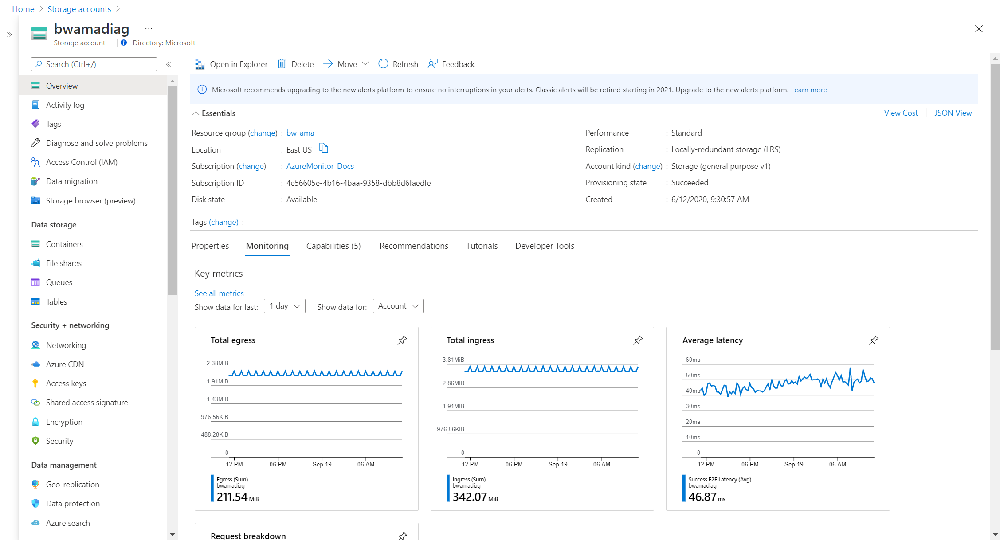

# Monitor Azure resources with Azure Monitor

When you have critical applications and business processes that rely on Azure resources, you want to monitor those resources for their availability, performance, and operation. Azure Monitor is a full-stack monitoring service that provides a complete set of features to monitor your Azure resources. You can also use Azure Monitor to monitor resources in other clouds and on-premises.

In this article, you learn about:

> [!div class="checklist"]
> * Azure Monitor and how it's integrated into the portal for other Azure services.
> * The types of data collected by Azure Monitor for Azure resources.
> * Azure Monitor tools that are used to collect and analyze data.

> [!NOTE]
> This article describes Azure Monitor concepts and walks you through different menu items. To jump right into using Azure Monitor features, start with [Analyze metrics for an Azure resource](../essentials/tutorial-metrics.md).

## Monitoring data

This section discusses collecting and monitoring data.

### Azure Monitor data collection

As soon as you create an Azure resource, Azure Monitor is enabled and starts collecting metrics and activity logs. With some configuration, you can gather more monitoring data and enable other features. The Azure Monitor data platform is made up of Metrics and Logs. Each feature collects different kinds of data and enables different Azure Monitor features.

- [Azure Monitor Metrics](../essentials/data-platform-metrics.md) stores numeric data from monitored resources into a time-series database. The metric database is automatically created for each Azure subscription. Use [Metrics Explorer](../essentials/tutorial-metrics.md) to analyze data from Azure Monitor Metrics.
- [Azure Monitor Logs](../logs/data-platform-logs.md) collects logs and performance data where they can be retrieved and analyzed in different ways by using log queries. You must create a Log Analytics workspace to collect log data. Use [Log Analytics](../logs/log-analytics-tutorial.md) to analyze data from Azure Monitor Logs.

###  Monitor data from Azure resources

While resources from different Azure services have different monitoring requirements, they generate monitoring data in the same formats so that you can use the same Azure Monitor tools to analyze all Azure resources.

Diagnostic settings define where resource logs and metrics for a particular resource should be sent. Possible destinations are:

- [Activity log](./platform-logs-overview.md): Subscription-level events that track operations for each Azure resource, for example, creating a new resource or starting a virtual machine. Activity log events are automatically generated and collected for viewing in the Azure portal. You can create a diagnostic setting to send the activity log to Azure Monitor Logs.
- [Platform metrics](../essentials/data-platform-metrics.md): Numerical values that are automatically collected at regular intervals and describe some aspect of a resource at a particular time. Platform metrics are automatically generated and collected in Azure Monitor Metrics.
- [Resource logs](./platform-logs-overview.md): Provide insight into operations that were performed by an Azure resource. Operation examples might be getting a secret from a key vault or making a request to a database. Resource logs are generated automatically, but you must create a diagnostic setting to send them to Azure Monitor Logs.
- [Virtual machine guest metrics and logs](): Performance and log data from the guest operating system of Azure virtual machines. You must install an agent on the virtual machine to collect this data and send it to Azure Monitor Metrics and Azure Monitor Logs.

## Menu options

You can access Azure Monitor features from the **Monitor** menu in the Azure portal. You can also access Azure Monitor features directly from the menu for different Azure services. Different Azure services might have slightly different experiences, but they share a common set of monitoring options in the Azure portal. These menu items include **Overview** and **Activity log** and multiple options in the **Monitoring** section of the menu.

:::image type="content" source="media/monitor-azure-resource/menu-01.png" lightbox="media/monitor-azure-resource/menu-01.png" alt-text="Screenshot that shows the Overview and Activity log menu items.":::

:::image type="content" source="media/monitor-azure-resource/menu-02.png" lightbox="media/monitor-azure-resource/menu-02.png" alt-text="Screenshot that shows the Monitoring menu.":::

## Overview page

The **Overview** page includes details about the resource and often its current state. For example, a virtual machine shows its current running state. Many Azure services have a **Monitoring** tab that includes charts for a set of key metrics. Charts are a quick way to view the operation of the resource. You can select any of the charts to open them in Metrics Explorer for more detailed analysis.

To learn how to use Metrics Explorer, see [Analyze metrics for an Azure resource](../essentials/tutorial-metrics.md).

### Activity log

The **Activity log** menu item lets you view entries in the [activity log](../essentials/activity-log.md) for the current resource.

:::image type="content" source="media/monitor-azure-resource/activity-log.png" lightbox="media/monitor-azure-resource/activity-log.png" alt-text="Screenshot that shows an activity log.":::

## Alerts

The **Alerts** page shows you any recent alerts that were fired for the resource. Alerts proactively notify you when important conditions are found in your monitoring data and can use data from either Metrics or Logs.

To learn how to create alert rules and view alerts, see [Create a metric alert for an Azure resource](../alerts/tutorial-metric-alert.md) or [Create a log query alert for an Azure resource](../alerts/tutorial-log-alert.md).

:::image type="content" source="media/monitor-azure-resource/alerts-view.png" lightbox="media/monitor-azure-resource/alerts-view.png" alt-text="Screenshot that shows the Alerts page.":::

## Metrics

The **Metrics** menu item opens [Metrics Explorer](./metrics-getting-started.md). You can use it to work with individual metrics or combine multiple metrics to identify correlations and trends. This is the same Metrics Explorer that opens when you select one of the charts on the **Overview** page.

To learn how to use Metrics Explorer, see [Analyze metrics for an Azure resource](../essentials/tutorial-metrics.md).

:::image type="content" source="media/monitor-azure-resource/metrics.png" lightbox="media/monitor-azure-resource/metrics.png" alt-text="Screenshot that shows Metrics Explorer.":::

## Diagnostic settings

The **Diagnostic settings** page lets you create a [diagnostic setting](../essentials/diagnostic-settings.md) to collect the resource logs for your resource. You can send them to multiple locations, but the most common use is to send them to a Log Analytics workspace so you can analyze them with Log Analytics.

To learn how to create a diagnostic setting, see [Collect and analyze resource logs from an Azure resource](../essentials/tutorial-resource-logs.md).

:::image type="content" source="media/monitor-azure-resource/diagnostic-settings.png" lightbox="media/monitor-azure-resource/diagnostic-settings.png" alt-text="Screenshot that shows the Diagnostic settings page.":::

## Insights

The **Insights** menu item opens the insight for the resource if the Azure service has one. [Insights](../monitor-reference.md) provide a customized monitoring experience built on the Azure Monitor data platform and standard features.

For a list of insights that are available and links to their documentation, see [Insights](../insights/insights-overview.md) and [core solutions](/previous-versions/azure/azure-monitor/insights/solutions).

:::image type="content" source="media/monitor-azure-resource/insights.png" lightbox="media/monitor-azure-resource/insights.png" alt-text="Screenshot that shows the Insights page.":::

## Next steps

Now that you have a basic understanding of Azure Monitor, get started analyzing some metrics for an Azure resource.

> [!div class="nextstepaction"]
> [Analyze metrics for an Azure resource](../essentials/tutorial-metrics.md)
