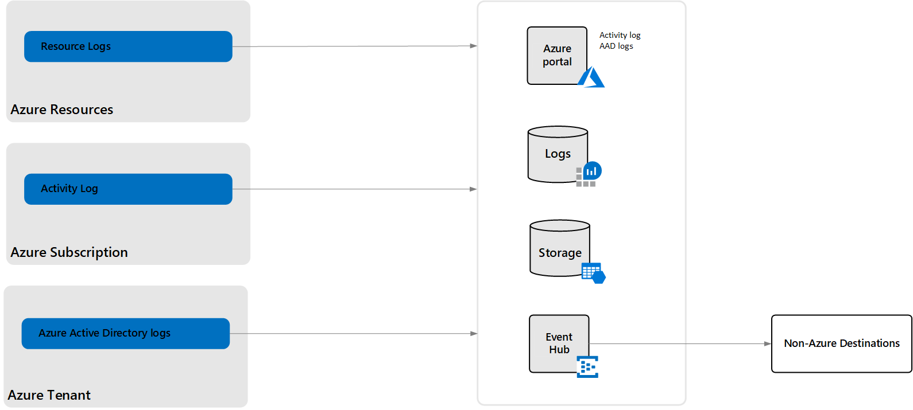

# Overview of Azure platform logs

Platform logs provide detailed diagnostic and auditing information for Azure resources and the Azure platform they depend on. Although they're automatically generated, you need to configure certain platform logs to be forwarded to one or more destinations to be retained. This article provides an overview of platform logs including what information they provide and how you can configure them for collection and analysis.

## Types of platform logs

The following table lists the specific platform logs that are available at different layers of Azure.

| Log | Layer | Description |
|:---|:---|:---|
| [Resource logs](./resource-logs.md) | Azure Resources | Provide insight into operations that were performed within an Azure resource (the *data plane*). Examples might be getting a secret from a key vault or making a request to a database. The content of resource logs varies by the Azure service and resource type.  *Resource logs were previously referred to as diagnostic logs.*  |
| [Activity log](../essentials/activity-log.md) | Azure Subscription | Provides insight into the operations on each Azure resource in the subscription from the outside (the *management plane*) in addition to updates on Service Health events. Use the Activity log to determine the _what_, _who_, and _when_ for any write operations (PUT, POST, DELETE) taken on the resources in your subscription. There's a single activity log for each Azure subscription. |
| [Azure Active Directory (Azure AD) logs](../../active-directory/reports-monitoring/overview-reports.md) | Azure Tenant |  Contain the history of sign-in activity and audit trail of changes made in Azure AD for a particular tenant.   |

> [!NOTE]
> The Azure activity log is primarily for activities that occur in Azure Resource Manager. It doesn't track resources by using the classic/RDFE model. Some classic resource types have a proxy resource provider in Resource Manager (for example, Microsoft.ClassicCompute). If you interact with a classic resource type through Resource Manager by using these proxy resource providers, the operations appear in the activity log. If you interact with a classic resource type outside of the Resource Manager proxies, your actions are only recorded in the Operation log. The Operation log can be browsed in a separate section of the portal.

## View platform logs

There are different options for viewing and analyzing the different Azure platform logs:

- View the activity log in the Azure portal and access events from PowerShell and the Azure CLI. See [View the activity log](../essentials/activity-log.md#view-the-activity-log) for details.
- View Azure AD security and activity reports in the Azure portal. See [What are Azure AD reports?](../../active-directory/reports-monitoring/overview-reports.md) for details.
- Resource logs are automatically generated by supported Azure resources. They aren't available to be viewed unless you create a [diagnostic setting](#diagnostic-settings).

## Diagnostic settings

Create a [diagnostic setting](../essentials/diagnostic-settings.md) to send platform logs to one of the following destinations for analysis or other purposes. Resource logs must have a diagnostic setting to be used because they have no other way of being viewed.

| Destination | Description |
|:---|:---|
| Log Analytics workspace | Analyze the logs of all your Azure resources together and take advantage of all the features available to [Azure Monitor Logs](../logs/data-platform-logs.md) including [log queries](../logs/log-query-overview.md) and [log alerts](../alerts/alerts-log.md). Pin the results of a log query to an Azure dashboard or include it in a workbook as part of an interactive report. |
| Event hub | Send platform log data outside of Azure, for example, to a third-party SIEM or custom telemetry platform. |
| Azure Storage | Archive the logs for audit or backup. |
| [Azure Monitor partner integrations](../../partner-solutions/overview.md)| Specialized integrations between Azure Monitor and other non-Microsoft monitoring platforms. Useful when you're already using one of the partners.  |

- For details on how to create a diagnostic setting for activity logs or resource logs, see [Create diagnostic settings to send platform logs and metrics to different destinations](../essentials/diagnostic-settings.md).
- For details on how to create a diagnostic setting for Azure AD logs, see the following articles:
  - [Integrate Azure AD logs with Azure Monitor logs](../../active-directory/reports-monitoring/howto-integrate-activity-logs-with-log-analytics.md)
  - [Tutorial: Stream Azure AD logs to an Azure event hub](../../active-directory/reports-monitoring/tutorial-azure-monitor-stream-logs-to-event-hub.md)
  - [Tutorial: Archive Azure AD logs to an Azure Storage account](../../active-directory/reports-monitoring/quickstart-azure-monitor-route-logs-to-storage-account.md)

## Pricing model

Processing data to stream logs is charged for [certain services](resource-logs-categories.md#costs) when sent to destinations other than a Log Analytics workspace. There's no direct charge when this data is sent to a Log Analytics workspace. There is a Log Analytics charge for ingesting the data into a workspace.

The charge is based on the number of bytes in the exported JSON-formatted log data, measured in GB (10^9 bytes).

Pricing is available on the [Azure Monitor pricing page](https://azure.microsoft.com/pricing/details/monitor/).

## Next steps

* [Read more details about activity logs](../essentials/activity-log.md)
* [Read more details about resource logs](./resource-logs.md)
