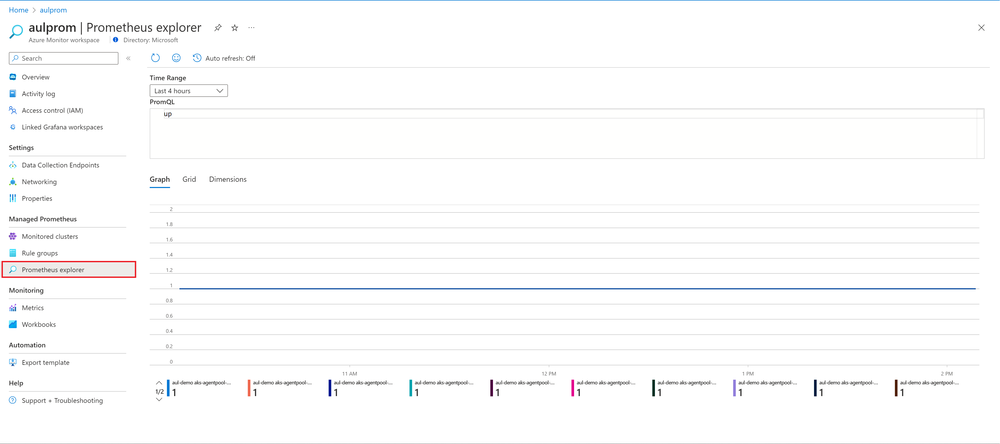
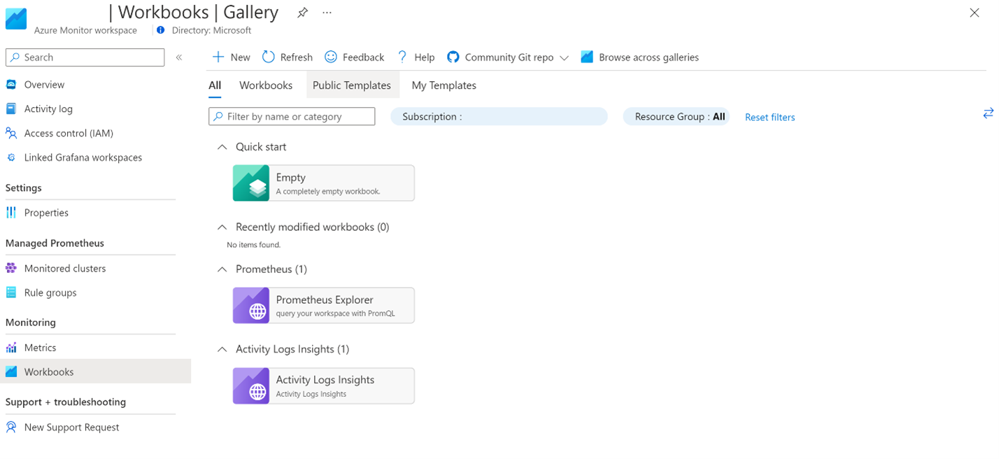
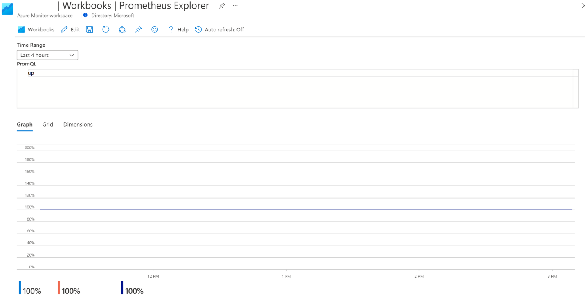
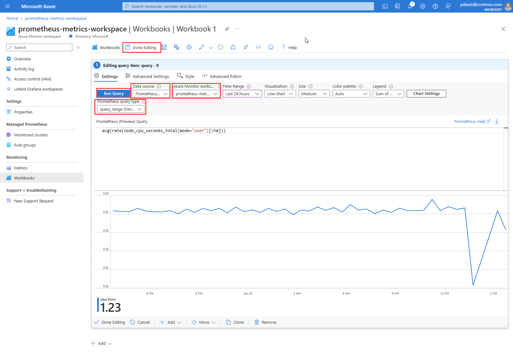

# Query Prometheus metrics using Azure workbooks

Create dashboards powered by Azure Monitor managed service for Prometheus using [Azure Workbooks](../visualize/workbooks-overview.md).
This article introduces workbooks for Azure Monitor workspaces and shows you how to query Prometheus metrics using Azure workbooks and the Prometheus query language (PromQL).

## Prerequisites
To query Prometheus metrics from an Azure Monitor workspace, you need the following:
-	An Azure Monitor workspace. To create an Azure Monitor workspace, see [Create an Azure Monitor Workspace](./azure-monitor-workspace-overview.md?tabs=azure-portal.md).
-	Your Azure Monitor workspace must be [collecting Prometheus metrics](./prometheus-metrics-enable.md) from an AKS cluster.
-	The user must be assigned role that can perform the **microsoft.monitor/accounts/read** operation on the Azure Monitor workspace.

## Prometheus Explorer workbook
Azure Monitor workspaces include an exploration workbook to query your Prometheus metrics. 

1. From the Azure Monitor workspace overview page, select **Prometheus explorer**

    
2. Or the **Workbooks** menu item, and in the Azure Monitor workspace gallery, select the **Prometheus Explorer** workbook tile.

A workbook has the following input options:
-	**Time Range**. Select the period of time that you want to include in your query. Select **Custom** to set a start and end time.
-	**PromQL**. Enter the PromQL query to retrieve your data. For more information about PromQL, see [Querying Prometheus](https://prometheus.io/docs/prometheus/latest/querying/basics/#querying-prometheus).
-	**Graph**, **Grid**, and **Dimensions** tabs. Switch between a graphic, tabular, and dimensional view of the query output.

## Create a Prometheus workbook

Workbooks support many visualizations and Azure integrations. For more information about Azure Workbooks, see [Creating an Azure Workbook](../visualize/workbooks-create-workbook.md).  

1.	From your Azure Monitor workspace, select **Workbooks**.

1.  Select **New**.
1.	In the new workbook, select **Add**, and select **Add query** from the dropdown.
:::image type="content" source="./media/prometheus-workbooks/prometheus-workspace-add-query.png" alt-text="A screenshot showing the add content dropdown in a blank workspace.":::    
1. Azure Workbooks use [data sources](../visualize/workbooks-data-sources.md#prometheus-preview) to set the source scope the data they present. To query Prometheus metrics, select the  **Data source** dropdown, and choose **Prometheus** .
1.	From the **Azure Monitor workspace** dropdown, select your workspace.
1.	Select your query type from **Prometheus query type** dropdown.
1.	Write your PromQL query in the **Prometheus Query** field. 
1.	Select **Run Query** button.
1.	Select the **Done Editing** at the bottom of the section and save your work

## Troubleshooting

If you receive a message indicating that "You currently do not have any Prometheus data ingested to this Azure Monitor workspace":

-	Verify that you have turned on metrics collection in the Monitored clusters blade of your Azure Monitor workspace.

If your workbook query does not return data with a message "You do not have query access":

-	Check that you have sufficient permissions to perform **microsoft.monitor/accounts/read** assigned through Access Control (IAM) in your Azure Monitor workspace.
-	Confirm if your Networking settings support query access. You may need to enable private access through your private endpoint or change settings to allow public access.
-	If you have ad block enabled in your browser, you may need to pause or disable and refresh the workbook in order to view data.

## Next steps
* [Collect Prometheus metrics from AKS cluster](./prometheus-metrics-enable.md)
* [Azure Monitor workspace](./azure-monitor-workspace-overview.md)
* [Use Azure Monitor managed service for Prometheus as data source for Grafana using managed system identity](./prometheus-grafana.md)
