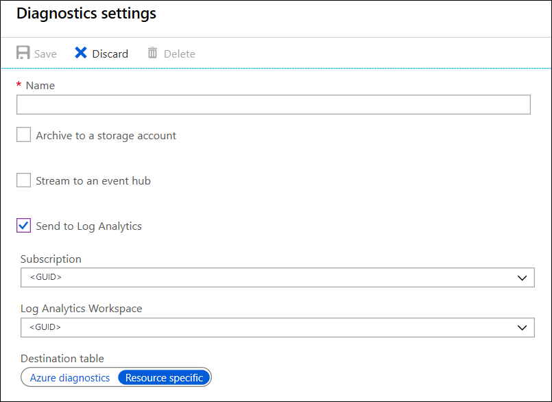

# Azure resource logs

Azure resource logs are [platform logs](../essentials/platform-logs-overview.md) that provide insight into operations that were performed within an Azure resource. The content of resource logs varies by the Azure service and resource type. Resource logs aren't collected by default. This article describes the [diagnostic setting](diagnostic-settings.md) required for each Azure resource to send its resource logs to different destinations. 

## Send to Log Analytics workspace

 Send resource logs to a Log Analytics workspace to enable the features of [Azure Monitor Logs](../logs/data-platform-logs.md), where you can:

- Correlate resource log data with other monitoring data collected by Azure Monitor.
- Consolidate log entries from multiple Azure resources, subscriptions, and tenants into one location for analysis together.
- Use log queries to perform complex analysis and gain deep insights on log data.
- Use log alerts with complex alerting logic.

[Create a diagnostic setting](../essentials/diagnostic-settings.md) to send resource logs to a Log Analytics workspace. This data is stored in tables as described in [Structure of Azure Monitor Logs](../logs/data-platform-logs.md). The tables used by resource logs depend on what type of collection the resource is using:

- **Azure diagnostics**: All data is written to the [AzureDiagnostics](/azure/azure-monitor/reference/tables/azurediagnostics) table.
- **Resource-specific**: Data is written to individual tables for each category of the resource.

### Resource-specific

In this mode, individual tables in the selected workspace are created for each category selected in the diagnostic setting. We recommend this method because it:

- Makes it easier to work with the data in log queries.
- Provides better discoverability of schemas and their structure.
- Improves performance across ingestion latency and query times.
- Provides the ability to grant Azure role-based access control rights on a specific table.

All Azure services will eventually migrate to the resource-specific mode.

The preceding example creates three tables:

- Table `Service1AuditLogs`

    | Resource provider | Category | A | B | C |
    |:---|:---:|:---:|:---:|:---:| 
    | Service 1 | AuditLogs | x1 | y1 | z1 |
    | Service 1 | AuditLogs | x5 | y5 | z5 |
    | ... |

- Table `Service1ErrorLogs`

    | Resource provider | Category | D | E | F |
    |:---|:---:|:---:|:---:|:---:| 
    | Service 1 | ErrorLogs |  q1 | w1 | e1 |
    | Service 1 | ErrorLogs |  q2 | w2 | e2 |
    | ... |

- Table `Service2AuditLogs`

    | Resource provider | Category | G | H | I |
    |:---|:---:|:---:|:---:|:---:| 
    | Service 2 | AuditLogs | j1 | k1 | l1|
    | Service 2 | AuditLogs | j3 | k3 | l3|
    | ... |

### Azure diagnostics mode

In this mode, all data from any diagnostic setting is collected in the [AzureDiagnostics](/azure/azure-monitor/reference/tables/azurediagnostics) table. This legacy method is used today by most Azure services. Because multiple resource types send data to the same table, its schema is the superset of the schemas of all the different data types being collected. For details on the structure of this table and how it works with this potentially large number of columns, see [AzureDiagnostics reference](/azure/azure-monitor/reference/tables/azurediagnostics).

Consider an example where diagnostic settings are collected in the same workspace for the following data types:

- Audit logs of service 1 have a schema that consists of columns A, B, and C
- Error logs of service 1 have a schema that consists of columns D, E, and F
- Audit logs of service 2 have a schema that consists of columns G, H, and I

The `AzureDiagnostics` table looks like this example:

| ResourceProvider    | Category     | A  | B  | C  | D  | E  | F  | G  | H  | I  |
|:---|:---:|:---:|:---:|:---:|:---:|:---:|:---:|:---:||:---:|
| Microsoft.Service1 | AuditLogs    | x1 | y1 | z1 |    |    |    |    |    |    |
| Microsoft.Service1 | ErrorLogs    |    |    |    | q1 | w1 | e1 |    |    |    |
| Microsoft.Service2 | AuditLogs    |    |    |    |    |    |    | j1 | k1 | l1 |
| Microsoft.Service1 | ErrorLogs    |    |    |    | q2 | w2 | e2 |    |    |    |
| Microsoft.Service2 | AuditLogs    |    |    |    |    |    |    | j3 | k3 | l3 |
| Microsoft.Service1 | AuditLogs    | x5 | y5 | z5 |    |    |    |    |    |    |
| ... |

### Select the collection mode

Most Azure resources write data to the workspace in either **Azure diagnostics** or **resource-specific** mode without giving you a choice. For more information, see [Common and service-specific schemas for Azure resource logs](./resource-logs-schema.md).

All Azure services will eventually use the resource-specific mode. As part of this transition, some resources allow you to select a mode in the diagnostic setting. Specify resource-specific mode for any new diagnostic settings because this mode makes the data easier to manage. It also might help you avoid complex migrations later.
  
   

> [!NOTE]
> For an example that sets the collection mode by using an Azure Resource Manager template, see [Resource Manager template samples for diagnostic settings in Azure Monitor](./resource-manager-diagnostic-settings.md#diagnostic-setting-for-recovery-services-vault).

You can modify an existing diagnostic setting to resource-specific mode. In this case, data that was already collected remains in the `AzureDiagnostics` table until it's removed according to your retention setting for the workspace. New data is collected in the dedicated table. Use the [union](/azure/kusto/query/unionoperator) operator to query data across both tables.

Continue to watch the [Azure Updates](https://azure.microsoft.com/updates/) blog for announcements about Azure services that support resource-specific mode.

## Send to Azure Event Hubs

Send resource logs to an event hub to send them outside of Azure. For example, resource logs might be sent to a third-party SIEM or other log analytics solutions. Resource logs from event hubs are consumed in JSON format with a `records` element that contains the records in each payload. The schema depends on the resource type as described in [Common and service-specific schema for Azure resource logs](resource-logs-schema.md).

The following sample output data is from Azure Event Hubs for a resource log:

```json
{
    "records": [
        {
            "time": "2019-07-15T18:00:22.6235064Z",
            "workflowId": "/SUBSCRIPTIONS/00000000-0000-0000-0000-000000000000/RESOURCEGROUPS/JOHNKEMTEST/PROVIDERS/MICROSOFT.LOGIC/WORKFLOWS/JOHNKEMTESTLA",
            "resourceId": "/SUBSCRIPTIONS/00000000-0000-0000-0000-000000000000/RESOURCEGROUPS/JOHNKEMTEST/PROVIDERS/MICROSOFT.LOGIC/WORKFLOWS/JOHNKEMTESTLA/RUNS/08587330013509921957/ACTIONS/SEND_EMAIL",
            "category": "WorkflowRuntime",
            "level": "Error",
            "operationName": "Microsoft.Logic/workflows/workflowActionCompleted",
            "properties": {
                "$schema": "2016-04-01-preview",
                "startTime": "2016-07-15T17:58:55.048482Z",
                "endTime": "2016-07-15T18:00:22.4109204Z",
                "status": "Failed",
                "code": "BadGateway",
                "resource": {
                    "subscriptionId": "00000000-0000-0000-0000-000000000000",
                    "resourceGroupName": "JohnKemTest",
                    "workflowId": "243aac67fe904cf195d4a28297803785",
                    "workflowName": "JohnKemTestLA",
                    "runId": "08587330013509921957",
                    "location": "westus",
                    "actionName": "Send_email"
                },
                "correlation": {
                    "actionTrackingId": "29a9862f-969b-4c70-90c4-dfbdc814e413",
                    "clientTrackingId": "08587330013509921958"
                }
            }
        },
        {
            "time": "2019-07-15T18:01:15.7532989Z",
            "workflowId": "/SUBSCRIPTIONS/00000000-0000-0000-0000-000000000000/RESOURCEGROUPS/JOHNKEMTEST/PROVIDERS/MICROSOFT.LOGIC/WORKFLOWS/JOHNKEMTESTLA",
            "resourceId": "/SUBSCRIPTIONS/00000000-0000-0000-0000-000000000000/RESOURCEGROUPS/JOHNKEMTEST/PROVIDERS/MICROSOFT.LOGIC/WORKFLOWS/JOHNKEMTESTLA/RUNS/08587330012106702630/ACTIONS/SEND_EMAIL",
            "category": "WorkflowRuntime",
            "level": "Information",
            "operationName": "Microsoft.Logic/workflows/workflowActionStarted",
            "properties": {
                "$schema": "2016-04-01-preview",
                "startTime": "2016-07-15T18:01:15.5828115Z",
                "status": "Running",
                "resource": {
                    "subscriptionId": "00000000-0000-0000-0000-000000000000",
                    "resourceGroupName": "JohnKemTest",
                    "workflowId": "243aac67fe904cf195d4a28297803785",
                    "workflowName": "JohnKemTestLA",
                    "runId": "08587330012106702630",
                    "location": "westus",
                    "actionName": "Send_email"
                },
                "correlation": {
                    "actionTrackingId": "042fb72c-7bd4-439e-89eb-3cf4409d429e",
                    "clientTrackingId": "08587330012106702632"
                }
            }
        }
    ]
}
```

## Send to Azure Storage

Send resource logs to Azure Storage to retain them for archiving. After you've created the diagnostic setting, a storage container is created in the storage account as soon as an event occurs in one of the enabled log categories.

> [!NOTE]
> An alternate strategy for archiving is to send the resource log to a Log Analytics workspace with an [archive policy](../logs/data-retention-archive.md).

The blobs within the container use the following naming convention:

```
insights-logs-{log category name}/resourceId=/SUBSCRIPTIONS/{subscription ID}/RESOURCEGROUPS/{resource group name}/PROVIDERS/{resource provider name}/{resource type}/{resource name}/y={four-digit numeric year}/m={two-digit numeric month}/d={two-digit numeric day}/h={two-digit 24-hour clock hour}/m=00/PT1H.json
```

The blob for a network security group might have a name similar to this example:

```
insights-logs-networksecuritygrouprulecounter/resourceId=/SUBSCRIPTIONS/00000000-0000-0000-0000-000000000000/RESOURCEGROUPS/TESTRESOURCEGROUP/PROVIDERS/MICROSOFT.NETWORK/NETWORKSECURITYGROUP/TESTNSG/y=2016/m=08/d=22/h=18/m=00/PT1H.json
```

Each PT1H.json blob contains a JSON object with events from log files that were received during the hour specified in the blob URL. During the present hour, events are appended to the PT1H.json file as they're received, regardless of when they were generated. The minute value in the URL, `m=00` is always `00` as blobs are created on a per hour basis.

Within the PT1H.json file, each event is stored in the following format. It uses a common top-level schema but is unique for each Azure service, as described in [Resource logs schema](./resource-logs-schema.md).

> [!NOTE]
> Logs are written to blobs based on the time that the log was received, regardless of the time it was generated. This means that a given blob can contain log data that is outside the hour specified in the blob’s URL. Where a data source like Application insights, supports uploading stale telemetry a blob can contain data from the previous 48 hours.  
> At the start of a new hour, it is possible that existing logs are still being written to the previous hour’s blob while new logs are written to the new hour’s blob.  

```json
{"time": "2016-07-01T00:00:37.2040000Z","systemId": "46cdbb41-cb9c-4f3d-a5b4-1d458d827ff1","category": "NetworkSecurityGroupRuleCounter","resourceId": "/SUBSCRIPTIONS/s1id1234-5679-0123-4567-890123456789/RESOURCEGROUPS/TESTRESOURCEGROUP/PROVIDERS/MICROSOFT.NETWORK/NETWORKSECURITYGROUPS/TESTNSG","operationName": "NetworkSecurityGroupCounters","properties": {"vnetResourceGuid": "{12345678-9012-3456-7890-123456789012}","subnetPrefix": "10.3.0.0/24","macAddress": "000123456789","ruleName": "/subscriptions/ s1id1234-5679-0123-4567-890123456789/resourceGroups/testresourcegroup/providers/Microsoft.Network/networkSecurityGroups/testnsg/securityRules/default-allow-rdp","direction": "In","type": "allow","matchedConnections": 1988}}
```

## Azure Monitor partner integrations

Resource logs can also be sent to partner solutions that are fully integrated into Azure. For a list of these solutions and details on how to configure them, see [Azure Monitor partner integrations](../../partner-solutions/overview.md).

## Next steps

* [Read more about resource logs](../essentials/platform-logs-overview.md).
* [Create diagnostic settings to send platform logs and metrics to different destinations](../essentials/diagnostic-settings.md).
