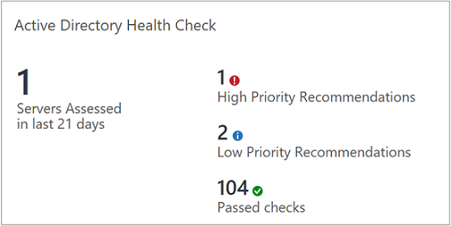
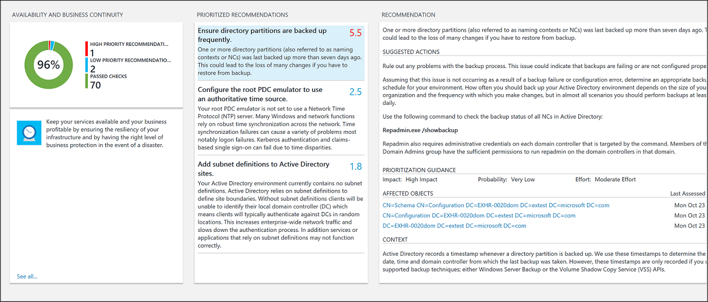

# Optimize your Active Directory environment with the Active Directory Health Check solution in Azure Monitor


[!INCLUDE [azure-monitor-log-analytics-rebrand](../../../includes/azure-monitor-log-analytics-rebrand.md)]

You can use the Active Directory Health Check solution to assess the risk and health of your server environments on a regular interval. This article helps you install and use the solution so that you can take corrective actions for potential problems.

This solution provides a prioritized list of recommendations specific to your deployed server infrastructure. The recommendations are categorized across four focus areas, which help you quickly understand the risk and take action.

The recommendations are based on the knowledge and experience gained by Microsoft engineers from thousands of customer visits. Each recommendation provides guidance about why an issue might matter to you and how to implement the suggested changes.

You can choose focus areas that are most important to your organization and track your progress toward running a risk free and healthy environment.

After you've added the solution and a check is completed, summary information for focus areas is shown on the **AD Health Check** dashboard for the infrastructure in your environment. The following sections describe how to use the information on the **AD Health Check** dashboard, where you can view and then take recommended actions for your Active Directory server infrastructure.  




## Prerequisites

* The Active Directory Health Check solution requires a supported version of .NET Framework 4.6.2 or above installed on each computer that has the Log Analytics agent for Windows (also referred to as the Microsoft Monitoring Agent (MMA)) installed.  The agent is used by System Center 2016 - Operations Manager, Operations Manager 2012 R2, and Azure Monitor.
* The solution supports domain controllers running Windows Server 2008 and 2008 R2, Windows Server 2012 and 2012 R2, and Windows Server 2016.
* A Log Analytics workspace to add the Active Directory Health Check solution from the Azure marketplace in the Azure portal. There is no additional configuration required.

  > [!NOTE]
  > After you've added the solution, the AdvisorAssessment.exe file is added to servers with agents. Configuration data is read and then sent to Azure Monitor in the cloud for processing. Logic is applied to the received data and the cloud service records the data.
  >
  >

To perform the health check against your domain controllers that are members of the domain to be evaluated, each domain controller in that domain requires an agent and connectivity to Azure Monitor using one of the following supported methods:

1. Install the [Log Analytics agent for Windows](../../azure-monitor/platform/agent-windows.md) if the domain controller is not already monitored by System Center 2016 - Operations Manager or Operations Manager 2012 R2.
2. If it is monitored with System Center 2016 - Operations Manager or Operations Manager 2012 R2 and the management group is not integrated with Azure Monitor, the domain controller can be multi-homed with Azure Monitor to collect data and forward to the service and still be monitored by Operations Manager.  
3. Otherwise, if your Operations Manager management group is integrated with the service, you need to add the domain controllers for data collection by the service following the steps under [add agent-managed computers](../../azure-monitor/platform/om-agents.md#connecting-operations-manager-to-azure-monitor) after you enable the solution in your workspace.  

The agent on your domain controller which reports to an Operations Manager management group, collects data, forwards to its assigned management server, and then is sent directly from a management server to Azure Monitor.  The data is not written to the Operations Manager databases.  

## Active Directory Health Check data collection details

Active Directory Health Check collects data from the following sources using the agent that you have enabled:

- Registry
- LDAP
- .NET Framework
- Event log
- Active Directory Service interfaces (ADSI)
- Windows PowerShell
- File data
- Windows Management Instrumentation (WMI)
- DCDIAG tool API
- File Replication Service (NTFRS) API
- Custom C# code

Data is collected on the domain controller and forwarded to Azure Monitor every seven days.  

## Understanding how recommendations are prioritized

Every recommendation made is given a weighting value that identifies the relative importance of the recommendation. Only the 10 most important recommendations are shown.

### How weights are calculated

Weightings are aggregate values based on three key factors:

* The *probability* that an issue identified causes problems. A higher probability equates to a larger overall score for the recommendation.
* The *impact* of the issue on your organization if it does cause a problem. A higher impact equates to a larger overall score for the recommendation.
* The *effort* required to implement the recommendation. A higher effort equates to a smaller overall score for the recommendation.

The weighting for each recommendation is expressed as a percentage of the total score available for each focus area. For example, if a recommendation in the Security and Compliance focus area has a score of 5%, implementing that recommendation increases your overall Security and Compliance score by 5%.

### Focus areas

**Security and Compliance** - This focus area shows recommendations for potential security threats and breaches, corporate policies, and technical, legal and regulatory compliance requirements.

**Availability and Business Continuity** - This focus area shows recommendations for service availability, resiliency of your infrastructure, and business protection.

**Performance and Scalability** - This focus area shows recommendations to help your organization's IT infrastructure grow, ensure that your IT environment meets current performance requirements, and is able to respond to changing infrastructure needs.

**Upgrade, Migration and Deployment** - This focus area shows recommendations to help you upgrade, migrate, and deploy Active Directory to your existing infrastructure.

### Should you aim to score 100% in every focus area?

Not necessarily. The recommendations are based on the knowledge and experiences gained by Microsoft engineers across thousands of customer visits. However, no two server infrastructures are the same, and specific recommendations may be more or less relevant to you. For example, some security recommendations might be less relevant if your virtual machines are not exposed to the Internet. Some availability recommendations may be less relevant for services that provide low priority ad hoc data collection and reporting. Issues that are important to a mature business may be less important to a start-up. You may want to identify which focus areas are your priorities and then look at how your scores change over time.

Every recommendation includes guidance about why it is important. You should use this guidance to evaluate whether implementing the recommendation is appropriate for you, given the nature of your IT services and the business needs of your organization.

## Use health check focus area recommendations

After it is installed, you can view the summary of recommendations by using the Health Check tile on the solution page in the Azure portal.

View the summarized compliance assessments for your infrastructure and then drill-into recommendations.

### To view recommendations for a focus area and take corrective action

[!INCLUDE [azure-monitor-solutions-overview-page](../../../includes/azure-monitor-solutions-overview-page.md)]

1. On the **Overview** page, click the **Active Directory Health Check** tile.

2. On the **Health Check** page, review the summary information in one of the focus area blades and then click one to view recommendations for that focus area.

3. On any of the focus area pages, you can view the prioritized recommendations made for your environment. Click a recommendation under **Affected Objects** to view details about why the recommendation is made.

    

4. You can take corrective actions suggested in **Suggested Actions**. When the item has been addressed, later assessments records that recommended actions were taken and your compliance score will increase. Corrected items appear as **Passed Objects**.

## Ignore recommendations

If you have recommendations that you want to ignore, you can create a text file that Azure Monitor will use to prevent recommendations from appearing in your assessment results.

### To identify recommendations that you will ignore

[!INCLUDE [azure-monitor-log-queries](../../../includes/azure-monitor-log-queries.md)]

Use the following query to list recommendations that have failed for computers in your environment.

```
ADAssessmentRecommendation | where RecommendationResult == "Failed" | sort by Computer asc | project Computer, RecommendationId, Recommendation
```

Here's a screenshot showing the log query:<


Choose recommendations that you want to ignore. You’ll use the values for RecommendationId in the next procedure.

### To create and use an IgnoreRecommendations.txt text file

1. Create a file named IgnoreRecommendations.txt.

2. Paste or type each RecommendationId for each recommendation that you want Azure Monitor to ignore on a separate line and then save and close the file.

3. Put the file in the following folder on each computer where you want Azure Monitor to ignore recommendations.

   * On computers with the Microsoft Monitoring Agent (connected directly or through Operations Manager) - *SystemDrive*:\Program Files\Microsoft Monitoring Agent\Agent
   * On the Operations Manager 2012 R2 management server - *SystemDrive*:\Program Files\Microsoft System Center 2012 R2\Operations Manager\Server
   * On the Operations Manager 2016 management server - *SystemDrive*:\Program Files\Microsoft System Center 2016\Operations Manager\Server

### To verify that recommendations are ignored

After the next scheduled health check runs, by default every seven days, the specified recommendations are marked *Ignored* and will not appear on the dashboard.

1. You can use the following log queries to list all the ignored recommendations.

    ```
    ADAssessmentRecommendation | where RecommendationResult == "Ignored" | sort by Computer asc | project Computer, RecommendationId, Recommendation
    ```

2. If you decide later that you want to see ignored recommendations, remove any IgnoreRecommendations.txt files, or you can remove RecommendationIDs from them.

## AD Health Check solutions FAQ

*What checks are performed by the AD Assessment solution?*

* The following query shows a description of all checks currently performed:

```Kusto
ADAssessmentRecommendation
| distinct RecommendationId, FocusArea, ActionArea, Recommendation, Description
| sort by FocusArea,ActionArea, Recommendation
```
The results can then be exported to Excel for further review.

*How often does a health check run?*

* The check runs every seven days.

*Is there a way to configure how often the health check runs?*

* Not at this time.

*If another server for is discovered after I’ve added a health check solution, will it be checked*

* Yes, once it is discovered it is checked from then on, every seven days.

*If a server is decommissioned, when will it be removed from the health check?*

* If a server does not submit data for 3 weeks, it is removed.

*What is the name of the process that does the data collection?*

* AdvisorAssessment.exe

*How long does it take for data to be collected?*

* The actual data collection on the server takes about 1 hour. It may take longer on servers that have a large number of Active Directory servers.

*Is there a way to configure when data is collected?*

* Not at this time.

*Why display only the top 10 recommendations?*

* Instead of giving you an exhaustive overwhelming list of tasks, we recommend that you focus on addressing the prioritized recommendations first. After you address them, additional recommendations will become available. If you prefer to see the detailed list, you can view all recommendations using a log query.

*Is there a way to ignore a recommendation?*

* Yes, see [Ignore recommendations](#ignore-recommendations) section above.

## Next steps

Use [Azure Monitor log queries](../log-query/log-query-overview.md) to learn how to analyze detailed AD Health Check data and recommendations.
