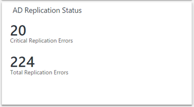
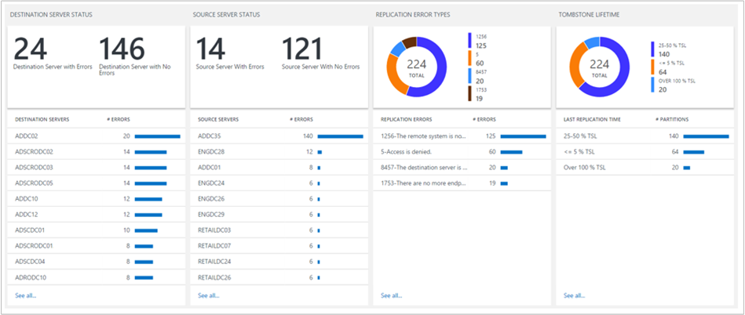
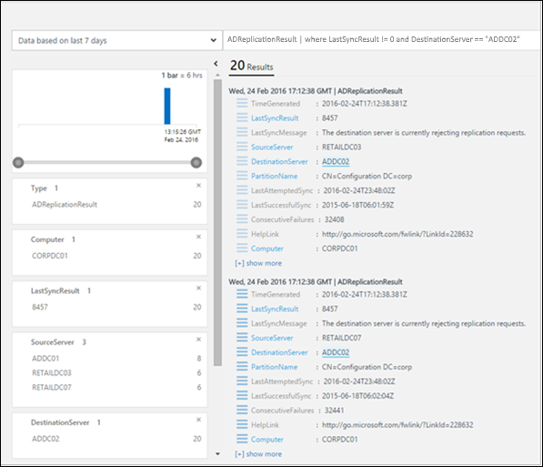
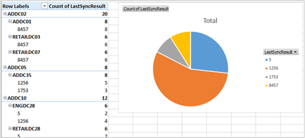

# Monitor Active Directory replication status with Azure Monitor

Active Directory is a key component of an enterprise IT environment. To ensure high availability and high performance, each domain controller has its own copy of the Active Directory database. Domain controllers replicate with each other in order to propagate changes across the enterprise. Failures in this replication process can cause a variety of problems across the enterprise.

The AD Replication Status solution pack regularly monitors your Active Directory environment for any replication failures.

[!INCLUDE [azure-monitor-log-analytics-rebrand](../../../includes/azure-monitor-log-analytics-rebrand-solution.md)]

## Installing and configuring the solution
Use the following information to install and configure the solution.

### Install agents on domain controllers
You must install agents on domain controllers that are members of the domain to be evaluated. Or, you must install agents on member servers and configure the agents to send AD replication data to Azure Monitor. To understand how to connect Windows computers to Azure Monitor, see [Connect Windows computers to Azure Monitor](../../azure-monitor/platform/agent-windows.md). If your domain controller is already part of an existing System Center Operations Manager environment that you want to connect to Azure Monitor, see [Connect Operations Manager to Azure Monitor](../../azure-monitor/platform/om-agents.md).

### Enable non-domain controller
If you don't want to connect any of your domain controllers directly to Azure Monitor, you can use any other computer in your domain connected to Azure Monitor to collect data for the AD Replication Status solution pack and have it send the data.

1. Verify that the computer is a member of the domain that you wish to monitor using the AD Replication Status solution.
2. [Connect the Windows computer to Azure Monitor](../../azure-monitor/platform/om-agents.md) or [connect it using your existing Operations Manager environment to Azure Monitor](../../azure-monitor/platform/om-agents.md), if it is not already connected.
3. On that computer, set the following registry key: Key: **HKEY_LOCAL_MACHINE\SYSTEM\CurrentControlSet\Services\HealthService\Parameters\Management Groups\<ManagementGroupName>\Solutions\ADReplication** Value: **IsTarget** Value Data: **true**

   > [!NOTE]
   > These changes do not take effect until you restart the Microsoft Monitoring Agent service (HealthService.exe).
   > ### Install solution
   > Follow the process described in [Install a monitoring solution](solutions.md#install-a-monitoring-solution) to add the **Active Directory Replication Status** solution to your Log Analytics workspace. There is no further configuration required.

## AD Replication Status data collection details
The following table shows data collection methods and other details about how data is collected for AD Replication Status.

| platform | Direct Agent | SCOM agent | Azure Storage | SCOM required? | SCOM agent data sent via management group | collection frequency |
| --- | --- | --- | --- | --- | --- | --- |
| Windows |&#8226; |&#8226; |  |  |&#8226; |every five days |

## Understanding replication errors

[!INCLUDE [azure-monitor-solutions-overview-page](../../../includes/azure-monitor-solutions-overview-page.md)]

The AD Replication Status tile displays how many replication errors you currently have. **Critical Replication Errors** are errors that are at or above 75% of the [tombstone lifetime](https://technet.microsoft.com/library/cc784932%28v=ws.10%29.aspx) for your Active Directory forest.

When you click the tile, you can view more information about the errors.

### Destination Server Status and Source Server Status
These columns show the status of destination servers and source servers that are experiencing replication errors. The number after each domain controller name indicates the number of replication errors on that domain controller.

The errors for both destination servers and source servers are shown because some problems are easier to troubleshoot from the source server perspective and others from the destination server perspective.

In this example, you can see that many destination servers have roughly the same number of errors, but there's one source server (ADDC35) that has many more errors than all the others. It's likely that there is some problem on ADDC35 that is causing it to fail to send data to its replication partners. Fixing the problems on ADDC35 might resolve many of the errors that appear in the destination server area.

### Replication Error Types
This area gives you information about the types of errors detected throughout your enterprise. Each error has a unique numerical code and a message that can help you determine the root cause of the error.

The donut at the top gives you an idea of which errors appear more and less frequently in your environment.

It shows you when multiple domain controllers experience the same replication error. In this case, you may be able to discover or identify a solution on one domain controller, then repeat it on other domain controllers affected by the same error.

### Tombstone Lifetime
The tombstone lifetime determines how long a deleted object, referred to as a tombstone, is retained in the Active Directory database. When a deleted object passes the tombstone lifetime, a garbage collection process automatically removes it from the Active Directory database.

The default tombstone lifetime is 180 days for most recent versions of Windows, but it was 60 days on older versions, and it can be changed explicitly by an Active Directory administrator.

It's important to know if you're having replication errors that are approaching or are past the tombstone lifetime. If two domain controllers experience a replication error that persists past the tombstone lifetime, replication is disabled between those two domain controllers, even if the underlying replication error is fixed.

The Tombstone Lifetime area helps you identify places where disabled replication is in danger of happening. Each error in the **Over 100% TSL** category represents a partition that has not replicated between its source and destination server for at least the tombstone lifetime for the forest.

In this situation, simply fixing the replication error will not be enough. At a minimum, you need to manually investigate to identify and clean up lingering objects before you can restart replication. You may even need to decommission a domain controller.

In addition to identifying any replication errors that have persisted past the tombstone lifetime, you also want to pay attention to any errors falling into the **50-75% TSL** or **75-100% TSL** categories.

These are errors that are clearly lingering, not transient, so they likely need your intervention to resolve. The good news is that they have not yet reached the tombstone lifetime. If you fix these problems promptly and *before* they reach the tombstone lifetime, replication can restart with minimal manual intervention.

As noted earlier, the dashboard tile for the AD Replication Status solution shows the number of *critical* replication errors in your environment, which is defined as errors that are over 75% of tombstone lifetime (including errors that are over 100% of TSL). Strive to keep this number at 0.

> [!NOTE]
> All the tombstone lifetime percentage calculations are based on the actual tombstone lifetime for your Active Directory forest, so you can trust that those percentages are accurate, even if you have a custom tombstone lifetime value set.
>
>

### AD Replication status details
When you click any item in one of the lists, you see additional details about it using a log query. The results are filtered to show only the errors related to that item. For example, if you click on the first domain controller listed under **Destination Server Status (ADDC02)**, you see query results filtered to show errors with that domain controller listed as the destination server:

From here, you can filter further, modify the log query, and so on. For more information about using the log queries in Azure Monitor, see [Analyze log data in Azure Monitor](../../azure-monitor/log-query/log-query-overview.md).

The **HelpLink** field shows the URL of a TechNet page with additional details about that specific error. You can copy and paste this link into your browser window to see information about troubleshooting and fixing the error.

You can also click **Export** to export the results to Excel. Exporting the data can help you visualize replication error data in any way you'd like.

## AD Replication Status FAQ
**Q: How often is AD replication status data updated?**
A: The information is updated every five days.

**Q: Is there a way to configure how often this data is updated?**
A: Not at this time.

**Q: Do I need to add all of my domain controllers to my Log Analytics workspace in order to see replication status?**
A: No, only a single domain controller must be added. If you have multiple domain controllers in your Log Analytics workspace, data from all of them is sent to Azure Monitor.

**Q: I don't want to add any domain controllers to my Log Analytics workspace. Can I still use the AD Replication Status solution?**

A: Yes. You can set the value of a registry key to enable it. See [Enable non-domain controller](#enable-non-domain-controller).

**Q: What is the name of the process that does the data collection?**
A: AdvisorAssessment.exe

**Q: How long does it take for data to be collected?**
A: Data collection time depends on the size of the Active Directory environment, but usually takes less than 15 minutes.

**Q: What type of data is collected?**
A: Replication information is collected via LDAP.

**Q: Is there a way to configure when data is collected?**
A: Not at this time.

**Q: What permissions do I need to collect data?**
A: Normal user permissions to Active Directory are sufficient.

## Troubleshoot data collection problems
In order to collect data, the AD Replication Status solution pack requires at least one domain controller to be connected to your Log Analytics workspace. Until you connect a domain controller, a message appears indicating that **data is still being collected**.

If you need assistance connecting one of your domain controllers, you can view documentation at [Connect Windows computers to Azure Monitor](../../azure-monitor/platform/om-agents.md). Alternatively, if your domain controller is already connected to an existing System Center Operations Manager environment, you can view documentation at [Connect System Center Operations Manager to Azure Monitor](../../azure-monitor/platform/om-agents.md).

If you don't want to connect any of your domain controllers directly to Azure Monitor or to System Center Operations Manager, see [Enable non-domain controller](#enable-non-domain-controller).

## Next steps
* Use [Log queries in Azure Monitor](../../azure-monitor/log-query/log-query-overview.md) to view detailed Active Directory Replication status data.
