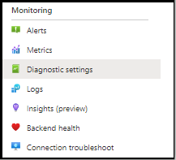
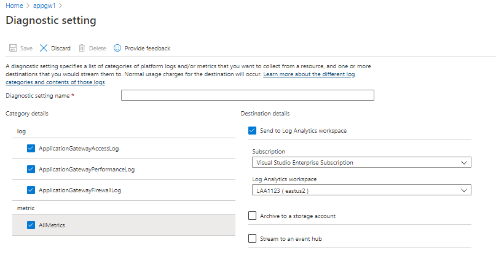
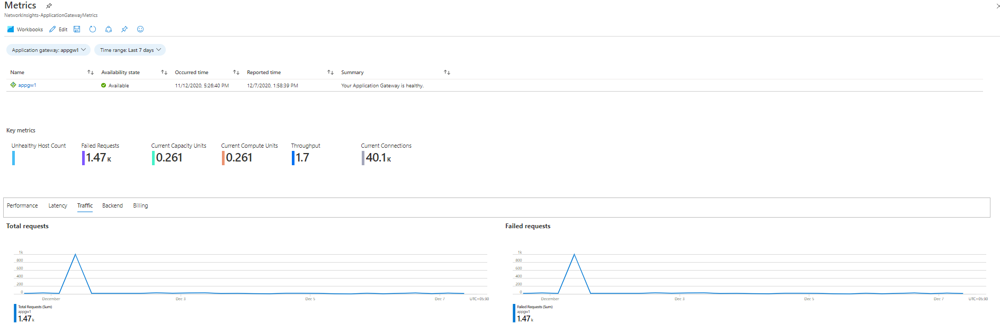
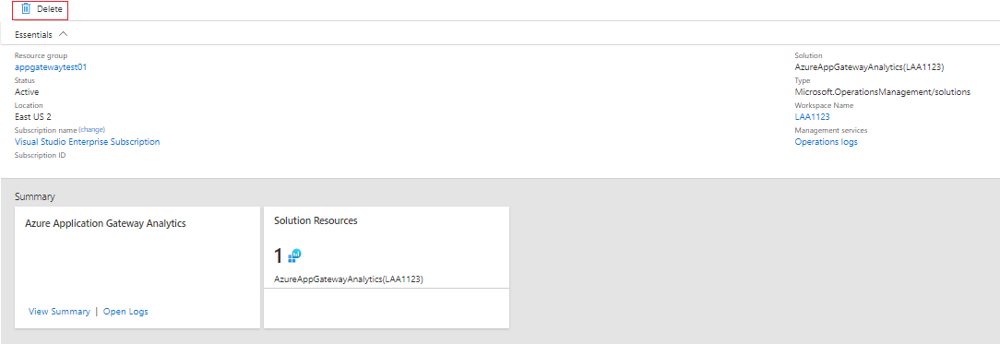

# Azure networking monitoring solutions in Azure Monitor

[!INCLUDE [updated-for-az](../../../includes/updated-for-az.md)]

Azure Monitor offers the following solutions for monitoring your networks:
* Network Performance Monitor (NPM) to
    * Monitor the health of your network
* Azure Application Gateway analytics to review
    * Azure Application Gateway logs
    * Azure Application Gateway metrics
* Solutions to monitor and audit network activity on your cloud network
    * [Traffic Analytics](../../networking/network-monitoring-overview.md#traffic-analytics) 
    * Azure Network Security Group Analytics

## Network Performance Monitor (NPM)

The [Network Performance Monitor](../../networking/network-monitoring-overview.md) management solution is a network monitoring solution, that monitors the health, availability and reachability of networks.  It is used to monitor connectivity between:

* Public cloud and on-premises
* Data centers and user locations (branch offices)
* Subnets hosting various tiers of a multi-tiered application.

For more information, see [Network Performance Monitor](../../networking/network-monitoring-overview.md).

## Network Security Group analytics

1. Add the management solution to Azure Monitor, and
2. Enable diagnostics to direct the diagnostics to a Log Analytics workspace in Azure Monitor. It is not necessary to write the logs to Azure Blob storage.

If diagnostic logs are not enabled, the dashboard blades for that resource are blank and display an error message.

## Azure Application Gateway analytics

1. Enable diagnostics to direct the diagnostics to a Log Analytics workspace in Azure Monitor.
2. Consume the detailed summary for your resource using the workbook template for Application Gateway.

If diagnostic logs are not enabled for Application Gateway, only the default metric data would be populated within the workbook.


> [!NOTE]
> In January 2017, the supported way of sending logs from Application Gateways and Network Security Groups to a Log Analytics workspace changed. If you see the **Azure Networking Analytics (deprecated)** solution, refer to [migrating from the old Networking Analytics solution](#migrating-from-the-old-networking-analytics-solution) for steps you need to follow.
>
>

## Review Azure networking data collection details
The Azure Application Gateway analytics and the Network Security Group analytics management solutions collect diagnostics logs directly from Azure Application Gateways and Network Security Groups. It is not necessary to write the logs to Azure Blob storage and no agent is required for data collection.

The following table shows data collection methods and other details about how data is collected for Azure Application Gateway analytics and the Network Security Group analytics.

| Platform | Direct agent | Systems Center Operations Manager agent | Azure | Operations Manager required? | Operations Manager agent data sent via management group | Collection frequency |
| --- | --- | --- | --- | --- | --- | --- |
| Azure |  |  |&#8226; |  |  |when logged |


### Enable Azure Application Gateway diagnostics in the portal

1. In the Azure portal, navigate to the Application Gateway resource to monitor.
2. Select *Diagnostics Settings* to open the following page.

   

   [ ](media/azure-networking-analytics/application-gateway-diagnostics-2.png#lightbox)

5. Click the checkbox for *Send to Log Analytics*.
6. Select an existing Log Analytics workspace, or create a workspace.
7. Click the checkbox under **Log** for each of the log types to collect.
8. Click *Save* to enable the logging of diagnostics to Azure Monitor.

#### Enable Azure network diagnostics using PowerShell

The following PowerShell script provides an example of how to enable resource logging for application gateways.

```powershell
$workspaceId = "/subscriptions/d2e37fee-1234-40b2-5678-0b2199de3b50/resourcegroups/oi-default-east-us/providers/microsoft.operationalinsights/workspaces/rollingbaskets"

$gateway = Get-AzApplicationGateway -Name 'ContosoGateway'

Set-AzDiagnosticSetting -ResourceId $gateway.ResourceId  -WorkspaceId $workspaceId -Enabled $true
```

#### Accessing Azure Application Gateway analytics via Azure Monitor Network insights

Application insights can be accessed via the insights tab within your Application Gateway resource.


The "view detailed metrics" tab will open up the pre-populated workbook summarizing the data from your Application Gateway.

[ ](media/azure-networking-analytics/application-gateway-workbook.png#lightbox)

### New capabilities with Azure Monitor Network Insights workbook

> [!NOTE]
> There are no additional costs associated with Azure Monitor Insights workbook. Log Analytics workspace will continue to be billed as per usage.

The Network Insights workbook allows you to take advantage of the latest capabilities of Azure Monitor and Log Analytics including:

* Centralized console for monitoring and troubleshooting with both [metric](../insights/network-insights-overview.md#resource-health-and-metrics) and log data.

* Flexible canvas to support creation of custom rich [visualizations](../visualize/workbooks-overview.md#visualizations).

* Ability to consume and [share workbook templates](../visualize/workbooks-overview.md#workbooks-versus-workbook-templates) with wider community.

To find more information about the capabilities of the new workbook solution check out [Workbooks-overview](../visualize/workbooks-overview.md)

## Migrating from Azure Gateway analytics solution to Azure Monitor workbooks

> [!NOTE]
> Azure Monitor Network Insights workbook is the recommended solution for accessing metric and log analytics for your Application Gateway resources.

1. Ensure [diagnostics settings are enabled](#enable-azure-application-gateway-diagnostics-in-the-portal) to store logs into a Log Analytics workspace. If it is already configured, Azure Monitor Network Insights workbook will be able to consume data from the same location and no additional changes are required.

> [!NOTE]
> All past data is already available within the workbook from the point diagnostic settings were originally enabled. There is no data transfer required.

2. Access the [default insights workbook](#accessing-azure-application-gateway-analytics-via-azure-monitor-network-insights) for your Application Gateway resource. All existing insights supported by the Application Gateway analytics solution will be already present in the workbook. You can extend this by adding custom [visualizations](../visualize/workbooks-overview.md#visualizations) based on metric & log data.

3. After you are able to see all your metric and log insights, to clean up the Azure Gateway analytics solution from your workspace, you can delete the solution from the solution resource page.

[ ](media/azure-networking-analytics/application-gateway-analytics-delete.png#lightbox)

## Azure Network Security Group analytics solution in Azure Monitor


> [!NOTE]
> The Network Security Group analytics solution is moving to community support since its functionality has been replaced by [Traffic Analytics](../../network-watcher/traffic-analytics.md).
> - The solution is now available in [Azure Quickstart Templates](https://azure.microsoft.com/resources/templates/oms-azurensg-solution/) and will soon no longer be available in the Azure Marketplace.
> - For existing customers who already added the solution to their workspace, it will continue to function with no changes.
> - Microsoft will continue to support sending NSG resource logs to your workspace using Diagnostics Settings.

The following logs are supported for network security groups:

* NetworkSecurityGroupEvent
* NetworkSecurityGroupRuleCounter

### Install and configure the solution
Use the following instructions to install and configure the Azure Networking Analytics solution:

1. Enable the Azure Network Security Group analytics solution by using the process described in [Add Azure Monitor solutions from the Solutions Gallery](./solutions.md).
2. Enable diagnostics logging for the [Network Security Group](../../virtual-network/virtual-network-nsg-manage-log.md) resources you want to monitor.

### Enable Azure network security group diagnostics in the portal

1. In the Azure portal, navigate to the Network Security Group resource to monitor
2. Select *Diagnostics logs* to open the following page

   
3. Click *Turn on diagnostics* to open the following page

   
4. To turn on diagnostics, click *On* under *Status*
5. Click the checkbox for *Send to Log Analytics*
6. Select an existing Log Analytics workspace, or create a workspace
7. Click the checkbox under **Log** for each of the log types to collect
8. Click *Save* to enable the logging of diagnostics to Log Analytics

### Enable Azure network diagnostics using PowerShell

The following PowerShell script provides an example of how to enable resource logging for network security groups
```powershell
$workspaceId = "/subscriptions/d2e37fee-1234-40b2-5678-0b2199de3b50/resourcegroups/oi-default-east-us/providers/microsoft.operationalinsights/workspaces/rollingbaskets"

$nsg = Get-AzNetworkSecurityGroup -Name 'ContosoNSG'

Set-AzDiagnosticSetting -ResourceId $nsg.ResourceId  -WorkspaceId $workspaceId -Enabled $true
```

### Use Azure Network Security Group analytics
After you click the **Azure Network Security Group analytics** tile on the Overview, you can view summaries of your logs and then drill in to details for the following categories:

* Network security group blocked flows
  * Network security group rules with blocked flows
  * MAC addresses with blocked flows
* Network security group allowed flows
  * Network security group rules with allowed flows
  * MAC addresses with allowed flows


On the **Azure Network Security Group analytics** dashboard, review the summary information in one of the blades, and then click one to view detailed information on the log search page.

On any of the log search pages, you can view results by time, detailed results, and your log search history. You can also filter by facets to narrow the results.

## Migrating from the old Networking Analytics solution
In January 2017, the supported way of sending logs from Azure Application Gateways and Azure Network Security Groups to a Log Analytics workspace changed. These changes provide the following advantages:
+ Logs are written directly to Azure Monitor without the need to use a storage account
+ Less latency from the time when logs are generated to them being available in Azure Monitor
+ Fewer configuration steps
+ A common format for all types of Azure diagnostics

To use the updated solutions:

1. [Configure diagnostics to be sent directly to Azure Monitor from Azure Application Gateways](#enable-azure-application-gateway-diagnostics-in-the-portal)
2. [Configure diagnostics to be sent directly to Azure Monitor from Azure Network Security Groups](#enable-azure-network-security-group-diagnostics-in-the-portal)
2. Enable the *Azure Application Gateway Analytics* and the *Azure Network Security Group Analytics* solution by using the process described in [Add Azure Monitor solutions from the Solutions Gallery](solutions.md)
3. Update any saved queries, dashboards, or alerts to use the new data type
   + Type is to AzureDiagnostics. You can use the ResourceType to filter to Azure networking logs.

     | Instead of: | Use: |
     | --- | --- |
     | NetworkApplicationgateways &#124; where OperationName=="ApplicationGatewayAccess" | AzureDiagnostics &#124; where ResourceType=="APPLICATIONGATEWAYS" and OperationName=="ApplicationGatewayAccess" |
     | NetworkApplicationgateways &#124; where OperationName=="ApplicationGatewayPerformance" | AzureDiagnostics &#124; where ResourceType=="APPLICATIONGATEWAYS" and OperationName=="ApplicationGatewayPerformance" |
     | NetworkSecuritygroups | AzureDiagnostics &#124; where ResourceType=="NETWORKSECURITYGROUPS" |

   + For any field that has a suffix of \_s, \_d, or \_g in the name, change the first character to lower case
   + For any field that has a suffix of \_o in name, the data is split into individual fields based on the nested field names.
4. Remove the *Azure Networking Analytics (Deprecated)* solution.
   + If you are using PowerShell, use `Set-AzureOperationalInsightsIntelligencePack -ResourceGroupName <resource group that the workspace is in> -WorkspaceName <name of the log analytics workspace> -IntelligencePackName "AzureNetwork" -Enabled $false`

Data collected before the change is not visible in the new solution. You can continue to query for this data using the old Type and field names.

## Troubleshooting
[!INCLUDE [log-analytics-troubleshoot-azure-diagnostics](../../../includes/log-analytics-troubleshoot-azure-diagnostics.md)]

## Next steps
* Use [Log queries in Azure Monitor](../logs/log-query-overview.md) to view detailed Azure diagnostics data.

