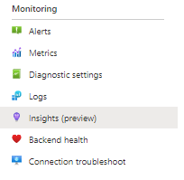

# Azure networking monitoring solutions in Azure Monitor

[!INCLUDE [updated-for-az](../../../includes/updated-for-az.md)]

Azure Monitor offers the following solutions for monitoring your networks:
* Network Performance Monitor to:
    * Monitor the health of your network.
* Azure Application Gateway analytics to review:
    * Application Gateway logs.
    * Application Gateway metrics.
* Solutions to monitor and audit network activity on your cloud network:
    * [Traffic analytics](../../networking/network-monitoring-overview.md#traffic-analytics).

## Network Performance Monitor

The [Network Performance Monitor](../../networking/network-monitoring-overview.md) management solution is a network monitoring solution that monitors the health, availability, and reachability of networks. It's used to monitor connectivity between:

* Public cloud and on-premises.
* Datacenters and user locations like branch offices.
* Subnets that host various tiers of a multi-tiered application.

For more information, see [Network Performance Monitor](../../networking/network-monitoring-overview.md).

## Application Gateway analytics

1. Enable diagnostics to direct the diagnostics to a Log Analytics workspace in Azure Monitor.
1. Consume the detailed summary for your resource by using the workbook template for Application Gateway.

If diagnostic logs aren't enabled for Application Gateway, only the default metric data would be populated within the workbook.

## Review Azure networking data collection details
The Application Gateway analytics and the network security group analytics management solutions collect diagnostics logs directly from Application Gateway and network security groups. It isn't necessary to write the logs to Azure Blob Storage, and no agent is required for data collection.

The following table shows data collection methods and other details about how data is collected for Application Gateway analytics and the network security group analytics.

| Platform | Direct agent | Systems Center Operations Manager agent | Azure | Operations Manager required? | Operations Manager agent data sent via management group | Collection frequency |
| --- | --- | --- | --- | --- | --- | --- |
| Azure |  |  |&#8226; |  |  |When logged |

### Enable Application Gateway diagnostics in the portal

1. In the Azure portal, go to the Application Gateway resource to monitor.
1. Select **Diagnostic settings** to open the following page.

   

   [](media/azure-networking-analytics/application-gateway-diagnostics-2.png#lightbox)

1. Select the **Send to Log Analytics workspace** checkbox.
1. Select an existing Log Analytics workspace or create a workspace.
1. Select the checkbox under **log** for each of the log types to collect.
1. Select **Save** to enable the logging of diagnostics to Azure Monitor.

#### Enable Azure network diagnostics by using PowerShell

The following PowerShell script provides an example of how to enable resource logging for application gateways:

```powershell
$workspaceId = "/subscriptions/d2e37fee-1234-40b2-5678-0b2199de3b50/resourcegroups/oi-default-east-us/providers/microsoft.operationalinsights/workspaces/rollingbaskets"

$gateway = Get-AzApplicationGateway -Name 'ContosoGateway'

Set-AzDiagnosticSetting -ResourceId $gateway.ResourceId  -WorkspaceId $workspaceId -Enabled $true
```

#### Access Application Gateway analytics via Azure Monitor Network Insights

Application insights can be accessed via the **Insights** tab in your Application Gateway resource.



The **View detailed metrics** tab opens the pre-populated workbook that summarizes the data from your Application Gateway resource.

[](media/azure-networking-analytics/application-gateway-workbook.png#lightbox)

### New capabilities with an Azure Monitor Network Insights workbook

> [!NOTE]
> No other costs are associated with an Azure Monitor Network Insights workbook. The Log Analytics workspace will continue to be billed per usage.

The Network Insights workbook allows you to take advantage of the latest capabilities of Azure Monitor and Log Analytics, including:

* Centralized console for monitoring and troubleshooting with both [metric](../../network-watcher/network-insights-overview.md#resource-health-and-metrics) and log data.
* Flexible canvas to support creation of custom-rich [visualizations](../visualize/workbooks-overview.md#visualizations).
* Ability to consume and [share workbook templates](../visualize/workbooks-templates.md) with a wider community.

For more information about the capabilities of the new workbook solution, see [Workbooks overview](../visualize/workbooks-overview.md).

## Migrate from the Azure Gateway analytics solution to Azure Monitor workbooks

> [!NOTE]
> We recommend the Azure Monitor Network Insights workbook solution for accessing metric and log analytics for your Application Gateway resources.

1. Ensure that [diagnostics settings are enabled](#enable-application-gateway-diagnostics-in-the-portal) to store logs in a Log Analytics workspace. If it's already configured, the Azure Monitor Network Insights workbook will be able to consume data from the same location. No more changes are required.

    > [!NOTE]
    > All past data is already available within the workbook from the point when diagnostic settings were originally enabled. No data transfer is required.

1. Access the [default insights workbook](#access-application-gateway-analytics-via-azure-monitor-network-insights) for your Application Gateway resource. All existing insights supported by the Application Gateway analytics solution will be already present in the workbook. You can add custom [visualizations](../visualize/workbooks-overview.md#visualizations) based on metric and log data.

1. After you see all your metric and log insights, to clean up the Azure Gateway analytics solution from your workspace, delete the solution from the **Solution Resources** pane.

   [](media/azure-networking-analytics/application-gateway-analytics-delete.png#lightbox)

## Troubleshooting

Follow the steps here to troubleshoot Azure Diagnostics.

[!INCLUDE [log-analytics-troubleshoot-azure-diagnostics](../../../includes/log-analytics-troubleshoot-azure-diagnostics.md)]

## Next steps
Use [log queries in Azure Monitor](../logs/log-query-overview.md) to view detailed Azure Diagnostics data.
