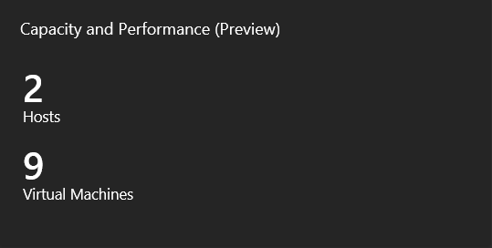
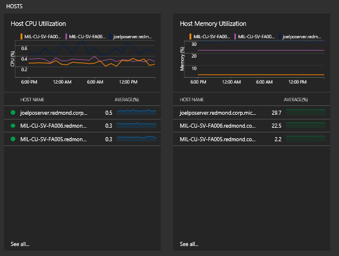

# Plan Hyper-V virtual machine capacity with the Capacity and Performance solution (deprecated)


> [!NOTE]
> The Capacity and Performance solution has been deprecated.  Customers who have already installed the solution can continue to use it, but Capacity and Performance can not be added to any new workspaces.

You can use the Capacity and Performance solution in Monitor to help you understand the capacity of your Hyper-V servers. The solution provides insights into your Hyper-V environment by showing you the overall utilization (CPU, memory, and disk) of the hosts and the VMs running on those Hyper-V hosts. Metrics are collected for CPU, memory, and disks across all your hosts and the VMs running on them.

The solution:

-	Shows hosts with highest and lowest CPU and memory utilization
-	Shows VMs with highest and lowest CPU and memory utilization
-	Shows VMs with highest and lowest IOPS and throughput utilization
-	Shows which VMs are running on which hosts
-	Shows the top disks with high throughput, IOPS, and latency in cluster shared volumes
- Allows you to customize and filter based on groups

> [!NOTE]
> The previous version of the Capacity and Performance solution called Capacity Management required both System Center Operations Manager and System Center Virtual Machine Manager. This updated solution doesn't have those dependencies.


## Connected sources

The following table describes the connected sources that are supported by this solution.

| Connected Source | Support | Description |
|---|---|---|
| [Windows agents](../../azure-monitor/platform/agent-windows.md) | Yes | The solution collects capacity and performance data information from Windows agents. |
| [Linux agents](../../azure-monitor/learn/quick-collect-linux-computer.md) | No	| The solution does not collect capacity and performance data information from direct Linux agents.|
| [SCOM management group](../../azure-monitor/platform/om-agents.md) | Yes |The solution collects capacity and performance data from agents in a connected SCOM management group. A direct connection from the SCOM agent to Log Analytics is not required.|
| [Azure storage account](../../azure-monitor/platform/collect-azure-metrics-logs.md) | No | Azure storage does not include capacity and performance data.|

## Prerequisites

- Windows or Operations Manager agents must be installed on Windows Server 2012 or higher Hyper-V hosts, not virtual machines.


## Configuration

Perform the following step to add the Capacity and Performance solution to your workspace.

- Add the Capacity and Performance solution to your Log Analytics workspace using the process described in [Add Log Analytics solutions from the Solutions Gallery](../../azure-monitor/insights/solutions.md).

## Management packs

If your SCOM management group is connected to your Log Analytics workspace, then the following management packs will be installed in SCOM when you add this solution. There is no configuration or maintenance of these management packs required.

- Microsoft.IntelligencePacks.CapacityPerformance

The 1201 event resembles:


```
New Management Pack with id:"Microsoft.IntelligencePacks.CapacityPerformance", version:"1.10.3190.0" received.
```

When the Capacity and Performance solution is updated, the version number will change.

For more information on how solution management packs are updated, see [Connect Operations Manager to Log Analytics](../../azure-monitor/platform/om-agents.md).

## Using the solution

When you add the Capacity and Performance solution to your workspace, the Capacity and Performance is added to the Overview dashboard. This tile displays a count of the number of currently active Hyper-V hosts  and the number of active virtual machines that were monitored for the time period selected.




### Review utilization

Click on the Capacity and Performance tile to open the Capacity and Performance dashboard. The dashboard includes the columns in the following table. Each column lists up to ten items matching that column's criteria for the specified scope and time range. You can run a log search that returns all records by clicking **See all** at the bottom of the column or by clicking the column header.

- **Hosts**
    - **Host CPU Utilization** Shows a graphical trend of the CPU utilization of host computers and a list of hosts, based on the selected time period. Hover over the line chart to view details for a specific point in time. Click the chart to view more details in log search. Click any host name to open log search and view CPU counter details for hosted VMs.
    - **Host Memory Utilization** Shows a graphical trend of the memory utilization of host computers and a list of hosts, based on the selected time period. Hover over the line chart to view details for a specific point in time. Click the chart to view more details in log search. Click any host name to open log search and view memory counter details for hosted VMs.
- **Virtual Machines**
    - **VM CPU Utilization** Shows a graphical trend of the CPU utilization of virtual machines and a list of virtual machines, based on the selected time period. Hover over the line chart to view details for a specific point in time for the top 3 VMs. Click the chart to view more details in log search. Click any VM name to open log search and view aggregated CPU counter details for the VM.
    - **VM Memory Utilization**	Shows a graphical trend of the memory utilization of virtual machines and a list of virtual machines, based on the selected time period. Hover over the line chart to view details for a specific point in time for the top 3 VMs. Click the chart to view more details in log search. Click any VM name to open log search and view aggregated memory counter details for the VM.
    - **VM Total Disk IOPS** Shows a graphical trend of the total disk IOPS for virtual machines and a list of virtual machines with the IOPS for each, based on the selected time period. Hover over the line chart to view details for a specific point in time for the top 3 VMs. Click the chart to view more details in log search. Click any VM name to open log search and view aggregated disk IOPS counter details for the VM.
    - **VM Total Disk Throughput** Shows a graphical trend of the total disk throughput for virtual machines and a list of virtual machines with the total disk throughput for each, based on the selected time period. Hover over the line chart to view details for a specific point in time for the top 3 VMs. Click the chart to view more details in log search. Click any VM name to open log search and view aggregated total disk throughput counter details for the VM.
- **Clustered Shared Volumes**
    - **Total Throughput** Shows the sum of both reads and writes on clustered shared volumes.
    - **Total IOPS** Shows the sum of input/output operations per second on clustered shared volumes.
    - **Total Latency** Shows the total latency on clustered shared volumes.
- **Host Density** The top tile shows the total number of hosts and virtual machines available to the solution. Click the top tile to view additional details in log search. Also lists all hosts and the number of virtual machines that are hosted. Click a host to drill into the VM results in a log search.





### Evaluate performance

Production computing environments differ greatly from one organization to another. Also, capacity and performance workloads might depend on how your VMs are running, and what you consider normal. Specific procedures to help you measure performance would probably not apply to your environment. So, more generalized prescriptive guidance is better suited to help. Microsoft publishes a variety of prescriptive guidance articles to help you measure performance.

To summarize, the solution collects capacity and performance data from a variety of sources including performance counters. Use that capacity and performance data that presented in various surfaces in the solution and compare your results to those at the [Measuring Performance on Hyper-V](https://msdn.microsoft.com/library/cc768535.aspx) article. Although the article was published some time ago, the metrics, considerations, and guidelines are still valid. The article contains links to other useful resources.


## Sample log searches

The following table provides sample log searches for capacity and performance data collected and calculated by this solution.


| Query | Description |
|:--- |:--- |
| All host memory configurations | Perf &#124; where ObjectName == "Capacity and Performance" and CounterName == "Host Assigned Memory MB" &#124; summarize MB = avg(CounterValue) by InstanceName |
| All VM memory configurations | Perf &#124; where ObjectName == "Capacity and Performance" and CounterName == "VM Assigned Memory MB" &#124; summarize MB = avg(CounterValue) by InstanceName |
| Breakdown of Total Disk IOPS across all VMs | Perf &#124; where ObjectName == "Capacity and Performance" and (CounterName == "VHD Reads/s" or CounterName == "VHD Writes/s") &#124; summarize AggregatedValue = avg(CounterValue) by bin(TimeGenerated, 1h), CounterName, InstanceName |
| Breakdown of Total Disk Throughput across all VMs | Perf &#124; where ObjectName == "Capacity and Performance" and (CounterName == "VHD Read MB/s" or CounterName == "VHD Write MB/s") &#124; summarize AggregatedValue = avg(CounterValue) by bin(TimeGenerated, 1h), CounterName, InstanceName |
| Breakdown of Total IOPS across all CSVs | Perf &#124; where ObjectName == "Capacity and Performance" and (CounterName == "CSV Reads/s" or CounterName == "CSV Writes/s") &#124; summarize AggregatedValue = avg(CounterValue) by bin(TimeGenerated, 1h), CounterName, InstanceName |
| Breakdown of Total Throughput across all CSVs | Perf &#124; where ObjectName == "Capacity and Performance" and (CounterName == "CSV Reads/s" or CounterName == "CSV Writes/s") &#124; summarize AggregatedValue = avg(CounterValue) by bin(TimeGenerated, 1h), CounterName, InstanceName |
| Breakdown of Total Latency across all CSVs | Perf &#124; where ObjectName == "Capacity and Performance" and (CounterName == "CSV Read Latency" or CounterName == "CSV Write Latency") &#124; summarize AggregatedValue = avg(CounterValue) by bin(TimeGenerated, 1h), CounterName, InstanceName |


## Next steps
* Use [Log searches in Log Analytics](../../azure-monitor/log-query/log-query-overview.md) to view detailed Capacity and Performance data.
