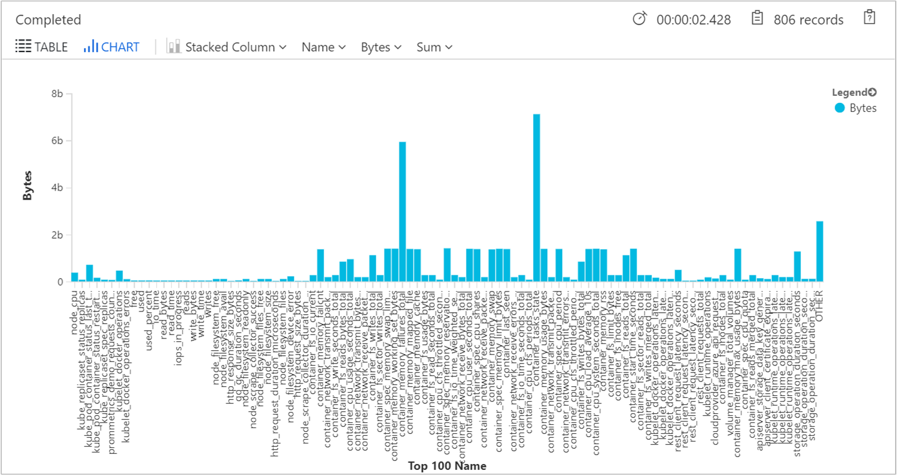

# Configure agent data collection for Azure Monitor for containers

Azure Monitor for containers collects stdout, stderr, and environmental variables from container workloads deployed to managed Kubernetes clusters hosted on Azure Kubernetes Service (AKS) from the containerized agent. This agent can also collect time series data (also referred to as metrics) from Prometheus using the containerized agent without having to setup and manage a Prometheus server and database. You can configure agent data collection settings by creating a custom Kubernetes ConfigMaps to control this experience. 

This article demonstrates how to create ConfigMap and configure data collection based on your requirements.

>[!NOTE]
>Support for Prometheus is a feature in public preview at this time.
>

## Configure your cluster with custom data collection settings

A template ConfigMap file is provided that allows you to easily edit it with your customizations without having to create it from scratch. Before starting, you should review the Kubernetes documentation about [ConfigMaps](https://kubernetes.io/docs/tasks/configure-pod-container/configure-pod-configmap/) and familiarize yourself with how to create, configure, and deploy ConfigMaps. This will allow you to filter stderr and stdout per namespace or across the entire cluster, and environment variables for any container running across all pods/nodes in the cluster.

>[!IMPORTANT]
>The minimum agent version supported to collect stdout, stderr, and environmental variables from container workloads is ciprod06142019 or later. The minimum agent version supported for scraping Prometheus metrics is ciprod07092019 or later. To verify your agent version, from the **Node** tab select a node, and in the properties pane note value of the **Agent Image Tag** property.  

### Overview of configurable data collection settings

The following are the settings that can be configured to control data collection.

|Key |Data type |Value |Description |
|----|----------|------|------------|
|`schema-version` |String (case sensitive) |v1 |This is the schema version used by the agent when parsing this ConfigMap. Currently supported schema-version is v1. Modifying this value is not supported and will be rejected when ConfigMap is evaluated.|
|`config-version` |String | | Supports ability to keep track of this config file's version in your source control system/repository. Maximum allowed characters are 10, and all other characters are truncated. |
|`[log_collection_settings.stdout] enabled =` |Boolean | true or false | This controls if stdout container log collection is enabled. When set to `true` and no namespaces are excluded for stdout log collection (`log_collection_settings.stdout.exclude_namespaces` setting below), stdout logs will be collected from all containers across all pods/nodes in the cluster. If not specified in ConfigMaps, the default value is `enabled = true`. |
|`[log_collection_settings.stdout] exclude_namespaces =`|String | Comma-separated array |Array of Kubernetes namespaces for which stdout logs will not be collected. This setting is effective only if `log_collection_settings.stdout.enabled` is set to `true`. If not specified in ConfigMap, the default value is `exclude_namespaces = ["kube-system"]`.|
|`[log_collection_settings.stderr] enabled =` |Boolean | true or false |This controls if stderr container log collection is enabled. When set to `true` and no namespaces are excluded for stdout log collection (`log_collection_settings.stderr.exclude_namespaces` setting), stderr logs will be collected from all containers across all pods/nodes in the cluster. If not specified in ConfigMaps, the default value is `enabled = true`. |
|`[log_collection_settings.stderr] exclude_namespaces =` |String |Comma-separated array |Array of Kubernetes namespaces for which stderr logs will not be collected. This setting is effective only if `log_collection_settings.stdout.enabled` is set to `true`. If not specified in ConfigMap, the default value is `exclude_namespaces = ["kube-system"]`. |
| `[log_collection_settings.env_var] enabled =` |Boolean | true or false | This controls if environment variable collection is enabled. When set to `false`, no environment variables are collected for any container running across all pods/nodes in the cluster. If not specified in ConfigMap, the default value is `enabled = true`. |

## Overview of configurable Prometheus scraping settings

Active scraping of metrics from Prometheus are performed from one of two perspectives:

* Cluster-wide - HTTP URL and discover targets from listed endpoints of a service, k8s services such as kube-dns and kube-state-metrics, and pod annotations specific to an application. Metrics collected in this context will be defined in the ConfigMap section *[Prometheus data_collection_settings.cluster]*.
* Node-wide - HTTP URL and discover targets from listed endpoints of a service. Metrics collected in this context will be defined in the ConfigMap section *[Prometheus_data_collection_settings.node]*.

|Scope | Key | Data type | Value | Description |
|------|-----|-----------|-------|-------------|
| Cluster-wide | | | | Specify any one of the following three methods to scrape endpoints for metrics. |
| | `urls` | String | Comma-separated array | HTTP endpoint (Either IP address or valid URL path specified). For example: `urls=[$NODE_IP/metrics]`. ($NODE_IP is a specific Azure Monitor for containers parameter and can be used instead of node IP address. Must be all uppercase.) |
| | `kubernetes_services` | String | Comma-separated array | An array of Kubernetes services to scrape metrics from kube-state-metrics. For example,`kubernetes_services = ["https://metrics-server.kube-system.svc.cluster.local/metrics",http://my-service-dns.my-namespace:9100/metrics]`.|
| | `monitor_kubernetes_pods` | Boolean | true or false | When set to `true` in the cluster-wide settings, Azure Monitor for containers agent will scrape Kubernetes pods across the entire cluster for the following Prometheus annotations:<br> `prometheus.io/scrape:`<br> `prometheus.io/scheme:`<br> `prometheus.io/path:`<br> `prometheus.io/port:` |
| | `prometheus.io/scrape` | Boolean | true or false | Enables scraping of the pod. |
| | `prometheus.io/scheme` | String | http or https | Defaults to scrapping over HTTP. If required, set to `https`. | 
| | `prometheus.io/path` | String | Comma-separated array | The HTTP resource path on which to fetch metrics from. If the metrics path is not `/metrics`, define it with this annotation. |
| | `prometheus.io/port` | String | 9102 | Specify a port to listen on. If port is not set, it will default to 9102. |
| Node-wide | `urls` | String | Comma-separated array | HTTP endpoint (Either IP address or valid URL path specified). For example: `urls=[$NODE_IP/metrics]`. ($NODE_IP is a specific Azure Monitor for containers parameter and can be used instead of node IP address. Must be all uppercase.) |
| Node-wide or Cluster-wide | `interval` | String | 60s | The collection interval default is one minute (60 seconds). You can modify the collection for either the *[prometheus_data_collection_settings.node]* and/or *[prometheus_data_collection_settings.cluster]* to time units such as ns, us (or µs), ms, s, m, h. |
| Node-wide or Cluster-wide | `fieldpass`<br> `fielddrop`| String | Comma-separated array | You can specify certain metrics to be collected or not from the endpoint by setting the allow (`fieldpass`) and disallow (`fielddrop`) listing. You must set the allow list first. |

ConfigMap is a global list and there can be only one ConfigMap applied to the agent. You cannot have another ConfigMap overruling the collections.

### Configure and deploy ConfigMaps

Perform the following steps to configure and deploy your ConfigMap configuration file to your cluster.

1. [Download](https://github.com/microsoft/OMS-docker/blob/ci_feature_prod/Kubernetes/container-azm-ms-agentconfig.yaml) the template ConfigMap yaml file and save it as container-azm-ms-agentconfig.yaml.  
1. Edit the ConfigMap yaml file with your customizations.

    - To exclude specific namespaces for stdout log collection, you configure the key/value using the following example: `[log_collection_settings.stdout] enabled = true exclude_namespaces = ["my-namespace-1", "my-namespace-2"]`.
    - To disable environment variable collection for a specific container, set the key/value `[log_collection_settings.env_var] enabled = true` to enable variable collection globally, and then follow the steps [here](container-insights-manage-agent.md#how-to-disable-environment-variable-collection-on-a-container) to complete configuration for the specific container.
    - To disable stderr log collection cluster-wide, you configure the key/value using the following example: `[log_collection_settings.stderr] enabled = false`.

1. Create ConfigMap by running the following kubectl command: `kubectl apply -f <configmap_yaml_file.yaml>`.
    
    Example: `kubectl apply -f container-azm-ms-agentconfig.yaml`. 
    
    The configuration change can take a few minutes to finish before taking effect, and all omsagent pods in the cluster will restart. The restart is a rolling restart for all omsagent pods, not all restart at the same time. When the restarts are finished, a message is displayed that's similar to the following and includes the result: `configmap "container-azm-ms-agentconfig" created`.

To verify the configuration was successfully applied, use the following command to review the logs from an agent pod: `kubectl logs omsagent-fdf58 -n=kube-system`. If there are configuration errors from the omsagent pods, the output will show errors similar to the following:

``` 
***************Start Config Processing******************** 
config::unsupported/missing config schema version - 'v21' , using defaults
```

Errors related to applying configuration changes for Prometheus are also available for review.  Either from the logs from an agent pod using the same `kubectl logs` command or from live logs. Live logs shows errors similar to the following:

```
2019-07-08T18:55:00Z E! [inputs.prometheus]: Error in plugin: error making HTTP request to http://invalidurl:1010/metrics: Get http://invalidurl:1010/metrics: dial tcp: lookup invalidurl on 10.0.0.10:53: no such host
```

Errors prevent omsagent from parsing the file, causing it to restart and use the default configuration. After you correct the error(s) in ConfigMap, save the yaml file and apply the updated ConfigMaps by running the command: `kubectl apply -f <configmap_yaml_file.yaml`.

## Applying updated ConfigMap

If you have already deployed a ConfigMap to your cluster and you want to update it with a newer configuration, you can simply edit the ConfigMap file you've previously used and then apply using the same command as before, `kubectl apply -f <configmap_yaml_file.yaml`.

The configuration change can take a few minutes to finish before taking effect, and all omsagent pods in the cluster will restart. The restart is a rolling restart for all omsagent pods, not all restart at the same time. When the restarts are finished, a message is displayed that's similar to the following and includes the result: `configmap "container-azm-ms-agentconfig" updated`.

## Verifying schema version

Supported config schema versions are available as pod annotation (schema-versions) on the omsagent pod. You can see them with the following kubectl command: `kubectl describe pod omsagent-fdf58 -n=kube-system`

The output will show similar to the following with the annotation schema-versions:

```
	Name:           omsagent-fdf58
	Namespace:      kube-system
	Node:           aks-agentpool-95673144-0/10.240.0.4
	Start Time:     Mon, 10 Jun 2019 15:01:03 -0700
	Labels:         controller-revision-hash=589cc7785d
	                dsName=omsagent-ds
	                pod-template-generation=1
	Annotations:    agentVersion=1.10.0.1
	              dockerProviderVersion=5.0.0-0
	                schema-versions=v1 
```

## Review Prometheus data usage

To identify the ingestion volume of each metrics size in GB per day to understand if it is high, the following query is provided.

```
InsightsMetrics 
| where Namespace contains "prometheus"
| where TimeGenerated > ago(24h)
| summarize VolumeInGB = (sum(_BilledSize) / (1024 * 1024 * 1024)) by Name
| order by VolumeInGB desc
| render barchart
```
The output will show results similar to the following:


To estimate what each metrics size in GB is for a month to understand if the volume of data ingested received in the workspace is high, the following query is provided.

```
InsightsMetrics 
| where Namespace contains "prometheus"
| where TimeGenerated > ago(24h)
| summarize EstimatedGBPer30dayMonth = (sum(_BilledSize) / (1024 * 1024 * 1024)) * 30 by Name
| order by EstimatedGBPer30dayMonth desc
| render barchart
```

The output will show results similar to the following:



Further information on how to monitor data usage and analyze cost is available in [Manage usage and costs with Azure Monitor Logs](../platform/manage-cost-storage.md).

## Next steps

Azure Monitor for containers does not include a predefined set of alerts. Review the [Create performance alerts with Azure Monitor for containers](container-insights-alerts.md) to learn how to create recommended alerts for high CPU and memory utilization to support your DevOps or operational processes and procedures.

- To continue learning how to use Azure Monitor and monitor other aspects of your AKS cluster, see [View Azure Kubernetes Service health](container-insights-analyze.md).

- View [log query examples](container-insights-log-search.md#search-logs-to-analyze-data) to see pre-defined queries and examples to evaluate or customize for alerting, visualizing, or analyzing your clusters.