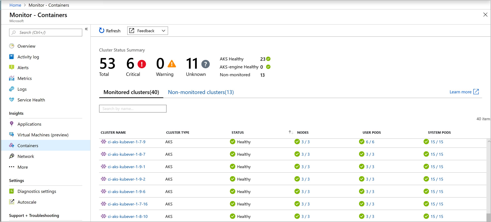

# Understand AKS cluster performance with Azure Monitor for containers 
With Azure Monitor for containers, you can use the performance charts and health status to monitor the workload of your Azure Kubernetes Service (AKS) clusters from two perspectives, directly from an AKS cluster or all AKS clusters in a subscription from Azure Monitor. Viewing Azure Container Instances (ACI) is also possible when you monitor a specific AKS cluster.

This article will help you understand the experience between the two perspectives, and how it helps you quickly assess, investigate, and resolve issues detected.

For information about enabling Azure Monitor for containers, see [Onboard Azure Monitor for containers](container-insights-onboard.md).

Azure Monitor provides a multi-cluster view showing the health status of all monitored AKS clusters deployed across resource groups in your subscriptions.  It shows AKS clusters discovered that are not monitored by the solution. Immediately you can understand cluster health, and from here you can drill down to the node and controller performance page, or navigate to see performance charts for the cluster.  For AKS clusters discovered and identified as unmonitored, you can enable monitoring for that cluster at any time.  ​
​
## Sign in to the Azure portal
Sign in to the [Azure portal](https://portal.azure.com). 

## Multi-cluster view from Azure Monitor 
To view the health status of all AKS clusters deployed, select **Monitor** from the left-hand pane in the Azure portal.  Under the **Insights** section, select **Containers**.  

On the **Monitored clusters** tab, you are able to learn the following:

1. How many clusters are in a critical or unhealthy state, versus how many are healthy or not reporting (referred to as an unknown state)?
1. Are all of my [Azure Kubernetes Engine (AKS-engine)](https://github.com/Azure/aks-engine) deployments healthy?
1. How many nodes, user and system pods are deployed per cluster.  

The health statuses included are: 

* **Healthy** – no issues detected for the VM and it is functioning as required. 
* **Critical** – one or more critical issues are detected, which need to be addressed in order to restore normal operational state as expected.
* **Warning** -  one or more issues are detected, which need to be addressed or the health condition could become critical.
* **Unknown** – if the service was not able to make a connection with the node or pod, the status changes to an unknown state.
* **Not found** - Either the workspace, the resource group, or subscription containing the workspace for this solution has been deleted.
* **Unauthorized** - User doesn’t have required permissions to read the data in the workspace.
* **Error** - Error occurred while attempting to read data from the workspace.
* **Mis configured** - Azure Monitor for containers was not configured correctly in the specified workspace.
* **No data** - Data has not reported to the workspace in the last 30 minutes.

Health state calculates overall cluster status as *worst of*” the three states with one exception – if any of the three states is *unknown*, overall cluster state will show **Unknown**.  

The following table provides a breakdown of the calculation controlling the health states for a monitored cluster on the multi-cluster view.

| |Status |Availability |  
|-------|-------|-----------------|  
|**User Pod**| | |  
| |Healthy |100% |  
| |Warning |90 - 99% |  
| |Critical |<90% |  
| |Unknown |If not reported in last 30 minutes |  
|**System Pod**| | |  
| |Healthy |100% |
| |Warning |N/A |
| |Critical |<100% |
| |Unknown |If not reported in last 30 minutes |
|**Node** | | |
| |Healthy |>85% |
| |Warning |60 - 84% |
| |Critical |<60% |
| |Unknown |If not reported in last 30 minutes |

From the list of clusters, you can drill down to the **Cluster** page by clicking on the name of the cluster, to the **Nodes** performance page by clicking on the rollup of nodes in the **Nodes** column for that specific cluster, or drill down to the **Controllers** performance page by clicking on the rollup of **User pods** or **System pods** column.   ​

## View performance directly from an AKS cluster
Access to Azure Monitor for containers is available directly from an AKS cluster by selecting **Insights** from the left-hand pane. Viewing information about your AKS cluster is organized into four perspectives:

- Cluster
- Nodes 
- Controllers  
- Containers

The default page opened when you click on **Insights** is **Cluster**, and it includes four line performance charts displaying key performance metrics of your cluster. 

The performance chart displays four performance metrics:

- **Node CPU Utilization&nbsp;%**: An aggregated perspective of CPU utilization for the entire cluster. You can filter the results for the time range by selecting **Avg**, **Min**, **Max**, **50th**, **90th**, and **95th** in the percentiles selector above the chart, either individually or combined. 
- **Node memory utilization&nbsp;%**: An aggregated perspective of memory utilization for the entire cluster. You can filter the results for the time range by selecting **Avg**, **Min**, **Max**, **50th**, **90th**, and **95th** in the percentiles selector above the chart, either individually or combined. 
- **Node count**: A node count and status from Kubernetes. Statuses of the cluster nodes represented are *All*, *Ready*, and *Not Ready* and can be filtered individually or combined in the selector above the chart. 
- **Activity pod count**: A pod count and status from Kubernetes. Statuses of the pods represented are *All*, *Pending*, *Running*, and *Unknown* and can be filtered individually or combined in the selector above the chart. 

You can use the left/right arrow keys to cycle through each data point on the chart and the up/down arrow keys to cycle through the percentile lines.

Azure Monitor for containers also supports Azure Monitor [metrics explorer](../platform/metrics-getting-started.md), where you can create your own plot charts, correlate and investigate trends, and pin to dashboards. From metrics explorer, you can also use the criteria you have set to visualize your metrics as the basis of a [metric based alert rule](../platform/alerts-metric.md).  

## View container metrics in metrics explorer
In metrics explorer, you can view aggregated node and pod utilization metrics from Azure Monitor for containers. The following table summarizes the details to help you understand how to use the metric charts to visualize container metrics.

|Namespace | Metric |
|----------|--------|
| insights.container/nodes | |
| | cpuUsageMillicores |
| | cpuUsagePercentage |
| | memoryRssBytes |
| | memoryRssPercentage |
| | memoryWorkingSetBytes |
| | memoryWorkingSetPercentage |
| | nodesCount |
| insights.container/pods | |
| | PodCount |

You can apply [splitting](../platform/metrics-charts.md#apply-splitting-to-a-chart) of a metric to view it by dimension and visualize how different segments of it compare to each other. For a node, you can segment the chart by the *host* dimension, and from a pod you can segment it by the following dimensions:

* Controller
* Kubernetes namespace
* Node
* Phase

## Analyze nodes, controllers, and container health

When you switch to **Nodes**, **Controllers**, and **Containers** tab, automatically displayed on the right-side of the page is the property pane.  It shows the properties of the item-selected, including labels you define to organize Kubernetes objects. Click on the **>>** link in the pane to view\hide the pane.  

As you expand the objects in the hierarchy, the properties pane updates based on the object selected. From the pane, you can also view Kubernetes events with pre-defined log searches by clicking on the **View Kubernetes event logs** link at the top of the pane. For more information about viewing Kubernetes log data, see [Search logs to analyze data](#search-logs-to-analyze-data). While you are reviewing your containers in the **Containers** view, you can see container logs in real time. For more information about this feature and the configuration required to grant and control access, see [How to view container logs real time with Azure Monitor for containers](container-insights-live-logs.md). 

Use the **+ Add Filter** option from the top of the page to filter the results for the view by **Service**, **Node**, or **Namespace** and after selecting the filter scope, you then select from one of the values shown in the **Select value(s)** field.  After the filter is configured, it is applied globally while viewing any perspective of the AKS cluster.  The formula only supports the equal sign.  You can add additional filters on top of the first one to further narrow your results.  For example, if you specified a filter by **Node**, your second filter would only allow you to select **Service** or **Namespace**.  

Specifying a filter in one tab continues to be applied when you select another and it is deleted after you click the **x** symbol next to the specified filter.   

Switch to the **Nodes** tab and the row hierarchy follows the Kubernetes object model, starting with a node in your cluster. Expand the node and you can view one or more pods running on the node. If more than one container is grouped to a pod, they are displayed as the last row in the hierarchy. You can also view how many non-pod related workloads are running on the host if the host has processor or memory pressure.

Azure Container Instances Virtual Nodes running the Linux OS are shown after the last AKS cluster node in the list.  When you expand an ACI Virtual Node, you can view one or more ACI pods and containers running on the node.  Metrics are not collected and reported for nodes, only pods.

From an expanded node, you can drill down from the pod or container running on the node to the controller to view performance data filtered for that controller. Click on the value under the **Controller** column for the specific node.   

You can select controllers or containers at the top of the page and review the status and resource utilization for those objects.  If instead you want to review memory utilization, in the **Metric** drop-down list, select **Memory RSS** or **Memory working set**. **Memory RSS** is supported only for Kubernetes version 1.8 and later. Otherwise, you view values for **Min&nbsp;%** as *NaN&nbsp;%*, which is a numeric data type value that represents an undefined or unrepresentable value. 

By default, Performance data is based on the last six hours, but you can change the window by using the **TimeRange** option at the upper left. You can also filter the results within the time range by selecting **Avg**, **Min**, **Max**, **50th**, **90th**, and **95th** in the percentile selector. 

When you mouse over the bar graph under the **Trend** column, each bar shows either CPU or memory usage, depending on which metric is selected, within a sample period of 15 minutes. After you select the trend chart through a keyboard, you can use the Alt+PageUp or Alt+PageDown keys to cycle through each bar individually and get the same details as you would on mouseover.

    

In the next example, note for the first in the list - node *aks-nodepool1-*, the value for **Containers** is 9, which is a rollup of the total number of containers deployed.

It can help you quickly identify whether you have a proper balance of containers between nodes in your cluster. 

The information that's presented when you view Nodes is described in the following table:

| Column | Description | 
|--------|-------------|
| Name | The name of the host. |
| Status | Kubernetes view of the node status. |
| Avg&nbsp;%, Min&nbsp;%, Max&nbsp;%, 50th&nbsp;%, 90th&nbsp;% | Average node percentage based on percentile during the selected duration. |
| Avg, Min, Max, 50th, 90th | Average nodes actual value based on percentile during that time duration selected. The average value is measured from the CPU/Memory limit set for a node; for pods and containers it is the avg value reported by the host. |
| Containers | Number of containers. |
| Uptime | Represents the time since a node started or was rebooted. |
| Controllers | Only for containers and pods. It shows which controller it is residing in. Not all pods are in a controller, so some might display **N/A**. | 
| Trend Avg&nbsp;%, Min&nbsp;%, Max&nbsp;%, 50th&nbsp;%, 90th&nbsp;% | Bar graph trend represents the average percentile metric percentage of the controller. |

In the selector, select **Controllers**.

Here you can view the performance health of your controllers and ACI Virtual Node controllers or Virtual Node pods not connected to a controller.

The row hierarchy starts with a controller and when you expand a controller, you view one or more pods.  Expand pod, and the last row displays the container grouped to the pod. From an expanded controller, you can drill down to the node it is running on to view performance data filtered for that node. ACI pods not connected to a controller are listed last in the list.

Click on the value under the **Node** column for the specific controller.   

The information that's displayed when you view controllers is described in the following table:

| Column | Description | 
|--------|-------------|
| Name | The name of the controller.|
| Status | The rollup status of the containers when it has completed running with status, such as *OK*, *Terminated*, *Failed* *Stopped*, or *Paused*. If the container is running, but the status was either not properly displayed or was not picked up by the agent and has not responded more than 30 minutes, the status is *Unknown*. Additional details of the status icon are provided in the table below.|
| Avg&nbsp;%, Min&nbsp;%, Max&nbsp;%, 50th&nbsp;%, 90th&nbsp;% | Roll up average of the average percentage of each entity for the selected metric and percentile. |
| Avg, Min, Max, 50th, 90th  | Roll up of the average CPU millicore or memory performance of the container for the selected percentile. The average value is measured from the CPU/Memory limit set for a pod. |
| Containers | Total number of containers for the controller or pod. |
| Restarts | Roll up of the restart count from containers. |
| Uptime | Represents the time since a container started. |
| Node | Only for containers and pods. It shows which controller it is residing. | 
| Trend Avg&nbsp;%, Min&nbsp;%, Max&nbsp;%, 50th&nbsp;%, 90th&nbsp;%| Bar graph trend represents the average percentile metric of the controller. |

The icons in the status field indicate the online status of the containers:
 
| Icon | Status | 
|--------|-------------|
|  | Running (Ready)|
|  | Waiting or Paused|
|  | Last reported running but hasn't responded more than 30 minutes|
|  | Successfully stopped or failed to stop|

The status icon displays a count based on what the pod provides. It shows the worst two states, and when you hover over the status, it displays a rollup status from all pods in the container. If there isn't a ready state, the status value displays **(0)**. 

In the selector, select **Containers**.

Here you can view the performance health of your Azure Kubernetes and Azure Container Instances containers.  

From a container, you can drill down to a pod or node to view performance data filtered for that object. Click on the value under the **Pod** or **Node** column for the specific container.   

The information that's displayed when you view containers is described in the following table:

| Column | Description | 
|--------|-------------|
| Name | The name of the controller.|
| Status | Status of the containers, if any. Additional details of the status icon are provided in the next table.|
| Avg&nbsp;%, Min&nbsp;%, Max&nbsp;%, 50th&nbsp;%, 90th&nbsp;% | The rollup of the average percentage of each entity for the selected metric and percentile. |
| Avg, Min, Max, 50th, 90th  | The rollup of the average CPU millicore or memory performance of the container for the selected percentile. The average value is measured from the CPU/Memory limit set for a pod. |
| Pod | Container where the pod resides.| 
| Node |  Node where the container resides. | 
| Restarts | Represents the time since a container started. |
| Uptime | Represents the time since a container was started or rebooted. |
| Trend Avg&nbsp;%, Min&nbsp;%, Max&nbsp;%, 50th&nbsp;%, 90th&nbsp;% | Bar graph trend represents the average percentile metric percentage of the container. |

The icons in the status field indicate the online statuses of pods, as described in the following table:
 
| Icon | Status |  
|--------|-------------|  
|  | Running (Ready)|  
|  | Waiting or Paused|  
|  | Last reported running but hasn't responded in more than 30 minutes|  
|  | Successfully stopped or failed to stop|  
|  | Failed state |  

## Container data-collection details
Container Insights collects various performance metrics and log data from container hosts and containers. Data is collected every three minutes.

### Container records

Examples of records that are collected by Azure Monitor for containers and the data types that appear in log search results are displayed in the following table:

| Data type | Data type in Log Search | Fields |
| --- | --- | --- |
| Performance for hosts and containers | `Perf` | Computer, ObjectName, CounterName &#40;%Processor Time, Disk Reads MB, Disk Writes MB, Memory Usage MB, Network Receive Bytes, Network Send Bytes, Processor Usage sec, Network&#41;, CounterValue, TimeGenerated, CounterPath, SourceSystem |
| Container inventory | `ContainerInventory` | TimeGenerated, Computer, container name, ContainerHostname, Image, ImageTag, ContainerState, ExitCode, EnvironmentVar, Command, CreatedTime, StartedTime, FinishedTime, SourceSystem, ContainerID, ImageID |
| Container image inventory | `ContainerImageInventory` | TimeGenerated, Computer, Image, ImageTag, ImageSize, VirtualSize, Running, Paused, Stopped, Failed, SourceSystem, ImageID, TotalContainer |
| Container log | `ContainerLog` | TimeGenerated, Computer, image ID, container name, LogEntrySource, LogEntry, SourceSystem, ContainerID |
| Container service log | `ContainerServiceLog`  | TimeGenerated, Computer, TimeOfCommand, Image, Command, SourceSystem, ContainerID |
| Container node inventory | `ContainerNodeInventory_CL`| TimeGenerated, Computer, ClassName_s, DockerVersion_s, OperatingSystem_s, Volume_s, Network_s, NodeRole_s, OrchestratorType_s, InstanceID_g, SourceSystem|
| Container process | `ContainerProcess_CL` | TimeGenerated, Computer, Pod_s, Namespace_s, ClassName_s, InstanceID_s, Uid_s, PID_s, PPID_s, C_s, STIME_s, Tty_s, TIME_s, Cmd_s, Id_s, Name_s, SourceSystem |
| Inventory of pods in a Kubernetes cluster | `KubePodInventory` | TimeGenerated, Computer, ClusterId, ContainerCreationTimeStamp, PodUid, PodCreationTimeStamp, ContainerRestartCount, PodRestartCount, PodStartTime, ContainerStartTime, ServiceName, ControllerKind, ControllerName, ContainerStatus, ContainerID, ContainerName, Name, PodLabel, Namespace, PodStatus, ClusterName, PodIp, SourceSystem |
| Inventory of nodes part of a Kubernetes cluster | `KubeNodeInventory` | TimeGenerated, Computer, ClusterName, ClusterId, LastTransitionTimeReady, Labels, Status, KubeletVersion, KubeProxyVersion, CreationTimeStamp, SourceSystem | 
| Kubernetes Events | `KubeEvents_CL` | TimeGenerated, Computer, ClusterId_s, FirstSeen_t, LastSeen_t, Count_d, ObjectKind_s, Namespace_s, Name_s, Reason_s, Type_s, TimeGenerated_s, SourceComponent_s, ClusterName_s, Message,  SourceSystem | 
| Services in the Kubernetes cluster | `KubeServices_CL` | TimeGenerated, ServiceName_s, Namespace_s, SelectorLabels_s, ClusterId_s, ClusterName_s, ClusterIP_s, ServiceType_s, SourceSystem | 
| Performance metrics for nodes part of the Kubernetes cluster | Perf &#124; where ObjectName == “K8SNode” | Computer, ObjectName, CounterName &#40;cpuUsageNanoCores, , memoryWorkingSetBytes, memoryRssBytes, networkRxBytes, networkTxBytes, restartTimeEpoch, networkRxBytesPerSec, networkTxBytesPerSec, cpuAllocatableNanoCores, memoryAllocatableBytes, cpuCapacityNanoCores, memoryCapacityBytes&#41;,CounterValue, TimeGenerated, CounterPath, SourceSystem | 
| Performance metrics for containers part of the Kubernetes cluster | Perf &#124; where ObjectName == “K8SContainer” | CounterName &#40;cpuUsageNanoCores, memoryWorkingSetBytes, memoryRssBytes, restartTimeEpoch, cpuRequestNanoCores, memoryRequestBytes, cpuLimitNanoCores, memoryLimitBytes&#41;,CounterValue, TimeGenerated, CounterPath, SourceSystem | 

## Search logs to analyze data
Log Analytics can help you look for trends, diagnose bottlenecks, forecast, or correlate data that can help you determine whether the current cluster configuration is performing optimally. Pre-defined log searches are provided for you to immediately start using or to customize to return the information the way you want. 

You can perform interactive analysis of data in the workspace by selecting the **View Kubernetes event logs** or **View container logs** option in the preview pane. The **Log Search** page appears to the right of the Azure portal page that you were on.

   

The container logs output that's forwarded to Log Analytics are STDOUT and STDERR. Because Azure Monitor is monitoring Azure-managed Kubernetes (AKS), Kube-system is not collected today because of the large volume of generated data. 

### Example log search queries
It's often useful to build queries that start with an example or two and then modify them to fit your requirements. To help build more advanced queries, you can experiment with the following sample queries:

| Query | Description | 
|-------|-------------|
| ContainerInventory  &#124; project Computer, Name, Image, ImageTag, ContainerState, CreatedTime, StartedTime, FinishedTime  &#124; render table | List all of a container's lifecycle information| 
| KubeEvents_CL  &#124; where not(isempty(Namespace_s))  &#124; sort by TimeGenerated desc  &#124; render table | Kubernetes events|
| ContainerImageInventory  &#124; summarize AggregatedValue = count() by Image, ImageTag, Running | Image inventory | 
| **Select the Line chart display option**:  Perf  &#124; where ObjectName == "K8SContainer" and CounterName == "cpuUsageNanoCores" &#124; summarize AvgCPUUsageNanoCores = avg(CounterValue) by bin(TimeGenerated, 30m), InstanceName | Container CPU | 
| **Select the Line chart display option**:  Perf  &#124; where ObjectName == "K8SContainer" and CounterName == "memoryRssBytes" &#124; summarize AvgUsedRssMemoryBytes = avg(CounterValue) by bin(TimeGenerated, 30m), InstanceName | Container memory |

## Next steps
Azure Monitor for containers does not include a predefined set of alerts to copy and modify according to your supporting processes and procedures. Review the [Create performance alerts with Azure Monitor for containers](container-insights-alerts.md) to learn how to create recommended alerts for high CPU and memory utilization.  
